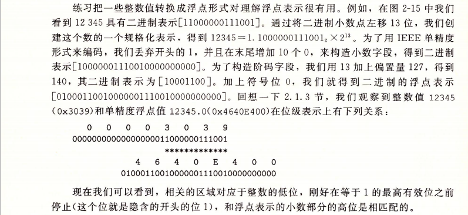

<font face = "Consolas">
<!-- @import "[TOC]" {cmd="toc" depthFrom=1 depthTo=6 orderedList=false} -->

<!-- code_chunk_output -->

- [整数运算](#整数运算)
  - [加法p62](#加法p62)
  - [乘除法p67](#乘除法p67)
- [浮点](#浮点)
  - [基本](#基本)
  - [整数转浮点P82:](#整数转浮点p82)
  - [舍入P83](#舍入p83)
  - [浮点运算P85](#浮点运算p85)

<!-- /code_chunk_output -->

# 整数运算
## 加法p62
* 无符号  判断相加是否溢出:合是否小于加数

* 有符号  0___+MAX -MAX____-1 
    * 正溢出结果为负补数(减去2w),负溢出为正补数(加上2w)
    * 检测:加数同号(异号不会溢出)但合与其异号
    * -(-MAX) = -MAX (-x 为 ~x+1)

## 乘除法p67
* 乘 可分解为几个2的n次方的合(14 = $2^3$ + $2^2$ + $2^1$) (可通过该乘数的二进制表示的1判断)乘次方则左移n位,最后相加
* 除 2的n次方  右移n位,但负数须加上偏置(被舍位全1)(即被舍位有1则结果+1)(使得结果去尾)(右移为向下偏)
```
自分析:乘法可通过逐位读取如为1则左移相应位数,然后相加
  除法除了2w数外,应逐位读存被除数,如大于除数则相减,得到结果1与余数,继续操作(参考十进制除法)
```

# 浮点
## 基本
* 小数点右为负幂 不能准确表示部分值

>  P78
  结构: (-1)s * M * $2^E$ s符号,E阶码(exp),M尾数(frac)(二进制小数),k阶码位
  内存中是 s exp frac
.
  规格化:
  exp不全为0或1时,为规格化值
  　E=e-Bias(偏置量,为$2^{k-1}$ -1,如127,1023),产生指数的正负取值范围
  　M=frac解释为小数位,隐含的以1开头
  　存在最大的规格化数,超过溢出为+∞
.
  非规格化:
  exp全0时
  　E=1-Bias, M=f(不隐含1)
  　1-Bias补偿非规格化数没有隐含1,使得最大非规格化数和最小规格化数平滑转变P81
  　提供一种表示0的办法,通过s可以定义0.0和-0.0
  　表示非常接近0的数,提供[逐渐溢出]的属性
  exp全1
  　frac全0得到无穷,非全0得到NaN

* 

## 整数转浮点P82:
  * 首先要得到尾数M,将待转整数的二进制表示的小数点移到首字符后,记录移动的位数加上偏置量为阶码(exp),再去小数点左的1(应计算M时会隐含1),然后将小数部分的二进制添足位数0即得到frac
    * 例12345:将二进制小数点左移13位(看精度),创建规格化表示,去开头1,末尾添10个0构造小数字段,13加上偏置量为阶码字段(exp),写在前,加上符号位.
  * 整数的低位(去首1)对应于浮点小数字段的高位
* 


## 舍入P83
  * 向0舍入，向上舍入，向下舍入
  * 向偶数舍入:避免统计偏差
    * 二进制中将最低有效位0为偶,1为奇,(形如10.00011的二进制模式)
    * 先四舍五入,在中间情况是在向偶舍入(倾向于使最低有效位为0)

## 浮点运算P85
  * 浮点加法不具有结合性(存在舍入),分配性(乘法时,如因局部积为极值时结果为极值) 
  * 浮点加法满足单调性(x+a >= x+b成立),浮点乘法也满足单调性