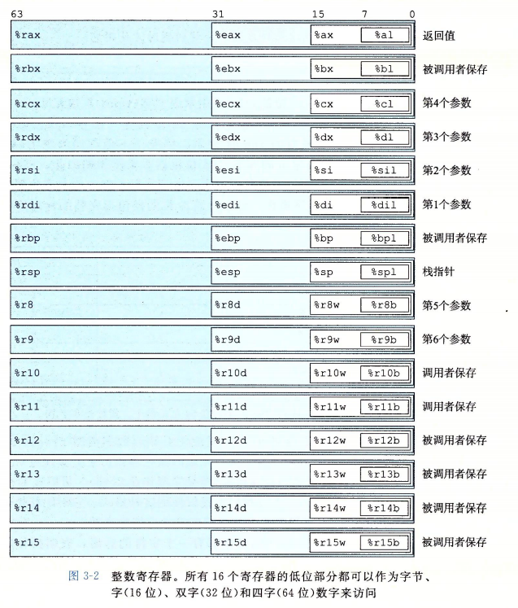
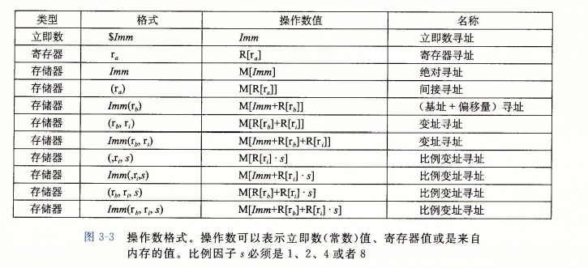
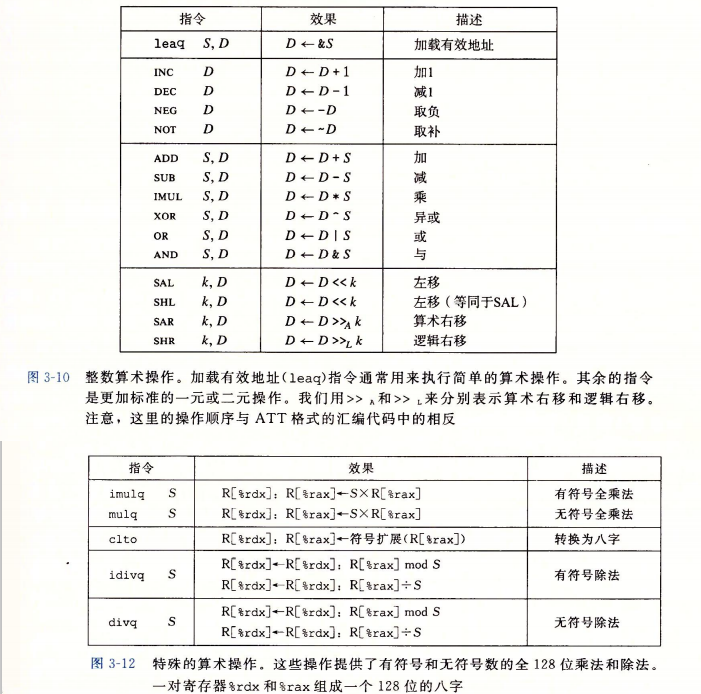

[TOC]

# 汇编1
# 数据格式
* 一个字节(FF)为8位,2个16进制数
* 一个字(FF FF)为双字节,16位

# 访问信息
### 指令后缀  P119
(下为整数,浮点用的另一套寄存器和指令,可能有歧义)
b = byte
w = word
l = double words(long word)
q = quad words(四字)
    
### CPU包含一组16个存储四字的通用目的寄存器(x86-64) P119
存储整数和指针
以 %r 开头

### 内存引用 P121
立即数 常见$后跟整数(10或16进制)，表示常数值(该地址)
寄存器 

### mov P122
mov S,D
复制 后缀表示操作的数据大小不同
前写入后 括号表示求值,无括号或有$表示立即数
有2个操作数,内存或寄存器,不能都为内存(内存到内存要写两个指令,先到寄存器再到另一个内存) 

     
(movl双字写入寄存器会将寄存器高位双字置0)  
(常规movq的源操作数只能为32位的补码,将其扩展,movabsq能将64位立即数作为源操作数,但只能写入寄存器)  
     

MOVZ表示零扩展(例movzbw byte to word)
    没有movzlq 4字节到8字节,可以通过寄存器为中介实现)
MOVS 符号扩展
    cltq 没有操作数,符号扩展 %eax->%rax,同 movslq %eax,%rax

###  栈 P125
pushq 和 popq 只有1个操作数(压入的数据源和弹出的数据目的)
数据为立即数
栈向下增长
指令编码仅1字节
可以用标准的内存寻址方法访问栈的任意位置

# 算数和逻辑操作 P128
* 除了leaq其他都根据数据大小有后缀
* 
****
### leaq加载有效地址(load effective address) P129
leaq S,D    
类mov, 原意为将有效地址写入目的,实常用于简洁描述普通的算数操作

### 一元(递增递减,取负取补)和二元(加减乘,异或,或,与)操作 P130
见上图
一元的操作数既是源又是目的
二元的第二个操作数是源和目的

### 移位操作 P131
2个操作数,前者为位移量,后者为要移位的数
移位量可以是立即数或 特定的 单字节 寄存器(%cl)
    一字节可达到255, 但移位时会根据数据的大小忽略高位
左移
    SAL SHL 效果一样,右填0
右移 
    SAR算数移位(arithmetic shift) 
    SHR逻辑移位()

### 特殊算数操作(全乘法,除法) P133
见上图下部分
乘法
    imulq S,D 两个64位操作数乘出64位乘积(128位乘积截取为64位时无符号乘和补码乘表现相同)
    imulq(补码乘)\mulq(无符号乘) S 单操作数,一个参数存于%rax,给出另一个参数,乘积低64位存于%rax,高位存于%rdx
除法
    idivq\divq S 将寄存器%rdx和%rax的128位作为被除数,给出除数,商存于%rax中,余数存于%rdx
    cpto 不需要操作数 读出%rax符号位,复制到%rdx所有位(用于被除数小于64位时)
         