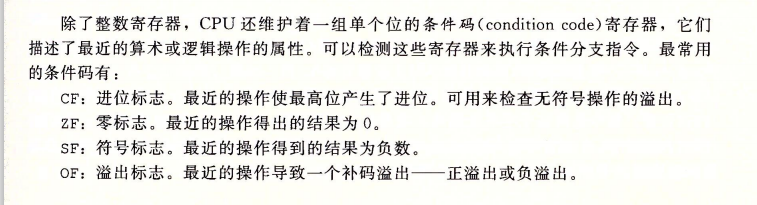
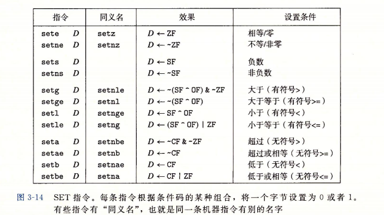
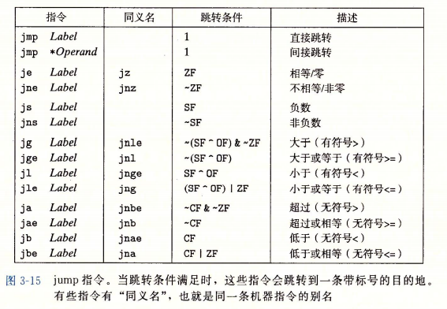
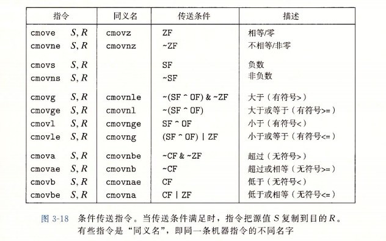

[TOC]
<font face = "Consolas">

# 汇编2
## 控制
### 条件码 P135(略读)
   * 
   * leaq只进行地址运算不改变条件码
   * CMP和TEST指令,只改变条件码,有大小后缀,cmp为减test为加
   * 
   * 先用比较和测试指令再用SET
   ****
### 跳转指令 P138
   * 
   ```
   直接跳转 jmp .L1   //跳转目标作为指令的一部分编码
   间接跳转 jmp *%rdx //跳转目标从寄存器或内存中读出(加括号为求值)无括号则跳寄存器中的值,有括号跳寄存器中的值指向的地址
   条件跳转只能直接跳转,名字与SET指令相匹配
   ```
### 跳转指令的编码 P139
   * 常用PC相对的(PC-relative),即编码值为目标指令的地址和下一跳指令的差
      ```
      3: -- 03       jmp   8<loop+0x8>
      5: -- --       ---   ---
      8: -- --       ---   ---
      //第一列为地址 
      //3想要跳转到8,则跳转指令的目标编码(0x03)为目标8-下一行地址5
      //目标编码也可为负数,向前跳

      //可迁移性好,只看跳转代码间的相对位置,改变代码块整体的内存位置无须修改编码
      //程序计数器PC的值是后面那条指令的地址,更新PC是执行一条指令的第一步
      ```
   * 第二种方法为给出4字节的绝对地址
   ****
### 用条件控制实现条件分支(结合下) P141
   * 如if语句,通过跳转实现就要加入条件和无条件分支
      ```
      it = test_expr;
      if(!it)
         goto false;
      statement;
      goto done;
      false:
         statement;
      done:
      ```
### 用条件传送实现条件分支 P145
   * 数据的条件转移: 同时计算条件操作的两种结果,再根据结果选取
   * 符合现代计算机流水线的设计. 分支预测逻辑一旦出错,时间惩罚很严重
   * 
      * 不支持单字节传送,支持单双四字,汇编器可从目标寄存器的名字推断条件传送指令的操作数长度,不需要自己指定名字
   ```
   因为都会求值,所以表达式的任意一个都不能出错
   出现错误就会尝试回分支代码
   编译器不具足够信息进行可靠判断,除非表达式极易计算会条件传送,通常还是条件控制
   ```
   ****
### 循环 P149
   * do-while循环可以直观的表示
   * while循环可以直接goto测试代码,也可以在开头判断一次然后调用do-while代码(根据优化等级不同,一般后者优)
   * for可用类while模式(其实三者都差不多一种模式)
   * switch采用 **跳转表** 模式 P159
      * 跳转表是一个数组,表项是代码段的地址
      * 跳转表优点是执行开关语句的时间与开关情况的数量无关
      * 汇编中创建一个储存&&指针的数组,在通过对权值的计算jmp到表项的位置
      * 可加范围判断,有默认项表示没有case到,有结尾代码处理break
   ****

