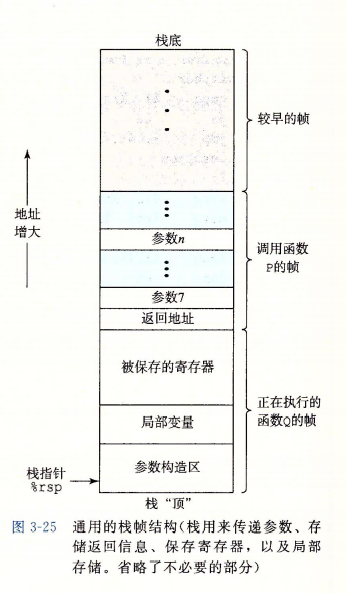
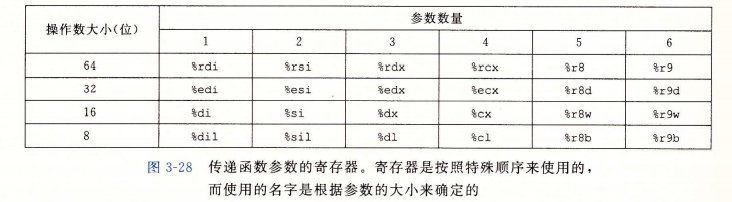

<font face = "Consolas">
<!-- @import "[TOC]" {cmd="toc" depthFrom=1 depthTo=6 orderedList=false} -->

<!-- code_chunk_output -->

- [汇编3](#汇编3)
  - [过程](#过程)
    - [运行时栈 P164](#运行时栈-p164)
    - [数据传送 P168](#数据传送-p168)
    - [寄存器中的局部存储空间 P172](#寄存器中的局部存储空间-p172)
- [数组(略)P176](#数组略p176)
  - [异质的数据结构(struct union)P183](#异质的数据结构struct-unionp183)
    - [struct](#struct)
    - [union P186](#union-p186)
    - [数据对齐](#数据对齐)
  - [系统安全](#系统安全)
    - [缓冲区溢出](#缓冲区溢出)
  - [边长栈帧的分配//](#边长栈帧的分配)
- [浮点代码(略) P204 待补](#浮点代码略-p204-待补)

<!-- /code_chunk_output -->

# 汇编3
## 过程
>过程调用的机制:
传递控制。在进入过程Q的时候,程序计数器必须被设置为Q的代码的起始地址,然后在返回时,要把程序计数器设置为P中调用Q后面那条指令的地址。
传递数据。P必须能够向Q提供一个或多个参数,Q必须能够向P返回一个值
分配和释放内存。在开始时,Q可能需要为局部变量分配空间,而在返回前,又必须释放这些存储空间


### 运行时栈 P164
  栈和寄存器存放传递控制和数据,分配内存的信息.
  超出寄存器存放的大小时就会在栈上分配空间

```
p->q调用时:
p压入返回地址
q保存p的寄存器状态(如q需用到<被调用者保存寄存器>)
传参通过寄存器(6个)和p栈帧完成
q操作通过寄存器和栈帧完成
---------P167(如何保存寄存器状态未解决)
call 将调用结束后的下一语句地址压入栈，并跳转到call的目标地址(执行函数),传参通过寄存器完成
调用函数中,PC正常更迭,局部栈弹出完后的栈向为上层的下一语句地址
ret 函数执行中遇到ret结束,返回值通过寄存器传递,在栈中弹出下一语句地址并跳转
```

### 数据传送 P168
最多6个整型(整数和指针)参数,按顺序,超出部分用栈传递(存于p的栈部分中),超出部分在后的先压入栈,最先的7位于栈顶
(参数倒序存入寄存器或栈)

内存中分配局部数据:寄存器不够或需要用到局部变量的地址时(求址,数组,结构)

### 寄存器中的局部存储空间 P172
> p->q p调用q
* 被调用者保存寄存器(%rbx,%rbp,%r12-%r15):
     >由q负责调用后不变
    在调用函数时q要不不改变寄存器的值,要不将要改变的寄存器压入栈,加上<保存的寄存器>标号,调用的最后将栈中保存的寄存器pop回相应寄存器
* 调用者保护寄存器(除了栈指针%rsp都是): 
    >q无需负责,p负责保存自己的寄存器状态

>前者告诉下级这些不能更改,后者表示下级随意更改保存寄存器状态的责任在上级,所以需要保存的数据大于前者数量(6)时超出的数据存于上级栈帧中


# 数组(略)P176

## 异质的数据结构(struct union)P183
### struct
>采用类似数组的实现,结构指针指向结构第一个字节的地址,编译器通过各字段的字节偏移产生对元素的引用
### union P186
>大小为最大字段的大小
存储的位相同,调用不同元素时解释方式不同
### 数据对齐
>通常要求地址是某值K(如2,4,8...)的倍数以获得更高的内存性能
汇编中用 .align 8 表示全局数据的起始地址为8的倍数 P161
在struct 中通过添加空白填充满足要求

## 系统安全
### 缓冲区溢出
* 栈随机化:
    >(windows好像没有? 通过main中重复启动直接输出一个局部变量的%p是否相同得)
* 栈破坏检测
    > 通过在缓冲区与栈状态间加一个随机**金丝雀值**(通过%fs:40段寻址读入,标记为只读),在函数返回时检查该地址值是否与金丝雀值相同判断栈状态是否被改变
* 限制可执行代码区域 
    >在处理器的内存保护上引入NX位(不可执行标记)

## 边长栈帧的分配//
>先将原本的基指针rbp(被调用者保存)保存,然后把栈指针rsp当作新的rbp
先分配16位给偏移量记录,然后计算所需内存,将计算值加22后向下舍入为16的倍数,rsp分配计算值的内存(减去),然后新rsp向上舍入为8的倍数(先加7然后将后3位置0)

# 浮点代码(略) P204 待补
