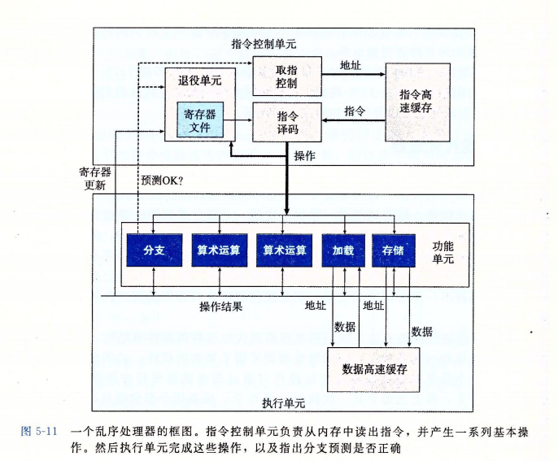

[TOC]

# 优化程序性能 P342
>考虑内存别名使用(不同指针可能指向相同地址),限制了编译器的优化策略
减少循环中的重复调用某个函数(特别其值一直不变时),将其存储于一个变量中
减少不必要的内存引用,在重复计算中计算过程用局部变量替代
****
## 现代处理器的整体结构
### 处理器框架

* 控制单元(ICU)读出指令序列并生成一组基本操作,执行单元(EU)执行操作
* ICU提前取指:
    >ICU在执行指令前很早就从指令高速缓存中取指,有足够时间译码发送给EU
* 基本操作:
    >内存引用和算数计算会被分开成不同的基本操作
    算数运算单元并没有严格分工,大部分单元都有多种功能
* 加载和存储单元:
    >负责读写内存,每个单元都有一个加法器完成地址计算.通过数据高速缓存(存放最近访问的数据值)访问内存
* 退役单元:
    >使用分支预测投机执行技术的结果不会存放到寄存器或内存中直到确定.ICU中有退役单元记录正在进行的处理,指令信息被放置在队列中,预测正确则指令退役执行寄存器更新,否则清空,丢弃计算结果.
* 局部数据转发:
    >执行单元可以相互数据转发.有寄存器重命名的机制.会更新寄存器r的指令译码时产生标记t,(r,t)加入一张表中.随后有以r为操作数的指令译码时,会把t发送给执行单元,完成操作生成结果(v,t),表示t的操作产生值v,等待寄存器r的操作都能使用v作为源值.表中没有相关寄存器时则直接读取获得.
****
##　并发与性能
>每个运算都有延迟(运算所需时间),发射(开始连续运算之间所需最小时钟周期数),容量(能执行该运算的功能单元数量).吞吐量为发射时间的倒数(极限优化下的操作延迟)
    
除法的发射时间等于其延迟(因除法必须等待上一条除法结束后才能开始),其余运算发射大部分为1
* 关键路径:
> 因有多个功能单元,所以运算是可以并行的,因此制约程序CPE的阻碍就是关键路径所需的时钟周期数,为程序运行所需周期数的**下界**.某些看似效率较低的部分可能并不阻碍程序效率.
* 循环展开:
    >在一次循环中计算多次达到减少循环次数的目的
* 使用不一个的变量:
    >直接透过此优化方法可以使程序效率更接近延迟界限,但如果在一次循环中通过一个变量来计算多次,这几次计算之间就需要等待,无法使程序超过延迟界限
* 不同变量并行,最后汇总
    >所以通过用不同的变量并行运算,最后再运算到结果上,可以充分发挥多功能单元并行的优势,超过延迟界限,在合理优化下所有相关功能单元的流水线都是满的,可以达到吞吐量界限
>这种操作不会影响结果,高优化等级编译器可以达到此效果
注意浮点乘与加是不可结合的,注意适用范围.
重新结合变换,显式改变运算顺序,也可以使程序更合理的并行
* SIMD向量指令
****
## 限制因素 P378
    > 并行度超过可用寄存器数量,编译器就会将临时值存放在内存中(通常是运行时堆栈),用时再读,降低效率.
* 条件传送风格代码:
    > 分支预测错误处罚,一般来说有条件传送,性能不会受太大影响.尽量书写"功能性的"语言风格(赋值而不是"命令式的":检查)适合条件传送
****
## 写/读相关 P382
> 内存读的结果依赖于最近的内存写
主要针对对内存的写读相关(p[i]=p[i-1]+a[i],循环中要反复读取p[i],且要等待存储完成),可以用寄存器做中间值解决.
* 存储缓冲区:
    >存储单元也有存储缓冲区,将没有完成的存储操作保存,加载发生时会检查存储缓冲区中的条目,地址匹配就读出
* 所以存储操作可以看成两个**独立**的操作:
    设置缓冲区条目的地址字段 | 设置该条目的数据字段 
    --|:--:
    * 地址计算必须在数据运算前
    * 加载时必须检索所有的存储缓冲区
    * ->单轮读写相互等待:
        >所以在写读操作的地址相同时(包括上下轮循环),加载就要等到数据计算结束,不同就可以独立进行
    * ->各轮相互等待:
        >写读相关时,循环操作的每一轮不能并行,效率低下.

* gprof