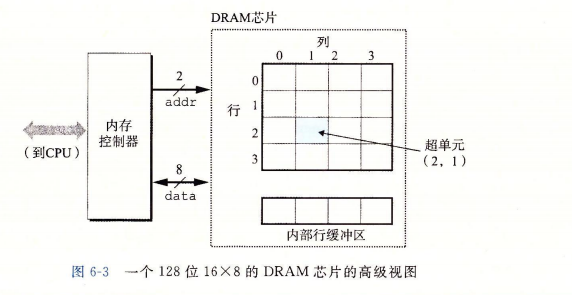
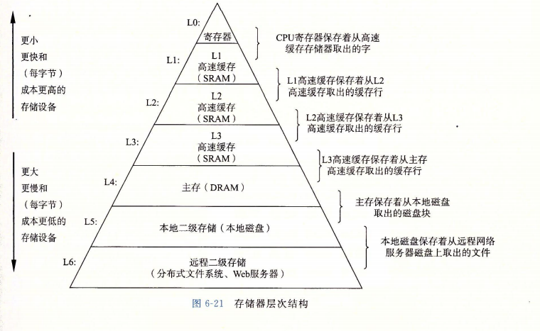
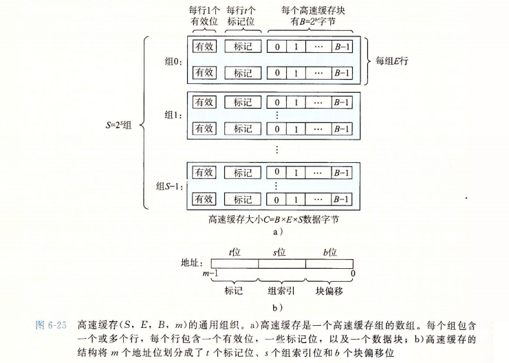

[TOC]

# 存储器层次结构 P398
****
## 随机访问存储器(RAM) P400
* 静态SRAM 双稳态存储器单元 有电永远保持 用于高速缓存
* 动态DRAM 易干扰不稳定 系统会周期性读出重写纠错
### DRAM
* 
> 16 * 8(d * w)
 d个(r行c列)超单元,每个超单元由w个DRAM单元(1位)组成
 8个data引脚传出入一个字节,2个addr引脚携带行列的超单元地址
 
* 读取:内存控制器先将整行内容复制到内部行缓冲区,再从行缓冲区复制出列地址的超单元
### 主存访问,总线 P405
* CPU芯片<--系统总线-->I/O桥<--内存总线-->主存
* 总线携带地址,数据,控制信号(同步事务,表示事务类型). 
* movq A,%rax: CPU将A地址放到系统总线上,经IO桥传递到内存总线,主存感受到该地址信号,从DRAM中取出该数据,写到内存总线,然后发回CPU,数据复制到寄存器%rax
* movq %rax,A: CPU将地址A传送到内存,到达后CPU将%rax的数据放到系统总线传到主存,存储.
### 连接I/O设备 P411
* I/O设备通过I/O总线与I/O桥连接,从而与计算机交互
### 访问磁盘 P412
* CPU有内存映射I/O系统,有I/O端口地址与端口相关联
* 读:CPU对端口地址发送指令(读指令,应读逻辑块号,存储的主存地址),然后磁盘独立将数据传送到内存无需CPU干涉(直接内存访问)(DMA传送),完成后磁盘发送给CPU一个中断信号,操作系统记录I/O完成.

****
## 局部性
* 时间局部性 同个内存位置多次引用
* 空间局部性 引用过的内存位置附近引用
    * 硬件层: 引入高速缓存
    * 操作系统级: 主存作为虚拟地址空间的高速缓存
****
##　存储器层次结构 P421
* 
* 高速缓存(cache),缓存(caching)
    * 中心思想: 上层存储设备作为下层的缓存
* 块: 存储器被划分成连续的数据对象组块,相邻层次块大小固定,其他层次可以不同,任意时刻上层缓存包含下层块的一个子集副本
* 读: 读k层数据时,先在上层的块中查找,找到了即缓存命中,读取.缓存不命中就取出下层的相应数据到上一层,覆盖一个块,由缓存的替换策略控制.
    * 放置策略: 全自由速度最优,昂贵,用于高层缓存...通常为严格的放置策略,上层块对应下层的一个块子集
    * 缓存不命中种类: 冷不命中:冷缓存(空)...冲突不命中:严格的放置策略中请求对象映射在同一个块
****
## 通用高速缓存组织 P426
* 
> 存储器地址为m位,高速缓存有S个组,每组有E行,每行有B字节,地址分为(t,s,b),为(标记(标记),组索引(组),块偏移(数据块的字偏移)),用于检索地址
  组偏移为中间位是为了不让太多连续内存块映射到同一高速缓存块

* 读: CPU执行读w字的指令,向高速缓存请求,高速缓存先通过组索引找到相应组,然后对标记(遍历)判断是否为对应信息,是则通过块偏移得到该块,不是就从内存中找到w字替换该高速缓存位置然后取值返回给CPU
* 写: 直写:直接写回低一层中---(不命中时)非写分配:直写
写回:推迟更新,直到改块要被替换时再写到低层---(不命中时)写分配:将低层块加载到高速缓存中再写回
