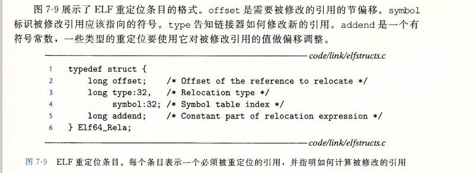
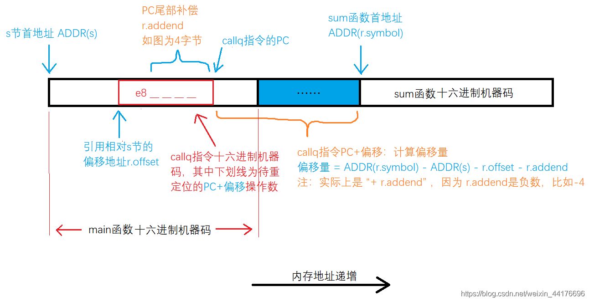

[TOC]

# 链接 P465 //待补充

### 编译器驱动程序 
> main.c --C预处理器-> 
main.i(ASCII码中间文件) --C编译器(ccl)-> 
main.s(ASCII码汇编文件) --汇编器(as)-> 
main.o(可重定位目标文件) --链接器程序(ld),组合->
prog(可执行目标文件)
shell调用加载器,将prog中的代码和数据复制到内存,将控制转移到这个程序开头

* 目标文件: (代码和数据节组成)纯粹是字节块的集合,包含程序代码,程序数据或引导链接器或加载器的数据结构.
    * 可重定位目标文件:　P467
    * 
* 符号表(待补充): 包含可重定位目标模块定义和引用的符号的信息
    * 包含本模块定义的全局符号(变量及函数),其他模块定义且被该模块引用的全局符号,只被该模块定义引用的局部符号
    * static静态变量由编译器在.data或.bss分配空间,在符号表中创建唯一名字的本地链接器符号
    * 非静态变量由运行时栈管理,链接器不管理.
    * 
* 符号解析
    * 静态局部变量:编译器确保其在本地链接器中有唯一的名字.
    * 全局符号: 不是在当前模块定义的会生成一个链接器符号表台条目由链接器处理.
    * 链接器: 编译器向汇编器输出每个全局符号的强(函数和已初始化的全局变量)弱(未初始化的),(多强报错,强弱选强,多弱随机)汇编器将其隐含在可重定位目标文件的符号表中
    * 静态库: 将所有相关的目标模块打包成一个单独的文件,用作链接器的输入
        * 库中的函数被编译为独立的目标模块,封装成单独的静态库文件
        * 链接器只复制被程序引用的目标模块,减少了可执行目标文件占用的内存
        * 解析引用过程: 链接器维护可重定位目标文件集合E,未解析符号集合U,已定义符号集合D,初始时都为空
            * 输入目标文件f链接器就将f加入E,修改UD
            * 输入存档文件f链接器匹配U未解析符号,如存档文件成员m匹配成功就将m加入E,修改UD.最后丢弃不包含在E中的成员目标文件
            > 所以在命令行中要先加入引用符号的目标文件,先把符号都写入U,然后加入库来解析.

*****
以上为符号解析，代码中每个符号引用正好和一个符号定义(其输入目标模块中的一个符号表条目)关联起来了
接下来就是重定位,合并输入模块,为每个符号分配运行时地址
**** 
* 重定位:
    * 重定位节和符号定义: 将所有相同类型的节合并为同一类型的聚合节,链接器将运行时内存地址赋给新的聚合节
    * 重定位节中的符号引用: 链接器将每个符号指向正确的运行时地址,依赖可重定位模块中的重定位条目
    * 重定位条目:放在.rel.text(代码),.rel.data(已初始化数据)中
        * 
        * 有PC相对引用(R_X86_64_PC32)和绝对引用(R_X86_64_32)
            * PC-relative偏移量为r.symbol+r.addend-要修改的引用的实际地址 P481
            * 
            [符号引用重定位 重定位PC相对引用 简单讲解](https://blog.csdn.net/weixin_44176696/article/details/106666236)