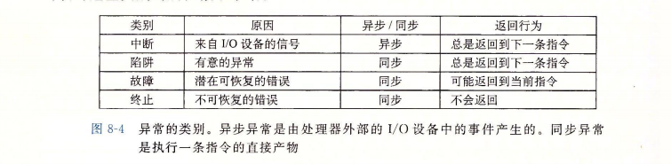
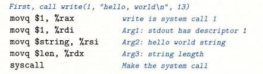
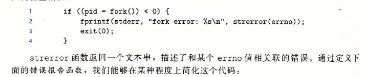
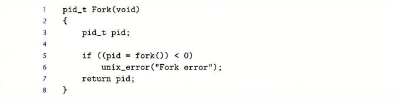
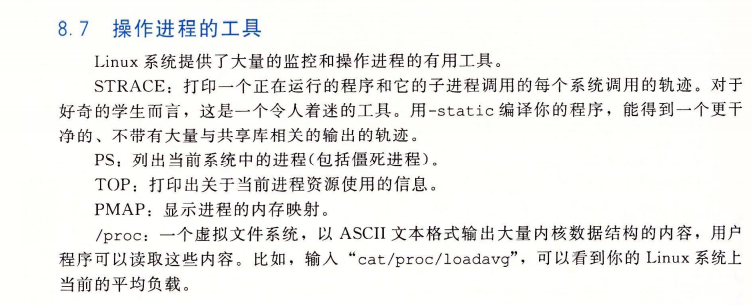

<font face = "Consolas">
<!-- @import "[TOC]" {cmd="toc" depthFrom=1 depthTo=6 orderedList=false} -->

<!-- code_chunk_output -->

- [异常控制流ECF](#异常控制流ecf)
  - [异常的类别 P504](#异常的类别-p504)
  - [系统调用 P506](#系统调用-p506)
  - [进程 P508](#进程-p508)
  - [系统调用错误处理 P512](#系统调用错误处理-p512)
    - [进程控制(Unix c操作进程的系统调用函数) P513-P526](#进程控制unix-c操作进程的系统调用函数-p513-p526)
  - [信号 P526](#信号-p526)

<!-- /code_chunk_output -->

# 异常控制流ECF
> 1.系统需要通过控制流突变对系统状态的变化作出反应
2.处理器检测到异常,通过一个异常表跳转表进行间接过程调用,异常表的起始地址放在异常表基址寄存器中,每个异常都有唯一的异常号,为异常表中的索引,有处理器分配的也有操作系统内核分配的.
3.异常处理程序运行在内核模式下,从用户程序转移到内核时,信息会被压入内核栈

## 异常的类别 P504
* 
* 中断: IO等待
硬件,指令执行过程中处理器检测到中断引脚电压变高,就从系统总线读取异常号,调用适当异常处理程序,处理程序返回时将控制返回给下一条指令.
* 陷阱: 有意的异常
提供系统调用,在用户程序和内核间提供过程接口.
* 故障: 错误(可能修复)
发生时处理器将控制转移给故障处理程序,修正则控制返回到故障指令重新执行,否则返回到内核abort例程来终止故障程序.
* 中止: 不可修复(如硬件错误)
处理程序返回给abort例程,中止程序,不会返回给错误程序.

## 系统调用 P506
> C库函数提供了一组包装函数,其将参数打包在一起,以系统调用指令陷入内核,然后将系统调用的返回状态传递回调用程序.

系统调用参数通过通用寄存器传递,%rax传递系统调用号,另6个寄存器最多包含6个参数,返回值由%rax传递(-4095->-1表示错误,对应于负的errno)


## 进程 P508
> 进程: 执行中程序的实例
内核通过进程控制流ECF提供进程的基本概念
上下文(context): 程序正确运行所需的状态(寄存器,栈,pc,代码和数据,环境变量,打开文件描述符,页表,进程表,文件表)
每个程序都运行在某个进程的上下文中
进程给应用程序提供了抽象: 独立的逻辑控制流, 独立的地址空间

* 逻辑控制流: PC的序列
* 并发流: **逻辑控制流**并发执行
    并发: 多个流并发执行的**现象**
    多任务: **进程间**轮流运行
    并行流: 并发流且不在同个处理器上运行
<br/>
* 私有地址空间: 进程为每个程序提供其私有地址空间 (进程间一般不能相互读写)
<br/>
* 进程运行的模式: 用户模式和内核模式
    通过某个控制寄存器的模式位.设置模式位表示进程运行于内核模式(可执行指令集中任何指令,可访问任何内存位置)
    一般运行于用户模式,切换的 唯一方法是异常,处理程序返回后切换回用户模式
    ```Linux /proc提供对内核数据结构的访问```
<br/>
* 上下文切换:较高层形式的异常控制流实现多任务
    上下文(定义见上文)用于重新启动被抢占进程时恢复状态
    上下文切换过程: 保存当前进程上下文,恢复下个进程上下文,控制传递给下个进程

## 系统调用错误处理 P512
Unix系统级函数遇到错误时通常返回-1并设置全局整数变量errno表示错误原因


包装后对fork()调用可: pid = Fork();

### 进程控制(Unix c操作进程的系统调用函数) P513-P526

## 信号 P526
> 软件形式的异常, 称为Linux信号
信号:通知进程系统中发生了一个某种类型的事件
一般的低层硬件异常由内核异常处理程序处理,对用户进程不可见.
信号提供了一种机制将异常从内核通知到用户进程

* 发送信号: 内核更新目的进程**上下文**的某个状态
* 接受信号: 目的进程被内核强迫对信号做出反应(忽略,中止,执行信号处理程序)

待处理信号: 没被接受的信号为待处理信号,一种类型的待处理信号在任意时刻至多为一个(多余的同类信号丢弃)
阻塞: 一种信号被阻塞时可发送但不被接收

上下文表现: 内核在进程上下文的pending位向量中维护待处理信号的集合(传送k类型设置pending第k位,接收k类型就清除第k位),blocked位向量维护被阻塞信号的集合.

* 发送信号 P528
* 接收信号 P531
* 阻塞 P532
* 信号并发问题 P540
* 非本地跳转 P546  
    jmp系列函数实现调用环境切换，跳过所有中间调用，类似catch throw

