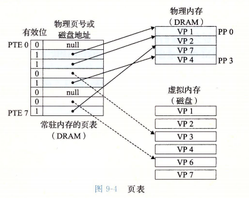
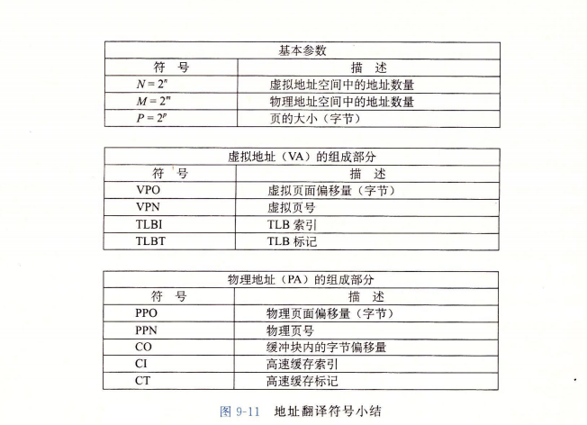

[TOC]
<font face = "Consolas">

# 虚拟内存(VM) P559
> 虚拟内存将主存看作磁盘上地址空间的高速缓存,主存中保存活动区域,根据需要在主存和磁盘中传送数据.
(一致)为每个进程提供一致的地址空间
(私有)保护每个进程的地址空间
****
## 地址概念 P560
### 物理地址: 
   >主存上,以字节为单位
   物理地址空间不要求$M=2^m$
### 虚拟地址
   >虚拟地址空间$N=2^n$
    ```虚拟地址--地址翻译硬件(MMU(内存管理单元)+操作系统) + 页表(物理内存中)-->物理地址```

****

# 虚拟内存 P561
> 虚拟内存存放在磁盘上
也被分块,叫做虚拟页,物理内存也被分为物理页(页帧),大小相同

虚拟页的页面被分为: 
未分配的 | 缓存的(在物理内存中) | 未缓存的(分配但未缓存在主存中)
--|:--:|--:
****
## 页表: 虚拟页映射到物理页

>页表:就是一个页表条目的数组,每个虚拟页都在页表中有一个固定的PTE
* 有无有效位影响页表存储的**地址字段**
    * 有有效位: 1存储DRAM中相应物理页起始地址,0不管
    * 没有有效位: (未分配)空, (已分配)该虚拟页磁盘上起始位置
### 页命中: 
> 虚拟地址被翻译为相应PTE,在页表中读取,有效得到PTE中的物理地址
### 缺页:  
> 通过有效位发现请求地址没有缓存在页表中,就从物理内存中选择一个牺牲页(写回),然后物理内存中就缓存请求地址的页面(相应的虚拟内存),并将新的缓存更新到页表的PTE中

   ```Linux getrusage()检测缺页数```
****
## 虚拟内存的内存管理功能
> 通常每个进程有一个独立的页表,提供独立的虚拟地址空间:
* 简化链接: 每个进程的内存映射都可以使用相同的基本格式,简化了链接器的实现
* 简化加载: 新建一个进程,将程序代码和数据分配为虚拟页,再通过页表按需缓存.
* 简化共享: 通过将不同的虚拟页面映射到相同的物理页面,来共享代码和数据
* 简化内存分配: 请求额外堆空间时可以分配连续的虚拟页面,然后映射到任意的物理页面(无需连续)
****
## 虚拟内存的内存保护功能
* 独立地址空间便于区分不同进程的私有内存
* 可再PTE上加额外的许可位控制对一个虚拟页面内容的访问
****
## 地址翻译 P567



```1. CPU请求一个虚拟地址,将该虚拟地址传给MMU```
```2. 通过虚拟地址的虚拟页号VPN选择相应的PTE,(通过TLB,见下文)```

```3. 如果该PTE有效位为0,MMU触发异常传递给CPU,引发内核中的缺页异常处理程序,该程序进行缺页操作(上文),然后返回到原先进程的导致缺页的指令.```
```4. PTE有效,观察该PTE中的物理页号PPN,通过PPN找到相应的物理地址页面,然后根据虚拟地址的虚拟页偏移量VPO偏移得到请求的物理地址(虚拟页偏移量VPO=物理页偏移量PPO:页面大小都相同)```

* SRAM: 大部分使用物理寻址访问,方便共享内存块,而且SRAM无需处理内存保护(地址翻译负责)


### TLB(Translation Lookaside Buffer):
* 是虚拟地址的缓存
* 

> TLB索引表示VPN的低位,TLB标记表示高位
(TLB索引的位数与TLB的组数相匹配[例中4组对应2位索引])
(先通过TLB索引得到组数再通过标记位判断)
(匹配成功得到PPN与虚拟地址的VPO组合得物理地址)
MMU从TLB中取出请求虚拟地址的PTE,如果没有就从L1缓存中取出相应PTE存放在PTE中
所有过程都在CPU的MMU上完成,速度快

### 多级页表
* 
    * 通过多个PTE索引物理地址
* 优点:
> 节省内存空间: 空的上级页表不会有下级页表
节省内存空间(相对于单页表总缓存于内存中): 只有上级页表会长时间缓存于主存,下级页表在需要时创建,调入调出
* 地址翻译: 虚拟地址带有多个VPN,分别指示不同的页表(TLB可以存储不同层次的页表,加速翻译)

<br/>
    <details>
    <summary><mark>地址翻译实例 P573</summary>
    
    
    
    </details>
<br/>

### i7 地址翻译
* 
* L1优化: L1缓存有64个组,每组64个缓存块,对应12位正好符合12位的VPO,所以MMU翻译VPN是VPO发往L1缓存得到相应的组和偏移,然后直接核对PPN与标记位,加快速度(P579)
<br/>

### Linux 虚拟内存
* 
* 进程单独: 
    > 每个进程都有单独的虚拟内存,包括进程虚拟内存和内核虚拟内存(部分映射到共享的物理页面)
* 内核虚拟内存的物理内存:
    > 内核虚拟内存中有一连续的虚拟页面(大小等于内存),映射到连续的物理页面,为内核提供访问物理内存任意位置的方法(该空间所有进程共用)
* 区域: 
    > 虚拟内存全分为区域,区域就是已分配虚拟内存的连续片(允许虚拟地址空间有空隙)
* 任务结构(task_struct): P581
    > 每进程独立,包含或指向该进程的所有运行所需信息
****
## 内存映射
> 虚拟内存区域与磁盘上的对象关联起来
匿名文件: 一个区域可以映射到普通文件,也可以映射到匿名文件(由内核创建的全0,CPU第一次引用到区域中的匿名文件时会在物理内存中牺牲一个页面,用0覆盖,更新页表)
交换空间: 初始化过的虚拟页面都由内核中交换空间中交换,交换空间限制当前进程分配虚拟页面的总数

### 共享/私有对象
* 共享对象: 
   > 进程共用,进程将共享对象映射到虚拟地址空间时,任何进程对共享对象的写可见
* 私有对象:
   > 写时复制: 如果不写,则所有进程共享该私有对象的物理副本(进程的页表条目将这个私有区域的页表标为只读,区域结构标为私有的写时复制),有进程试图写会触发保护故障,就会在物理内存中创建该页面的新副本,更新页表,恢复可写权限 ,然后返回到那个写操作.

### fork()
> 内核为新进程创建各种数据结构,分配PID.
为新进程创建虚拟内存,创建原始副本,两个进程的每个页面标为只读,每个区域结构标为私有的写时复制.
fork()返回时新老进程的虚拟内存相同,任意一个写操作触发写时复制.

>返回2次:
在父进程中，fork返回新创建子进程的进程ID;
在子进程中，fork返回0;
如果出现错误，fork返回一个负值;

>新进程从fork()返回处开始执行


### execve() 加载并执行程序
> 删除当前进程用户部分已存在的区域结构
为新程序创建新的区域结构(私有,写时复制)(代码.text和已初始化数据.data是由文件提供的,共享库文件提供,其余都映射到匿名文件)
将当前进程上下文中的PC指向代码入口

### mmap() 创建虚拟内存 munmap() 删除虚拟内存
****
## 动态内存分配 P587
> 动态内存分配器维护**堆**
堆在未初始化数据.bss和共享库映射区域之间,brk指针指向堆顶部,向上生长
堆被分为大小不同的块,有已分配的和空闲的.(被显式分配,隐式或显式释放)

### malloc() free()
> 错误时会设置errno
calloc()分配初始化过的内存  realloc()改变已分配块的大小

### 要求和目标
>处理任意请求序列: 不假设分配释放的顺序
立即响应请求: 不允许为了性能重新排列或缓冲请求
只使用堆: 为了分配器可扩展,任何非标量数据结构都必须保存堆中
对齐块: 可保存任何类型的数据对象
不修改已分配块:

>最大化吞吐率: 单位时间完成的请求数
最大化内存利用率:峰值利用率

### 碎片
* 内部碎片: 分配的块比有效荷载大产生的差值
* 外部碎片: 空闲内存太过零散,合计足够但没有单独的足够大的空闲块

### 待考虑实现问题: 
* 空闲块组织: 如何记录空闲块
* 放置: 如何选择空闲块
* 分割: 如何处理空闲块被填充后的剩余部分
* 合并: 如何处理刚被释放的块

###  隐式空间链表
> 通过将块信息嵌入块本身来区别块边界
空闲块通过头部中的大小字段隐式链接
一个简单的块组成: 头部 有效荷载 (填充)
* 头部: 包含块大小,是否分配
    * 信息位: 假设块大小是8的倍数,那块大小的后3位必是0,就可以将这后三位作为信息位
结束块: 设置已分配(简化合并)但大小为0的终止头部

### 选择分配块的方法 P593
* 首次适配: 从头开始
    * 优点: 趋向于将大空闲块留在链表后面
    * 缺点: 在链表头留下大量小空闲块,增加搜索时间
* 下一次适配: 从上一次查询结束的地方开始
    * 优点: 比首次适配快    
    * 缺点: 内存利用率低    
* 最佳适配: 遍历所有空闲块找最小的符合块
    * 优点: 内存利用率高
    缺点: 慢
* (分离式空闲链表组织)

### 合并空闲块
假碎片: 邻接的小空闲块,释放时产生
立即合并: 每次释放时合并所有相邻块
推迟合并: 等时机
>如何合并前面的块?(单链表无法常数事件访问前项)
:添加边界标记(在每个块结尾添加脚部(头部的副本))
可能产生显著的内存开销
优化:只有前块是空闲块时需要脚部,所以将前块的分配位放在当前快的信息位中,已分配的块就不需要脚部了
### 分配器代码设计 P597-P603

### 显式空闲链表 
> 在空闲块的荷载区中包含pred和succ指针,组织双向空闲链表  
### 分离的空闲链表
> 分离存储: 维护多个空闲链表,每个链表存储大小相同的空闲块
* 简单分离存储
    * 每个块都是当前大小类的最大规格
    * 链表为空请求分配时直接向操作系统请求.
    * 优点:
        * 分配块的大小可通过地址推断,没有合并,所以分配块不需要头脚部
        * 空闲块只需succ指针,最小块只有一个字
    * 缺点: 容易造成内部和外部碎片
* 分离适配(高效)
    * 每个空闲链表关联一个大小类
    * 分配: 分配块从相应的大小类中首次适配(内存利用率接近最佳适配),找到就分割,将剩余部分插入适当的空闲链表中.
    * 找不到就搜索更大的大小类,实在没有就向系统请求
    * 释放: 执行合并

### 垃圾收集器 
>Mark&Sweep算法
将内存视为有向可达图
根节点(寄存器,栈,全局变量)不在堆中,包含指向堆中的指针
堆节点对应堆中的一个已分配块.
有向边p->q意味块p某个位置指向块q的某个位置
存在从任意根节点除法到达p的有向路径则节点p可达
不可达节点是垃圾,不能被再次使用
C收集器是保守的垃圾收集器: 不能维持可达图的精确表示(C内存位置没有标记类型信息(int可能伪装成指针指向不可达块))
* Mark&Sweep
    * 标记阶段标出可达节点(标记于头部中的空闲的低位)
    * 清楚阶段释放每个未标记的已分配块
    * 代码模拟 P607