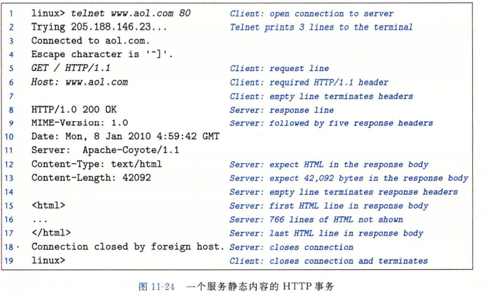

[TOC]

# 网络编程 P643

## 客户端-服务器编程模型
> 模型中应用由服务器**进程**和客户端**进程**组成的
服务器管理资源,代表客户端进行操作
* 基本操作:事务
    1. 客户端需要服务时,向服务器发出亲求,即发起一个事务.
    2. 服务器收到请求后解释并操作它的资源
    3. 服务器给客户端发送一个响应,等待下一个请求
****
## 网络简单思维模型
> 对主机而言,网络只是一种IO设备

### 硬件&概念
* 主机上的**适配器**:
    IO总线扩展槽上的
    提供了到网络的物理接口
    存储一个48位的以太网适配器唯一地址
    >接收的数据从适配器,经过IO总线,内存总线,复制到内存(通常DMA传送)
* **以太网段**:
    网线和集线器组成
    > 集线器和多个主机适配器相连
    集线器将从一个端口上收到的位复制到其他所有端口上
* **帧**:(网段,局域网内)
    >一段位(帧frame)(包含头部位(标识源,目的地址,长度),有效载荷)
* **包**:(互联网络内)
    >包头(大小,源主机和目的主机地址)和有效荷载组成
### 通信
* 网段内通信
    >主机发送帧到该网段上的其他任何主机,每个主机适配器都可见,但只有目的主机实际读取.

* 局域网LAN:(桥接以太网)多以太网段连接成较大的局域网
    * 通过**网桥**连接
    * 网桥与其他网桥,集线器连接
    > 网桥有选择的复制帧到其他端口节省带宽(网桥间,网桥到网段都精准复制)

* 互联网络internet: (广域网WAN)**路由器**连接多个不兼容的局域网
    * 通过路由器连接
    * 通过协议软件消除不兼容
    * 互联网络协议: 一致的主机地址格式, 一致的包
    
* internet协议局域网间(互联网络)数据传递:
    
    1. 主机A客户端进行系统调用,从虚拟地址空间复制数据到内核缓冲区中
    2. 主机A协议软件在数据前附加internet包头和LAN1帧头(有效荷载时互联网络包),组装成LAN1帧(internet寻址到主机B,LAN1帧头寻址到路由器),然后传送此帧到主机上的适配器.
    3. 主机的LAN1适配器将该帧复制到网络上,送入路由器
    4. 路由器的LAN1适配器读取此帧,传送到协议软件
    5. 路由器从互联网络包头提取目的internet地址,索引转发到哪个路由器,然后剥落LAN1帧头,加上目的主机B所在局域网LAN2的新的LAN2帧头,将此帧送入路由器的LAN2适配器
    6. 路由器的LAN2适配器复制该帧到网络上,到达主机B
    7. 主机B适配器读到此帧,传送到协议软件,协议软件剥落包头和帧头.
    8. 进行读取这些数据的系统调用时,将得到数据复制到虚拟地址空间
****
## 因特网P646
> 运行TCP/IP协议

### IP地址
> 32位无符号整数
**点分十进制**表示法 128.128.128.128 即0x80808080(有函数实现点分十进制到二进制的网络字节顺序)
IP地址存放在了一个struct中,但为IP地址定义一个标量类型应该更好
* **网络字节顺序**:
TCP/IP定义了统一的网络字节顺序(大端小端),如IP地址以大端法存放,主机字节顺序和网络字节顺序有函数实现转换

### 域名
> 因特网定义了将域名映射到IP地址的机制
* **域名系统DNS**:
    * 维护一系列的主机条目结构:每条定义了一组域名和一组IP地址之间的映射
****
## 套接字 P651
### **套接字**
是连接的一个端点,形式为(地址:端口),因特网地址和16位整数端口
>客户端请求连接时,内核自动分配一个临时端口
服务器套接字地址中的端口可以固定,称为知名端口(如http对应80)
### 套接字对: 
(客户端IP:客户端端口, 服务器IP:服务器端口)
> 套接字对唯一确定一个连接
### 套接字地址结构
> 内核看来套接字是通信的一个端点,程序看来是一个有相应描述符的打开文件

>套接字地址存放在sockaddr_in中
sin_family存储AF_INET, sin_pot存储16位端口号,sin_addr存储32位IP,IP和端口号都以网络字节顺序(大端法)存放
sockaddr是一个通用结构

### 套接字接口: P652
>一组函数,与Unix IO一起用于创建网络应用
* 
* socket(): 创建套接字描述符
    * `int socket(int dimain, int type, int protocol)`
* connect(): 客户端建立和服务器的连接
    * `int connect(int clientfd, const struct sockaddr *addr, socklen_t addrlen)`
* bind(): 告诉内核将addr中服务器套接字地址和套接字描述符sockfd联系起来
    * `int bind(int sockfd, const struct sockaddr *addr, socklen_t addrlen)`
* listen(): 服务器告诉内核描述符只由服务器使用
    * `int listen(int sockfd, int backlog)`
        >将sockfd从主动套接字转化为监听套接字,接受客户端的连接请求
* accept(): 服务器等待来自客户端的连接请求
    * `int accept(int listenfd, struct sockaddr *addr, int *addrlen)`

### 主机和服务的转换 P656-P664
> linux提供了一系列函数实现二进制套接字地址结构和其他信息的相互转化
****
## Web服务器
> Web通过http(超文本传输协议)实现客户端与服务器之间的交互
Web支持HTML(超文本标记语言),可以包含指令,指针(超链接)

### Web内容 P666
> 内容是与一个MIME(多用途的网际邮件扩充协议)类型相关的字节序列
* 提供内容的方式:
    * 服务静态内容: 返回磁盘文件的*内容*给客户端
    * 服务动态内容: 返回可执行文件的*输出*给客户端
* URL(通用资源定位符):
    > Web服务器管理的*资源*的名字
    * 可执行文件后可加参数,?分割文件名和参数,&分割参数
    * `http://bluefish.ics.cs.cmu.edu:8000/cgi-bin/adder?15000&213`
    >客户端使用前缀决定联系的服务器,服务器使用后缀得到请求的内容

### HTTP事务 P667
> HTTP基于文本行,可以通过Linux的telnet程序执行事务
* URI(统一资源标识符): 相应URL的后缀 
* 
>HTTP请求部分
* 第1行: telnet打开到某个服务器的连接
* 2-4行: telnet打印三行输出
* 第5行: 请求行(method/URI/version),输入文本(telnet将该行尾加上回车和换行发送到服务器)(GET指导服务器生成和返回URI)
* 第6行: 请求报头(可以更多行)
    * 例中为Host报头,在HTTP/1.1需要,代理缓存使用Host报头,作为浏览器和服务器的中介,代理可以有多个(代理链)
* 第7行: 空行,表示请求报头结束,执行操作,(本例中服务器发送请求的HTML文件)
>HTTP响应部分
* 第8行: 响应行(HTTP版本 状态码 状态消息)
* 9-13行: 响应报头(提供响应的附加信息)
* 第14行: 空行,中止响应报头
* 15-17行: 响应主体:被请求的内容

### 服务动态内容
> CGI(通用网关接口)解决下述问题
1. 客户端如何传参给服务器
    > 参数在URI中传递
2. 服务器如何将参数传给其子进程
    > 服务器接收到请求后,先调用fork()创建子进程,子进程将CGI环境变量QUERY_STRING设置为可执行文件的参数,调用execve()在子进程的上下文执行可执行文件
3. 服务器如何将其他信息传递给子进程
    > 通过CGI的环境变量
4. 子进程的输出发送到哪里
    > 子进程加载运行CGI程序前,用dup2()将标准输出重定向到客户端相关联的已连接描述符,因此CGI程序到标准输出的输出会直达客户端.

### 简单Web服务器构建 P671-P677