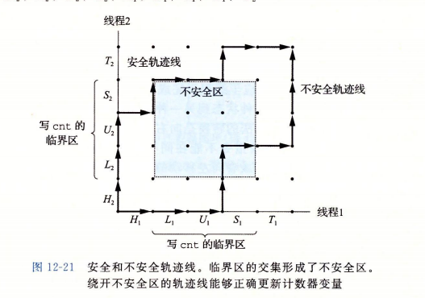
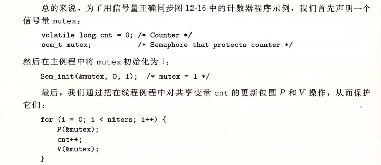

[TOC]

# 并发编程
* 三种构造并发程序的方法:
    1. 进程
        >每个逻辑控制流都是一个进程,由内核调度
        有独立的虚拟地址空间,和其他流通信要显式的IPC(进程间通信)机制
    2. I/O多路复用
        > 程序在一个进程上下文中*显式*调度自己的逻辑流,
        程序为单独进程,所有流共享地址空间
    3. 线程
        > 线程是运行在单一进程上下文的逻辑流,由内核调度
        共享地址空间,由内核调度(内核调度的IO多路复用?)

## 基于进程的并发编程 P682
### 构建:
>父进程接收客户端的连接请求,创建一个新的子进程为每个新客户端提供服务
1. 客户端监听一个监听描述符(3),接受了服务器1的连接请求,返回一个已连接描述符(4)
2. 服务器派生一个子进程,其获取服务器描述表的完整副本
3. 子进程关闭副本中的监听描述符(3),父进程关闭其已连接描述符(4),子进程提供服务
    > 父子进程已连接描述符都指向同一个文件表项,只有父进程关闭其(4)才能释放(4)的文件表条目
### 特性:
* 特性: 
    * 共享文件表
    * 独立地址空间
* 优点:
    * 模型清晰
* 缺点:
    * IPC机制开销大

## 基于IO多路复用的并发编程 P684
### 构建: 
>创建逻辑流,显式调度流
显式等待,判断请求,显式选择调用函数
1. select()(返回已准备好的描述符的非零个数)阻塞,直到有请求
2. 根据请求的类型调用函数
### 特性:
* 特性:
    * 每个逻辑流可访问该进程全部地址空间
* 优点:
    * 更多对程序行为的控制
    * 单进程运行,方便调试
    * 效率高
* 缺点:
    * 编码复杂
    * 不能充分利用多核处理器

## 基于线程的并发编程 P691
### 线程
> 允许编写一个进程里同时运行多个线程的程序
* **线程上下文**(Thread context):TID,栈,pc,寄存器,条件码 
#### 特性
同进程:
>由内核自动调度
内核通过整数ID识别

同IO多路复用:
>多线程运行在单一进程的上下文中,共享虚拟地址空间

特性:
>上下文小,切换快
线程平等,每个线程都可以对任意对等线程操作
#### 线程内存模型 P696
> 线程共享进程上下文的剩余部分,共享打开文件的集合
寄存器不共享
全局变量/本地静态变量保存在虚拟内存的读/写区域中,本地自动变量保存在线程栈中
线程栈内存互相不设防,只要能得到指针都可访问(包括本地自动变量)
### Posix线程接口 P691-P696

### 信号量同步线程 P698
> 线程栈内存不设防,变量随意访问,共享变量很容易实现,也带来**同步错误**问题
#### 进度图 P701
> 操作共享变量内容的临界区不能和其他进程的临界区交替执行
* H:头部指令块
* L,U.S: 操作共享变量
* T: 尾部指令块

* 线--进度, 点--状态
* 两进程LUS相交的部分为不安全区,进入表示互斥
> 重叠的禁止区会引起**死锁**(每个线程都等待其他线程执行不可能的V())区域(没有安全路径离开禁止区)
#### semaphore(信号量)
> 信号量s是非负整数全局变量,只由两种特殊操作处理,P,V
* P(s)(Proberen测试): 一定减1,如为0则挂起直到s非0(等待V重启)
* V(s)(Verhogen增加): 一定加1.如果有任意线程阻塞在P(等待s变为非0),V会将其重启
    > 测试,加减,存储不能有中断
    V只能重启一个等待线程,但没有定义重启的顺序,多个线程等待时无法预测
* 信号量不变性: 正确初始化过的信号量不可能有负值
> 实现
* 互斥锁(二元信号量,只有01):保护变量,将每个共享变量与一个信号量联系
    * 进度图所有禁止区s都为-1,根据信号量不变性无法进入,安全
    
* 生产-消费者问题
* 读者-写者问题
>待补