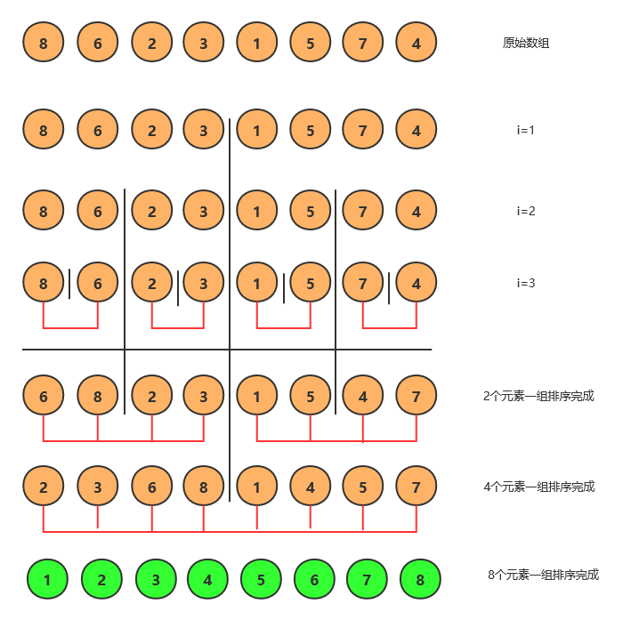
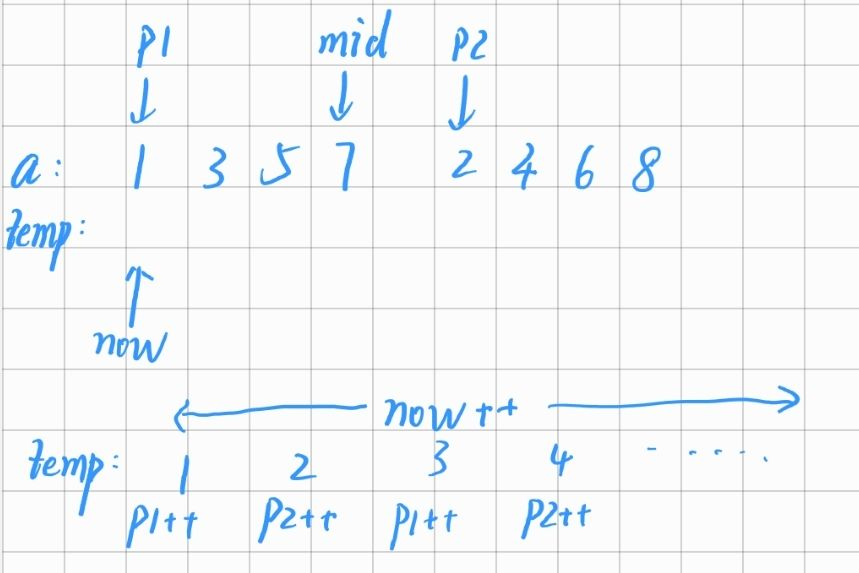

[TOC]
<font face = "Consolas">

## 基础操作
### 循环读入
`while (cin >> i)`实现`CTRL+D`(文件结束)结束输入
```c++
vector<int> a;
    int i;
    while (cin >> i)
        a.push_back(i);
```

## 排序(Sort)
### 归并排序(merge)
> 稳定,时间复杂度$O(nlogn)$,空间复杂度$O(n)$

分治法+回溯,将无序数组拆分至最小单元,再开始回溯


* 回溯时,左右数组都是有序状态,只需将两个有序数组合并即可
    开一个临时数组进行此操作
    
```c++
template <class T>
void merge(vector<T> &a, int l, int r, T *temp)
// sort from l to r
{
    if(r -  l <= 0)
        return;
    int mid = (l + r) >> 1;
    merge<T>(a, l, mid, temp);
    merge<T>(a, mid + 1, r, temp);
    int p1 = l, p2 = mid + 1, now = l;
    while(now <= r)
        if (p1 > mid || (p2 <= r && a[p2] < a[p1])) //组1完成,直接写组2 ||给出正常写组2的情况(a[p2] < a[p1]),其余都为写组1情况
            temp[now++] = a[p2++];
        else
            temp[now++] = a[p1++];
    for (int i = l; i <= r; ++i)
        a[i] = temp[i];
}
```