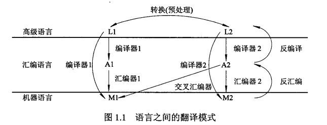
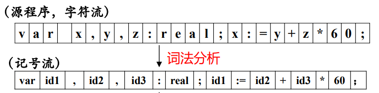
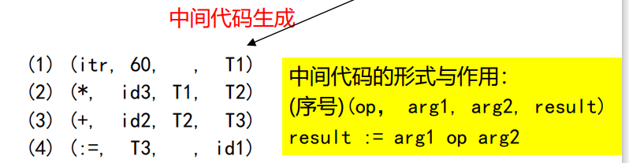

<font face = "Consolas">
<!-- @import "[TOC]" {cmd="toc" depthFrom=1 depthTo=6 orderedList=false} -->

<!-- code_chunk_output -->

- [机器语言到人类语言](#机器语言到人类语言)
- [语言之间翻译](#语言之间翻译)
- [编译器与解释器](#编译器与解释器)
- [编译器的工作原理与基本组成](#编译器的工作原理与基本组成)
  - [通用程序设计语言的主要成份](#通用程序设计语言的主要成份)
    - [以过程式语言为例](#以过程式语言为例)
  - [以阶段划分编译器](#以阶段划分编译器)
    - [编译器各阶段的工作](#编译器各阶段的工作)
    - [错误分类](#错误分类)
  - [编译器的分析/综合模式](#编译器的分析综合模式)
  - [编译器扫描的遍数](#编译器扫描的遍数)

<!-- /code_chunk_output -->

>程序 = 算法 + 数据结构

>源代码(.c.h)(可阅读可修改的文本)
->目标代码(.o.obj.lib)(被翻译后的半成品)
->可执行代码(exe)(可由计算机执行的成品)

# 机器语言到人类语言
* 面向机器的语言包括: 机器语言,汇编语言
* 面向人类的语言包括:
    * 通用程序设计语言与汇编语言(包括机器指令)
    * 数据查询语言(sql)
    * 形式化描述语言(正规式)
    * 其他面向特定应用领域的语言(html,matlab)

# 语言之间翻译


# 编译器与解释器


* 主要区别: 运行目标程序时的控制权在解释器而不在目标程序
* 解释器优点:
    * 较好的动态特性: 源程序参与解释器的运行,因此可动态改变源程序,提供较好的交互与错误诊断
    * 较好的可移植性: 解释器一般用某种语言编写,只要对解释器重新编译就能运行在不同环境中
* 解释器缺点: 时间空间效率低
    * 时间上: 运行中需要调用解释器,浪费时间
    * 空间上: 执行解释时,解释器及其依赖也占据内存

# 编译器的工作原理与基本组成
## 通用程序设计语言的主要成份
通用程序设计语言的典型特征: 抽象
抽象程度以语言支持的基本结构为特征,可大致划分为: 过程,模块(抽象数据类型,ADT),类
>共同特点：两大部分组成：声明＋操作＝完整定义
### 以过程式语言为例
* 特征是将整个程序作为一个过程
* 过程由两类语句组成:
    * 声明性语句: 提供操作对象的性质,如数据类型、值、作用域等
    * 操作性语句: 确定操作的计算次序，完成实际操作

* 过程由过程头和过程体组成
    ```text
    (1) procedure sample(y: integer);   {过程头}
    (2)     var x : integer;            {过程体（开始）}
    (3)     begin x := y;
    (4)         if x>100 then x := 0
    (5)     end;                        {过程体（结束）}

    ```
* 编译器对两类语句的处理
    * 声明性语句: 一般是生成相应的环境(存储空间).如 (1),(2)
    * 操作性语句: 生成可执行代码序列.如(3~5)
        >为了便于编译器的处理，操作性语句中使用的每个操作对象，均应在使用前声明，即符合先声明后引用的原则。
## 以阶段划分编译器


### 编译器各阶段的工作
以`var x, y, z : real;  x := y + z * 60;`为例
1. 词法分析: 输入源程序,输出记号流
    根据词法规则识别出源程序中各个记号(token),每个记号代表一类单词(lexeme),常见记号:
    * 关键字: 特殊含义的词,也称保留字(var,begin,end)
    * 标识符: 变量名,过程名等所有对象的名称(x,y)
    * 字面量: 常数,字符串常量(60)
    * 特殊符号: 特定含义的符号,运算符,分隔符等(+-)

    

2.  语法分析: 通过记号流构建句子的结构,以语法树表现出来
    

3. 语义分析: 将语法树进行语义处理,语法检查
    根据语义规则对语法树中语法单元进行静态语义检查(类型检查,转换等),保证语法正确的结构在语义上也合法
    * 声明性语句: 进行符号表的查填(名称,类型,地址)
    * 操作性语句: 检查表达式运算是否有意义(类型转换)

    
> 对声明语句的处理已完成
无论对解释器还是编译器,这前的各个阶段是完全一样的.后面解释器可以直接形成计算步骤进行计算(无需中间代码),编译器还要生成中间代码
4. 生成中间代码
仅涉及编译器
仅涉及操作性语句
遍历语法树,生成可顺序执行的中间代码序列:
`(op操作符,arg1左操作数,arg2右操作数,result结果)`


5. 中间代码优化

    > 局部优化、循环优化、全局优化等；优化实际上是一个等价变换，变换前后的指令序列完成相同功能，但在占用的空间上和程序执行的时间上都更省、更有效

6. 目标代码生成

    > 不同形式的目标代码－汇编、可重定位、
内存形式（Load-and-Go）;

7. 符号表管理
    >合理组织符号，便于各阶段查找、填写等
8. 出错处理
    > 报告错误、修复错误(使得编译能继续)

### 错误分类
* 语法错误:
    * 词法错误: 非法字符,错误关键字标识符等
    * 语法错误: 语法结构出错(错误的分号,括号等)
* 语义错误:
    * 静态语义错误: 类型不一致,参数不匹配等
        >语义分析中发现
    * 动态语义错误: 逻辑错误(死循环,0作除数等)
        >如果在编译过程中指出这种错误，则执行编译很费时，也会产生很多错报、误报。
        所以一般情况下，编译器不识别、不处理动态语义错误(程序执行时发现)


## 编译器的分析/综合模式
将编译器的各个阶段逻辑上划分为:
* 分析部分(前端)
    词法分析到中间代码生成阶段
    > 语言结构和意义的分析
* 综合部分(后端)
    > 语言意义处理


## 编译器扫描的遍数
> 自学
1. 每个阶段将程序完整分析一遍的工作模式称为一遍扫描。
2. 影响扫描遍数的因素：
    * 软、硬件条件，如内存太小
    * 语言结构，如规定标识符的先声明后引用
    * 编译技术，如拉链－回填
    