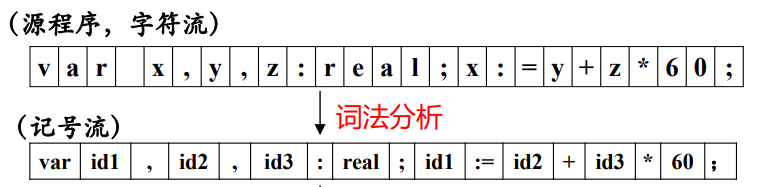
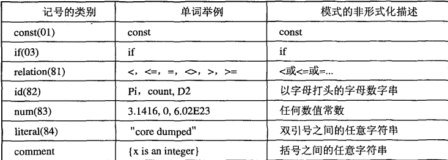
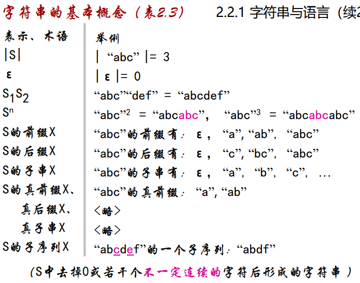
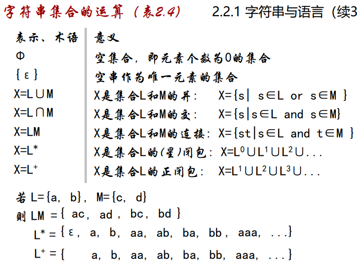
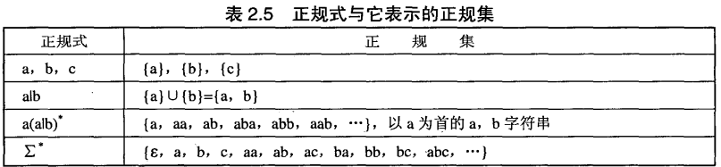
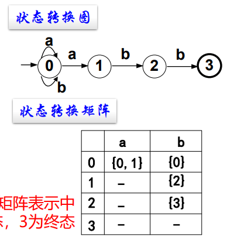
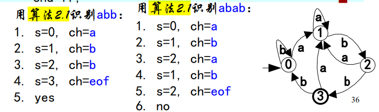

[TOC]
<font face = "Consolas">

词法分析: 输入源程序,输出记号流
根据词法规则识别出源程序中各个记号(token),每个记号代表一类单词(lexeme),常见记号:
* 关键字: 特殊含义的词,也称保留字(var,begin,end)
* 标识符: 变量名,过程名等所有对象的名称(x,y)
* 字面量: 常数,字符串常量(60)
* 特殊符号: 特定含义的符号,运算符,分隔符等(+-)



## 词法分析概念
### 记号,模式,单词
* 模式(pattern): 产生和识别单词(元素)的规则
* 记号(token): 按照某个模式(规则)识别出的元素
    > 至少含有两个信息: 记号的类别(标识符等),其他信息
* 单词(lexeme):被识别出的元素自身的值,也称为词值
    * 关键字(保留字): 特殊含义的词(var,begin,end)
    * 标识符: 变量名,过程名等所有对象的名称(x,y)
        > 标识符识别为id
    * 字面量: 常数,字符串常量(60)
    * 特殊符号: 特定含义的符号,运算符,分隔符等(+-)
<br>

### 记号的属性
记号至少含有两个部分: 记号的类别,其他信息(属性)
一般来说记号的类别可用整性编码或枚举类型表示

> 括号中的整数表示记号类别

表达式|mycount|>|25
-|:-:|:-:|-
类别|82|81|83
属性|mycount|5|25

### 词法分析器的作用与工作方式
* 特征: 编译器中唯一与源程序打交道的部分
    > 可被认为是整个编译器的预处理器
* 主要工作:
    1. 识别记号,并交给语法分析器.(根据模式识别记号)
    2. 滤掉源程序中的无用成分,如注释、空格、回车等
    3. 处理与具体平台有关的输入(如文件结束符的不同表示等)
    4. 调用符号表管理器或出错处理器,进行相关处理
        > 词法错误: 非法字符,拼错等
        >>词法错误一般不是由词法分析器检查出来的,因为除非法字符外的大部分字符串都按某个模式匹配从而被识别成一个记号,这需要语法分析器检查出来
* 根据编译器的总体需求,可有不同的工作方式:
    1. 作为语法分析器的子程序
        > 每当语法分析器需要一个记号时,就调用词法分析器得到一个识别出的记号
        最常用,最易实现
    2. 单独一遍扫描
        > 输入源程序,输出记号流
    3. 与语法分析器并行工作
        > 两者以生产/消费的形式并行工作,词法分析器将识别出的记号流输出到队列,语法分析器从队列中取得记号

## 模式的形式化描述
### 字符串与语言
* `2.1` `语言L`是`有限字母表∑`上有限长度字符串的集合
    > 字母表∑是组成L的字符串的所有字符的集合
    字母表有限,字符串长度有限
* 字符串基本概念:


* 字符串集合的运算:


### 正规式与正规集
* `2.2` 令Σ是一个有限字母表,则Σ上的正规式及其表示的集合递归定义如下:
    1. ε是正规式,它表示集合 L(ε) = {ε}
    2. 若a是Σ上的字符,则a是正规式,它表示集合L(a)={a}
    3. 运算: 若正规式r和s分别表示集合L(r)和L(s),则
        * 或`r|s`是正规式,表示集合 L(r)∪L(s),
        * 连接`rs`是正规式,表示集合 L(r)L(s),
        * 闭包`r`是正规式,表示集合 (L(r))*
        * `(r)`是正规式,表示的集合仍然是 L(r).
            >括弧用来改变运算的先后次序

        >都左结合
        优先级: 闭包(*+?) > 连接 > 或

可用正规式描述(其结构)的语言称为正规语言或正规集

> 正规集是一个集合,正规式是表示正规集的一种方法


* `2.3`正规式的等价: 若正规式P和Q表示了同一个正规集,则称P和Q是等价的,记为`P=Q`
    > 不同正规式也可以表示同一个正规集(正规式与正规集之间是多对一的关系)
    ```text
    令 L(x) = {a,b},L(y) = {c,d},
    则 L(x|y) = L(x)∪L(y) = {a,b,c,d}
       L(y|x) = L(y)∪L(x) = {a,b,c,d}
    所以: x|y = y|x
    ```
* 正规式等价的证明:
    * 证明不同的正规式表示同一集合
    * 代数性质运算

公理|公理
:-:|:-:
r\|s = s\|r |(rs)t = r(st)
r\|(s\|t) = (r\|s)\|t |εr = rε = r
r(s\|t) = rs\|rt |r* = (r+\|ε) 
(s\|t)r = sr\|tr |r** = r*

### 记号的说明
记号 = 正规式
> 正规式可以严格地规定记号的模式
id=a(a|b)\*可以读作为"id定义为a(a|b)\*"

#### 简化正规式描述
1. 正闭包
若r是表示L(r)的正规式,则r+是表示(L(r))+的正规式,且下述等式成立:
r+ = rr* = r\*r,r\* = r+|ε
    > (0|1|2|3|4|5|6|7|8|9)(0|1|2|3|4|5|6|7|8|9)*
    可以化简为: 
    (0|1|2|3|4|5|6|7|8|9)+
2. 可缺省
若r是正规式,则`r?`是表示L(r)∪{ε}的正规式,且下述等式成立:
r? = r|ε
    > ?表示加空集
    E(+|-|ε) 可以简化为: E(+|-)?
3. 字符组
若r是若干字符进行“或”运算构成的正规式,则可改写为 [r’],其中 r’ 可以有如下书写形式:
    * 枚举: 如 a|b|e|h,可写为 [abeh],顺序无关
    * 分段: 如 0|1|2|3|4|5可写为 [0-5]
    * 混合: 如 0|1|2|3|4|5|6|7|8|9|a|b|c|d|x,可写为: [0-9a-dx]
        > 左边界小于右边界,字符范围要连续
* 非字符组
若[r]是一个字符组形式的正规式,则[^r]是表示∑-L([r])的正规式
    > 非
    例如: 若 ∑={a, b, c, d, e, f, g},则:
    L([abc]) = L(a|b|c) = { }
    L([^abc]) = L(d|e|f|g) = { }
5. 串
若r是若干字符进行连接运算构成的正规式,则:
“r” = r 
    > 避免与正规式中运算符的冲突
    ε= “”, a = “a”(a是Σ的任一字符)
    例如: “a|b” = a“|”b ≠ a|b
#### 引入辅助定义
* 辅助定义的作用: 为复杂的或重复出现的正规式命名,并在以后的使用中用名字代替该正规式.
* 辅助定义的形式与正规式一样: 名字 = 正规式
>辅助定义并不表示任何模式.即: 作为辅助定义的正规式仅供内部使用,而不用于说明记号.
辅助定义:  内部名 = 子正规式
模 式:  记号名= 正规式

> 例:引入正规式的缩写形式和辅助定义式后:
char = [a-zA-Z]
digit = [0-9]
digits = digit+
optional_fraction = (.digits)?
optional_exponent = (E(+|-)?digits)?

## 记号的识别-有限自动机
正规式对模式进行形式化的描述,解决了说明记号的问题
有限自动机解决记号的识别问题
划分不确定/确定有限自动机: 根据其下一状态转移是否确定

### 不确定的有限自动机(NFA, Nondeterministic Finite Automaton)
* `2.4` NFA是一个五元组(5-tuple):M =(S,∑,move,s0,F),其中
    * S: 有限个状态(state)的集合;
    * ∑: 有限个输入字符(包括ε)的集合;
    * move: 一个状态转移函数
        >move(si,ch)=sj表示,当前状态si下若遇到输入字符ch,则转移到状态sj;
    * s0: 唯一的初态(也称开始状态);
    * F: 终态集(也称接受状态集),它是S的子集,包含了所有的终态. 
####  状态转换图
用一个有向图来直观表示NFA
* 节点: NFA中状态
* 有向边: move(si,a)=sj
    > 从节点si触发进入节点sj,a是边上的标记(可以为ε)
#### 状态转换矩阵
用一个矩阵来直观表示NFA
* 状态对应行,字符对应列
* M[si,a]=sj
> 一般第一行为初态,终态需特别指出
---
>正规式 (a|b)*abb
```text
描述的正规集的NFA的定义
S ={0, 1, 2, 3}
∑={a, b}
move={ move(0,a)=0,
        move(0,a)=1,
        move(0,b)=0,
        move(1,b)=2,
        move(2,b)=3 }
s0 = 0
F ={3}
```
> 直观表示方式


#### NFA如何识别记号
对字符串,从初态开始,经一系列状态转移到达终态
有多种表现方式(定义,转换矩阵,转换图)
> 转换图最直观,每个记号的实质是从初态开始到某个终态的路径上的标记

* 不确定性: 一个字符串并可能有多个路径
* NFA识别输入序列的一般方法: 反复试探所有路径,直到到达终态,或者到达不了终态

所以需构建确定的有限自动机
### 确定的有限自动机(DFA, Deterministic)
* `2.5` DFA是NFA的一个特例,其中:
    * 没有状态具有ε状态转移(ε-transition)
        >即状态转换图中没有标记ε的边;
    * 对每个状态s和每个字符a,最多有一个下一状态
* DFA的确定性的表现形式:
    * 定义: move（si, a)函数都是1对1的;
    * 转换图: 从一个状态出发的任2条边上的标记均不同;
    * 转换矩阵:M[si,a]是一个状态.
    >且字母表不包括ε.
#### 模拟DFA
将在DFA上识别输入序列的过程形式化为算法(被称为模拟器(模拟DFA行为),驱动器(用DFA的数据驱动分析动作))
> 算法与模式无关,仅DFA与模式相关
* `算法2.1` 模拟DFA
    * 输入: DFA D和输入字符串x(eof).D的初态为s0,终态集为F.
    * 输出: 若D接受x,回答“yes”,否则回答“no”.
    * 方法: 用下述过程识别x：
        ```text
        s:=s0; ch:=nextchar();  准备初值
        while ch≠eof
        loop s:=move(s,ch); ch:=nextchar(); 
        end loop;
        if s ∈ F
        then return “yes”; else return “no”;
        end if;
        ```
>


### 有限自动机的等价
* `2.6` 若有限自动机M和M’识别同一正规集,则称M和M’是等价的,记为M = M’
>正规式与有限自动机从两个侧面表示正规集.正规式是描述,自动机是识别
因此,当它们表示相同集合时,均存在等价的问题