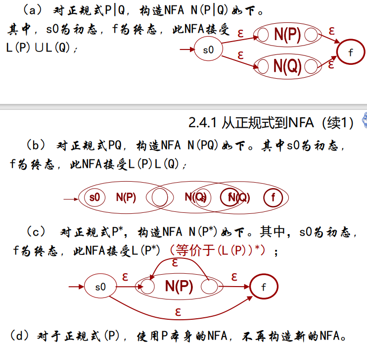
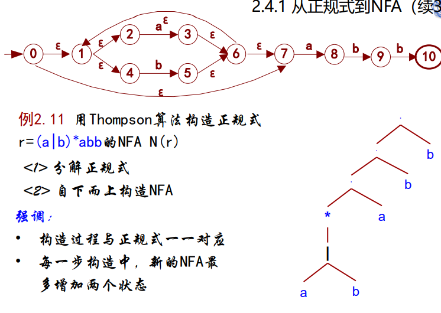
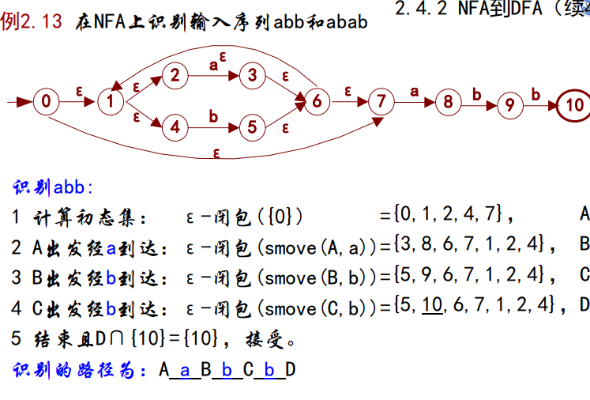
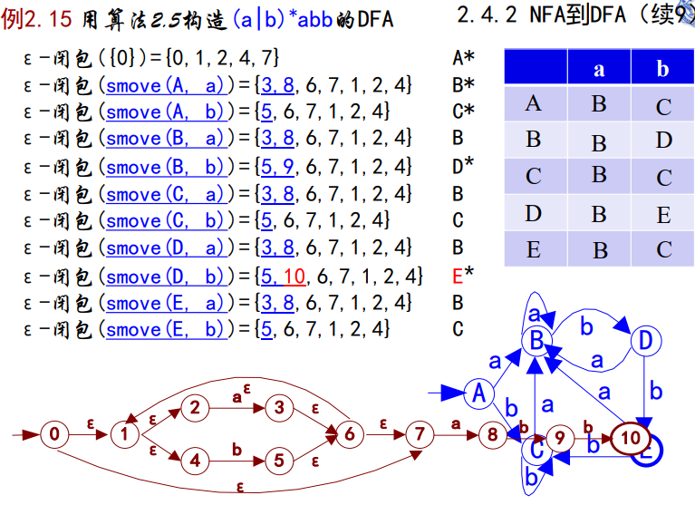
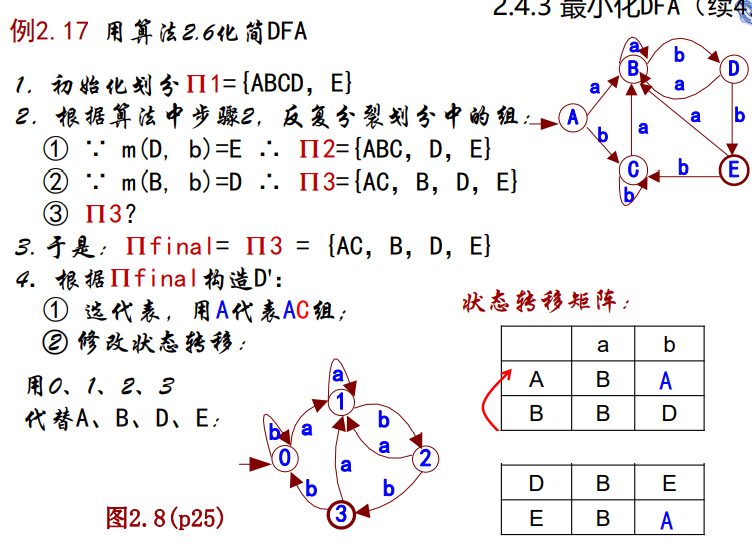
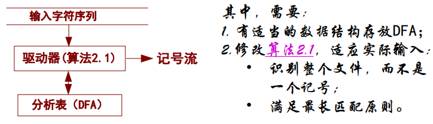

[TOC]
<font face = "Consolas">

# 从正规式构造词法分析器
构造词法分析器的一般方法和步骤: 
1. 用正规式描述模式(为记号设计正规式);
2. 为每个正规式构造一个NFA,它识别正规式所表示的正规集;
3. 将构造的NFA转换成等价的DFA,这一过程也被称为确定化;
4. 优化DFA,使其状态数最少,这一过程也被称为最小化;
5. 根据优化后的DFA构造词法分析器.
> 先构造NFA: 正规式到NFA有规范的一对一构造算法
再将NFA构造为DFA: DFA识别记号的算法较优

## 正规式->NFA
* `算法2.2` Thompson 算法
    * 输入: 字母表∑上的正规式r
    * 输出: 接受L(r)的NFA N
    * 方法: 首先分解r至最基本的正规式,然后根据下述步骤构造NFA: 
        1. 对ε,构造NFA N(ε)如下.其中,s0为初态,f为终态,
此NFA接受{ε};
            > s0 -ε-> f
        2. 对∑上的每个字符a,构造NFA N(a)如下,它接受{a} ;
            > s0 -a-> f
        3. 若N(P)和N(Q)是正规式P和Q的NFA,则
            

>

## NFA->DFA
### NFA识别记号的并行方法
NFA识别记号采用并行方法: 将不确定的下一状态确定化(考虑所有情况)
* smove(S,a): 从状态集S出发,经a可直接到达的下一状态全体.
    >与move(s,a)的唯一区别: 状态→状态集.
* ε-闭包(T): 从状态集T出发,不经任何字符可到达的状态全体.
* `2.7` 状态集T的ε-闭包(T)是一个状态集,且满足:
    1. T中所有状态属于ε-闭包(T);
    2. 任何smove(ε-闭包(T),ε)属于ε-闭包(T);
    3. 再无其他状态属于ε-闭包(T).
> 

### 子集法构造DFA
“并行”模拟NFA的弱点: 每次动态计算下一状态转移的集合,效率低
改进: 将NFA上的全部路径均确定化并且记录下来,得到与NFA等价的DFA,对记号的识别在DFA进行
* `算法2.5` 从NFA构造DFA
* 输入: NFA N
* 输出: 等价的DFA D.其初态是NFA初态的ε－闭包,其终态是含有NFA终态的状态集合
* 方法 用下述过程构造DFA
    ```fortran
    while Dstates有尚未标记的状态T
    loop 标记T;
        for 每一个字符a // T中向外转移边的标记
        loop U := ε-闭包(smove(T,a));
            if U非空
            then Dtran[T,a] := U; 
                if U不在Dstates中
                then U作为尚未标记的状态加入Dstates;
                end if;
            end if;
        end loop;
    end loop;
    ```
> 

## DFA->最小化DFA
存在等价DFA,希望由状态数最少的DFA构造词法分析器
* `2.8` 对于任何两个状态t和s,若:
    * 从一状态出发接受输入字符串ω,而从另一状态出发不接受ω;或者
    * 从t出发和从s出发到达不同的接受状态;
    则称ω对状态t和s是可区分的. 
    >反方向思考该定义:
    设想任何输入序列ω对s和t均是不可区分的,则说明从s出发和从t出发,分析任何输入序列ω均得到相同结果.因此,s和t可以合并成一个状态.

* `算法2.6` 最小化DFA的状态数
    * 输入: DFA D={S,∑,move,s0,F}.
    * 输出: 等价的D'={S',∑,move',s0',F'}（D'状态数最少）
    * 方法: 执行如下步骤
        1. 初始划分Π={ S-F,F };
        2. 应用下述过程构造新的划分Πnew:
        ```text
            令Πnew = Π
            for Π的每一个组G
            loop
                划分G,G的两个状态s和t仍在同一组中的充要条件是:
                    对任意a,move(s,a)和move(t,a)在Π同一组中
                用新划分的组替代中Πnew的G,形成新的划分;
            end loop;
        ```
        3. if Πnew = Π then Πfinal := Π, 转4;
            else Π := Πnew, 转2;
        4. 在Πfinal每个组Gi中选一个代表si',使得D中从Gi所有状态出发的状态转移在D'中均从si'出发,D中所有转向Gi中的状态转移在D'中均转向si'.
        含有D中s0的状态组G0的代表s0' 成为 D’的初态,Πfinal所有含F中状态的组Gk 的代表 sk'构成D'的终态集F'.
        5. 删除D’的死状态(即不是终态且对所有输入字符均转向其自身),并删除从初态不可到达的状态. 

> 

## DFA->词法分析器
### 表驱动型的词法分析器
在表驱动的词法分析器中,DFA是数据,用于指导驱动器(模拟DFA的代码) 对输入序列进行分析.
与模拟DFA算法(算法2.1)一同构成表驱动型的词法分析器


### 直接编码的词法分析器
直接编码的词法分析器,将DFA和识别输入序列的过程合并在一起,直接用程序代码模拟DFA识别输入序列的过程.

如何用程序模拟DFA的状态和它的状态转移:
1. 状态和状态转移与语句的对应关系
    * 初态→程序的开始(存于一个状态变量);
    * 当前状态的判定→ 分支（case/if）
    * 状态转移→根据输入修改状态变量（case/if）;
    * 扫描输入串→循环语句（loop）;
    * 返回时，满足最长匹配原则.
```C
例: 识别(a|b)*abb的程序框架
// 从 src 中分析第1个记号.若得到则存储在 token中，
// 且返回已分析的字符个数; 否则返回 0
int getToken (char* src, char* token)
{
char *ptr =src; int len=0; int state=0;
for( ; *ptr!=‘\0’; ptr++ )// 跳过开始的若干空白字符
    if( isspace(*ptr) ) { ++len; continue; }
    else break;

for( ; *ptr!=‘\0’; ptr++ ){     // 扫描输入, 状态转移
    if( *ptr != ‘a’ && *ptr != ‘b’ )break; // 限定字母表
    switch( state ){ // 当前状态的判定
    case 0: // state 0
        switch ( *ptr ){ case 'b': state = 0; break;
                        case 'a': state = 1; break; }
        break;
    case 1: // state 1
        switch ( *ptr ){ case 'a': state = 1; break;
                        case 'b': state = 2; break; }
        break;
    case 2: // state 2
        … // 与上面类似
        break;
    case 3: // state 3
        … // 与上面类似
        break;
    } // end switch(state)
    ++len; *token++ = *ptr;
} // end for-loop
if( state == 3 ) { *token = '\0'; return len;}
else { return 0; }
}
```
-|表驱动 |直接编码
-|:-:|:-:
分析器的速度| 慢| 快
程序与模式的关系 |无关 |有关
适合的编写方法 |工具生成 |手工编写
分析器的规模| 较大 |较小

