[TOC]

词法分析将语言看成单词的集合(正规集,线性结构
语法分析将语言看作句子的集合,非线性结构(树)

语法分析的双重含义:
* 语法规则: 规定句子形成的规则
    > 如上下文无关文法(CFG)
* 语法分析: 根据语法规则识别记号流中的语言结构
    > 如自上而下,自下而上的分析方法

本章主要内容: 
1. 与语法分析相关的若干问题
2. 上下文无关文法
3. 自上而下分析
4. 自下而上分析
5. 函数绘图语言的语法分析器
## 语法分析的问题
### 语法分析器的作用
* 根据记号流为语法正确的输入构造分析树;
* 检查输入中的语法(可能包括词法)错误,并调用出错处理器进行适当处理

### 语法错误处理原则
错误分类
* 语法错误:
    * 词法错误: 非法字符,错误关键字标识符等
    * 语法错误: 语法结构出错(错误的分号,括号等)
* 语义错误:
    * 静态语义错误: 类型不一致,参数不匹配等
    * 动态语义错误: 逻辑错误(死循环,0作除数等)

>自学语法错误处理的目标,语法错误的基本恢复策略

## 上下文无关文法(CFG, Context Free Grammar)
* `3.1` **CFG**: 一个四元组 G=(N,T,P,S),其中
    1. N: 非终结符(Nonterminals)的有限集合;
    2. T: 终结符(Terminals)的有限集合,且N∩T=Φ;
    3. P: 产生式(Productions)的有限集合
        > 产生式形如:A→α,其中A∈N (左部),α∈(N∪T)* (右部),若α=ε,则称A→ε为空产生式(也可以记为A →);
    4. S: 非终结符,称为文法的开始符号(Start symbol).(S ∈ N) 
    > 终结符与非终结符用 大小写 "" <>区分
    本课程:
    大写英文字母A、B、C等表示 非终结符;
    小写英文字母a、b、c等表示 终结符;
    小写希腊字母α、β、δ等表示 任意文法符号序列(ε除外)

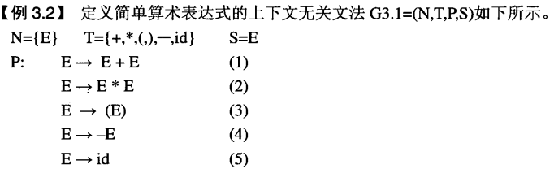

> → 读作“定义为”或者“可导出”
“E→E+E”: 算术表达式定义为两个算术表达式相加
### 产生式集表示CFG
对于一个正确的CFG G=( N,T,P,S ),定义中: 
∵ 每个产生式A→α,(其中A∈N,α∈(N∪T)* )N∩T=Φ,
∴ N 是 可以 出现在产生式左边的符号的集合;
   T 是 绝不 出现在产生式左边的符号的集合(记号)
> 第一个产生式的左部是文法开始符号S

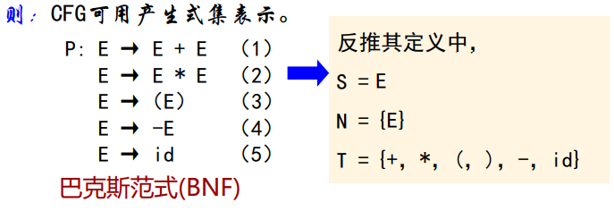

产生式可缩写:
当若干个产生式具有相同的左部非终结符时,可以将它们合并为一个产生式: 
* 左部: 是 该非终结符,且产生式以此非终结符命名;
* 右部: 是 所有原来右部的或运算(并集合).
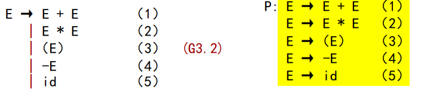
    > '|'连接的每个右部称为一个候选项

### CFG产生语言的基本方法: 推导
推导即从开始符号S开始,反复使用产生式:
将左部的非终结符替换为右部的文法符号序列(展开产生式,用=>表示),直到得到一个终结符序列.
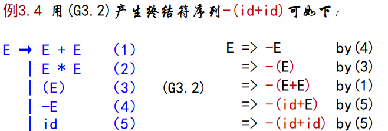

* `3.2` 用产生式A→γ的右部替换文法符号序列αAβ中的A得到αγβ的过程,称αAβ**直接推导**出αγβ,记作: αAβ=>αγβ.
若对于任意文法符号序列α1,α2,...αn,有α1=>α2=>...=>αn,则称此过程为**零步**或**多步推导**,记为: α1-\*->αn.(α1=αn零步推导,否则为至少**一步推导**,记为a1-+->an)
    > 任意α,有α-\*->α,即推导具有自反性;
若α-\*->β,β-\*->γ,则α-\*->γ,即推导具有传递性

 

* `3.3` 由 CFG G 所产生的语言 L(G) 被定义为:
L(G) = { ω┃S-\+->ω and ω∈T* },
L(G)称为上下文无关语言( CFL, Context Free Language),ω称为**句子**.
若S-\*->α,α∈(N∪T)*,则称α为G的一个**句型**
 

* `3.4` 在推导过程中,若每次直接推导均替换句型中最左边的非终结符,则称为**最左推导**,由最左推导产生的句型被称为左句型.
    > 类似的可以定义最右推导与右句型,最右推导也被称为规范推导.

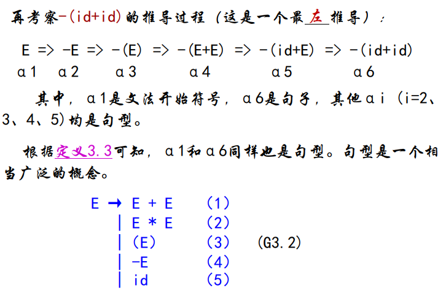

### 推导、分析树与语法树
一般的推导产生句子的方式很不直观,分析图比较直观
* `3.5` 对 CFG G 的句型,**分析树**(具体分析树)被定义为具有下述性质的一棵树:
    1. 根: 由开始符号所标记;
    2. 叶子: 终结符、非终结符、ε;
    3. 内部结点: 非终结符;
    4. 产生式: 若A是非叶子节点的标记,且X1,X2,...,Xn是该节点从左到右所有孩子的标记,则A→X1X2...Xn是一个产生式.若A→ε,则标记为A的结点可以仅有一个标记为ε的孩子

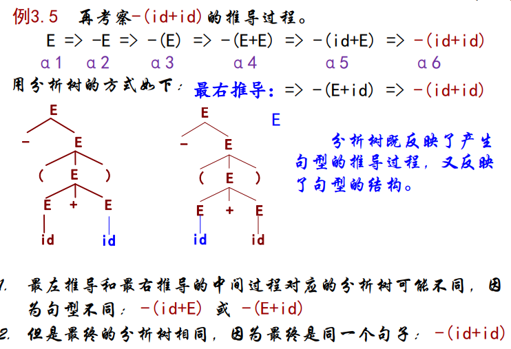

> 一般仅关注句型结构忽略推导过程

* `3.6` 对CFG G的句型,表达式的**语法树**(抽象语法树)被定义为具有
下述性质的一棵树
    1. 根,内部节点: 由表达式中的操作符标记;
    2. 叶子: 操作数;
    3. 括号: 隐含在语法树的结构中.
> 语法树与分析树的最根本区别在于它们的内部(根)节点: 
● 分析树的内部(根)节点是非终结符;
● 语法树的内部(根)节点是操作符(运算符);
或者说语法树中: 省略了反映分析过程的非终结符.

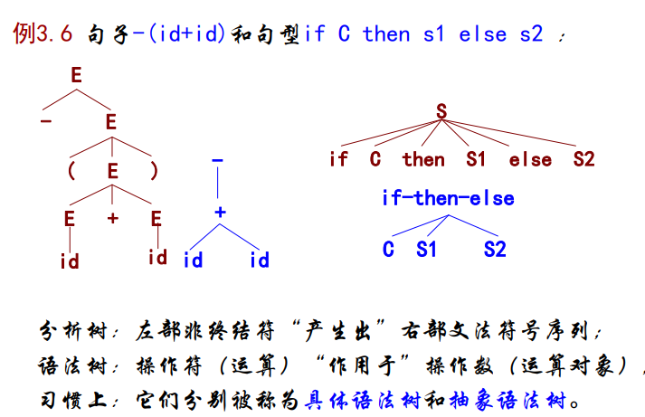

### 二义性与二义性的消除
#### 二义性(Ambiguity)
任何一个句子的分析树可能不止一棵
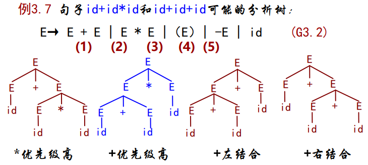

* `3.7` 若文法G对同一句子产生不止一棵分析树,则称G是**二义**的
    > 原因: 在产生句子的过程中某些直接推导有多于一种选择
    ● 一个句子有多于一棵分析树,仅与文法和句子有关,与采用的推导方法无关;
    ● 造成文法二义的根本原因: 文法中缺少对文法符号**优先级和结合性**的规定

显然,程序设计语言不允许二义
#### 二义性的消除
1. 改写二义文法为非二义文法
    1. 新引入的非终结符,限制了每一步直接推导均有唯一选择;
    2. 最终分析树的形状,仅与文法有关,而与推导方法无关;
    3. 非终结符的引入,增加了推导步骤(分析树增高)
    4. 越接近S的文法符号的优先级越低;
        > 引入一个新的非终结符,增加一个子结构并提高一级优先级
    5. 对于A→αAβ,其右部中,若A在终结符a左边出现(即β中包含a),则终结符a具有左结合性质
        > 递归非终结符在终结符左边,使该终结符具有左结合性,否则具有右结合性.
    
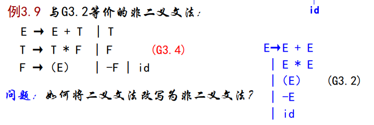
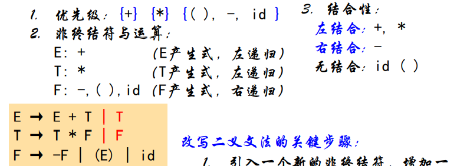

2. 规定二义文法中符号的优先级和结合性,使仅产生一棵分析树
二义文法优点:容易理解,效率高
* 对于G3.2分别为运算符规定方向和优先级
* 对于if给出明确结束标志(如end if)

## 语言和文法
文法的作用: 
1. 结构说明: 给出精确、易于理解的语言结构说明;
2. 可扩展性: 以文法为基础的语言,便于加入新的、或修改、删除旧的语言结构;
3. 自动生成: 有些类别的文法,可以自动生成高效的分析器.

### 正规式 -> CFG
1. 构造正规式的NFA;
2. 若0为初态,则A0为开始符号;
3. 对于move(i,a)=j,引入产生式Ai→aAj;
4. 对于move(i,ε)=j,引入产生式 Ai→Aj;
5. 若i是终态,则引入产生式Ai →ε.

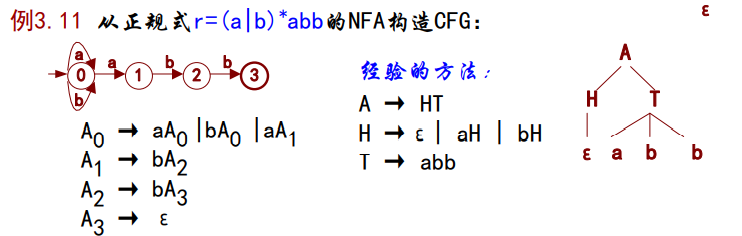

### 上下文有关语言(CSL, Context Sensitive Language)
有一些CFG无法描述的结构: 上下文有关结构,包括:
* 变量的声明与引用必须一致
* 过程调用时实参与形参的个数、类型必须一致等

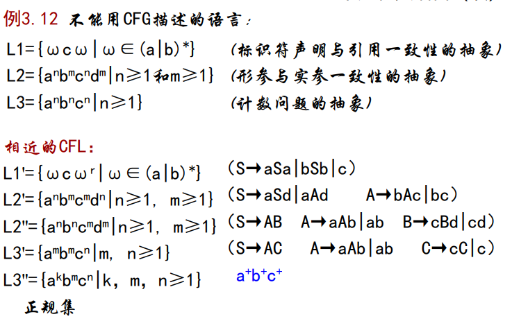

### 形式语言与自动机
* `3.8` 若文法G=(N,T,P,S)的每个产生式α→β中,均有α∈(N∪T)\*,且至少含有一个非终结符,β∈(N∪T)\*,则称G为**0型文法**
    > 对0型文法施加以下第i条限制,即得到i型文法.
    1.G的任何产生式α→β（S→ε除外）满足|α|≤|β|;
    2.G的任何产生式形如A→β,其中A∈N,β∈(N∪T)*;
    3.G的任何产生式形如A→a或者A→aB(或者A→Ba),其中A和B∈N,a∈T.

文法 |语言 |自动机
-|:-:|-
短语文法 (0型) |短语结构语言 |图灵机
CSG (1型)| CSL |线性界线自动机
CFG (2型) |CFL |下推自动机
正规文法 (3型) |正规集 |有限自动机

0型语言 ⊃ CSL ⊃ CFL ⊃正规
结论: 0型文法、CSG、CFG、正规式能力递减
但是: 能力越强的文法,其文法的设计和自动机的构造越困难
因此: 语法分析仅用到CFG（除特别指出,文法即指CFG ）
