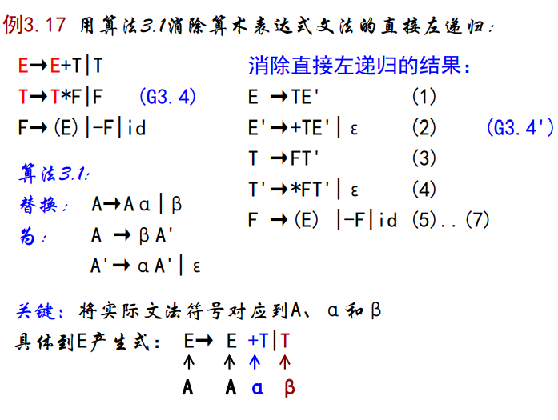

<font face = "Consolas">
<!-- @import "[TOC]" {cmd="toc" depthFrom=1 depthTo=6 orderedList=false} -->

<!-- code_chunk_output -->

- [自上而下语法分析](#自上而下语法分析)
    - [消除左递归](#消除左递归)
    - [提取左因子](#提取左因子)
    - [递归下降分析(器)](#递归下降分析器)
      - [构造文法的状态转换图并且化简;](#构造文法的状态转换图并且化简)
      - [将转换图转化为EBNF表示;](#将转换图转化为ebnf表示)
      - [从EBNF构造子程序(递归下降子程序)](#从ebnf构造子程序递归下降子程序)
    - [非递归预测分析器](#非递归预测分析器)
      - [预测分析表](#预测分析表)
      - [下推自动机的工作方式](#下推自动机的工作方式)
      - [驱动器算法](#驱动器算法)
      - [构造预测分析表](#构造预测分析表)
      - [LL(1)文法](#ll1文法)

<!-- /code_chunk_output -->

# 自上而下语法分析
自上而下就是从文法的开始符号出发,向下推导,推出句子
* 基本思想: 推导
    对于任何一个输入序列（记号流）,从S开始进行最左推导,直到得到一个合法的句子或发现一个非法结构.

* 

采用试探加回溯的方法,但有下述2种文法情况带来问题:
1. 若有A→αβ1|αβ2,(公共左因子),则会虚假匹配和大量回溯;
    >分析效率低、语义动作难以恢复、出错位置的报告不确切等
2. 若有A→Aα(左递归),则死循环使分析无法进行下去.

所以需要重写文法,提取左因子,以避免回溯.消除左递归,以避免陷入死循环
### 消除左递归
* `3.9` 若文法G中的非终结符A,对某个文法符号序列α存在推导A-+->Aα,则称G是**左递归**的.
若G中有形如A→Aα的产生式,则称该产生式对A**直接左递归**

1. 消除文法的直接左递归
    * `算法3.1` 消除直接左递归
    输入: 含直接左递归的G
    输出: 等价的不含直接左递归的G'
    方法: 
        ```text
        对于每个含直接左递归的产生式A:
        整理为如下形式: A→ Aα1|Aα2|...|Aαm|β1|β2|...|βn(αi非空,βj均不以A开始)
        然后用下式代替A产生式: 
        A → β1A' | β2A' | ... | βnA' 
        A'→ α1A' | α2A' | ... | αmA' |ε 
        ```
    >考虑A→Aα|β, 两个产生式有一个直接左递归
替换为: A→βA', A'→αA'|ε 消除该直接左递归


2. 消除文法的左递归
存在不是直接的左递归
    > S→Aa|b A→Ac|Sd|ε
    S=>Aa=>Sda, S左递归(但不是直接左递归)
    * `算法3.2` 消除左递归
    输入: 无回路文法G
    输出: 无左递归的等价文法G'
    方法: 
        ```text
        将非终结符合理排序: A1,A2,...,An;
        for i in 2 .. n
        loop for j in 1 .. i-1
            loop
                对每个形如Ai→Ajγ产生式中的Aj用
                Aj→δ1|δ2|...|δk的右部替换,得到新产生式
                Ai→δ1γ|δ2γ|...|δkγ;
                消除Ai产生式中的直接左递归;
            end loop;
        end loop;
        ```
        > 将无直接左递归的非终结符展开到其他产生式中

* 

### 提取左因子
* 公共左因子(前缀): A → αβ1|αβ2
* 提取左因子: 当不确定用A产生式的哪个候选项替换A时,可以重写A的产生式来推迟这种决定,直到看见足够的输入,能正确决定所需选择为止
    > 类似于有限自动机的确定化
    将:  A → αβ1|αβ2
替换为: A →αA' A'→β1|β2
* `算法3.3` 提取文法的左因子
    * 输入: 文法G
    * 输出: 等价的无左因子文法G'
    * 方法: 
        ```text
        对于每个有左因子的产生式A: 
        重排A产生式: A→αβ1|αβ2| ... |αβn|γ;
        用 A→αA’|γ 和A’→β1|β2| ...|βn 取代原A产生式.
        重复该过程,直到所有A、A’的候选项中不再有公共前缀
        ```
* 

### 递归下降分析(器)
* 本质: 以程序中的过程调用来模拟最左推导
* 基本思想: 每个非终结符A对应一个子程序(函数A),过程体中,产生式右部的: 
    * 非终结符B: 对应子程序B的调用
    * 终结符T: 与输入记号进行匹配
* 特点: 
    1. 子程序递归(因为文法是递归的);
    2. 程序与文法相关;
    3. 对文法的限制是不能有公共左因子和左递归;
    4. 非形式化的方法,只要能写出子程序,用什么样的方法和步骤均可.

简单方法:
#### 构造文法的状态转换图并且化简;
* 文法的状态转换图 : 
    >要先消除左递归
    每个非终结符对应一个状态转换图
    1. 为非终结符A建立一个初态和一个终态;
    2. 为A→X1X2...Xn构造从初态到终态的路径,边标记依次为X1,X2,...,Xn.
    
    然后,根据识别同一集合的原则,化简转换图
        >标记为A的边可等价为标记ε的边转向A转换图的初态;
        ε边连接的两个状态可以合并;
        标记相同的路径可以合并;
        不可区分的状态可以合并
        

#### 将转换图转化为EBNF表示;
文法的扩展BNF表示EBNF(extended BNF):对产生式集进行扩充
1. { }: 重复0或若干次（while）
2. [ ]: 可缺省（if或while）
3. | : 括弧之内的或关系（case）
4. ( ): 改变运算的优先级和结合性

* 

#### 从EBNF构造子程序(递归下降子程序)
```text
procedure L() is
begin
    lookahead := lexan();
    while (lookahead≠eof)loop E(); match(';'); end loop;
end L;
        
 procedure E() is
begin
    T();
    while lookahead∈(+|-)
    loop match(lookahead);
        T();
    end loop;
end E;

procedure F() is
begin
    case lookahead is
        '(' : match('('); E(); match(')');
        id : match(id);
        num : match(num);
        others : error("syntax error2");
    end case;
end F;
```

### 非递归预测分析器
由预测分析表,符号栈,驱动器组成
把程序模拟的状态转换成分析表中的内容,用分析表指导驱动器完成对输入序列的分析
* 核心概念: 
    1. 工作方式: 格局与格局变换
    2. 分析表的结构、驱动器(模拟算法)
    3. 预测分析表的构造
    4. LL(文法、语言、分析器)


#### 预测分析表


#### 下推自动机的工作方式
每张“幻灯片”称为一个**格局**
* 格局: 一个三元组(栈内容,当前剩余输入,改变格局的动作)

分析从某个初始格局开始,经过一系列的格局变化,最终到达接受格局,表明分析成功;
或者到达出错格局,表明发现一个语法错误.
* 改变格局的动作: 
    1. 匹配终结符: 若top^ = ip^(但≠#),则pop且next(ip);
    2. 展开非终结符: 若top^ = X且 M[X,ip^]=α(X→α),则pop且push(α);
    3. 报告分析成功: 若top^ = ip^ = #,则分析成功并结束;
    4. 报告出错: 其它情况,调用错误恢复例程.
#### 驱动器算法
* `算法3.4` 非递归的预测分析
    * 输入: 输入序列ω和文法G的预测分析表M
    * 输出: 若ω∈L(G),得到ω的一个最左推导;否则指出一个错误
    * 方法: 
    ```text
    初始格局为: (#S,ω#,分析器的第一个动作)
    令ip指向ω#中的第一个终结符,top指向S
    loop x:=top^; a:=ip^;
        if x ∈ T then
            if x=a
            then pop(x); next(ip); -- 匹配终结符
            else error(1); -- 出错: 栈顶终结符不是a
            end if;
        else if M[x, a] = X→Y1Y2...Yk
            then pop(X); push(YkYk-1...Y2Y1);--展开产生式
            else error(2); -- 出错: 产生式不匹配
            end if;
        end if;
      exit when x=#; -- 分析成功
    end loop;
    ```


#### 构造预测分析表
驱动器与文法无关,所有预测分析器的驱动器均相同,只有预测分析表内容不同
* 构造预测分析表:
    1. 首先构造FIRST集合与FOLLOW集合;
    2. 然后根据两个集合构造预测分析表
    <br>
* `3.10` 文法符号序列α的**FIRST**集合为:
FIRST(α)={a|α-+->a...,a∈T},
若α-+->ε,则ε∈FIRST(α)
    > 就是从α开始可以推导出的所有以终结符开头的序列中的开头终结符
* `3.11` 非终结符A的**FOLLOW**集合如下:
FOLLOW(A) = { a | S-*->...Aa...,a∈T }
若A是某句型的最右符号,则 #∈FOLLOW（A）
    > 就是从文法开始符号可以推导出的所有含A序列中紧跟A之后的终结符
> FIRST(E) ={ ( id num }
FOLLOW(E)={ ; ) }
* `算法3.5` 计算X的FIRST集合
* `算法3.6` 计算所有非终结符的FOLLOW集合


>FIRST(A) 为左部为A关系中的开头终结符
FOLLOW(A) 为右部中A后紧跟B或β的FIRST(B)-ε或β, 以及B->αA或（B->αAβ中FIRST(β)存在ε时）的 FOLLW(B)

* `算法3.7` 构造预测分析表


>FIRST中对应项直接加入
FIRST(A)中有ε就将ε填到FOLLOW(A)对应项中

#### LL(1)文法
* `3.12` 文法G被称为是LL(1)文法,当且仅当为它构造的预测分析表中不含多重定义的条目
* `推论3.12` G是LL(1)的,当且仅当G的任何两个产生式A→α|β满足:
    1. 对任何终结符a,α和β不能同时推导出以a开始的串;
    2. α和β最多有一个可以推导出ε;
    3. 若β ε,则α不能导出以FOLLOW(A)中终结符开始的任何串.
    >有左递归和左因子的文法不是LL(1)文法
* `推论3.2` G是LL(1)的,当且仅当G的任何两个产生式A→α|β满足:
    1. 对任何终结符a,α和β不能同时推导出以a开始的串;
    2. α和β最多有一个可以推导出ε;
    3. 若β-*->ε,则α不能导出以FOLLOW(A)中终结符开始的任何串
* LL(1)弱点:
    1. 文法难写、难懂;
    2. 适应范围有限,往往写不出有些语言的LL(1)文法
    >实际编译器中使用更多的是一类LL(1)文法的真超集,即LR(1)文法

