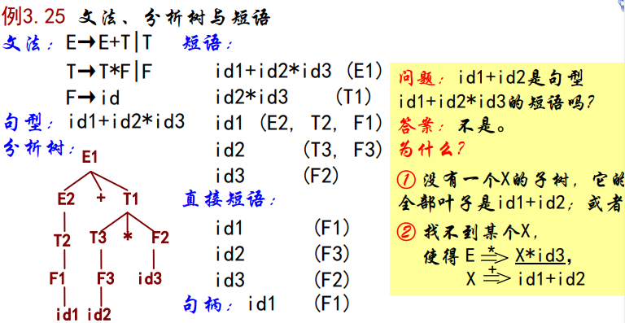
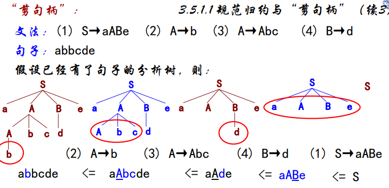
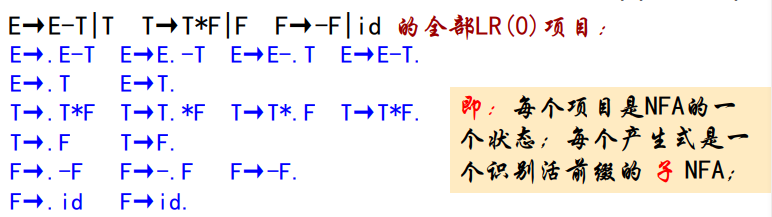
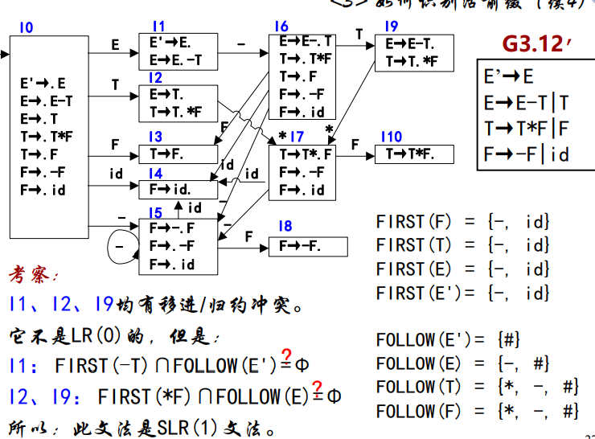

[TOC]
<font face = "Consolas">

# 自下而上语法分析
* 自下而上分析采用**归约**方法: 从叶子到根构造分析树,从句子开始归约出文法的开始符号
    >推导的逆过程

>对分析语言来说自下而上分析更自然
自下而上分析最一般方法LR方法比LL强
但LR自下而上分析的逆向思维过程使得分析表构造复杂

## 自下而上分析基本方法
从左到右扫描输入序列ω,反复用产生式的左部替换产生式的右部,谋求对ω的匹配,最终将ω归约为文法的开始符号或者发现一个语法错误
### 规范归约与“剪句柄”
* `3.13` 设αβδ是文法G的一个句型,
若存在S-\*->αAδ,A-+->β,
则称β是句型αβδ相对于A的**短语** 
特别的,若有A→β,则称β是句型αβδ相对于产生式A→β的**直接短语** .
一个句型的最左直接短语被称为**句柄** 
    * 短语形成的两个要素: 
        1. 从S可以推导出A,即S-\*->αAδ;
        2. 从A至少一次推导出β,即A-+->β.
    >直观上,句型是一个完整结构,短语是句型中的某部分(相对某非终结符).S是一个句型而不是一个短语(树根不是短语)
    * 特征:
        1. 短语: 以非终结符为根子树中所有从左到右的叶子;
        2. 直接短语: 只有父子关系的子树中所有从左到右排列的叶子(树高为2);
        3. 句柄: 最左边父子关系树中所有从左到右排列的叶子(句柄是唯一的).



* `3.14` 若α是文法G的句子且满足下述条件,则称序列αn,αn-1,...,α0是α的一个**最左归约**,其中
    1. αn=α
    2. α0=S(S是G的开始符号)
    3. 对任何i(0< i <=n),αi-1是将αi中的句柄替换为相应产生式左部非终结符得到的
    > 最左归约的逆过程是一个最右推导,分别称最右推导和最左归约为规范推导和规范归约


<br>
<br>

但句柄难以直接看出,采用剪句柄方式(给出句子的分析树,然后一个个剪句柄)


### 移进-归约分析器工作模式
* 语法分析器不能如此进行剪句柄,有2个问题:
    1. 确定右句型中将要归约的子串(确定句柄) 
    2. 确定如何选择正确的产生式进行归约

采用**移进-归约**: 用一个栈“记住”将要归约句柄的前缀,句柄形成前移进,形成后归约


两者工作模式完全相同(格局变换)
> 格局:(栈,剩余输入,动作)
分析从某个初始格局开始,经过一系列格局变化,最终到达接收格局标明分析成功/出错格局标明发现语法错误
剩余输入: 开始格局剩余输入是全部输入序列,接收格局剩余输入为空,其他格局的剩余输入是全部输入序列的一个后缀
栈: 文法符号和状态
驱动器根据当前栈和剩余输入查找移进-归约分析表确定动作,改变栈和剩余输入状态,从而进入下一格局
* 改变格局的动作: 
    1. 移进(shift): 当前剩余输入的下一终结符进栈.
    2. 归约(reduce): 将栈顶句柄替换为对应非终结符(最左归约)
    3. 接受(accept): 宣告分析成功
    4. 报错(error): 发现语法错误,调用错误恢复例程


> 句柄总是在栈顶形成
栈中保留的总是一个右句型的前缀(活前缀)
最左归约是逻辑上从下到上构造一棵分析树,或从下到上为分析树剪句柄

> 待解决问题:
如何保证栈中总是活前缀(指导移进)
如何确定栈顶已经形成句柄并选择正确的产生式进行归约(指导归约)

## LR分析
* LR分析特点:
    1. 采用最一般的无回溯移进-归约方法;
    2. 能够及时发现错误;
    3. 可分析的文法是LL文法的真超集;
    4. 分析表较复杂,难以手工构造;
```text
E → E-T (1)
   | T  (2)
T → T*F (3) 以(G3.12)为例
   | F  (4)
F → -F  (5) 
   | id (6)  
```
### LR分析与LR文法
* LR分析器的核心: 驱动器,移进-归约(LR)分析表

与LL分析表不同,LR分析表可明显分为: **动作表**(action),**转移表**(goto)
动作表为 状态\终结符, 转移表为 状态\非终结符


* s: 当前状态
* a: 终结符
* A: 非终结符
* action\[s,a]: 当前栈顶状态为s和输入终结符为a是应进行的下一动作
* goto\[s,A]: 当前栈顶为s和非终结符A的下一状态转移

根据当前状态和当前剩余输入,动作表有4种**动作**对应引起格局变化的4种动作形式
1. action\[s,a]=si: 移进一个终结符并转向状态i
2.  = rj: 归约: 用第j个产生式的左部替换栈顶中的句柄
3. = acc: 接收
4. = blank: 出错处理
5. goto\[s,A]=s': s状态下遇到A转移到状态s'.
> 2,5共同完成归约
* `算法3.8` LR分析(驱动器)
    * 输入: 输入序列ω和文法G的LR分析表(action与goto)
    * 输出: 若ω属于L(G),得到ω的规范归约,否则指出一个错误
    方法: 
    ```text
    初始格局为(#0,ω#, 第1个动作),其中0是初态
    ip: ω#中的第一个终结符,top: 栈顶初始状态
    loop s:=top^; a:=ip^;
        case action[s,a] is
            shift s': push(a); next(ip); push(s'); -- 移进
            reduce by A→β:
                pop(2*|β|);         -- 弹出句柄和相应状态
                s' := top^;         -- 暴露出当前栈顶状态s'
                push(A);            -- 产生式左部符号进栈
                push(goto(s',A));  -- 新栈顶状态进栈
                write(A→β);         -- 完成归约,跟踪分析轨迹
            accept: return;         -- 成功返回
            others: error;          -- 出错处理
        end case;
    end loop; 
    ```
    >文法符号和当前状态同时出入栈


> 状态转移r时如行2,下一项为-,当前为状态4,action\[4,-]为=r6归约(F->id),前状态为0,所以目标状态为goto\[0,F]=3

* `3.15` 若为文法G构造的移进-归约分析表中不含多重定义的条目,则称G为**LR(k)文法**,由此分析表构成的分析器被称为LR(k)分析器,它所识别的语言被称为LR(k)语言
    * L: 从左到右扫描输入序列
    * R: 逆序的最右推导
    * k: 确定下一动作向前看的终结符个数
    > 一般情况下k<=1.当k=1时,简称LR

    > LR 分析器是一大类(移进－归约)分析器: 
    根据分析表的构造,有
    LR(0)、SLR(1)、LALR(1)、LR(1)分析器.
    它们功能的强弱和构造的难度依次递增.
    k>1后,分析器的构造趋于复杂,一般情况下并不构造k>1的LR(k)分析器.
### 构造SLR(1)分析器(simple LR(1))
* 简单的LR分析器: 在分析器工作时可以根据简单向前看一个终结符确定下一步的动作
* 基本思想: 首先构造一个可以识别文法G中所有活前缀的DFA,然后根据DFA和简单的向前看信息构造SLR分析表
#### 活前缀与LR(0)项目
* `3.16` 出现在移进-归约分析器栈中的右句型的前缀,被称为文法G的**活前缀**(viable prefix)
    * 特点: 右句型的前缀,已在分析栈中
    > 活前缀＋若干终结符(不在栈中)＝ 右句型.
    在移进-归约分析中,只要保证已扫描过的输入序列可以归约为一个活前缀,则分析到目前为止没有错误
* 构造SLR分析表的关键: 为文法G构造一个识别它的所有活前缀的DFA.(NFA->DFA,需要先得到识别活前缀的NFA)
* `3.17` 一个**LR(0)项目**(简称项目)是这样一个产生式,在它右部的某个位置有一个点`.`
对于A→ε,它仅有一个项目A→ `.`

    > 点把产生式右部分为两部分: A->α.β
    表示在分析过程种看到了产生式右部的多少内容
    β不为空表示产生式右部还没有全部看到,需要继续移进(可移进项目);
    β为空表示当前栈顶以及形成了一个句柄,可以进行归约(可归约项目)

    > 项目与活前缀的关系: 
    若 T→.T*F是识别活前缀α的状态,
    则 T→T.*F是识别活前缀αT的状态.
    产生式T→T*F是识别活前缀αT*F的NFA.
    >> 于是: 所有产生式构成识别文法G所有活前缀的NFA,将其确定化即得到识别活前缀的DFA
#### 拓广文法与识别活前缀的DFA
为了使得构造识别文法G活前缀的NFA/DFA具有唯一的初态和终态(唯一的接受状态),引入拓广文法
* **拓广文法** G' = G∪{S'→S}
S'→.S是识别S的初态,S'→S.是识别S的终态
    > 例:
    文法G3.12:  E→E-T|T T→T*F|F F→-F|id
    的拓广文法:  G' = G∪{E'→E}
    唯一初态与终态:  E' →.E 和 E'→E.
* NFA(项目)->DFA(项目集)
    * 词法分析器－“子集法”: 
        >ε_闭包(I): 从**状态集**I不经任何**字符**能到达的**状态**全体;
        smove(I,a): 所有从I经字符a能直接到达的状 态全体.
    * 类似的两个过程: 
        >closure(I): 从**项目集**I不经任何**文法符号**到达的**项目**全体;
        goto(I,x): 所有从I经文法符号x能直接到达的项目全体
    * `3.18`项目集I的**闭包**closure(I)是这样一个项目集
        1. I中的所有项目属于closure(I);
        2. 若A→α.Bβ属于closure(I),则所有形如B→.γ的项目属于closure(I);
        3. 其它任何项目不属于closure(I).
        > 指明了在项目集I状态下,所有不经任何文法符号就能到达的项目集
    * `3.19` 对所有属于项目集I、且形如 A→α.Xβ 的项目(X∈N∪T),goto(I,X)是所有形如 A→αX.β 的项目
        > 指明了从项目集I经文法符号X能直接到达的下一状态集合
    * `算法3.9` 构造文法G的、基于LR(0)项目的、识别活前缀的DFA
        * 输入: 拓广文法G'
        * 输出: DFA=(C, Dtran) -- C是状态集(每个状态是一个项目集),Dtran是状态转移
        * 方法:
            ```text
            加入closure(S’→.S)到C中,作为唯一未标记状态; -- 初态
            while C中还有未标记状态I -- 考察所有未标记状态
            loop 标记I;
                for I 状态下的每个文法符号x     -- 考察所有边的标记x
                loop if J:=closure(goto(I,x))非空   --有下一状态
                    then Dtran[I,x]:= J;    -- 记录下一状态转移
                        if J不在C中     -- 新状态待考察
                        then 不标记加入J到C;
                        end if;
                    end if;
                end loop;
            end loop; 
            ```
    * 用算法3.9构造DFA
    
    * 活前缀
    从初态出发的每条路径的标记,就是一个活前缀
        > 环: 无穷条路径=无穷个活前缀
    * 项目(集)的指导意义
        * I中一项目对某活前缀有效,则I中其他任何项目对该活前缀也有效
        * 指导下一步动作: 
        A→β1.β2(可移进项): 移进β2中第一个文法符号
        B→β.(可归约项): 按产生式B→β归约
            > 同时最多只有一个项目起作用,分析的每一步都是确定的
            所以,此文法是LR(0)文法
#### SLR(1)解决项目集冲突
当一个项目集中同时存在: 
1. 移进/归约冲突: A→β1.β2和B→β.: 既可移进又可归约
2. 归约/归约冲突: A→α.和B→β.: 均可指导下一步分析

解决方法:  SLR(1)方法(简单向前看一个终结符)
1. 移进/归约冲突: 若FIRST(β2)∩FOLLOW(B)=Φ,冲突可解决
2. 归约/归约冲突: 若FOLLOW(A)∩FOLLOW(B)=Φ,冲突可解决
>若冲突可以解决,则称文法为SLR(1)文法,构造的分析表为SLR(1)分析表.
否则就不是SLR(1)文法,需寻求能力更强的文法,即寻求新的项目集(如LR(1)项目集等).



#### SLR分析表的构造
* `算法3.10` 构造SLR分析表
    * 输入: 基于G的LR(0)项目集的、识别活前缀的DFA=(C, Dtran)
    * 输出: 若G是SLR(1)的,得到action和goto,否则指出一个错误
    * 方法: 按下述步骤构造分析表
    


.,;: 