[TOC]
<font face = "Consolas">

# 静态语义分析
考虑语言的实际意义
* 检查静态语义错误
* 将语义正确的语句翻译成中间代码

>本章关注的是语法分析的基础上的语义处理,忽略语法分析.
为了简单,本章的文法一般为二义文法.
默认解决二义的方法是规定常规意义下的优先级和结合性
## 语法制导翻译
### 语法和语义
* **语法**: 语言的结构(语言的“样子”)
* **语义**: 附着于语言结构上的实际含意(即语言的“意义”)
    > 正确的语法(格式)不代表正确的语义(意义)
* 关系: 
    * 语义不能离开语法独立存在;
    * 语法与语义之间没有明确的界线;
    * 语义远比语法复杂;
        > 没有数学的形式化描述
    * 同一语言结构可包含多种含意,不同语言结构可表示相同含意.
* 语义分析作用:
    * 检查结构正确的句子所表示的意思是否合法
    * 执行规定的语义动作,如: 表达式求值,符号表的查询/填写,中间代码生成等
* 语义分析方法最常用语法制导翻译
### 属性与语义规则
* **语法制导翻译**(Syntax Directed Translation)的基本思想:
简单地讲: 以语法分析为基础,伴随语法分析的各个步骤,执行相应的语义动作
* 具体方法: 
    1. 将文法符号所代表的语言结构的意思,用附着于该文法符号的**属性**表示;
        > 属性的抽象表示采用`.attr`,如E.val E.type等
    2. 用**语义规则**规定产生式所代表的语言结构之间的关系(即属性之间的关系),即用语义规则实现语义(属性)计算.
    3. 语义规则的执行: 
    在语法分析的适当时刻(如推导或归约)执行附着在对应产生式上的语义规则(以实现对语义的处理,如计算、查填符号表、生成中间代码、发布出错信息等).
* `4.1` **属性**/**语义规则**的定义
    对于产生式A→α,其中α是由文法符号X1X2...Xn组成的序列,它的语义规则可以表示为(4.1)所示关于属性的函数f: 
    `b := f(c1, c2, ..., ck)  (4.1)`
    >语义规则就是属性之间的计算
    属性的依赖关系决定了计算的先后次序

    > • 称此属性b依赖于属性c1,c2,...,ck
    • 若b是A的属性,c1, c2, ..., ck是α中文法符号的属性或者A的其它属性,则称b是A的**综合属性**
    • 若b是α中某文法符号Xi的属性,c1, c2, ..., ck是A的属性或者是α中其它文法符号的属性,则称b是Xi的**继承属性**
    • 若语义规则的形式如 f(c1, c2, ..., ck)
    则可将其想像为产生式左部文法符号A的一个**虚拟属性**.属性之间的依赖关系,在虚拟属性上依然存在.

    > 如 E→E1+E2 
    E.val := +(E1.val , E2.val)

### 语义规则的两种(表示/描述)形式
根据属性表示的抽象程度,语义规则的两种表示方式:
* 语法制导定义(Syntax Directed Definition)
    用抽象的属性和运算表示的语义规则.(公式,做什么,算法)
* 翻译方案(Translation Scheme)
    用具体的属性和运算表示的语义规则.(程序段,如何做,程序实现)
>忽略实现细节,二者作用等价


产生式 |语法制导定义 |翻译方案
-|-|-
L→E |print(E.post)|  print_post(post);
E→E1+E2| E.post:=E1.post\|\|(连接运算)E2.post\|\|'+';| post[k]:='+'; k:=k+1;
E→num| E.post:=num.lexval; |post[k]:=lexval; k:=k+1;
> • print(E.post)是L的虚拟属性(可想象为L.p:=print(E.post))
• 翻译方案也可直接输出表达式的后缀形式(自上而下分析过程对分析树后序遍历,遍历次序与表达式的后缀显示正好一致),
如E→E1+E2 print(+)
E→num print(lexval)

将属性附着在分析树对应文法符号上,形成注释分析树
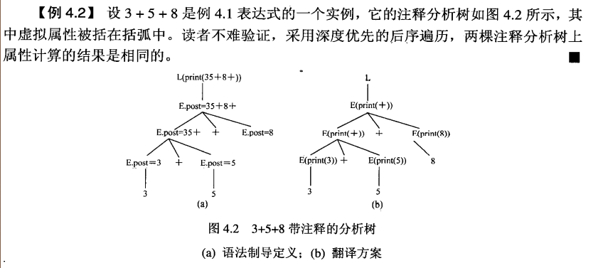

> 综合属性是自下而上计算的 继承属性是自上而下计算的
约定: 除非特别提醒,本章讨论的语法制导翻译是综合属性;且采用LR分析.
### LR分析翻译方案的设计
LR分析中的语法制导翻译实质上是对LR语法分析的扩充
* 扩充LR分析器的功能: 
当执行归约的动作时,也执行相应产生式对应的语义动作.由于是归约时执行语义动作,因此限制语义动作仅能放在产生式右部的最右边
* 扩充分析栈: 
增加一个与分析栈并列的语义栈,用于存放分析栈中文法符号所对应的属性值
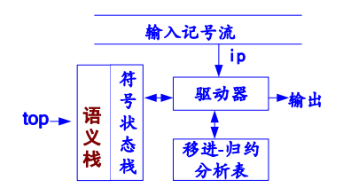

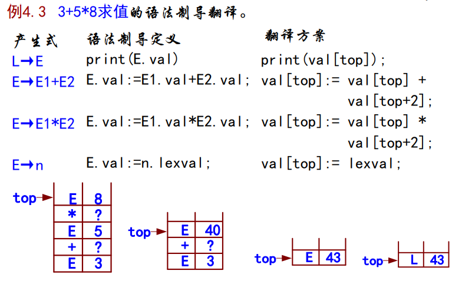
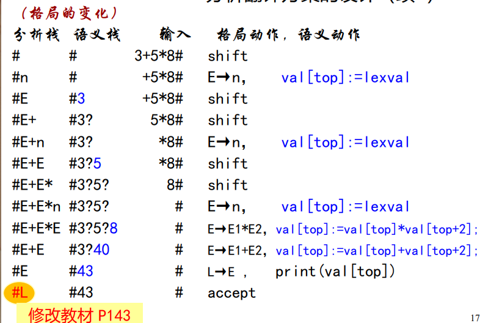

### 递归下降分析翻译方案的设计
* 递归下降方法: 用程序实现对非终结符的展开和对终结符的匹配
    >从上到下构建分析树,对虚拟分析树进行深度优先遍历
     语法分析中唯一适合于手工构造的方法

    问题:
    * 1．在递归下降子程序中,语义动作可以出现在产生式右部的任何位置;
    * 如何为文法符号的属性设计存储空间(函数返回值、参数、变量等)

## 中间代码
* 中间代码是编译器前端与后端的分水岭
语义分析完成的源程序就具备生成目标代码的条件,但直接翻译低效困难,因此设计一种中间代码,先语法制导翻译生成中间代码,再考虑对代码的优化,最终目标代码生成
* 对中间代码的要求
    * 便于语法制导翻译
    * 既与机器指令的结构相近,又与具体机器无关
* 中间代码的主要形式: 
    * 树
        > 最基本,实质上就是一颗语法树
        其他形式的中间代码均与树有对应关系
    * 后缀式
    * 三地址码
### 后缀式
* 特征: 
    * 操作数在前,操作符紧随其后
        中缀式 |后缀式
        -|-
        3+5*2/7 |3 5 2 * 7 / +
        (3+5)*(2/7) |3 5 + 2 7 / *
    * 无需用括号限制运算的优先级和结合性
* `算法4.2` 后缀式计算
    * 输入: 后缀式
    * 输出: 计算结果
    * 方法: 采用下述过程进行计算,最终结果留在栈中
        ```text
        x := first_token;
        while not end_of_exp
        loop if x is an operand
            then
                push( x ); -- 操作数进栈
            else -- 算符
                pop(operands); -- 弹出操作数
                push(evaluate); -- 计算,并将结果进栈
            end if;
            x := next_token( );
        end loop; 
        ```
    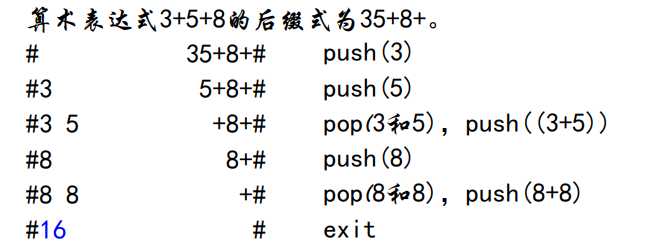

* 推广到其他语句
只要遵守操作数在前,操作符紧跟其后的原则即可
    > `if e then x else y`
    后缀式可写为`e x y if-then-else`

### 三地址码
* 三地址码: 是由不超过三个地址组成的一个运算

#### 直观表示
语法| 语义
-|-
result := arg1 op arg2| 结果存放在result中的二元运算arg1 op arg2
result := op arg1|结果存放在result中一元运算op arg1
op arg1 |一元运算op arg1 
result := arg1|直接拷贝
> 例如: 赋值句x := a+b*c 的三地址码序列: 
T1 := b * c
T2 := a + T1
x := T2
>> 形式上是最多仅有一个二元运算组成的赋值句
 
* 三地址码种类
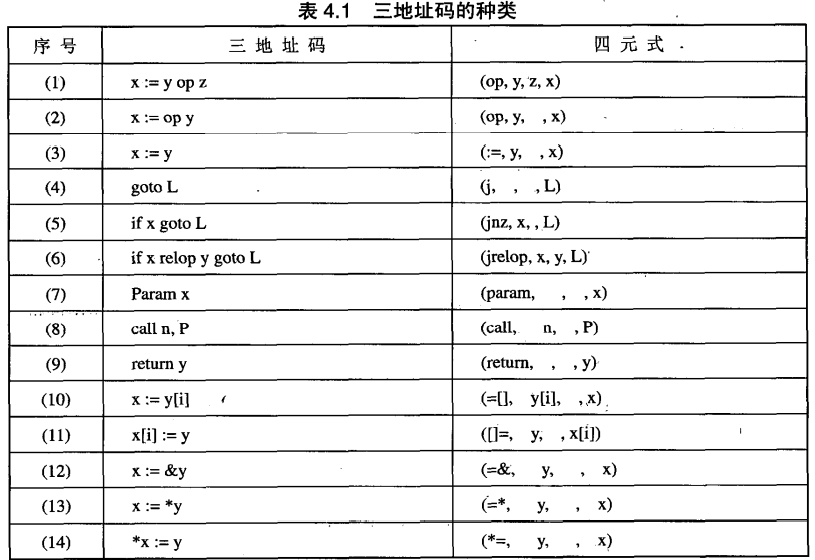

> 三地址码与汇编指令再结构上十分接近,又不涉及具体机器有关的细节
#### 三地址码的实现: 三元式与四元式
*  三元式
    形式:  (i) (op, arg1, arg2)
    三地址码: (i) := arg1 op arg2
    > 序号既代表此三元式,又代表三元式存放的结果
    * 例: 表达式x:=a+b*c的三元式: 
    (1) (*, b, c )
    (2) (+, a,(1))
    (3) (:=,x,(2))
        > 标识符a,b,c,x分别表示它们的存储位置
        序号(1)、(2)、(3)分别是它们在三元式表中的位置
    * 弱点: 给代码的优化带来困难
        > 代码的删除,移动会影响三元式的序号,使得其他三元式中对原序号的引用无效,而代码优化通常使用删除,移动某些代码等手段.
    * 三元式的语法制导翻译
        1. 属性 `.code`: 三元式代码/序号,或者指示标识符的存储单元;
        2. 属性 `.name`: 标识符的名字;
        3. 函数`trip( op,arg1,arg2 )`: 生成一个三元式,返回三元式的序号;
        4. 函数`entry(id.name)`: 返回标识符在符号表中的位置或存储位置

        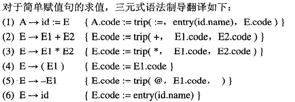

        * 例: x:=a+b*c的三元式(LR分析)
        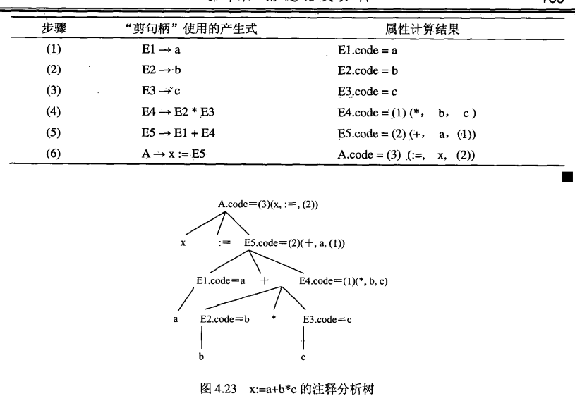

* 四元式
    在三元式的基础上增加了一个存放结果的项
    四元式的语法: （i）(op,arg1,arg2,result)
    所表示的计算: result := arg1 op arg2
    >将由序号所表示的运算结果改为用(临时)变量来表示(唯一区别)
    此改变使得四元式的运算结果与其在四元式序列中的位置无关
    避免了三元式优化困难的弱点
    * 四元式的语法制导翻译
        1. 属性`.code`:  表示存放运算结果的位置(变量);
        2. 函数`newtemp`: 返回一个新的临时变量,如T1,T2,...等;
        3. 过程`emit( op,arg1,arg2, result)`: 生成一个四元式,若为一元运算,则arg2可空.

        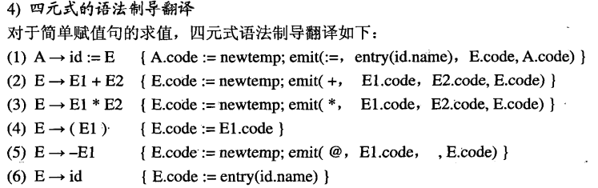

        * 例: 成x:=a+b*c的四元式(LR分析)
        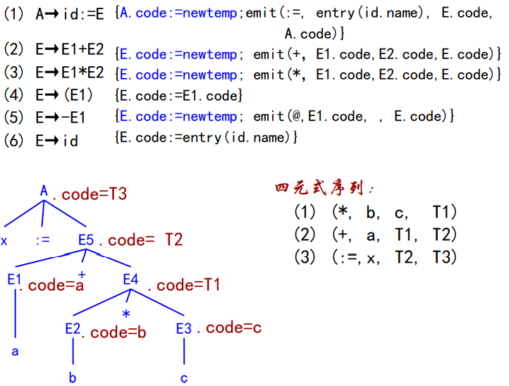

### 树形表示
1. 树作为中间代码
语法树真实反映句子结构,对语法树稍加修改(加入语义信息),即可以作为中间代码的一种形式(注释语法树)
    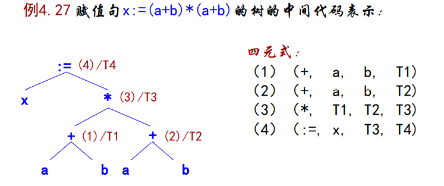
2. 树的语法制导翻译
    1. 属性 `.nptr`: 指向树节点的指针;
    2. 函数 `mknode(op,nptr1,nptr2)`:  生成一个根或内部节点,节点数据是op, nptr1和nptr2分别指向的左右孩子的子树.若仅有一个孩子,则nptr2为空;
    3. 函数 `mkleaf(node)`:  生成一个叶子节点

    
    
3. 树的优化表示－DAG
    * 如果树上某些节点有完全相同的孩子,则这些结点可以指向同一个孩子,形成一个有向无环图 (DAG, DirectedAcyclic Graph)
    * DAG与树的唯一区别是多个父亲可以共享同一个孩子,从而达到资源(运算、代码等)共享的目的
    * DAG的语法制导翻译与树的语法制导翻译相似,仅需要在mknode和mkleaf中增加相应的查询功能
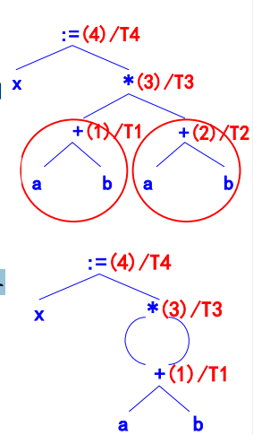

4. 树与其他中间代码的关系
    树表示的中间代码与其他形式之间有内在联系:
    * 树 → 后缀式
    方法: 对树进行深度优先后序遍历,得到的线性序列就是后缀式,或者说后缀式是树的一个线性化序列
    * 树 → 三元式/四元式
    特点: 树的每个非叶子节点和它的儿子对应一个三元式或四元式;
    方法: 对树的非叶子节点进行深度优先后序遍历,即得到一个三元式或四元式序列

    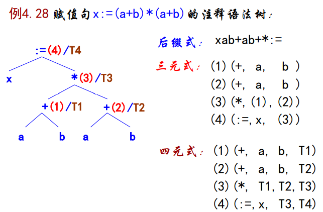

## 符号表
* 作用: 连接声明与引用的桥梁,记住每个符号的相关信息,如作用域和类型等,帮助编译的各个阶段正确有效地工
* 基本目标: 有效记录信息、快速准确查找
### 符号表条目
* 条目: 每个声明的符号在符号表中占据一行,称为一个条目,用于存放符号的相关信息(包括其名字)
    * 条目内容: 名字＋属性
    * 条目种类(符号表中的内容): 保留字、标识符、特殊符号(包括算符、分隔符等)等等.
    * 按上述种类分成多个子表:
        * 不同类别的符号可以存放在不同的子表中,如变量名表、过程名表、保留字表等.
        * 每个作用域一个子表
    * 查询符号的依据: 组合关键字
* **组合关键字**:唯一区分一个条目的若干域
    C符号表组合关键字至少包括: 名字＋作用域＋类型(符号种类)
    > 若一个名字x在同一作用域中允许有多个声明(如int x;struct x{}),则引用x时需要根据上下文确定x到底指哪个对象
### 构成名字的字符串的存储方式
* 直接存储: 定长存储
    > 浪费大,无法解决极端情况
* 间接存储: 变长存储
    将构成名字的字符串同一存放在连续的大存储空间,字符串之间用特殊分隔符隔开,在符号表条目中存放指向该字符串首字母的指针
    > 解决字符串不定长问题,但效率较低
### 名字的作用域
源程序中的名字可以出现在不同的范围内,并且可以具有不同的意义
* 划分范围的方式: 并列 嵌套
* 名字的作用域: 名字在哪个范围内起作用
    > 并列不相干,嵌套需制定规则限定,使得名字在任何范围内无二义
* 名字的作用域规则:规定一个名字在什么样的范围内应该表示什么意义
    * 静态作用域规则（static-scope rule）: 
        编译时就可以确定名字的作用域
    * 最近嵌套规则（most closely nested）: 
        以程序块为例,也适用于过程
        1. 程序块B中声明的名字的作用域包括B
        2. 如果名字x未在B中声明,那么B中x的出现是在外围程序块B’ 的x声明的作用域中,即B'满足:
            * B'有x的声明
            * B'比其它任何含x声明的程序块更接近被嵌套的B
### 线性表
最简单,最易实现符号表的数据结构
为正确反映名字的作用域,线性表应具有栈特征
* 线性表上的操作: 关键字=名字+(当前)作用域;
<br>

* 查找: 从表头(栈顶)开始,遇到的第一个符合条件的名字;
* 插入: 先查找,再加入在表头(栈顶)
* 删除: 将在同一作用域的名字同时摘走,适当保存或不再保存
* 修改: 先查找,修改第一个遇到的符合条件的名字的信息

### 散列表
将线性表分成m个小表.构造hash函数,使符号均匀散布在m个子表中.若散列均匀,则时间复杂度会降到原线性表的1/m
相同作用域的名字被散列到不同的子表中,为了方便删除,在散列链的基础上再设立一个作用域链
* 散列链(hash link):  链接所有具有相同hash值的元素,表头在表头数组中;
* 作用域链(scope link): 链接所有在同一作用域中的元素,表头在作用域表中
<br>

* 查找: 计算hash值k,进入k子表沿链查找目标名字
* 插入: 先查找,若不在则分别沿hash link和scope link插入到两个链中(均插在表头,两个表均可看作是栈)
* 删除: 以作用域链连在一起的所有元素从当前符号表中删除(临时删除,则保留作用域链所链的子表,下次使用时直接加入到散列链中即可)
<br>

* 散列函数的计算
    * 目标: 使得符号均匀分布
    * 关键: hash: string → integer
    * 一种可行的hash函数方案: 
        ```text
        从串s=c1c2…ck的字符 确定正整数h: 
            令:  h0=0,
            计算: hi=αhi-1+ci, 1≤i≤k,
            得到: h=hk
            α=1或α是素数,如α=65599.
        取一素数m, 令 h=h mod m
        ```