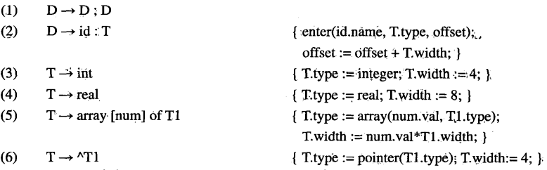
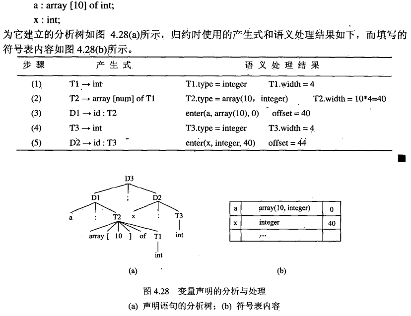
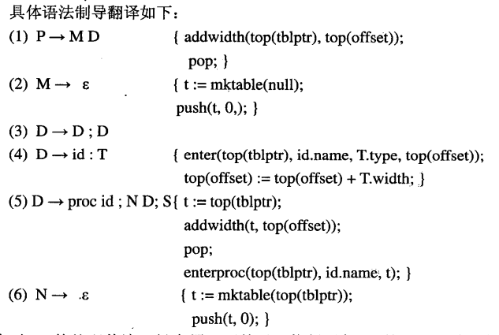
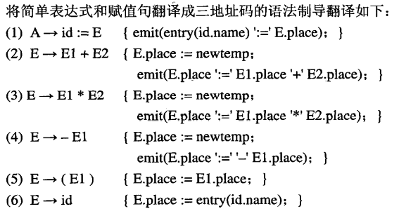
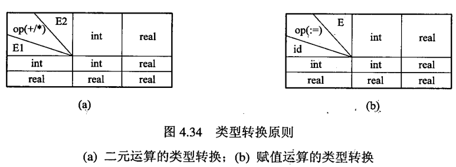
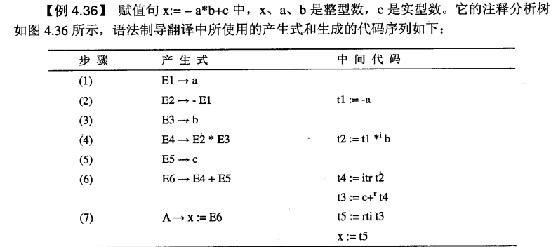

[TOC]
<font face = "Consolas">

## 声明语句的翻译
* 声明语句作用: 为可执行语句提供信息,以便于其执行
* 对声明语句的处理: 主要是将所需要的信息正确地填写进合理组织的符号表中
### 变量的声明
* 类型定义: 为编译器提供存储空间大小的信息
* 变量声明: 为变量分配存储空间
* 组合数据: 类型定义和变量声明可以有两种形式: 定义与声明在一起/分离
    > 分离: type player = array[1..2] of integer;
    var c, p : player;
    同时: var c, p : array[1..2] of integer;
> 简单数据类型的存储空间是预先确定的
组合数据类型变量的存储空间,需要编译器根据程序员提供的信息计算而定
#### 变量声明的语法制导翻译
只需将变量名,变量类型,变量所需存储空间填入符号表即可.
* 变量声明的文法
    ```text
    D → D ; D               (1)
        | id : T            (2)
    T → int                 (3)     G4.5
        | real              (4)
        | array [num] of T  (5)
        | ^T                (6)
    ```
    > 产生式(5)数据类型声明
    (6)指针类型声明
* 填写符号表信息的语法制导翻译
    1. 全局量`offset`: 记录当前符号存储地址(偏移量,初值设为0)
    2. 属性`.type`和`.width`: 变量的类型和所占据的存储空间大小
    3. 过程`enter(name, type, offset)`: 为type类型的变量name建立符号表条目,并为其分配存储空间(位置)`offset`
    4. `array(n,type)`生成数组类型,`pointer(type)`生成指针类型

    
    

### 过程的定义与声明
* **过程**(procedure): 过程头(规格说明)(做什么) + 过程体(怎么做)
    * 过程头(规格说明): 为过程使用者提供信息(过程名,参数,可能的返回值)
    * 过程体: 过程所要完成操作的具体实现
    >函数: 有返回值的过程
    主程序: 被操作系统调用的过程/函数
    * 过程的三种形式
        * 过程定义: 过程头+过程体
        * 过程声明: 过程头
        * 过程调用
    ```Ada
    --定义
    procedure swap(x,y:in out integer)      -- 规格说明
    is                                      -- 过程体开始
    temp : integer;                         -- 体中的声明
    begin temp := x; x := y; y := temp;     -- 可执行语句
    end swap;                               -- 过程体结束

    --声明与调用
    procedure swap(x, y: in out integer);   -- 过程声明
    swap(a, b);                             -- 过程调用
    ```
    > 先声明后引用(定义包括声明)
#### 左值与右值
* 直观上,出现在赋值号左边和右边的量分别称为左值和右值
* 实质上,
    * **左值**: 一个量的内存地址(必须具有存储空间).
    * **右值**: 一个量的值(可以仅有值而没有存储空间).
> 形象地讲,左值是容器,右值是内容
```ada
(1) const two = 2;      -- 声明一个值为2的常量two
(2) x : integer;        -- 声明一个类型为整型数的变量x
(3) function max(a, b : integer) return integer;
                        -- 声明一个返回值类型是整型数的函数max
(4) x := two;           -- 赋值句执行后,x当前值为2
(5) x := two + x;       -- 赋值句执行后,x当前值变为4
(6) x := max(two,x)+x;  -- 赋值句执行后,x当前值变为8
(7) 4 := x;             -- 字面量不能作为左值
(8) two := x;           -- 常量不能作为左值
(9) max(two,x) := two;  -- 函数返回值不能作为左值
(10) x+two := x+two;    -- 表达式的值不能作为左值
```
#### 参数传递
* **形参**(formal parameter, parameter): 声明时的参数
* **实参**(actual parameter, argument): 引用时的参数
<br>

* 常见的参数传递形式
    * 值调用(call by value)
    * 引用调用(call by reference)
    * 复写－恢复(copy-in/copy-out)
    * 换名调用(call by name)
    > 参数传递方式的本质区别: 实参是代表左值,右值,还是实参本身的正文

##### 值调用
* 实参特点: 任何可以作为右值的对象均可作为实参
1. 过程定义中,形参被当作局部量看待,并在过程内部为形参分配存储单元;
2. 调用过程前,首先计算实参并将其值（实参的右值）放入(copy)形参的存储单元;
3. 过程内部对形参单元中的数据直接访问
> 为形参分配局部量存储单元,传参只传值
过程内部对参数的修改,不影响实参
##### 引用调用
* 实参特点: 必须是左值
1. 过程定义中,形参被当作局部量看待,并在过程内部为形参分配存储单元;
2. 调用过程前,将作为实参的变量的地址放进(copy)形参的存储单元;
3. 过程内把形参单元中的数据当作地址,间接访问
> 为形参分配局部量存储单元,传参传地址
过程内部对形参的修改,实质上是对实参的修改
##### 复写-恢复
引用调用导致对源地址变量也在过程中修改,复写-恢复解决此问题
* 实参特点: 必须是左值
1. 过程定义中,形参被当作局部量看待,并在过程内部为形参分配单元;
2. 调用过程前,首先计算实参并将值(实参的右值)放入形参的存储单元(复写,copy-in) ;
3. 过程内部对形参单元中的数据直接访问;
4. 过程返回时将形参的右值放回实参的存储单元(copy-out).
> 为形参分配局部量存储单元,传参传值,结束后将结果值写回源地址
不在过程中修改实参,在过程返回时将结果写入实参
##### 换名调用
由 Algol60 的复写规则定义
1. 过程被认为宏,每次对过程的调用,实质上是用过程体替换过程调用,替换中用实参的文字替换体中的形参.这样的替换方式被称为宏替换或宏展开;
2. 应区分被调用过程的局部名和调用过程的局部名.可以认为在宏展开前被调用过程的每个局部名被系统地重新命名成可区别的名字;
3. 当需要保持实参的完整性时, 可以为实参加括弧
> 宏,速度快
严格讲,换名调用并不能算作真正的过程调用和参数传递
C++内联函数inline既有宏的高效,又模拟了函数调用的结果(消除换名调用的副作用)

#### 作用域信息的保存
##### 过程的作用域
此处讨论的过程作用域,也遵守静态作用域和最近嵌套规则
* `4.4`  设主程序（最外层过程）的嵌套深度dmain=1,
    1. 若过程A内直接嵌套定义过程B,则dB=dA+1;
    2. 变量的**嵌套深度** = 变量声明时所在过程的嵌套深度
##### 符号表中作用域信息的保存
* 符号表每个过程一张
* 嵌套过程中名字作用域信息的保存: 可以用具有嵌套关系的符号表来实现
每个过程可以被认为是一个子符号表,或者是符号表树中的一个节点
* 有嵌套关系的节点之间可以用**双向链表**连接: 正向的链指示过程的嵌套关系,而逆向的链可以用来实现按作用域对名字的访问
##### 语法制导翻译生成符号表
```text
P → D                   (1)
D → D ; D               (2) G4.7
    | id : T            (3)
    | proc id ; D; S    (4)
```
 过程声明开始时需要生成一个新的符号表节点(为了生成双向链表),但在自下而上的分析方法中上式(1)(4)的D前无法加入语义动作(无法在分析D前先为D生成新节点)
 在(1)(4)前加入非终结符M,N(空产生式)
```text
P → M D                 (1)
D → D ; D               (2)
    | id : T            (3) G4.8
    | proc id ; N D; S  (4)
M →ε                    (5)
N →ε                    (6)
```
MN不产生新的文法符号,而引入的空产生式右部可以加入语义动作,使得在自下而上分析中对空产生式归约的语义动作在D前执行
<br>

为了正确处理符号表中节点的嵌套关系,需用栈记录各节点生成过程以便产生正确的双向链表
* 全程量: 有序对栈(tblptr, offset)
    * tblptr保存指向符号表节点的指针
    * offset保存对应过程的所有局部变量的存储空间大小
* 栈上操作: `push(t, o)` `pop` `top(stack)`
* 语义函数/过程
    1. 函数`mktable(previous)`建立一个新的符号表节点,并返回指向该节点的指针.previous是逆向链,指向该节点的前驱,即外层的符号表节点
    2. 过程`enter(table, name, type, offset)`在table指向的符号表节点中,为变量name建立新的条目,包括名字的类型和存储位置等
    3. 过程`addwidth(table, width)`: 计算table指向的符号表节点中所有条目的累加宽度,并记录在table的头部信息中
    4. 过程`enterproc(table, name, newtable)`: 在table指向的符号表节点中,为过程name建立一个新的条目.参数newtable是正向链,指向过程name自身的符号表节点

具体语法制导翻译: 


## 简单算术表达式与赋值句
**简单算术表达式和赋值句**: 表达式和赋值句中变量是不可再分的简单变量
>本节讨论基于:
```text
A → id:=E
E → E + E
    | E * E     G4.9
    | -E
    | (E)
    | id
```
### 简单算术表达式的语法制导翻译
* 属性`.place`: 
    存放E的变量地址(符号表中地址或临时变量的地址);
* 过程`emit(result ':=' arg1 'op' arg2)`: 
    生成“result := arg1 op arg2”的三地址码



### 变量的(内部)类型转换
为了允许表达式中变量的类型不同,不同类型的变量最终被分配的存储空间大小相同
* 强制(coercion): 按照一定的原则,将不同类型的变量在内部转换为相同的类型,然后进行同类型变量的计算
    > 一般小空间类型转换为大占用类型



* 属性`.type`: int 或 real

两个新的三地址码指令
* `T := itr E` 将E从int->real,结果存放T中
* `T := rti E` 将E从real->int,结果存放T中



,.: ;