[TOC]
<font face = "Consolas">

## 数组元素的引用
* 简单变量可用属性`.place`直接表示存储位置
* 数组以第一个元素地址为首地址,分配一个连续空间
    `(首地址,偏移量)`
    * 多维到一维空间的映射: 以行为主,以列为主
        > 不同的映射方式,使得同一个元素相对首地址的偏移量不同
* 确定映射方式的两种方法
    1. 由定义数组类型时的语法确定映射方式
        ```text
        a:array[d1] of
        array[d2] of ...
        array[dn] of integer;
        引用方式: a[i1,i2, ...,in]或a[i1][i2]...[in]
        ```
    2. 由编译器确定映射方式
        ```text
        a : array [d1, d2, ..., dn] of integer;
        引用方式: a[i1,i2, ...,in]
        ```

* 如何确定数组中对应元素的地址
    1．确定元素地址的计算公式;
    2．根据计算公式设计语义规则

### 数组元素的地址计算
* 三个假设条件
    >1.数组元素以行为主存放;
    2.数组每维下标的下界均为1;
    3.每个元素占 w 个标准存贮单元
* 约定
    > 数组的声明:  A[d1, d2, .., dn]
    数组元素的引用:  A[i1, i2, .., in]
    a: 首地址
* 一维数组A[d1]
    `addr(A[i]) = a + (i-1) * w`
* 二维数组A[d1,d2]
    `addr(A[i1,i2]) = a+( (i1-1)*d2 + (i2-1) )*w`
* 三维数组A[d1,d2, d3]
    `addr(A[i1,i2,i3]) = a +( (i1-1)*d2*d3 + (i2-1)*d3 + (i3-1) )*w`
* n维数组A[d1,d2,…,dn]
    可化简为:
    ```text
    v1 = i1
    vj = vj-1*dj+ij (j=2,3,...,n)
    c1 = 1
    cj = cj-1*dj+1 (j=2,3,...,n)

    addr(A[i1,i2,...,in]) = a-cw+vw=CONSPART+VARPART
    /a-cw称为不变部分CONSPART,vw称为可变部分VARPART
    ```

### 数组元素引用的语法制导翻译
* 数组元素寻址可用两部分共同确定: `CONSPART[VARPART]`或简写`T1[T]`
* 三地址码:
    * 取值: X:=T1[T] 
    * 赋值: T1[T]:=X
    > 将不变部分作为基址,可变部分作为变址
#### 允许变量是数组的文法
```text
A → V := E
V → id | id[EL]     (G4.10)
EL→ E | EL ,E
E → E + E | ( E ) | V   
```
a[i, j]:=x分析树如下
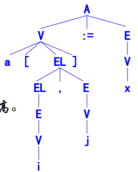

> 引入新的非终结符V,允许为数组元素变量

数组元素引用的语法制导翻译关键是计算出数组的可变部分(需要在分析中同步计算递推公式)
上述文法不适合递推公式的同步计算(自下而上分析中只有EL归约完成后才归约V->id[EL],即已将数组各下表的列表都已规约完成)(dj不知道数组名a)
我们希望逐步递推得到vj
* 修改文法以适应递推公式的同步计算
    ```text
    A → V := E  (1) G4.11
    V → id      (2)
      | EL ]    (3) -- 完成数组元素的分析和对v的计算
    EL→ id [ E  (4) -- 得到数组名,第一维下标,即得到v1
      | EL , E  (5) -- 递归计算第i维的vi
    E → E + E   (6)
      | ( E )   (7)
      | V       (8)
    ```
    修改后的a[i, j]:=x分析树
    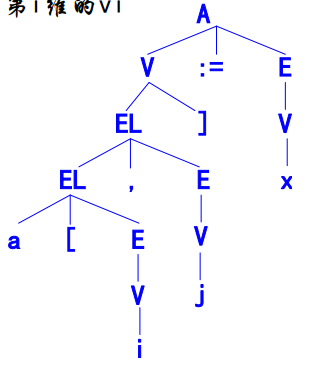
#### 函数和属性
1. 属性`.array`: 数组名在符号表中的入口(数组首地址a).
2. 属性`.dim`: 数组维数计数器,记录当前分析到的维数.
3. 属性.`place`: 
    * 下标列表`EL`: 存放vj=vj-1*dj+ij(j=2,3,..., n)的地址(临时变量)
    * 简单变量`id`: 仍然表示简单变量的地址,
    * 数组元素`id[EL]`: 存放不变部分,一般可以是一个临时变量.
4. 属性`.offset`: 保存数组元素地址中的可变部分,简单变量的offset为空,可记为null.
5. 函数`limit(array, k)`: 计算并返回数组array中第k维成员个数dk.

赋值句的语法制导翻译:
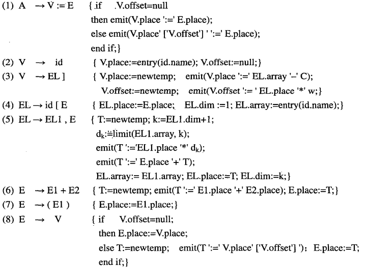

例: 对于数组: arr:array[10,20] of int
赋值句 arr[i+x,j+y]:=m+n 的语法制导翻译(令w=4)
C= c\*w = (c1\*d2+1)\*w = (1\*20+1)\*4 =84
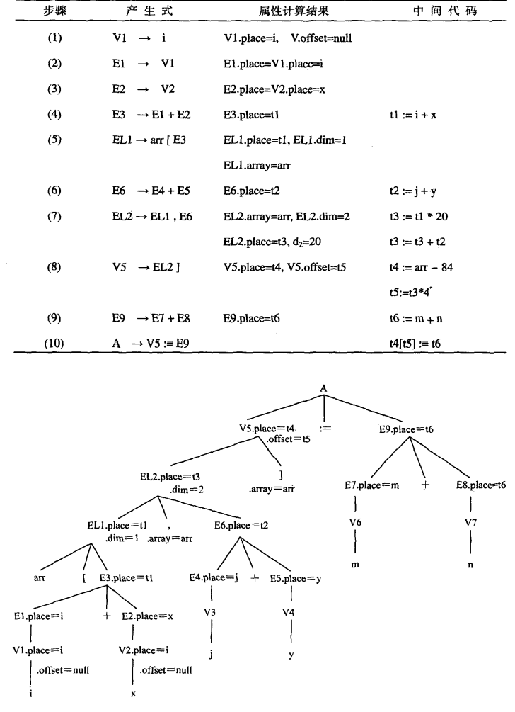

## 布尔表达式
### 作用与结构
* 应用: 
    1. 逻辑运算,如: x:=a or b
    2. 控制语句的控制条件,如if C then ..
* 优先级从高到低: not > and > or
* 结合性: and,or为左结合,not为右结合

例: a*b\<c and x>y or not z
```text
简化的布尔表达式文法
E→ E or E
  | E and E
  | not E
  | (E)         G4.12
  | id relop id
  | id
  | true
  | false
```
### 计算方法
* 数值表示的直接计算
    true=1 false=0
    or and not = + * -
    ```text
    对于关系运算表达式 a<b 的计算翻译成如下三地址码序列
    (101) if a<b goto (104)
    (102) t1 := 0
    (103) goto (105)
    (104) t1 := 1
    (105) ...
    /
    (i) if a relop b goto (i+3)
    (i+1) t1 := 0
    (i+2) goto (i+2+2)
    (i+3) t1 := 1
    (i+4) ...
    ```
* 逻辑表示的短路计算
    短路计算以if-then-else的形式解释布尔表达式
    控制逻辑如下:
    * A or B: if A then true else B
    * A and B: if A then B else false
    * not A: if A then false else true
    ```text
    对布尔表达式 A or B and not C 采用短路计算:
    可翻译为:
    T1 := not C
    T2 := B and T1
    T3 := A or T2
    等价解释为:
    if A
    then true
    else if B
         then if C then false else true
         else false
    ```
> 短路计算的必要性:
对于语句: while ptr<>nil and ptr^.data=x do ...
短路计算可以回避指针为空时对ptr^.data=x的判断,从而避免程序运行时错误

> 短路计算可以用语法/语义规定.如Ada语言提供两组运算
短路计算:  and then, or else
非短路计算:  and, or

### 数值表示的直接计算的语法制导翻译
* 全局量`nextstat`: 指向第一个可用的三地址码序号,每调用一次meit该值+1,初值为1
* 语义规则:
    ```ada
    (1)E→E1 or E2 { E.place := newtemp;
            emit(E.place ':=' E1.place 'or' E2.place);}
    (2) |E1 and E2 { E.place := newtemp;
            emit(E.place ':=' E1.place 'and' E2.place);}
    (3) |not E1{ E.place := newtemp;
            emit(E.place ':=' 'not' E1.place);}
    (4) |(E1) { E.place := E1.place;}
    (5) |id1 relop id2
            { E.place := newtemp;
            emit('if' id1.place relop.op id2.place
                'goto' nextstat+3);
            emit(E.place ':=' '0');
            emit('goto' nextstat+2);
            emit(E.place ':=' '1');
            } 
    (6) |id { E.place:=entry(id.name);}
    (7) |true { E.place:=newtemp; emit(E.place ':=' '1');}
    (8) |false { E.place:=newtemp; emit(E.place ':=' '0');} 
    ```
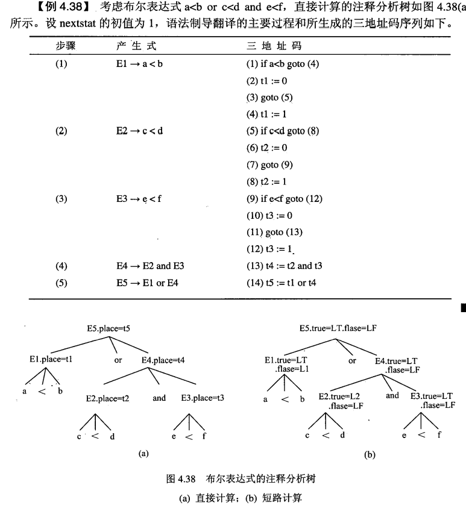

### 短路计算的语法制导定义
* 属性 `.true`: 表达式的真出口,它指向表达式为真时的转向.
* 属性 `.false`: 表达式的假出口,它指向表达式为假时的转向.
* 函数 `newlable`: 与newtemp相似,但它产生的是一个标号而不是一个临时变量

考虑布尔表达式 E→E1 op E2:
* op是 or 
    首先生成计算表达式E1的中间代码,然后在计算表达式E2的中间代码之前设置一个标号E1.false,使得当表达式E1为假时,转而计算表达式E2
* op是 and
    即首先生成计算表达式E1的中间代码,然后在计算表达式E2的中间代码之前设置一个标号E1.true,使得当表达式E1为真时,转而计算表达式E2

语法制导定义
```ada
(1)E→E1 or E2
        { E1.true:= E.true; E1.false:=newlabel;
        E2.true:= E.true; E2.false:=E.false;
        E.code := E1.code||emit(E1.false':')||E2.code;}
(2) |E1 and E2
        { E1.false:= E.false; E1.true:=newlabel;
        E2.false:= E.false; E2.true:=E.true;
        E.code := E1.code||emit(E1.true':')||E2.code;}
(3) |not E1 
        { E1.false:=E.true; E1.true:=E.false;
        E.code := E1.code; }
(4) |(E1) 
        {E1.false:=E.false; E1.true:=E.true;
        E.code := E1.code;}
(5) |id1 relop id2
        { E.code := emit('if'id1.place relop.op id2.place'goto'E.true)
        || emit('goto' E.false);}
(6) |id 
        { E.code := emit('if' id.place 'goto' E.true)
        || emit('goto' E.false);}
(7) |true 
        { E.code := emit('goto' E.true);}
(8) |false 
        { E.code := emit('goto' E.false);}
```

* 例: 再考虑式a<b or c<d and e<f 的短路计算(注释分析图如上)
    设整个表达式(E5)的真假出口为LT,LF,newlable生成的标号可以是L1,L2,...
    最终的三地址码序列为:
    ```ada
        if a<b goto LT
        goto L2
    L2: if c<d goto L1
        goto LF
    L1: if e<f goto LT
        goto LF
    ```

* 语法制导定义未解决的两个问题(需要翻译方案解决)
    * 如何实现表达式的真、假出口
    * 如何在语法分析的同时正确生成三地址码序列,即所有的转向均可确定
    > 即: 设计一种什么样的翻译方案,使得仅对分析树进行一次遍历即可生成所需的中间代码序列.
### 拉链与回填
解决上述问题
* 基本思想: 当三地址码中的转向不确定时,将所有转向同一地址的三地址码拉成一个链,一旦所转向的地址被确定,则为此链上的所有三地址码中回填入此地址
* 属性 `.tc`: 真出口链,链接所有转向同一真出口的三地址码
* 属性 `.fc`: 假出口链,链接所有转向同一假出口的三地址码
* 函数 `mkchain(i)`: 为序号是i的三地址码构造一个新链,且返回指向该链的指针;
* 函数 `merge(P1,P2)`: 合并链P1和P2,且P2成为合并后的链头,并返回链头指针;
* 过程 `backpatch(P,i)`: 向P链中所有三地址码均回填出口地址为值 i.
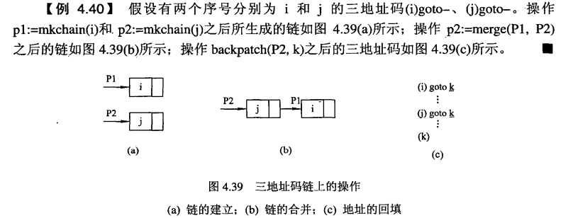

修改的翻译方案:
* 修改文法: 增加M产生式(以适应LR分析)
    > 为了再产生式右部的中间位置加入语义规则,引入一个非终结符
* M的属性`.stat`: 记录当前第一个可用的三地址码序号
    ```ada
    (1)M→ε 
            {M.stat:=nextstat;}
    (2)E→E1 or M E2
            {backpatch(E1.fc, M.stat);
            E.tc:=merge(E1.tc, E2.tc); 
            E.fc:=E2.fc;} 
    (3) |E1 and M E2
            {backpatch(E1.fc, M.stat);
            E.tc:=merge(E1.tc, E2.tc); 
            E.fc:=E2.fc;}
    (4) |not E1
            {E.tc:=E1.fc; E.fc:=E1.tc;}
    (5) |(E1) 
            {E.tc:=E1.tc; E.fc:=E1.fc;}
    (6) |id1 relop id2
            {E.tc:=mkchain(nextstat); 
            E.fc:=mkchain(nextstat+1);
            emit('if' id1.place relop.op id2.place 'goto -');
            emit('goto -');} 
    (7) |id { E.tc:=mkchain(nextstat);
            E.fc:=mkchain(nextstat+1);
            emit('if' id.place 'goto -');
            emit('goto -'); }
    (8) |true 
            {E.tc:=mkchain(nextstat); emit('goto -');}
    (9) |false
            {E.fc:=mkchain(nextstat); emit('goto -');}
    ```
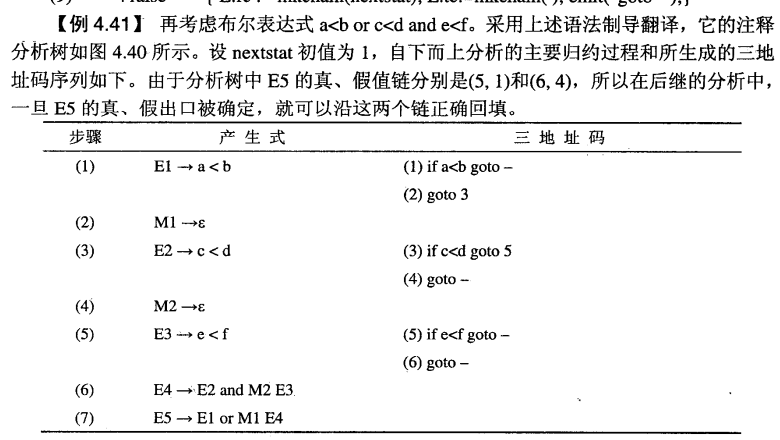
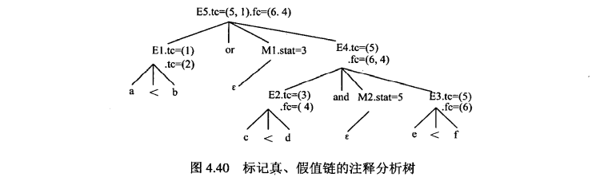

## 控制语句
四类控制语句: 
* 无条件转移: 
    >goto L（转向标号L 所指示位置）
    exit、break（退出某个范围）
* 条件转移:  
    >if 布尔表达式 then … else …
    while 布尔表达式 do { … }
* 循环:  
    >for_loop: 有下界、上界、循环步长
* 分支:  
    >switch/case: 根据不同的取值执行不同的分支
>循环、分支 可等价为: 
无条件转移/条件转移 + 布尔表达式（关系表达式）
本节仅讨论前2种语句的翻译.
* 条件转移/无条件转移语句基于的文法: G4.14
    ```text
    S→ id:S                 (1) // 带标号的语句
     | goto id              (2) // goto语句
     | if E then S          (3)
     | if E then S else S   (4)     G4.14
     | while E do S         (5) 
     | A                    (6) // 赋值语句
     | begin L end          (7) // 组合语句
    L→ L;S                  (8) // 语句序列
     | S                    (9)
    ```
### 标号与无条件转移
* 无条件转移的两个要素: 标号所标记的位置、goto所转向的标号
    >起标记位置作用的标号被称为标号的**定义出现**;
    用于goto转向的标号被称为标号的**引用出现**
* 作用域规定: 在一定的作用域内,一个标号仅允许定义一次,而可以引用多次
* 用符号表存放标号信息: 对于标号定义,将有关信息填写进符号表中;对于标号引用,根据符号表中的信息生成三地址码的正确转向
    > 但在很多情况下标号的引用先于标号的定义.解决的方法是借助于符号表的拉链与回填
* 符号表中标号的信息域
    * `.type`: 记录标识符的种类,如‘标号’、‘未知’;
    * `.def`:  若type是标号,记录是否已定义: ‘未定义’、‘已定义’
    * `.addr`: 遇到标号定义时保存此标号对应三地址码的序号,遇到标号定义前保存链头
    * 过程`fill(entry(id.name), t, b, d)`: 将t, b, d分别填写到符号表中标识符id的.type、.def、.addr域中
    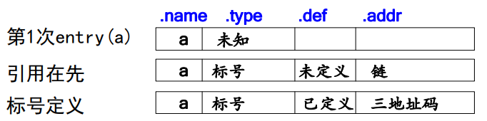
* 生成转移语句三地址码序列的翻译方案
    ```ada
    (1)S→goto id        --标号引用
        { if entry(id.name).type='未知' -- 标识符第一次出现
          then fill(entry(id.name),'标号', '未定义', nextstat);
               emit('goto -'); -- ↑尚未定义,拉链
          else if entry(id.name).type ='标号' -- 已出现且是标号
               then emit('goto', entry(id).addr);
                    if entry(id.name).def=‘未定义’ -- 尚未定义,↓拉链
                    then fill(entry(id.name),'标号','未定义',nextstat-1);
                    end if;
               else error; -- 标识符已出现且类型不是标号,出错
               end if;
          end if;
        }
    (2)S →LAB S1 { -- 略（根据S1是何种语句,进行相应的翻译）}
    (3) LAB→id:     --标号定义
        { if entry(id.name).type='未知' -- 标识符第一次出现
          then fill(entry(id.name), '标号', '已定义', nextstat);
          else if entry(id.name).type='标号' and entry(id.name).def='未定义' -- 还未定义出现
               then q:=entry(id.name).addr; 
                    fill(entry(id.name), '标号', '已定义', nextstat);
                    backpatch(q, nextstat);
               else error; -- 其它情况均出错
               end if;
          end if;
        }
    ```
    > 所用标号还未定义是,将所有被引用相同标号的三地址码序号进行拉链,链头放在符号表的.addr中
    此标号定义出现则将出现时的三地址码回填
### 条件转移
* 条件转移的三种结构的语法形式:
    ```ada
    S→ if E then S          (3)
     | if E then S else S   (4)
     | while E do S         (5)
    ```
* 属性`.begin`: 语句S开始的三地址码序号
* 属性`.next`:  语句S结束后的三地址码序号
* 已有属性: `.true` `.false` `.code`
* 语法制导定义:
    ```ada
    (3) S→if E then S1
            {
                E.true:=newlabel; E.false:=S.next;
                                  S1.next:=S.next;
                S.code:=E.code||emit(E.true ':')||S1.code;
            }
        //三地址码结构: 
        E.code
        E.true: S1.code
        E.false: ...

    (4) S→if E then S1 else S2
            {
            E.true :=newlabel; E.false:=newlabel;
            S1.next:=S.next;
            S2.next:=S.next;
            S.code := E.code 
                || emit(E.true ':') || S1.code
                || emit('goto' S.next)
                || emit(E.false ':') || S2.code;
            }
        //三地址码结构: 
        E.code
        E.true: S1.code
        goto S.next
        E.false: S2.code
        S.next: ...

    (5) S→while E do S1
            {
            S.begin := newlabel; E.true := newlabel;
            E.false := S.next; S1.next := S.begin;
            S.code := emit(S.begin ':') || E.code
                || emit(E.true ':') || S1.code 
                || emit('goto' S.begin)
                || emit(E.false ':');
            }
        //三地址码结构: 
        S.begin: E.code
        E.true: S1.code
        goto S.begin
        E.false: ...
    ```
#### 控制流与翻译方案
问题: 不同的语句序列结束后,如何使控制转向语句的结束
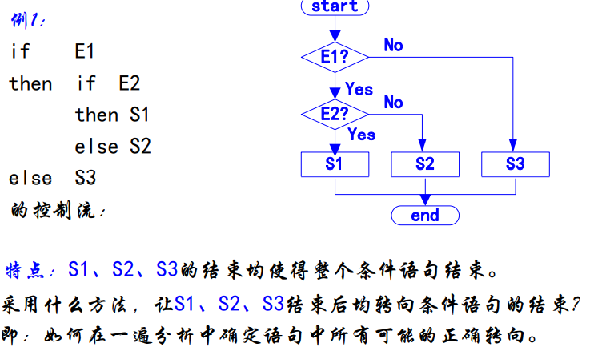

若干语句具有相同的出口时需要设置一个链,将所有转向相同出口的三地址码链起来,通过拉链与回填处理
* 已有属性`.tc` `.fc`: 布尔表达式的真、假出口链
* 属性`.nc`: 语句结束后的转向.未确定时拉链,确定后回填
* 语义规则:
    ```ada
    (1)M→ε 
        {M.stat:=nextstat;}
    (2)S→if E then M S1
        {backpatch(E.tc,M.stat);S.nc:= merge(E.fc,S1.nc);}
    (3)N→ε
        {N.nc:= mkchain(nextstat); emit('goto -');}
    (4)S→if E then M1 S1 N else M2 S2
        {backpatch(E.tc,M1.stat); backpatch(E.fc,M2.stat);
        S.nc:=merge(S1.nc,merge(N.nc,S2.nc));} 
    (5)S→while M1 E do M2 S1
        {backpatch(S1.nc,M1.stat); backpatch(E.tc,M2.stat); 
        S.nc:=E.fc; emit('goto' M1.stat);                } 
    (6)S→A
        {S.nc := mkchain();  // 空链 } 
    ```
    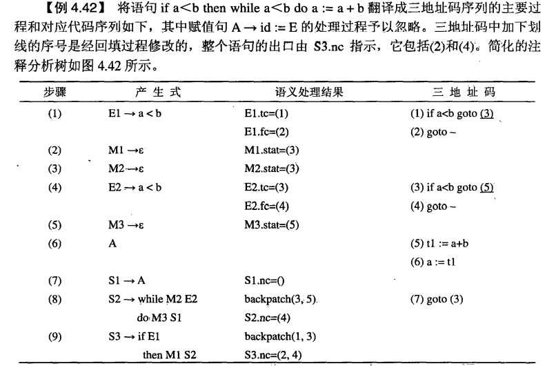
    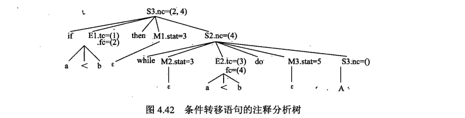
