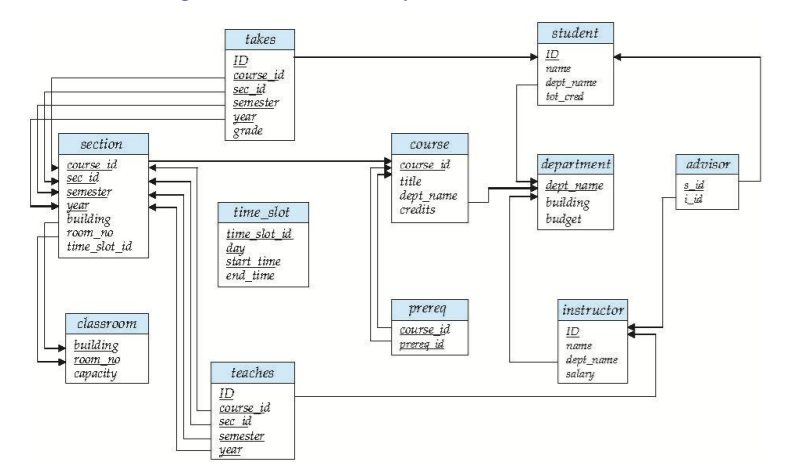
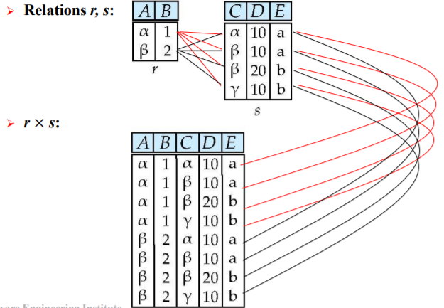
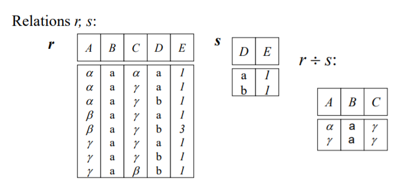

关系数据库(relational model)
[TOC]

> 这里讨论的数据库模式,关系模式(relation schema)是类似于类的概念而不是实例
# 结构
* 表
* 联系: 表中的每行都代表了一组值之间的联系,表是关系的集合
* 元组(tuple): 一组值的序列(列表)
> 关系-表,元组-行,属性-列
* 域(domain): 定义域
    > 原子的域: 域中元素不可再分
* 空(null):

# 码
## 超码(superkey)/主码(primary key)
一个或多个属性,组合可以在一个关系中唯一的标识一个元组 
>候选码(candidate key): 最小的超码
主码:选中的主要用来区分的候选码
## 外码(foreign key)
关系模式r1在属性中包含r2的主码,则这个属性在r1称作参照r2的外码
>r1称作外码的参照关系(referencing relation)
r2称作外码的被参照关系(referenced relation)

# 模式图
含有主码和外码依赖的数据库模式可以用模式图来表示

> 下划线标注主码,箭头标注外码
模式图中没有表示出参照完整性约束

# 关系查询语言(Relational Query Languages)
用户从数据库中请求获取信息的语言
* 过程化语言(Procedural language): 
用户指导数据库操作
* 非过程化语言(nonprocedural language): 
用户只需描述所需信息
* '纯'查询语言: 
过程化的关系代数,非过程化的元组关系运算和域关系演算
    > 关系代数,关系演算(元组关系演算和域关系演算)

select(选择): 
 project(投影): π
 union(并): ∪
 set difference(集合差): –
 Cartesian product(笛卡尔积): ×
 rename: 

# 关系运算
## 选择σ
返回输入关系中满足谓词的行
$σ _{dept\_name=“Physics”}(instructor)$
> 可用∧∨¬, = ≠ >< ≥≤
## 投影π
指定输出的属性,并去除重复元组
$π_{ID, name, salary} (instructor)$
## 并∪
两个输入关系中元组的并
## 集合差-
r-s
>r,s必须同元且属性域相同
## 笛卡尔积×(Cartesian-Product)

## 更名p
$p_x(E)$ 
$p_{x(A1,A2,...,An)}(E)$ 同时更改属性名
## 交
## 自然连接⋈
笛卡尔积后保留所有共有属性相同的行
## 除÷
r÷s
r中独立项记为一个整体,包含s中的所有项的整体

## 外连接
将相应方向的关系中不匹配的元组填充空值后放入自然连接的结果
(左外连接 右外连接 全外连接)