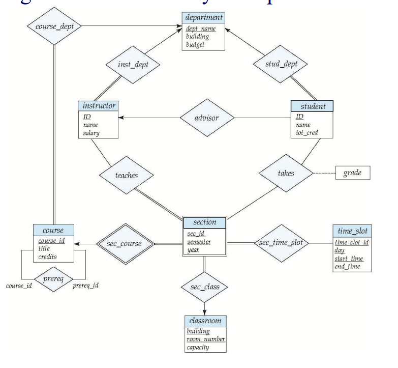
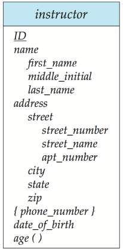
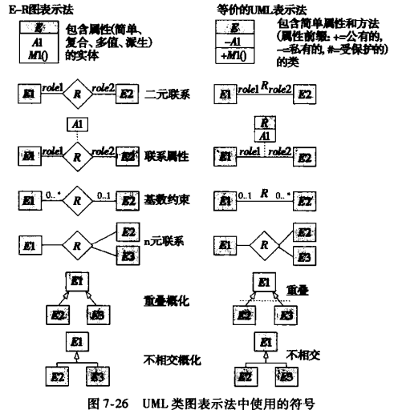

数据库设计和ER模型
[TOC]

# 设计过程
>构建数据库包括设计数据库模式,设计访问和更新数据的程序,设计控制数据访问的安全模式.
本单元关注数据库模式的设计
## 设计阶段
* 未来数据库用户的数据需求
* 选择数据模型,并将需求转化为数据库的概念模式
    > 概念设计阶段(ER模型提供对模式的描述)
* 功能需求规格说明(specification of functional requirements)

抽象数据模型到数据库实现的转换过程:
* 逻辑设计(logical design):将高层概念模式映射到数据库系统的实现数据模型上.
* 物理设计(physical design): 指明数据库的文件结构,索引结构等
## 设计选择
* 实体: 可明确识别的个体
* 关系: 实体之间的联系

# 实体(entity)-联系(relationship)模型
三个基本概念: 实体集 联系集 属性
## 实体集(entity sets)
* 实体: 可区别于所有其他对象的一个对象
    > 实体通过一组属性(实体集中每个成员所拥有的描述性性质)来表示,每个实体在每个属性上都有各自的值
* 实体集: 具有相同性质(属性)的实体集合
## 联系集(relationship sets)
* 联系: 多个实体之间的相互关联
    > 联系也可具有描述性属性(联系的属性)
* 联系集: 相同类型联系的集合
    > 联系集中的一个联系实例必须由其参与实体唯一标识(一组实体只对应联系集中的一个联系,与联系的属性无关)
    相同的实体集可能参与到多于一个联系集中
    * 二元(binary)联系集: 涉及两个实体集的联系集
        > 大部分联系集都是二元的
    * 度(degree): 参与联系集的实体集数目
## 属性(attributes)
域(domain): 属性可取值的集合
* 简单(simple)和复合(composite)属性: 复合属性可划分为更小的部分(名字分为姓名)
* 单值(single-valued)和多值(multi-valued)属性: 一个多值属性对应于一组值
* 派生(derived)属性: 值从别的相关属性或实体派生出来

# 约束
## 映射基数(Mapping Cardinality)
表示一个实体通过一个联系集能关联的实体的个数
>对于实体集A和B间的二元联系集来说映射基数只有4种情况:
一对一: A中一个实体至多与B中一个实体相关联
一对多,多对一,多对多

# 删除实体集的冗余属性(Redundant Attributes
)
实体集之间通过联系集联系起来时可能导致不同实体集中的属性冗余,需要删除

# 实体-联系图(E-R diagram)
图形化表示数据库的全局逻辑结构

构件 | 含义
-|-
分割矩形 | 实体集和属性
菱形 | 联系集
未分割矩形 | 联系集属性
线段 | 实体集连接到联系集
虚线 | 联系集属性连接到联系集
双线 | 实体在联系集中的参与度
双菱形 | 连接到弱实体集的标志性联系集
## 角色(role)
在菱形和分割矩形间的连线上标注来表示角色
## 映射基数(Cardinality Constraints)
实体集A,B之间的联系集可以是一对一,一对多,多对一,多对多的
一带箭头,一对多则多指向一
## 复杂属性
表示复合属性

## 弱实体集(Weak Entity Sets)
实体集的所有属性都不足以形成主码
* 存在依赖于标识实体集: 弱实体集必须与另一个称作标识或属主实体集的实体集关联才有意义
* 分辨符: 属性的集合来唯一标识
* 弱实体集的主码: 标识实体集的主码加上分辨符组成

# ER转换为关系模式

# ER设计问题
## 实体集 or 属性
将实体集的主码作为另一个实体集的属性是不对的,应该通过联系集(隐含了这些主码属性)
## 实体集 or 联系集
## 二元 or n元联系集

# UML

