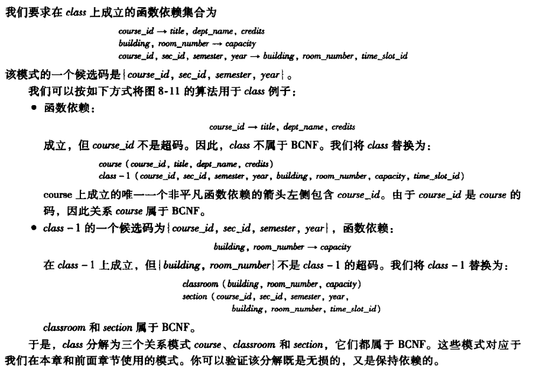

关系数据库设计

<!-- @import "[TOC]" {cmd="toc" depthFrom=1 depthTo=6 orderedList=false} -->

<!-- code_chunk_output -->

- [原子域和第一范式](#原子域和第一范式)
- [使用函数依赖进行分解](#使用函数依赖进行分解)
  - [字母表示](#字母表示)
  - [函数依赖(Functional dependence)](#函数依赖functional-dependence)
  - [2NF](#2nf)
  - [第三范式(3NF)](#第三范式3nf)
  - [Boyce-Codd范式(BCNF)](#boyce-codd范式bcnf)
- [函数依赖理论](#函数依赖理论)
  - [函数依赖集的闭包(Closure)](#函数依赖集的闭包closure)
  - [属性集的闭包](#属性集的闭包)
  - [正则覆盖(Canonical Cover)](#正则覆盖canonical-cover)
  - [无损分解(Lossless-join Decomposition)](#无损分解lossless-join-decomposition)
  - [保持依赖(Dependency Preservation)](#保持依赖dependency-preservation)
- [分解算法(Decomposition Algorithm)](#分解算法decomposition-algorithm)
  - [BCNF分解](#bcnf分解)
    - [BCNF简化判定方法](#bcnf简化判定方法)
    - [BCNF分解算法](#bcnf分解算法)
  - [3NF分解](#3nf分解)
- [多值依赖(MVDs: Multivalued Dependencies)](#多值依赖mvds-multivalued-dependencies)
- [第四范式(4NF)](#第四范式4nf)
  - [4NF分解](#4nf分解)

<!-- /code_chunk_output -->

> 关系数据库设计的目标是生成一组关系模式,减少冗余方便获取信息,这是通过设计满足适当范式的模式实现的.

# 原子域和第一范式
* 域是原子的: 该域的元素被认为是不可再分的单元
* 第一范式(1NF): 该关系模式的所有属性的域都是原子的

# 使用函数依赖进行分解
## 字母表示
* α,β -- 属性集
* r(R) -- 关系模式
    > 关系模式是属性集,但并非所有属性集都是关系模式
* F -- 函数依赖集
* K -- 属性集是一个超码
    > 可以唯一标识关系中一条元组的一个或多个属性的集合
## 函数依赖(Functional dependence)
函数依赖让我们可以表达唯一标识某些属性的值的约束
>
>K->R在r(R)上成立,则K是r(R)的一个超码(任意元组t1,t2,凡是t1[K]=t2[K],总有t1=t2,则K是一个超码)
* 平凡(trivial)的函数依赖: 在所有关系中都满足
    > 如A->A
* F集合的**闭包**$F^+$: F中所有的函数依赖
## 2NF
> 消去非主属性对主键的部分函数依赖
消除所有基于函数依赖能发现的冗余
* 第二范式(2NF): 每个表必须有主键,其他数据元素与主键一一对应。通常称这种关系为函数依赖(Functional dependence)关系
    >非主属性必须完全依赖于主键(不能存在仅依赖主关键字一部分的属性)
    如(学号, 课程名称) → (姓名, 年龄, 成绩, 学分)中:
    主键为:(学号, 课程名称)
    而函数依赖关系为:
    (课程名称) → (学分)
    (学号) → (姓名, 年龄)
    不符合2NF
    /
    修改为符合2NF的:
    学生：Student(学号, 姓名, 年龄)；
    课程：Course(课程名称, 学分)；
    选课关系：SelectCourse(学号, 课程名称, 成绩);

## 第三范式(3NF)
> 消除非主属性对主键的传递依赖
BCNF函数依赖的保持在计算上很困难,不是保持依赖的,因此设计3NF,弱但保持依赖
* 第三范式: 
    > 对$F^+$中所有形如α->β的函数依赖,下面至少一项成立:
    α->β是一个平凡的函数依赖(β是α的子集)
    α是R的一个超码(前两条同BCNF)
    β-α的每个属性A都包含于R的一个候选码中
    >> 候选码:最小的超码

    >消除**传递依赖**(指的是如果存在"A → B → C"的决定关系，则C传递函数依赖于A)
    如Student(学号, 姓名, 年龄, 所在学院, 学院地点, 学院电话)
    主键为("学号"),符合2NF
    但不符合3NF: (学号) → (所在学院) → (学院地点, 学院电话)
    /
    改为:
    学生：(学号, 姓名, 年龄, 所在学院)；
    学院：(学院, 地点, 电话)。

## Boyce-Codd范式(BCNF)
>消除主键对主键的传递依赖
*  BCNF: 
    >对$F^+$中所有形如α->β的函数依赖,下面至少一项成立:
    α->β是平凡的函数依赖(β是α的子集)
    α是R的一个超码

    >在第三范式的基础上，数据库表中不存在任何字段对任一候选关键字段的传递函数依赖
    如:StorehouseManage(仓库ID, 存储物品ID, 管理员ID, 数量)一个管理员只在一个仓库工作；一个仓库可以存储多种物品
    有如下决定关系:
    (仓库ID, 存储物品ID) →(管理员ID, 数量)
    (管理员ID, 存储物品ID) → (仓库ID, 数量)
    所以，(仓库ID, 存储物品ID)和(管理员ID, 存储物品ID)都是StorehouseManage的候选关键字，表中的唯一非关键字段为数量，它是符合第三范式的
    但存在:
    (仓库ID) → (管理员ID)
    (管理员ID) → (仓库ID)
    关键字段决定关键字段,不符合BCNF
    /
    改进为:
    (仓库ID, 管理员ID)
    (仓库ID, 存储物品ID, 数量)
# 函数依赖理论
## 函数依赖集的闭包(Closure)
* F集合的闭包$F^+$: F中所有的函数依赖
    > 大F的闭包计算过程很长,可用以下规则找出所有给定F的所有$F^+$
    * Armstrong公理:
        
    找出的规则为:
        
    总结的$F^+$算法:
        
## 属性集的闭包
`α->B`属性B被α函数确定(functionally determine)
> 如何判断α是否为超码:
必须得出被α函数确定的属性集,即$F^+$中所有左半部为α的函数依赖

$α^+$: F下被α函数确定的所有属性的集合
算法为:

* 超码: $α^+$包含R中所有属性即α是超码
* 函数依赖: $α^+$包含β则α->β
* 计算$F^+$: 对任意α属于R找出闭包$α^+$,对任意S属于$α^+$则有函数依赖α->S
## 正则覆盖(Canonical Cover)
* 无关属性(Extraneous Attributes): 去除函数依赖中的一个属性不改变该函数依赖集的闭包
    
    * 检验无关属性:
        

* 正则覆盖(canonical cover):
    $F_c$是一个依赖集,F与$F_c$相互逻辑蕴含对方中的所有依赖,且:
    * $F_c$中所有函数依赖不含无关属性
    * $F_c$中函数依赖的左半部都唯一
        
        
        > 正则覆盖未必唯一

        >F的正则覆盖$F_c$与F具有相同的闭包,即验证是否满足$F_c$=验证是否满足F
        但$F_c$是最小的(不包含无关属性,合并了所有相同左半部的函数依赖),因此验证$F_c$更容易

## 无损分解(Lossless-join Decomposition)

* 如何判断无损分解:
    
## 保持依赖(Dependency Preservation)
使用函数依赖理论保持依赖
* 限定(restriction):$R_1$,$R_1$,...,$R_n$为R的一个分解,F在$R_i$上的限定$F_i$是$F^+$中所有只包含$R_i$中属性的函数依赖的集合
    
* 保持依赖: 
    
    验证保持依赖:
    
    无损分解&保持依赖例子:
    

# 分解算法(Decomposition Algorithm)
将不好的关系模式分解为好的模式
* 必须无损分解
* 尽量保持依赖
## BCNF分解
BCNF定义可直接用于检查一个关系是否属于BCNF,但$F^+$难以计算
### BCNF简化判定方法
* 非平凡函数依赖α->β是否属于BCNF: 计算$α^+$是否包含R中所有属性(α是否是R的超码)
* 关系模式R是否属于BCNF: 仅需检查给定集合F中所有函数依赖是否违反BCNF
    
### BCNF分解算法
关系模式分解的一般方法以满足BCNF
将不满足BCNF的R分解为一组BCNF模式R1..Rn
利用违反BCNF的依赖进行分解

> 将函数依赖中的属性作为一个新的关系模式,在原模式中删去包含的非超码属性,循环直至所有模式满足BCNF

## 3NF分解 

# 多值依赖(MVDs: Multivalued Dependencies)

-| α | β | R-α-β
-|-|-|-
t1 | x | y1|z1
t2 |x|y2|z2
t3|x|y1|z2
t4|x|y2|z1
两个元组t1,t2,α相同,交换他们R-α-β上的值产生的新元组也在关系中,这样α->->β
>平凡的多值依赖: R上所有关系都满足α->->β(β是α的子集或两者交为R)

> 规律
若α->β,则α->->β
若α->->β,则α->->R-α-β

# 第四范式(4NF)
>函数依赖和多值依赖集为D的关系模式r(R):
对$D^+$中所有形如α->->β的多值依赖,至少以下之一成立:
α->->β是一个平凡的多值依赖
α是R的一个超码
## 4NF分解

