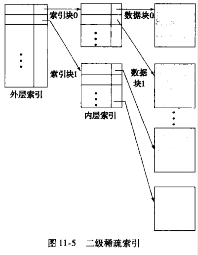
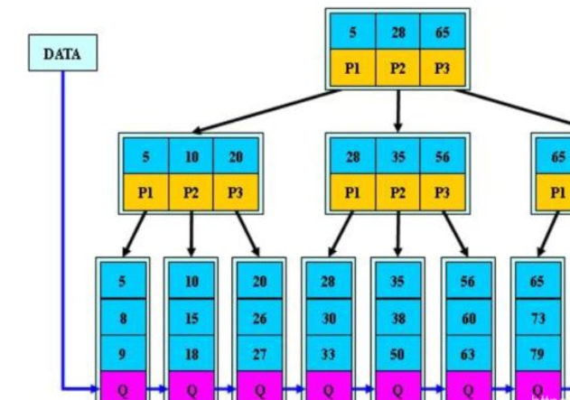
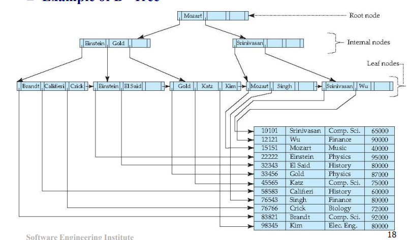
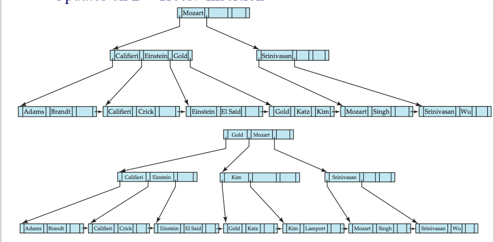
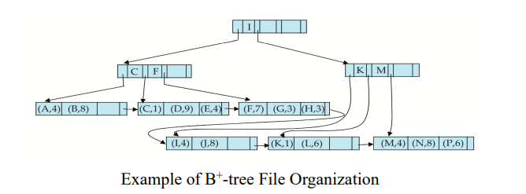
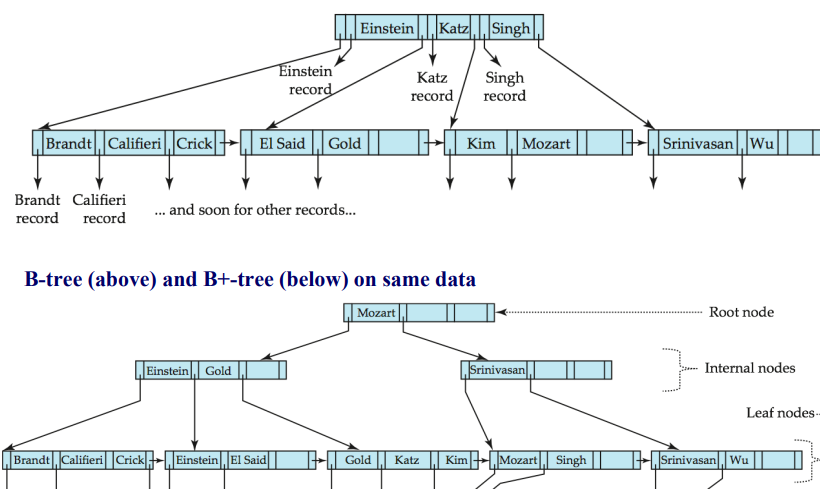

索引与散列

<font face = "Consolas">
<!-- @import "[TOC]" {cmd="toc" depthFrom=1 depthTo=6 orderedList=false} -->

<!-- code_chunk_output -->

- [索引概念](#索引概念)
- [顺序索引(order indices)](#顺序索引order-indices)
  - [稠密索引(dense)和稀疏索引(sparse)](#稠密索引dense和稀疏索引sparse)
  - [多级索引(Multilevel Index)](#多级索引multilevel-index)
  - [索引更新](#索引更新)
- [B+树索引文件](#b树索引文件)
  - [结构](#结构)
  - [更新](#更新)
    - [插入](#插入)
    - [删除](#删除)
    - [不唯一的搜索码](#不唯一的搜索码)
- [B+树扩展](#b树扩展)
  - [B+树文件组织](#b树文件组织)
  - [辅助索引和记录重定位(Record relocation and secondary indices)](#辅助索引和记录重定位record-relocation-and-secondary-indices)
  - [字符串上的索引](#字符串上的索引)
  - [批量加载和自底向上B+树构建(Bulk Loading and Bottom-Up Build)](#批量加载和自底向上b树构建bulk-loading-and-bottom-up-build)
  - [B树索引文件](#b树索引文件-1)
- [多码访问(Multiple-Key Access)](#多码访问multiple-key-access)
  - [多个单码访问](#多个单码访问)
  - [多码索引(Indices on Multiple Keys)](#多码索引indices-on-multiple-keys)
  - [覆盖索引(Covering indices)](#覆盖索引covering-indices)
- [静态散列(Static Hashing)](#静态散列static-hashing)
  - [散列概念](#散列概念)
  - [散列函数](#散列函数)
  - [桶溢出处理](#桶溢出处理)
  - [散列索引(Hashing Indices)](#散列索引hashing-indices)
- [动态散列(Dynamic Hashing)](#动态散列dynamic-hashing)
  - [静态散列的不足之处](#静态散列的不足之处)
  - [数据结构](#数据结构)
    - [可扩充散列(Extendable hashing)](#可扩充散列extendable-hashing)
  - [查询和更新](#查询和更新)
- [顺序查询和散列比较](#顺序查询和散列比较)
- [位图索引(Bitmap Indices)](#位图索引bitmap-indices)
- [SQL中索引定义](#sql中索引定义)

<!-- /code_chunk_output -->

# 索引概念
* **搜索码**(search key): 在文件中查找记录的属性或属性集
* **主索引**(primary index)(**聚集索引**(clustering)): 该文件按照该搜索码排序
* **辅助索引**(secondary index)(**非聚集索引**(nonclustering)): 搜索码指定的顺序和文件中记录的物理顺序不同的索引
* **索引顺序文件**(index-sequential file): 在搜索码上有聚集索引的文件
* **索引项**(index entry)(**索引记录**(record)): 由个搜索码和指向具有该搜索码的一条或多条记录的指针

# 顺序索引(order indices)
## 稠密索引(dense)和稀疏索引(sparse)
* 稠密索引(dense index): 每个搜索码值都有一个索引项
* 稀疏索引(sparse index): 只为搜索码的某些值建立索引项
    > 一块一个索引项(因此辅助索引只能用稠密索引)
    通常比稠密索引慢,用于定位记录
    对于增删消耗较少空间时间资源
>索引有助于搜索记录
但增加修改开销: 修改文件时必须更新文件上每个索引
主索引的顺序扫描好用,但辅助索引的顺序扫描代价太高
## 多级索引(Multilevel Index)
索引文件太大放不进内存时,保存在磁盘上,将主索引视为顺序文件,构造稀疏索引

多级二分查找索引

## 索引更新
增删等操作
稠密索引为顺序哈希表开散列
稀疏索引为块哈希(索引值为当前块中记录的第一条)开散列

# B+树索引文件
> 文件增大顺序索引的性能都会下降,且需定期重组文件
B+在数据修改的情况下仍能保持性能
但B+消耗较多时间空间资源



## 结构


多级索引,包含n-1个搜索码值K,n个指针P(非叶结点指向子节点,叶结点指向数据块),每个结点中搜索码值排序存放(`i<j,Ki<Kj`)
> 为平衡树(根到叶结点每条路径长度相同)
根结点至少有2个子节点
* 叶结点
    * 每个叶结点最多有n-1个值.最少为(n-1)/2
    * Pi指向具有搜索码值Ki的一条文件记录,Pn指向下一个叶结点
* 非叶结点(内部结点(internal node))
    * 所有指针指向树中结点的指针
    * 最多容纳n个指针,最少容纳n/2
    * 指针Pi指向的子树 Ki-1 <= 搜索码值 < Ki
    > 形成叶结点上的多级稀疏索引
```python
#Find record with search-key value V.
1. C=root
2. While C is not a leaf node {
    1. Let i be least value s.t. V <= Ki
    2. If no such exists, set C = last non-null pointer in C
    3. Else { if (V= Ki) Set C = Pi+1 else set C = Pi}(如果允许重复就去掉这行)
    }
3. Let i be least value s.t. Ki = V
4. If there is such a value i, follow pointer Pi to the desired record.
5. Else no record with search-key value k exists.
```

## 更新
记录的修改可视为删除插入
插入过大需要分裂(split),删除过小需要合并(coalesce)
### 插入
在叶结点插入一条新记录(一堆搜索码值和记录指针),再使插入后搜索码依然有序
如果插入后结点过大,就平均分裂,父节点加上分裂后产生的新节点的搜索码值,如果父节点也过大,就继续分裂.如果根结点都分裂了,树的深度增大
> 叶结点分裂可按顺序平分,非叶结点的分裂是本该分裂到第二个结点中的首项放到上一层



### 删除
再叶结点中移除该项,该叶结点中已删除项右边的所有项左移一个位置
* 删除非首项: 直接删除
* 删除首项(搜索码): 将右节点更新到搜索码
* 项过少: 合并,更新搜索码(逐级向上合并)
### 不唯一的搜索码
允许同值出现,影响删除效率
* 添加额外的属性:唯一化属性
    > 额外存储开销,但实现简单.
* 搜索码维护指针桶
    > 额外复杂性,删除成本可能高,空间开销低.

# B+树扩展
## B+树文件组织


* 叶节点存储记录而不是记录指针
    > 记录一般比指针大,所以需要提高空间利用率:通过在分裂和合并重新分布时涉及更多的兄弟节点
    1.插入时节点已满则尝试将其项重新分布到相邻结点中,失败则分裂节点并在相邻中均匀分配,最终每个节点至少有2n/3项
    2.删除时如节点项数少于2n/3就试图从相邻节点中平均一下
* 树中相邻叶节点可能分布在磁盘中不同位置,随着增删顺序性逐渐丢失,可能需要重建系统
## 辅助索引和记录重定位(Record relocation and secondary indices)
>一些文件组织可能改变记录的位置,这样的话所有相关的指针的辅助索引都必须更新,操作代价很高
所以辅助索引中不存储指针而存储主索引搜索码属性的值
这样重定位就不需要更新辅助索引,但定位时需要先用辅助索引找到主索引搜索码的值,然后用主索引找到对应记录.
降低更新代价,但增加了辅助索引访问数据的代价.
## 字符串上的索引
>字符串是变长且不限长度的
使用前缀压缩(Prefix compression)技术,不在非叶节点存储整个搜索码,只存储前缀(足以将这两颗子树中的码值区分开即可)
叶节点中的键可以通过共享公共前缀进行压缩
## 批量加载和自底向上B+树构建(Bulk Loading and Bottom-Up Build)
IO时间太长
* 批量加载: 将大量项一次插入到索引,将插入数据根据搜索码排序文件再插入(减少磁盘寻道时间)
* 自底向上构建:从叶子级自底向上快速自空树构建
## B树索引文件
B树去除搜索码值在非叶节点和叶结点重复出现


> 优点: 使用节点较少;可能在到达叶节点前找到目标;
缺点: 小部分提前找到;非叶节点较大,扇出减少,深度更大;增删复杂;实现难

# 多码访问(Multiple-Key Access)
## 多个单码访问
对某些类型的查询使用多个索引(通过不同的属性查询)
同时检索这多个类型会扫描大量指针但得到很小的结果集,使用位图索引加速.
## 多码索引(Indices on Multiple Keys)
在复合的搜索码上建立和使用索引(连接属性形成搜索码)
## 覆盖索引(Covering indices)
存储附加的属性用于索引

# 静态散列(Static Hashing)
(哈希)
> 顺序文件组织必须访问索引结构来定位数据,导致过多的IO.
散列的文件组织可以避免访问索引结构

## 散列概念
* 桶(bucket): 能存储一条或多条记录的一个存储单位(通常一个磁盘块)
* h: 散列函数(hashing function)
* K: 所有搜索码值的集合
* B: 所有桶地址的集合

>插入: 为了插入搜索之为Ki的记录,计算h(Ki),给出存放该记录的桶的地址,有空间即将记录存储到该桶中
查找: 计算h(Ki),搜索具有该地址的桶,搜索码有相同的散列值则检查桶中每条记录的搜索码值
删除: 计算h(Ki),在相应的桶中查找删除.

## 散列函数
理想的散列函数: 均匀,随机
## 桶溢出处理
桶没有足够的空间,原因有:
* 桶不足
* 桶偏斜(skew): 分配不均,某些桶溢出
> 为了减少溢出可能性,桶数选为`(nr/fr)*(1+d)`
`nr`将要存储的记录总数(记录总数已知为前提),`fr`一个桶能存放的记录数目,`d`避让因子(典型0.2)

但还是有可能桶溢出,用溢出桶(overflow buckets)解决
> 为已满的桶提供一个溢出桶,如又满了就继续提供,得到溢出链
以上为闭地址/闭散列(closed hashing)
开散列(open hashing): 桶集合固定,桶满后寻找其他桶
## 散列索引(Hashing Indices)
将搜索码及其相应的指针组织成散列文件结构
> 严格来说知识一种辅助索引结构

# 动态散列(Dynamic Hashing)
## 静态散列的不足之处
* 固定的桶集合无法应对变大的数据库,导致效率降低或溢出
* 为预增长分配空间则有空间浪费
* 周期性重组耗时且禁止访问

使用动态散列技术允许散列函数动态改变
## 数据结构
### 可扩充散列(Extendable hashing)
通过桶的分裂和合并来适应数据库大小的变化
    每次重组仅作用于一个桶,性能影响较低
> 选择均匀随机的散列函数h,产生值的范围较大,为b(典型32)位二进制
按需建桶,逐位使用
## 查询和更新
> 查询含有搜索码值Kl的桶的位置,系统取得h(Kl)的前i位,查找对应表项,根据表项中指针得到桶的位置
插入kl,则按上过程定位到桶后,如有剩余空间插入该桶,已满则分裂该桶,系统判定是否需增加使用的位数
删除时定位到桶,删除搜索码和文件中记录,如成空桶也许删除,此时可能合并桶,i也可能减少

# 顺序查询和散列比较
* 考虑问题:
    * 重组代价是否可接受
    * 增删相对频率如何
    * 最坏访问和平均访问如何平衡
    * 用户可能提出那些类型查询
* 散列:
    * 优点
        > 性能不会随文件增长降低
          最小空间开销
    * 缺点
        > 查询记录的额外讯息
          同地址本身可能变得非常大
          不能在磁盘上分配大的连续区域
          >> 用B+在桶地址中定位
    * 线性散列
        > 允许目录的增量增长
          但有更多的桶溢出

# 位图索引(Bitmap Indices)
为多码上的简单查询设计
> 为每个属性建立子集的位图,在多码查询时取两位图的与或非

# SQL中索引定义
索引是冗余的数据结构,但对效率,完整性约束十分重要.
`create index <index-name> on <relation-name>(<attribute-list>)`
`drop index <index-name>`
