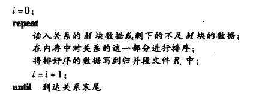

查询处理(query processing)

<!-- @import "[TOC]" {cmd="toc" depthFrom=1 depthTo=6 orderedList=false} -->

<!-- code_chunk_output -->

- [概述](#概述)
- [查询代价的度量(measures of query cost)](#查询代价的度量measures-of-query-cost)
- [选择运算(selection operation)](#选择运算selection-operation)
  - [文件扫描(file scan)](#文件扫描file-scan)
  - [索引扫描(index scan)](#索引扫描index-scan)
  - [涉及比较的选择](#涉及比较的选择)
  - [复杂选择实现](#复杂选择实现)
- [排序(sort)](#排序sort)
  - [外部排序归并算法(External Sort-Merge)](#外部排序归并算法external-sort-merge)
    - [代价分析](#代价分析)
- [连接运算⋈(Join Operation)](#连接运算join-operation)
  - [嵌套循环连接(nested-loop join)](#嵌套循环连接nested-loop-join)
  - [块嵌套循环连接(Block Nested-Loop Join)](#块嵌套循环连接block-nested-loop-join)
  - [索引嵌套循环连接(Indexed Nested-Loop Join)](#索引嵌套循环连接indexed-nested-loop-join)
  - [归并连接(Merge-Join)](#归并连接merge-join)
  - [散列连接(Hash-Join)](#散列连接hash-join)
- [表达式运算(Evaluation of Expressions)](#表达式运算evaluation-of-expressions)
  - [物化(Materialization)](#物化materialization)
  - [流水线(Pipelining)](#流水线pipelining)

<!-- /code_chunk_output -->

# 概述

>  查询->语法分析和翻译->关系代数表达式->优化器->执行计划->执行引擎->查询结果
* 语法分析和翻译: 将查询翻译成系统的内部表达形式并语法分析
* 执行: 执行引擎得到执行计划,执行该计划并返回查询结果

查询语句可通过不同的算法翻译成不同的关系代数运算
* 计算原语(evaluation primitive): 翻译后的关系代数运算
* 查询计算计划(query-evaluation plan): 执行一个查询的原语操作序列

查询优化(query optimization): 系统负责的构造具有最小查询执行代价的查询执行计划
> 本章学习:
如何度量查询成本
计算关系代数运算的算法
如何为单个运算组合算法以计算完整表达式

# 查询代价的度量(measures of query cost)
查询处理的代价: 通过该查询对各种资源的使用情况进行度量
包括: 
**磁盘读取**(主要),用的CPU时间,并行/分布式数据库系统中的通信代价
* 磁盘读取(disk accesses)
    > 大型数据库系统中的主要代价(因为磁盘存取比内存操作速度慢,CPU速度提升比磁盘速度提升快很多)
    包括寻道,读,写时间
    简化起见忽略CPU时间,仅用磁盘存取代价度量查询执行计划的代价
    传输一块平均时间消耗tT秒(典型0.1ms),磁盘块平均访问时间(搜索加旋转延迟)ts秒(典型4ms)
        >> 这里只考虑最坏情况,因响应时间,磁盘状态,计划都是未知的

# 选择运算(selection operation)
文件扫描(file scan)是查询处理中存取数据最低级的操作,是用于定位满足条件的记录的搜索算法

>$t_T$: 传输一块平均时间消耗
$t_s$: 磁盘块平均访问时间(搜索加旋转延迟)秒
$h_i$: B+树高度

## 文件扫描(file scan)
所有的元组都保存在单个文件的关系上:
* A1(线性搜索line search): 扫描测试每一个文件块
## 索引扫描(index scan)
* A2(主索引,码属性等值比较)
* A3(主索引,非码属性等值比较)
* A4(辅助索引,等值比较)

## 涉及比较的选择
* A5(主索引,比较): 选择条件是比较时,可用顺序主索引(从头到头找首个满足条件的)
* A6(辅助索引,比较): 使用有序辅助索引指导涉及比较条件的
## 复杂选择实现
* 合取(conjunctive selection)and
    $σ_{θ1∩θ2∩...∩θn}(r)$
    * A7(利用一个索引)
        > 先判断是否存在简单条件,利用A2-A6检索满足该条件的记录,然后测试每条检索到的记录是否满足其余条件
        代价由所选算法代价给出
    * A8(使用组合索引)
        > 组合索引(composite index):在多个属性上建立的一个索引
        A2-A4
    * A9(通过标识符的交)
        > 对每个索引进行扫描,获取指向满足单个条件的记录的指针,这些指针的交集即为满足合取条件的指针集合
        扫描各个单个索引的代价+交集的代价
* 析取(disjunctive selection)
    $σ_{θ1∪θ2∪...∪θ∪}(r)$
    * A10(通过标识符的并)
        > 每个索引进行扫描,获取指向满足单个条件的记录的指针,这些指针的并集即为满足合取条件的指针集合
* 取反
    $σ_{┐θ}(r)$
    > 使用文件扫描
    如果非很少且θ上有索引,就用索引从文件中找

# 排序(sort)
## 外部排序归并算法(External Sort-Merge)
* 外排序(External sort): 对不能全部放在内存中的关系的排序
> M: 内存缓冲区能容纳的磁盘块数
1. 建立归并段(run),每个归并段内都是排序过的
    
2. 对归并段进行归并假设归并段总数 N < M,就能为每个归并段文件分配一个块,剩下的空间容纳存放结果的一个块
    为N个归并段文件Ri各分配一个内存缓冲块,并分别读入一个数据块
    

### 代价分析
$b_r$: 包含关系r中记录的磁盘块数
$b_b$: 分配给每个归并段的缓冲块数
* 磁盘存取代价: 
    * 一阶段读入每一数据块并写出,2$b_r$
    * 共需归并趟数$log_{M-1}(b_r/M)$,每一趟的数据块读写一次(最后一趟不用写,还可能有轮空),$b_r(2log_{M-1}(b_r/M)+1)$
    * 磁盘搜索代价:
    归并段建立:2$b_r/M$
    归并过程: 每一趟归并有$2b_r/b_b$次磁盘搜索(除了最后一趟)
    $2b_r/M+(b_r/b_b)(2log_{(M/b_b)-1}(b_r/M)-1) $

# 连接运算⋈(Join Operation)
>假定:
student 记录数$n_{student}=5000$ 磁盘块数$b_{student}=100$
takes 记录数$n_{takes}=10000$ 磁盘块数$b_{takes}=400$
## 嵌套循环连接(nested-loop join)
$r⋈_θs$ 计算两个关系r和s的θ连接
算法中有关r的循环包含有关s的循环,因此r称为连接的外层关系(outer relation),s为连接的内层关系(inner relation)

> 最暴力的算法
不要求有索引,且允许任何类型的连接
代价很大

传输次数:
>最坏情况缓冲区只能容纳每个关系的一个数据块,共需$n_r*b_s+b_r$次块传输
   每次扫描内层关系s只需一次磁盘搜索(数据是顺序读取的),读取关系r需要$b_r$次磁盘搜索
   最好情况两个关系都放到内存中,每个数据块只需读一次
   只需$b_r+b_s$次块传输,2次磁盘搜索
>> 考虑student和takes的自然连接
假定student为外层关系: 需检查5000\*10000对元组
最坏情况下块传输 5000\*400+100,磁盘搜索 5000+100
最好情况下块传输 100+400,磁盘搜索 2
假定takes为外层关系
最坏情况下块传输 10000*100+400, 磁盘搜索10000+400
## 块嵌套循环连接(Block Nested-Loop Join)
缓冲区太小而内存不能完全容纳任何一个关系时,以块的方式处理关系

传输代价:
> 最坏情况下,要为r的每个块读取s的所有块,须$b_r*b_s+b_r$次块传输,对r的扫描需要每块一次的磁盘搜索,对n的每一次扫描需要一次磁盘搜索,共$2b_r$次磁盘搜索
最好情况下内存容纳s,须$b_r+b_s$次块传输,两次磁盘搜索(把较小的关系作为内层关系)
## 索引嵌套循环连接(Indexed Nested-Loop Join)
若在内层循环的连接属性上有索引,就可用索引查找替代文件扫描(对r的每个元组,都可利用索引查找s中和其满足连接条件的元组)
代价:
> 最坏情况下,缓冲区只能容纳r的一块和索引的一块
读取r须$b_r$次IO操作(一次块传输一次磁盘搜索)
$b_r(t_T+t_s)+n_r*c$
>> c: 使用连接条件对关系s进行单次选择操作的代价(一般把元组较少的关系作外层关系效果好)
## 归并连接(Merge-Join)
用于计算自然连接和等值连接
代价:
> $b_r+b_s$块传输,$b_r/b_b+b_s/b_b$磁盘搜索+排序代价
## 散列连接(Hash-Join)
用于计算自然连接和等值连接
把两个关系的元组划分成在连接属性值上具有相同散列值的元组集合
//待补充
代价:
> 假定没有散列表溢出,不需递归划分
$3(b_r+b_s)+4n_h(可忽略)$次块传输,$3(b_r/b_b)+(b_s/b_b)+2n_h$次磁盘搜索

# 表达式运算(Evaluation of Expressions)
考虑如何计算包含多个运算的表达式:
* 以适当的顺序每次执行一个操作,每次计算的结果物化到一个临时关系中以备后用.
    > 需要构造临时关系,且必须写到磁盘上(除非很小)
* 流水线上同时计算多个运算,运算结果传递给下一个
## 物化(Materialization)
物化计算(Materialized evaluation): 从表达式的最底层运算开始,将结果存储在临时关系中,在树的高一层中使用这些临时关系来进行计算,循环直到根节点
>代价:
结果在缓冲区积累的代价,写到磁盘上的代价
* 双缓冲(double buffering): 使用2个缓冲区,一个用于连续执行算法,另一个用于写结果
    > 允许CPU和IO活动并行
    我为输出缓冲区分配额外的磁盘块,每次同时写出多个块以减少磁盘搜索次数.
## 流水线(Pipelining)
减少查询执行中产生的临时文件数来提高查询的执行效率。
流水线计算: 将多个关系操作组合成一个操作,其中一个操作的结果传送到下一个操作
* 需求驱动流水线(demand-driven pipeline): 系统不断向流水线顶端的操作发出需要元组的请求,一个操作收到需要元组的请求就计算下一个元组并返回
* 生产者驱动流水线(producer-driven pipeline: 各操作不等待元组请求而是积极产生元组