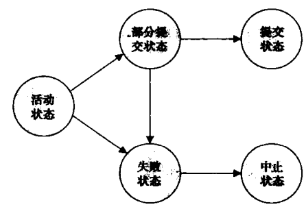
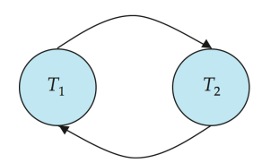

事务

<font face = "Consolas">
<!-- @import "[TOC]" {cmd="toc" depthFrom=1 depthTo=6 orderedList=false} -->

<!-- code_chunk_output -->

- [概念](#概念)
- [简单事务模型](#简单事务模型)
- [事务状态](#事务状态)
- [如何并行事务](#如何并行事务)
  - [调度(schedule)](#调度schedule)
- [可串行化(serializable)](#可串行化serializable)
  - [优先图(precedence graph)](#优先图precedence-graph)
- [隔离性和原子性](#隔离性和原子性)
  - [可恢复调度(Recoverable Schedules)](#可恢复调度recoverable-schedules)
  - [无级联调度(Cascading Schedule):](#无级联调度cascading-schedule)
- [事务隔离性级别](#事务隔离性级别)

<!-- /code_chunk_output -->

# 概念
* 事务(transaction): 构成单一逻辑工作单元的操作集合
    > 事务ACID特性:
    原子性(atomicity): 事务不可分割,如果执行失败就要把影响全部撤销
    隔离性(isolation): 事务不认为他们之间会并发
    持久性(durability): 崩溃后事务的操作也应是持久的
    一致性(consistency): 从一致的数据库状态开始独立运行,结束时数据库也必须是一致的.

# 简单事务模型
* 保证原子性的基本思路: 对于事务要执行写操作的数据项,系统在磁盘上记录其旧值,这个信息记录在日志文件中,如果事务没能完成就从日志恢复旧值
    > 由恢复系统(recovery system)处理
* 保证持久性:
    1. 事务做的更新在事务结束前已写入磁盘
    2. 有关事务已执行的更新信息已写到磁盘上(数据库在系统故障重启后能重新构造更新)
    > 由恢复系统(recovery system)处理
* 隔离性: 串行执行事务,但为了效率,可通过某些方法允许多个事务并发执行
    > 由并发控制系统(concurrency-control system)负责
* 一致性: 程序员负责
# 事务状态
* 活动的(active):初始状态,事务执行时处于这个状态。
* 部分提交的(partially committed):最后一条语句执行后
* 失败的(failed):发现正常的执行不能继续后。
* 中止的(aborted):事务回滚并且数据库已恢复到事务开始执行前的状态后
* 提交的(committed):成功完成后


失败状态的事务必须回滚进入中止状态:
* 重启(restart)事务: 仅当出现硬件错误失败时重启的事务看成是一个新事物
* 杀死(kill)事务: 内部逻辑错误或输入错误

# 如何并行事务
并行事务可以提高吞吐量(throughput)和资源利用率,减少等待时间
并发事务时,可能违背隔离性,导致数据库的一致性被破坏
系统通过并发控制(concurrency-control scheme)保证,现考虑正确的并发执行
## 调度(schedule)
指令在系统中执行的时间顺序
>一组事务的调度必须包含这组事务的全部指令,保持指令在各个事务中出现的顺序
对事务的调度在某种意义上等价于一个串行调度,称为可串行化(serializable)调度

# 可串行化(serializable)
>冲突可串行化:
两条连续指令IJ引用不同的数据项,则交换IJ没有影响
若IJ引用相同的数据项,就有可能造成冲突
* 冲突等价(conflict equivalent): 调度S能通过一系列非冲突指令交换转换成S',则称S和S'冲突等价
* 冲突可串行化(conflict serializable): 调度S与一个串行调度冲突等价
## 优先图(precedence graph)
由G=(V(顶点集),E(边集))组成
* 顶点集由所有参与调度的事务组成
* 边集由满足下列条件之一的边Ti->Tj组成:
    * Tj执行read(Q)前Ti执行write(Q)
    * Tj执行write(Q)前Ti执行read(Q)
    * Tj执行write(Q)前Ti执行write(Q)
    > 有冲突的情况

优先图有环,则调度S是非冲突可串行化的


# 隔离性和原子性
从事务故障恢复的角度讲什么调度是可以接受的
## 可恢复调度(Recoverable Schedules)
* 可恢复调度: 对于每对事务Ti和Tj,如果Tj读取了之前由Ti所写的数据项,则Ti先于Tj提交.
```text
T6       |    T7
read(A)  |
write(A) |  
         |  read(A)
         |  commit
read(B)
* 一个不可恢复的调度
T7依赖于T6,T6在提交前故障就必须中止T7,但T7已提交,不可再中止
```
## 无级联调度(Cascading Schedule):
* 级联回滚(Cascading Rollbacks): 由单个事务故障导致一系列事务回滚的现象
    > 回滚所有的依赖事务

级联回滚导致撤销大量工作,影响效率,希望对调度加以限制,避免级联回滚
* 无级联调度(Cascading Schedule): 对于每位事务Ti和Tj,如果Tj读取了先前由Ti所写的数据项,则Ti必须在Tj这一读操作前提交.

# 事务隔离性级别
SQL标准规定的隔离性级别:
* 可串行化(Serializable): 保证可串行化调度
* 可重复读(Repeatable read): 只允许读取已提交数据,且在一个事务两次读取同一个数据项期间其他事务不得更新该数据
    > 该事务不要求与其他事务可串行化
* 已提交读(Read committed): 只允许读取已提交数据但不要求可重复读
* 未提交读(Read uncommitted): 允许读取未提交数据
>以上所有隔离性级别都不允许脏写(dirty write):  若一个数据项已被另一个未提交或中止的事务写入,则不允许对该数据项执行写操作

> 许多数据库默认隔离性级别是已提交读
SQL显式设置隔离性级别`set transaction isolation level <>`
大部分数据库默认情况下在成功执行后会隐式提交