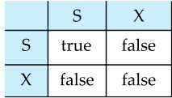
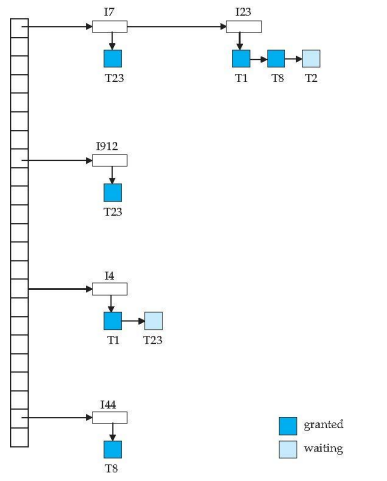
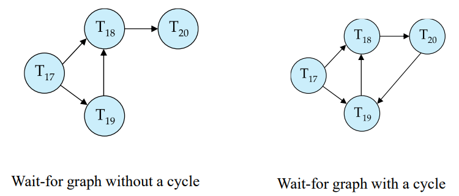
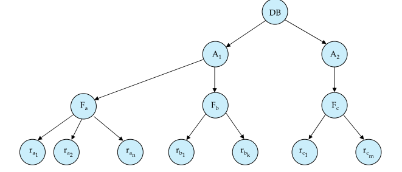
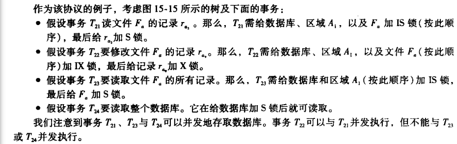

并发控制


<font face = "Consolas">
<!-- @import "[TOC]" {cmd="toc" depthFrom=1 depthTo=6 orderedList=false} -->

<!-- code_chunk_output -->

- [基于锁的协议(Lock-Based Protocols)](#基于锁的协议lock-based-protocols)
  - [锁(lock)](#锁lock)
  - [封锁协议(locking protocol)](#封锁协议locking-protocol)
    - [两阶段协议封锁(Two-Phase Locking Protocol)](#两阶段协议封锁two-phase-locking-protocol)
    - [封锁实现](#封锁实现)
- [死锁处理(deadlock)](#死锁处理deadlock)
  - [死锁预防(deadlock prevention)](#死锁预防deadlock-prevention)
  - [死锁检测(Deadlock Detection)](#死锁检测deadlock-detection)
  - [死锁恢复(Deadlock Recovery)](#死锁恢复deadlock-recovery)
- [多粒度(Multiple Granularity)](#多粒度multiple-granularity)
  - [意向锁(intention lock)](#意向锁intention-lock)
  - [多粒度封锁协议(Multiple Granularity Locking protocol)](#多粒度封锁协议multiple-granularity-locking-protocol)
- [基于时间戳的协议(Timestamp-Based Protocols)](#基于时间戳的协议timestamp-based-protocols)
  - [时间戳(Timestamp)](#时间戳timestamp)
  - [时间戳排序协议(timestamp ordering protocol)](#时间戳排序协议timestamp-ordering-protocol)
  - [Thomas写规则(Thomas’ Write Rule)](#thomas写规则thomas-write-rule)
- [基于有效性检查的协议(Validation-Based Protocol)](#基于有效性检查的协议validation-based-protocol)
- [多版本控制(Multiversion Schemes)](#多版本控制multiversion-schemes)
  - [多版本时间戳排序( Multiversion Timestamp Ordering)](#多版本时间戳排序-multiversion-timestamp-ordering)
  - [多版本两阶段封锁(Multiversion Two-Phase Locking)](#多版本两阶段封锁multiversion-two-phase-locking)
- [快照隔离(Snapshot Isolation)](#快照隔离snapshot-isolation)

<!-- /code_chunk_output -->

> 为了保持事务的隔离性
常用的机制有两阶段封锁和快照隔离

# 基于锁的协议(Lock-Based Protocols)
> 确保隔离性的方法之一: 要求数据项以互斥的方式进行访问
最常用的方法是只允许事务访问当前该事务持有锁的数据项

## 锁(lock)
* 锁(lock): 控制对数据项并发访问的机制
    * 共享的(shared-mode): 可读但不能写
    * 排他的(exclusive-mode): 即可读又可写
    > 每个事务根据对数据项的操作类型申请(request)适当的锁,该事务将请求发送给并发控制管理器,在并发控制管理器授予(grand)所需锁后才能继续其操作.
* 锁相容矩阵(Lock-compatibility matrix)

    >事务Tj在数据项Q上拥有B类型锁,事务Ti请求对Q加A类型锁,若Ti可立即获得锁,则AB类型锁相容(compatible)
    相容的AB锁comp(A,B)为true

指令:
* 申请共享锁: `lock-S(Q)`
* 申请排他锁: `lock-X(Q)`
* 释放锁: `unlock(Q)`

> 在一个事务中,不能太早释放锁,不然在数据一致性上可能会出问题
封锁可能导致死锁
死锁(deadlock)出现时,系统必须回滚两个事务中的一个
>>死锁可通过回滚解决,不一致状态数据库系统不能处理

## 封锁协议(locking protocol)
* 封锁协议: 规定事务何时对数据项进行加锁,解锁,限制调度数目
>`Ti->Tj` Ti先于(precede)Tj,Ti先在Q上持有A型锁,后Tj在Q上持有B型锁,且comp(A,B)=F
这意味在任何等价的串行调度中,Ti必须出现在Tj前

>所有合法的调度为冲突可串行化时,称一个封锁协议是保证(ensure)冲突可串行性
对任何合法调度关联的->关系无环
### 两阶段协议封锁(Two-Phase Locking Protocol)
要求每个事务分两阶段提出加锁和解锁申请
* 增长阶段(Growing Phase): 可获得锁,不可释放
* 缩减阶段(Shrinking Phase): 可释放,不可获得
> 最初事务处于增长阶段,一旦事务释放了锁就进入了缩减阶段 

* 事务的封锁点(lock point): 该事务获得其最后加锁的位置
* 可保证冲突可串行化: 多个事务可通过封锁点进行排序,这个顺序就是事务的可串行化顺序

1. 除了调度可串行化,调度还应无级联
在两阶段封锁协议下级联回滚可能发生
可修改为:
    * 严格两阶段封锁协议(strict Two-Phase Locking Protocol):
    还要求事务持有的所有排他锁在事务提交后才可释放
    * 强两阶段封锁协议(rigorous Two-Phase Locking Protocol):
    要求事务提交之前不能释放任何锁

2. 允许锁转换(lock conversion): 提供将共享锁和排他锁相互转换的机制(upgrade/downgrade)
    > 升级只能在增长阶段,降级只能在缩减阶段

3. 自动加锁解锁(Automatic Acquisition of Locks):
    * Ti进行read(Q)时系统产生lock-S(Q)在此read前
    * Ti进行write(Q)时系统检查Ti是否已在Q上持有共享锁,若有则upgrade加在前,没有则lock-X(Q)加在前
    * 事务提交或中止后释放所有锁

### 封锁实现
锁管理器(lock manager): 一个过程,从事务接受消息并反馈消息
使用锁表(lock table)为已加锁的每个数据项维护一个链表

> 锁请求到达就在相应数据项的链表尾加记录
  数据未加锁就授予,加锁则等待该请求与当前持有锁相容且先前请求都授予锁
  收到解锁请求就删除对应记录,并检查随后的授权
  事务中止删除该事务等待锁的所有请求,系统采取适当动作撤销该事务则该中止事务持有的所有锁被释放
  >> 保证了请求无饿死(starvation),(不可插队)


# 死锁处理(deadlock)
两阶段封锁协议未保证死锁不出现
死锁时系统回滚某些陷于死锁的事务
主要两种方法:
* 死锁预防(deadlock prevention): 保证系统永不死锁
* 允许系统死锁,再用死锁检测(detection)和死锁恢复(recovery)
> 两种方法都可能导致事务回滚
## 死锁预防(deadlock prevention)
* 对加锁请求进行排序或要求同时获得所有锁
    >对所有数据项加一个次序,事务只能按次序规定的顺序封锁数据项 
    要求一次性封锁很困难,需要的所有数据项难以预知,数据的利用率很低

* 每当等待可能导致死锁就进行事务回滚
    * 抢占与事务回滚,Tj可通过回滚事务Ti抢占(preempted)其持有的锁.
        为控制抢占,每个事务赋予唯一的时间戳,系统仅通过时间戳判断等待还是回滚(回滚后依旧保有原时间戳)
        * wait-die: 抢占者老时等待,年轻时直接回滚,后以原先时间戳继续申请
        * wound-wait:抢占者年轻时等待,抢占者老时直接抢占
        > 都存在不必要的回滚
* 锁超时(lock timeout): 申请锁的事务一段时间未得到授予称该事务超时,该事务回滚
    > 实现简单,效果好,但等待时间难以把握,可能出现饿死
## 死锁检测(Deadlock Detection)
等待图(wait-for graph)有向图来描述死锁:
> G=(V(顶点集),E(边集)),顶点集由所有事务组成,边集每一元素为有序对Ti->Tj(事务Ti等待Tj的数据项)
图包含环则存在死锁



## 死锁恢复(Deadlock Recovery)
通常做法为回滚一个或多个事务
1. 选择牺牲者
    > 选择最小回滚代价,但这很难量化,代价包括:
    1.事务已计算多久,还需多久
    2.已使用多少数据项
    3.还需多少数据项
    4.回滚牵涉多少事务
2. 回滚,决定回滚多远
    * 彻底回滚(total rollback):中止该事务
    * 部分回滚(partial rollback): 尽量只回滚到解决死锁处,需要系统维护事务的额外状态信息
3. 饿死
    如果牺牲者总为同一事务就可能发生饿死,必须保证该次数有限(在代价中包含回滚次数)

# 多粒度(Multiple Granularity)
>以上都把数据项作为进行同步执行的单元,但将多个数据项为一组作为一个同步单元更好

需要允许系统定义多级粒度(Granularity)的机制,允许各种大小的数据项并定义数据粒度的层次结构,小粒度数据项嵌套在大粒度数据项中,形成树

> 树中每个节点可单独加锁,加锁的同时该事务以同样类型的锁隐式封锁这个节点的全部后代节点
这样的话加锁时就要检查根节点到目标节点路径上所有节点有无锁或兼不兼容
在节点显式加锁时要给该节点的全部祖先节点加上意向锁(intention lock)

## 意向锁(intention lock) 
意向锁类型:
* 共享型意向锁(intention-shared,`IS`): 在树的较低层进行显式封锁但只加共享锁
* 排他型意向锁(intention-exclusive,`IX`): 在树的较低层进行显式封锁,可加排他锁或共享锁
* 共享排他型意向锁(shared and intention-exclusive,`SIX`): 该节点的子树显式加共享锁,在树的更低层次加排他锁

这些锁类型的相容矩阵:
-|IS|IX|S|SIX|X
-|-|-|-|:-:|-
IS|T|T|T|T|F
IX|T|T|F|F|F
S|T|F|T|F|F
SIX|T|F|F|F|F
X|F|F|F|F|F
## 多粒度封锁协议(Multiple Granularity Locking protocol)
采用这些锁类型保证可串行性,每个事务按如下规则对数据项Q加锁
1. 遵守锁类型相容
2. 首先封锁树的根节点,并且可加任意类型的锁
3. 仅当该事务对当前Q的父节点有IX或IS锁时,可对Q加S,IS锁
4. 仅当该事务对当前Q的父节点有IX或SIX锁时,可对Q加X,SIX,IX锁
5. 仅当该事务未曾对任何节点解锁时,可对节点加锁(事务为两阶段的)
6. 仅当该事务当前不持有Q的子节点的锁时,可对Q解锁
>加锁按自顶向下,解锁按自底向上
例子:

该协议增强了并发性,减少了锁开销,在长短事务混合的应用中很有用

# 基于时间戳的协议(Timestamp-Based Protocols)
另一种决定事务可串行次序的方法:事先选定事务的次序
## 时间戳(Timestamp)
对于每个事务,把一个唯一的固定时间戳和他联系起来,此时间戳记为`TS(Ti)`
> 时间戳在事务开始执行前由数据库系统赋予,按时间先后给(使用系统时钟或计数器)

时间戳决定了串行化顺序
要实现此机制,每个数据项Q需与两个时间戳值相关联:
* `W-timestamp(Q)`: 成功执行write(Q)的所有事务的最大时间戳
* `R-timestamp(Q)`: 成功执行read(Q)的所有事务的最大时间戳
> 在有新的read(Q)或write(Q)执行时更新时间戳
## 时间戳排序协议(timestamp ordering protocol)
保证任何有冲突的read或write操作按时间戳顺序执行
```py
if Ti.read(Q):
    if TS(Ti) < W-timestamp(Q): read被拒绝,Ti回滚(Ti需要读入的Q值已被覆盖)
    else: 执行read, R-timestamp(Q)=TS(Ti)
elif Ti.write(Q):
    if TS(Ti) < R-timestamp(Q): write被拒绝,Ti回滚(Ti错过了该write的时候,后面的已经读了)
    elif TS(Ti) < W-timestamp(Q): write被拒绝,Ti回滚(Ti已经过时了)
    else: 执行write,W-timestamp(Q)=TS(Ti)
```
> 因为发出read/write被回滚的事务会被赋予新的时间戳,重新启动

该协议保证冲突可串行化,无死锁(不存在等待的事务),可能饿死(一系列冲突的短事务引起长事务反复重启,发现事务反复重启就要暂时阻塞与之冲突的事务)
可能产生不可恢复的调度,用以下扩展保证调度可恢复:
* 在事务末尾执行所有的写操作(原子性的写操作(写过程中不可访问))
* 通过受限的封锁形式(对未提交数据项的读被推迟到更新该数据项的事务提交后)
* 跟踪未提交写操作
## Thomas写规则(Thomas’ Write Rule)
修改时间戳排序协议,允许更高程度的并发
>`write(Q)时:elif TS(Ti) < W-timestamp(Q): write被拒绝,Ti回滚`
此回滚不必要,因为新值已被写入,本事务的旧值只会被TS(T)< TS(Ti)的事务请求read,但这些事务也应被回滚,所以这个旧值无需存在,因此改为:
`write(Q)时:elif TS(Ti) < W-timestamp(Q): write被忽略`

通过忽略写,此规则允许非冲突可串行化但正确的调度,满足视图可串行化调度

# 基于有效性检查的协议(Validation-Based Protocol)
在冲突频率低的事务集中采用开销较小的机制
减小开销的困难是事先不知道那些事务将陷入冲突,这需要监控系统的机制
* 有效性检查协议(Validation protocol): 要求每个事务在其生命周期中按两个或三个阶段执行(取决于该事务是只读事务还是更新事务)

    1. 读阶段(read phase): 系统执行Ti,各数据项值被读入并保存在Ti的局部变量中,所有write对局部临时变量进行
    2. 有效性检查阶段(validation phase): 对事务进行有效性测试(下文介绍),判定是否可进行write操作不违反可串行性,若有效性测试失败则中止此事务
    3. 写阶段(write phase): 若事务通过有效性检查,则保存写操作结果的临时局部变量值复制到数据库中(只读事务忽略此阶段)
    > 每个事务都必须按如上顺序经历这些阶段,并发执行的事务可以交叉执行

    我们必须得知事务的各阶段何时进行,现在在什么状态,因此将3个时间戳与事务关联
    * `Start(Ti)`: 开始执行的时间
    * `Validation(Ti)`: 完成读阶段开始其有效性检查的时间
    * `Finish(Ti)`: 完成写阶段的时间
    > 利用时间戳Validation(Ti)的值通过时间戳排序技术决定可串行性顺序
    即值`TS(Ti)=Validation(Ti)`
    >>选择Validation而不是Start为时间戳是因为在冲突频度很低的情况下期望有更快的响应时间
* 有效性测试(validation test): 要求任何满足TS(Ti)< TS(Tj)的事务满足下列条件之一:
    * `Finish(Ti) < Start(Tj)` (Ti在Tj开始前完成)
    * Ti写的数据项集与Tj所读的数据项集不相交,且`Start(Tj) < finish(Ti) < validation(Tj)` (Ti的写阶段在Tj的有效性检查阶段之前完成,保证两者写不重叠)
> 自动预防级联回滚
有效性检查中是乐观的并发控制(optimistic concurrency): 假定事务能够完成执行,最终有效
封锁和时间戳排序是悲观的(检测到冲突即强迫事务等待或回滚)

# 多版本控制(Multiversion Schemes)
以上的并发控制机制停留在延迟,中止操作来保证可串行性,但如果将数据项的旧值拷贝保存在系统中就可以避免这些问题.
* 多版本并发控制(multiversion concurrency control): 每个write(Q)创建Q的一个新版本,事务发出read(Q)时并发控制管理器选择Q的一个版本进行读取(并发控制机制必须保证用于读取的版本的选择能保持可串行性,这有性能考究)
## 多版本时间戳排序( Multiversion Timestamp Ordering)
对每个数据项Q有一个版本序列 <Q1,Q2,...Qn> 与之关联每个版本Qk包含三个数据字段:
* `Content`: Qk版本的值
* `W-timestamp(Q)`: 创建Qk版本的事务的时间戳
* `R-timestamp(Q)`: 所有成功读取Qk版本的事务的最大时间戳
> 事务Ti发出write(Q)操作创建Q的一个新版本Qk,版本的content字段保存Ti写入的值,W-timestamp(Q),R-timestamp(Q)初始化为TS(Ti),每当其他事务Tj读取Qk的值且R-timestamp(Qk)< TS(Tj) 时,R-timestamp更新
* 多版本时间戳排序机制(Multiversion Timestamp Ordering scheme):
假设Ti发出read(Q)或write(Q)操作,令Qk表示Q满足如下条件的版本,其写时间戳是<=TS(Ti)的最大写时间戳
    1. Ti发出read(Q),则返回值是Qk的内容
        > 事务读取最近版本
    2. Ti发出write(Q):
    若TS(Ti) < R-timestamp(Qk),则回滚Ti;
    若TS(Ti) = W-timestamp(Qk),则覆盖Qk内容;
    若TS(Ti) > R-timestamp(Qk),创建Q的一个新版本
        > 当一个事务执行写操作太迟时强迫中止
    3. 删除机制: 若Q的老版本Qk和Qj这两个版本的W-timestamp都 < 系统中最老的事务的时间戳,即Qk和Qj中较旧的版本不会再用到,可以删除
> 读请求从不失败且不必等待
但读取数据项要求更新R-timestamp,产生2次潜在的磁盘访问而不是一次
事务间冲突通过回滚解决,开销很大
不保证可恢复性和无级联性,与基本的时间戳排序机制一样扩充可以避免

## 多版本两阶段封锁(Multiversion Two-Phase Locking)
该协议对只读事务和更新事务加以区分
* 更新事务: 执行强两阶段封锁协议(持有全部锁直到事务结束),数据项每个版本有一个时间戳(一个计数器ts-counter,提交处理时增加计数)
读取一个数据项时获得该项上的共享锁后读取最新版本的值;写时获得该项上的排他锁,为此项创建一个新版本,写操作在新版本上进行,新版本的时间戳最初置为正无穷
提交: Ti将他创建的每一版本的时间戳设置为ts-counter+1;然后将ts-counter加一.同一时间只允许有一个更新事务进行提交
    > 可按提交的次序进行串行化
      Ti增加了ts-counter之后启动的只读事务看到Ti更新的值,增加ts-counter之前启动的只读事务看到Ti更新之前的值:只读事务都不必等待加锁
* 只读事务: 开始执行前,以ts-counter当前值作为该事务的时间戳,在执行读操作时遵从多版本时间戳排序协议(Ti发出read(Q)时返回值是小于TS(Ti)的最大时间戳的版本的内容)
> 保证调度可恢复,无级联
* 版本删除: 类似多版本时间戳排序中采用的方式

# 快照隔离(Snapshot Isolation)
在事务开始执行前给他一份数据库的快照,事务在该快照上操作,与其他并发事务完全隔离.
* 对只读事务来说: 理想,不用等待
* 对更新事务来说: 将更新写入数据库之前必须处理与其他并发更新事务之间存在的潜在冲突
    > 允许事务T提交时T变为提交状态,T对数据库的所有写操作作为一个原子操作执行
    * 先提交者获胜(First-committer-wins): 事务T进入部分提交状态,以下操作作为一个原子操作执行:
        1. 检查是否有并行事务,对于T打算写入的数据该事务是否以更新
        2. 发生1则T中止
        3. 没发生则T提交写入数据库
        > 更新丢失(lost update)预防
        与T并发(concurrent with T)事务: 在从T开始到执行此检查之间的任何时刻该事务是活跃的或部分提交的
    * 先更新者获胜(First-updater-wins): 系统采用仅用于更新操作的锁机制(读不获得锁,不影响),Ti更新时请求该数据项的一个写锁
        * 获得锁:
        若该项已被任何并发事务更新,Ti中止
        否则Ti正常执行
        * 锁已被Tj持有:
        Ti等待直到Tj中止或提交
            * Tj中止:锁释放,Ti获得锁,执行更新检查(如有另一个并发事务更新过该数据项则Ti中止,否则执行)
            * Tj提交: Ti中止
        > 冲突时允许第一个获得锁的事务提交并完成更新,其后的中止(除非第一个更新者被中止)

快照隔离开销低且没有中止(除非并发事务更新同一个数据项)
但不保证可串行化:
```text
Ti: read AB, update B
Tj: read AB, update A
Ti,Tj并发,两者都可提交
//Ti->Tj, Tj->Ti 出现环,非可串行化
```
* 写偏斜(write skew): 一对事务中的每一个都读对方写的数据,但不存在两者同时写的数据
```text
T1: x := y
T2: y := x
```
* 数据库的完整性约束不能在快照层面检查,只能在数据库当前状态下检查约束
* 并发更新事务本身可串行化,但只读事务正好出现
```text
Ti: read B, update B
Tj: read AB, update A
Tk: read AB

Ti start; Tj start;
Ti finish;
TK start; (读取的快照包括Ti的更新)
// Ti->Tk,Tk->Tj 出现环,非可串行化
```