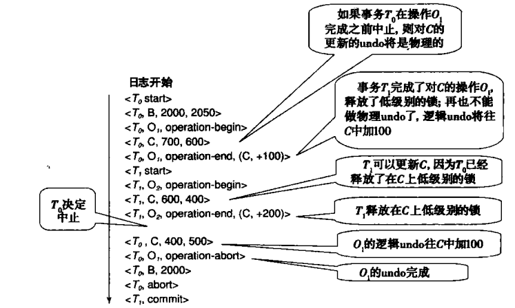
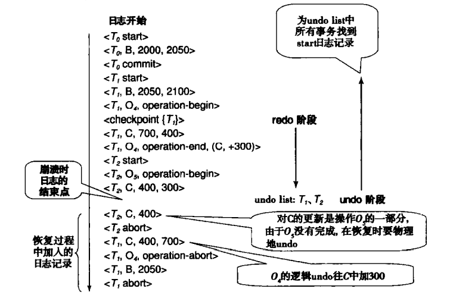

恢复系统

[TOC]
<font face = "Consolas">

# 故障分类
## 事务故障(transaction failure)
* 逻辑错误(logical error): 事务由于内部条件无法继续正常执行(非法输入,找不到数据,溢出,超出资源限制)
* 系统错误(system error): 系统进入不良状态(死锁等),无法继续正常执行(可在以后重新执行)
## 系统崩溃(system crash)
* 故障-停止假设(fail-stop assumption): 硬件故障,数据库软件或操作系统的漏洞导致易失性存储器内容对视,并使得事务处理停止.
## 磁盘故障(disk failure)
数据传输过程中由于磁头损坏或故障造成磁盘块上内容丢失
## 恢复算法
1. 确定用于存储数据的设备的故障方式
2. 考虑这些故障方式对数据库内容的影响
3. 提出故障发生后仍保证数据库一致性以及事务原子性的算法
    * 正常事务处理中采集足够的信息用于故障恢复
    * 故障发生后采取措施,将数据库内容恢复到某个保证数据库一致性.事务原子性和持久性的状态

# 存储器(Storage Structure)
存储介质按速度,容量,顺应故障能力可划分为:
* 易失性存储器(Volatile storage)
* 非易失性存储器(Nonvolatile storage)
* 稳定存储器(Stable storage)
## 稳定存储器实现(Stable-Storage Implementation)
实现稳定存储器需要在多个非易失性存储介质(磁盘等)上以独立的故障模式复制所需信息,以受控的方式更新信息,保证故障不会破坏所需信息

在内存和磁盘间进行块传送有以下可能的结果:
* 成功完成(Successful completion)
* 部分失败(Partial failure): 传送过程中发生故障,目标块有不正确的信息
* 完全失败(Total failure): 故障发生的足够早,目标块完好无缺

系统为每个逻辑数据库块维护备份(镜像磁盘或远程备份),输出操作为:
1. 信息写入第一个物理块
2. 第一次写完成时,相同信息写入第二个物理块
3. 只有第二次写也完成时输出才算完成

写过程中系统发生故障:
1. 对每一个正在写的块检查他们的两个拷贝,相同则没有错误,不同则用一块代替另一块(保证写要不完全成功,要不没有任何改变)
## 数据访问(Data Access)
数据库系统常驻于非易失性存储器,只有部分内容在主存中
数据库分成定长存储单位块(block)
* 物理块(physical block): 位于磁盘上的块
* 缓冲块(buffer block): 临时位于主存的块
* 磁盘缓冲区(disk buffer): 内存中用于临时存放块的区域

从盘和主存之间的块移动由下列操作引发:
1. `input(B)` 传送物理块B到主存
2. `output(B)` 传送缓冲块B至磁盘,并替换磁盘上相应物理块(写回)

每个事务Ti都有私有工作区,用于保存Ti所访问以及更新的所有数据项的拷贝,该工作区在事务初始化时由系统创建,事务提交或终止时由系统删除
将Ti工作区中保存的每一个数据项X记为xi,Ti在其工作区和系统缓冲区之间传送数据,使用下列操作传送数据:
1. `read(X)` 将数据项X的值赋予局部变量xi 
    a. 若X所在块Bx不在主存中,执行input(Bx)
    b. 将缓冲块中X的值赋予xi
2. `write(X)` 将局部变量xi的值赋予缓冲块中的数据项X
    a. 若X所在块Bx不在主存中,执行input(Bx)
    b. 将xi的值赋予缓冲块Bx中的X

缓冲块终将写回磁盘,要么因为内存空间不够,要么数据库系统需要将B的变化反映到磁盘上
* 数据库发output(B)称数据库对缓冲块B进行强制输出(force-output)

事务第一次访问数据项X时必须执行read(X)将X读到局部变量xi,对X的所有更新作用到xi上,在一个事务执行中任何时间点都可以write(X)在数据库中反映X的变化,在对X进行最后的写之后必须write(X).
X所在的缓冲块Bx的output(Bx)不需在write(X)后立刻执行(Bx可能包含其他仍在被访问的数据项),一段时间以后才真正执行输出.
> 若write(X)后output(Bx)前系统崩溃,则丢失X的新值,这个由数据库系统执行额外动作保证不发生

# 恢复与原子性(Recovery and Atomicity)
涉及原子性的磁盘写到一半系统崩溃,系统一致性破坏,无法通过数据库状态找出错误
为保持原子性,必须在修改数据库前先向稳定存储器输出信息描述修改
## 日志记录(Log-Based Recovery)
日志(log)时日志记录(log record)的序列.记录数据库中的所有活动
* 更新日志记录(update log record): 描述一次数据库写,包括以下字段:
    * 事务标识(transaction identifier): 执行write的事务的唯一标识
    * 数据项标识(data-item identifier): 所写数据项的唯一标识(数据项的磁盘位置)
    * 旧值(old value)
    * 新值(new value)
    > 一个更新日志记录表示为 <Ti,Xj,V1,V2>, 标识事务Ti对数据项Xj执行一个写操作,旧值新值分别为V1,V2
* 还有其他类型的日志记录,如事务的开始,提交,中止
    >\<Ti start>事务开始 \<Ti commit>事务提交 \<Ti abort>中止

事务执行写操作时必须在数据库修改前建立该写操作的日志记录加到日志中,就可以正常修改数据库,且支持撤销(通过旧值)
日志必须放在稳定存储器中(开销较高),一直保存所有日志记录的化日志会很大

## 数据库立即修改(Immediate Database Modification)
一般的事务修改数据库步骤:
1. 事务在主存中的私有工作区运算
2. 事务修改主存的磁盘缓冲区中该项的数据块
3. 系统执行output
> 延时修改(deferred-modification): 一个事务直到它提交时都没有修改数据库
立即修改(immediate-modification): 数据库修改在事务仍然活跃是发生
>>延迟修改的代价为事务创建更新过程中所有数据项的本地拷贝,且随时会被其他事务请求而写回

恢复算法支持立即修改,需要考虑:
* 已提交的事务所作的数据库修改停留在缓冲区上,每写回磁盘
* 已修改数据库的活动事务需要中止

但有日志的存在,可以undo,redo
## 事务提交(Transaction Commit)
* 事务提交: 这个事务的commit日志记录(该事务最后一个日志记录)输出到稳定存储器
    > 此时所有更早的日志记录都以输出到稳定存储器中,日志中由足够的信息保证即使系统崩溃也可重做事务的更新
    若在事务在输出commit日志记录前系统崩溃,该事务回滚
## 并发控制和恢复(Concurrency Control and Recovery)
并发事务可能重复修改同个数据项,为了撤销某个事务的影响撤销该数据项时可能也撤销了另一个事务的影响
为避免,恢复算法要求若一个数据项已被一个事务修改了,在该事务提交或终止前不允许其他事务修改此数据项(可通过获得排他锁)
## 使用日志来重做和撤销事务(Undo and Redo Operations)
恢复系统使用2个恢复过程,都利用日志找到每个事务更新过的数据的集合
* redo(Ti): 将Ti更新过的所有数据项的值都更新为新值
    > 系统崩溃恢复中redo次序很重要,大多数恢复算法直接遍历日志redo每个日志记录
* undo(Ti): 将Ti更新过的所有数据项的值都恢复成旧值
    > 不仅恢复旧值,而且作为撤销过程的一部分写日志记录来记录执行的更新(特殊的redo-only日志记录)
    redo完成后写 \<Ti abort>日志记录标明撤销完成(这表明每个已结算的事务最终必须有commit记录或abort记录)

系统判断对那些事务进行重做,撤销:
* 包含 \<Ti start>,但不包括 \<Ti commit> 或 \<Ti abort>则对Ti撤销,undo(Ti)
* 包含 \<Ti start>,以及\<Ti commit> 或 \<Ti abort>,对Ti重做,redo(Ti)
    > 确保修改体现到数据库中
## 检查点(Checkpoints)
故障时不可能检索整个日志(太耗时,且真的需重做的事务只占少部分)
为减少开销引入检查点,一个日志中的时间点
检查点执行过程: 
1. 将当前主存中所有日志记录输出到稳定存储器
2. 将所有修改的缓冲块输出到磁盘
3. 将一个日志记录 \<checkpoint L> 输出到稳定存储器,L为执行检查点时正活跃的事务列表
> 检查点执行过程中不允许事务执行任何更新

系统崩溃时找到日志中最后一条检查点记录:
* 检查点前的事务(commit或abort在检查点记录前),以写入数据库,无需redo
* L中以及L后的事务,没有commit或abort就undo(未完成的直接撤销),有的redo

# 恢复算法(Recovery Algorithm)
给出详细的恢复算法
> 本节的恢复算法要求:
若一个数据项已被一个事务修改了,在该事务提交或终止前不允许其他事务修改此数据项
## 事务回滚
正常(非系统崩溃)的事务回滚:
1. 倒序遍历日志,对每个日志记录 \<Ti,Xj,V1,V2>:
    * 将值V1写入数据项Xj
    * 向日志中写一个特殊的补偿日志记录(compensation log record)(只读) \<Ti,Xj,V1> (V1为本次回滚中Xj恢复成的值)
        >这样的日志记录不需要撤销,也就不需要undo信息
2. 发现 \<Ti start> 就停止倒序遍历,向日志中写 \<Ti abort> 日志记录
## 系统崩溃后恢复(Recovery from failure)
分两阶段进行:
1. 重做阶段: 从最后一个检查点开始正向扫描redo所有事务的更新
将\<Ti,Xj,V1,V2>,\<Ti,Xj,V1> redo
undo list为检查点中或后未abort或commit的事务
2. 撤销阶段: 回滚undo list中所有事务,倒序扫描日志执行回滚
    * 属于undo list中事务的日志记录执行undo
    * 发现undo list中事务Ti的 \<Ti start>,就在日志中写一个 \<Ti abort>,将Ti从undo list中去掉
    * undo list变空.即系统找到list中所有事务的start,撤销阶段结束

# 缓冲区管理
## 日志记录缓冲(Log Record Buffering)
将每个日志记录都输出到稳定存储器开销很大(向稳定存储器的输出一般以块为单位,一个日志记录比一块小很多),最好一次输出多个日志记录
采用日志缓冲区,于主存中缓存日志,对恢复技术加要求保证事务完整性:
* 日志记录 \<Ti commit> 输出到稳定储存器后Ti进入提交状态
* 日志记录 \<Ti commit> 输出到稳定储存器之前与Ti有关的所有日志记录必须已经输出到稳定存储器
* 主存中的数据块输出到数据库前所有与该块中数据相关的日志记录必须已输出到稳定存储器
    > 先写日志(Write Ahead Logging,WAL)规则,严格来讲只需undo信息先写
## 数据库缓冲(Database Buffering)
将修改过的块写回数据库中
* 强制(force)策略: 事务提交时强制将修改过的所有的块都输出到磁盘
* 非强制(no-force)策略: 允许在没有写回时提交
>非强制策略使事务更快提交,有等待时间从而可以一次更新多个块
 本节所有恢复算法在非强制策略下正常工作
* 窃取(steal)策略: 允许事务提交前将修改过的块写回磁盘
* 非窃取策略: 不允许
> 遵守先写日志规则,本节所有恢复算法正常工作
非窃取策略不适合大量更新的事务
* 管理数据库缓冲区:
    1. 数据库系统保留部分主存作为缓冲区,数据库系统自己管理
        > 限制了主存使用的灵活性
    2. 数据库系统在操作系统提供的虚拟内存中实现其缓冲区,但数据库缓冲页仍由数据库系统自己管理
## 模糊检查点(Fuzzy Checkpointing)
上文检查点要求更新检查点时所有更新暂停,若缓冲区页数量很大,完成检查点的时间很长,这中断就不可接受
* 模糊检查点: 允许在checkpoint记录写入日志后,修改过的缓冲块写到磁盘前开始更新
    > 只有写入checkpoint记录之后的页面才输出到磁盘,系统可能在所有页面写完之前崩溃,检查点就可能不完全.
    处理方法:
    将最后一个完全检查点记录在日志中的位置存在磁盘上固定的位置last_checkpoint,系统在写入checkpoint记录时不更新该信息而是写记录前创建所有修改过的缓冲块的列表,只有在列表中所有缓冲块都输出到磁盘上后last_checkpoint才会更新

# 非易失性存储器数据丢失的故障(Failure with Loss of Nonvolatile Storage)
基本方法: 周期性的将整个数据库的内容转储(dump)到稳定存储器中,利用最近一次转储将数据库复原到前面的一致状态,再利用日志将数据库系统恢复到最近的一致状态

* 转储过程中不能有事务处于活跃状态,执行类似于检查点的过程:
    1. 将当前主存中所有日志记录输出到稳定存储器中
    2. 将所有缓冲块输出到磁盘
    3. 将数据库内容拷贝到稳定存储器
    4. 将日志记录 \<dump>输出到稳定寄存器

* 归档转储(archival dump): 数据库内容的转储,将转储归档可用他们查看数据库的旧状态
* SQL转储(SQL dump): 将SQL DDL语句和SQL insert语句写到文件中,可以重执行这些语句以重新创建数据库
> 简单转储开销过大: 拷贝整个数据库到稳定存储器导致大量的数据传送;转储过程中中止事务处理浪费CPU周期
模糊转储(fuzzy dump)对此做出改进

# 锁的提前释放和逻辑undo操作(Recovery with Early Lock Release)
为了提高并发度,允许提前释放锁.这可能导致问题(提前释放中若新事务来了数据项又被更新了,这通过redo不能解决(redo的话新事务的更新就被覆盖了,不正确))
## 逻辑操作(logical operation)
* 逻辑操作: 因为他们提前释放锁,需要逻辑undo操作
* 逻辑undo操作(logical undo operation): 释放了低级别的锁就不能用更新的数据项的旧值对操作进行撤销,而必须通过执行一个补偿操作来撤销
> 操作在执行时获得低级别的锁,操作完成就释放锁;但相应事务必须按两阶段方式保持高级别的锁防止并发事务冲突,但每个事务必须获得在更新的键值上的锁并按两阶段方式持有锁,防止并发冲突

## 逻辑undo日志记录(Logical Undo Logging)
要允许逻辑undo,在执行修改索引的操作之前,事务创建 \<Ti,Qj,operation-begin> 日志记录(ob为该操作实例的唯一标识)
操作结束后写 \<Ti,Qj,operation-end,U>的operation-end日志记录(U为undo信息)
* 逻辑日志(logical logging): 记关于操作的信息的日志
* 物理日志(physical logging): 记关于旧值和新值信息的日志
> 逻辑日志只用于undo,不用于redo(redo用物理日志记录执行)
```text
Example: insert of (key, record-id) pair (K5, RID7) into index I9
<T1, O1, operation-begin>
…                   /
<T1, X, 10, K5>     /Physical redo of steps in insert
<T1, Y, 45, RID7>   /
<T1, O1, operation-end, (delete I9, K5, RID7)>
```
## 有逻辑undo的事务回滚(Transaction Rollback with Logical Undo)


## 有逻辑undo的故障恢复(Failure Recovery with Logical Undo)


# ARIES恢复方法
与前文恢复算法的主要区别:
1. 使用日志序列号(log sequence number,LSN)标识日志记录,将LSN存储在数据库页中标识某数据库页上已实施的操作
2. 支持物理逻辑redo(Physiological redo)
3. 使用脏页表(Dirty page table)减少恢复时不必要的重做(脏页:在内存中已更新但磁盘上未更新的页)
4. 使用模糊检查点机制,只记录脏页信息和相关的信息
## 数据结构//
## 恢复算法
