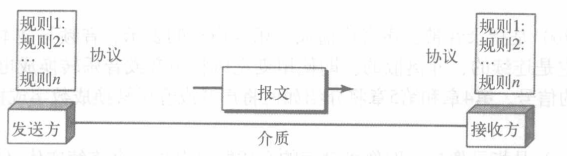
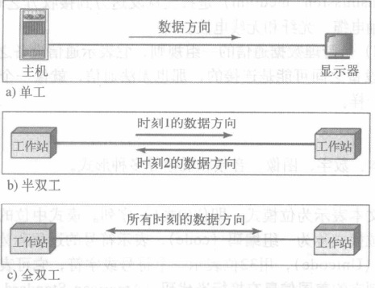
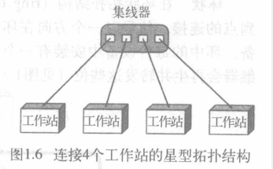
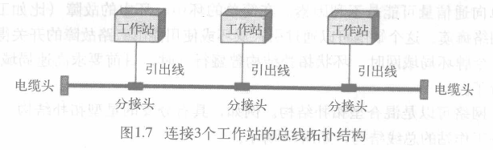
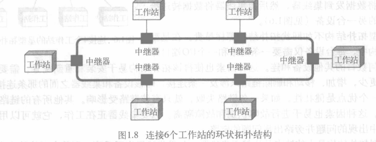

绪论
[TOC]

## 数据通信
* **电信**(telecommunication): 在一定距离上的通信(tele是希腊语,即“远程的”).
* **数据**(data): 指的是以任何格式表示的信息,该格式需要创建和使用数据的双方达成共识.
* **数据通信**(data communication): 是在两台设备之间通过诸如线缆的某种形式的传输介质进行的数据交换
### 数据通信系统的组成部分

* 报文(Message)
* 发送方(Sender),Source
* 接收方(Receiver),Destination
* 传输介质(Transmission Medium)
* 协议(Protocol),管理数据通信的一组规则,表示通信设备之间的一组约定
### 数据表示
* 文本: 位模式,每一种位模式称为一组编码(code),表示符号的过程称为编码过程
* 数字: 位模式,直接转换为二进制数
* 图像: 位模式
* 音频: 连续的,非离散的
* 视频:
### 数据流

* 单工(simplex): 单方向通信
* 半双工(half-duplex): 每台设备均能发送和接收,但不能同时进行
* 全双工(full-duplex): 双方能同时发送和接收

## 网络
* **网络**(network): 是用通信链路连接起来的设备(通常称为**节点**)的集合
### 分布式处理(distributed processing)
将任务划分给多台计算机
### 网络准则(Network Criteria)
* 性能: 可用多种方式衡量
    * 传输时间: 报文从一台设备到另一台设备所需时间
    * 响应时间: 请求和响应之间花费的时间
    * 吞吐量(throughput),延迟(delay)(矛盾的属性)
* 可靠性(Reliability)
    * 故障出现的频率
    * 故障恢复所花费的时间
    * 灾难中的健壮性
* 安全性(Security)
    * 保护数据免受未授权的访问
    * 传输过程中免受攻击
    * 丢失、损伤的恢复策略和方法
### 物理结构(Physical Topology)
* **链路**(Link):将数据由一台设备传输到另外一台设备的通信通路
#### 连接类型
* 点到点(point to point): 链路全部的能力为两台设备之间的传输所共用,即两台设备之间没有中间连接点
* 多点连接(multipoint connection, multidropconnection): 两台以上设备共享单一链路(空间上共享(同时),时间上共享(轮流))
#### 物理拓扑结构(Physical Topology)
网络物理上分布的方式
* 网状(Mesh)
    全相联,每两台设备之间都有一条专用的点到点链路
    需要n(n-1)/2条双工模式链路
    * 优点
        >• 消除了共享通信量的问题
        • 健壮性
        • 安全性和机密性
        • 易于故障识别和隔离
    * 缺点
        >• 安装困难
        • 线缆数量多
        • 费用高
* 星型(Star)
每台设备仅有一条与中央控制器连接的点到点专用链路,中央控制器为**集线器**(hub)

    * 优点
        >• 易于安装和配置
        • 健壮性
        • 易于故障识别和隔离
        • 价格便宜
    * 缺点
        >• 依赖于集线器
        • 线缆数量较多
* 总线(Bus)
多点连接,由**主干**(backbone)连接网络上所有设备

    >由于能量损耗,信号传输越远越微弱,总线支持的分接头数目,距离是有限的
    * 优点
        >• 安装简单
        • 线缆数量少
    * 缺点
        >• 重新连接和错误隔离困难
        • 出现错误或中断会影响整条总线

* 环状(Ring)
每台设备只与其两侧的设备有一条专用的点到点连接,信号以一个方向在环中传输直至目的设备,中继器再生转发非目的信号

    * 优点
        >• 易于安装和重新配置
        • 易于故障识别和隔离
    * 缺点
        >• 单点故障引起整个网络瘫痪

* 混合型
### 网络模型(Network Models)
* OSI(开放系统互联,Open System Interconnection)模型
* Internet模型
### 网络分类
通常按照地理范围分: 
* 局域网(local area network, LAN)
* 广域网(wide area network, WAN)
* 城域网(metropolitan area network, MAN)
* 个人网(personal area network, PA)

## 因特网
* 英特网服务提供商(ISP, Internet Service Provider)
## 协议和标准
### 协议
* 协议: 是一组用来管理数据通信的一组规则,规定了通信的内容、通信方式和通信的时间.
    三要素:
    * 语法(syntax),数据的结构或格式
    * 语义(semantics),每一个位片断的含义
    * 时序(timing),报文发送的时间和发送的速率
### 标准
* 事实的: 依据事实或惯例
* 法定的: 依据法规或规则

