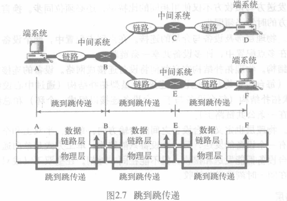
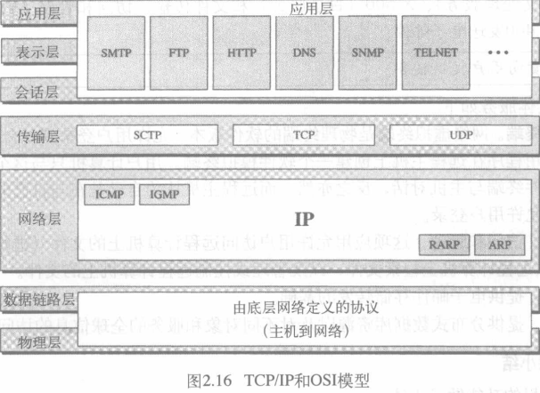

网络模型

<!-- @import "[TOC]" {cmd="toc" depthFrom=1 depthTo=6 orderedList=false} -->

<!-- code_chunk_output -->

- [任务分层](#任务分层)
- [OSI模型](#osi模型)
- [OSI模型各层功能](#osi模型各层功能)
  - [物理层(physical layer)](#物理层physical-layer)
  - [数据链路层(data link layer)](#数据链路层data-link-layer)
    - [跳到跳传递](#跳到跳传递)
  - [网络层(network layer)](#网络层network-layer)
    - [源到目的传递](#源到目的传递)
  - [传输层(transport layer)](#传输层transport-layer)
  - [会话层(session layer)](#会话层session-layer)
  - [表示层(presentation layer)](#表示层presentation-layer)
  - [应用层(application layer)](#应用层application-layer)
  - [小结](#小结)
- [TCP/IP协议族](#tcpip协议族)
- [寻址](#寻址)
  - [物理地址](#物理地址)
  - [逻辑(IP)地址](#逻辑ip地址)
  - [端口地址](#端口地址)
  - [专用地址](#专用地址)

<!-- /code_chunk_output -->

## 任务分层
通过层次的概念说明服务

## OSI模型
* OSI(开放系统互联,Open System Interconnection)模型
    > ISO是国际标准化组织

使不同系统间的通信变得容易,不要求对其底层的硬件和软件逻辑结构做任何改动
提供了一个可以用来进行网络系统设计的层次化框架,由7个相互独立但又有互相关联的层次组成

> 每一层调用下一层提供的服务
* 可分为3个子功能组: 网络支持层:123(处理物理层面问题),用户支持层567,传输层4

整体结构如下

>Dn表示第n层的数据
整个过程从第七层开始,一层层下移
每层数据单元可能被加入头部(header),尾部(trailer)
在物理层上转换成电磁信号
* 封装: 第N-1层的分组中的数据部分是第N层的完整分组
## OSI模型各层功能
### 物理层(physical layer)
包含在物理介质上传输位流所需的功能,定义了接口与传输介质的机械和电气特性
负责**位**从一个跳(节点)(hop)到另一跳的传递
* 定义接口与介质的物理特性: 定义设备与传输介质之间的接口特性,传输介质类型
* 将位流编译成光,电信号
* 传输速率(transmisson rate): 每秒发送的位数
* 位同步: 双方时钟必须同步
* 线路配置,物理拓扑,传输方式
### 数据链路层(data link layer)
将物理层的数据无差错地传递给网络层
负责**帧**从一个跳(节点)(hop)到另一跳的传递
* 成帧: 将来自网络层的位流划分为帧(frame)
* 物理寻址: 在帧的头部添加发送方,接收方的物理地址(同一网络)或连接网络的设备地址(不同网络)
* 流量控制: 防止接收方因传输速率不够过载
* 差错控制: 检测与重发损坏帧,丢失帧,防止重复帧.(通常在帧的结束出添加尾部)
* 访问控制: 多台设备连接到同一链路时的控制权授予
#### 跳到跳传递

相邻节点AF在数据链路层的通信需要经过三次传递,三个系统之间交换的帧具有不同的头部(地址不一样)
### 网络层(network layer)
网络层负责将各个**分组**从源地址传递到目的地址
* 逻辑寻址: 在分组头部添加发送方,接收方的逻辑地址
    >通过网络边界的分组需要另一个寻址系统区分源与目的系统
* 路由选择: 组成大网络时帮助连接设备(路由器)把分组送到最终目的地
#### 源到目的传递

### 传输层(transport layer)
传输层负责一个**报文**从一个进程到另一个进程的传递
保证整个报文无差错,按顺序到达目的地,在源到目的层次上进行差错控制和流量控制
* 服务点寻址: 在头部添加服务点地址(端口地址)
    > 网络层传递到指定计算机, 传输层传递给指定进程
* 分段和组装: 将报文分解成可传输的片段,编上序号方便组装和错误处理
* 连接控制: 无连接的传输层将每个片段作为独立的分组传递,面向连接的传输层在传递分组之前须于目的及其的传输层建立连接
* 流量控制: 端到端流量控制
* 差错控制: 进程到进程间
### 会话层(session layer)
网络的对话控制器,建立维护同步通信系统间的交互工作
会话层负责对话控制和同步
* 对话控制: 允许两个系统进入对话
* 同步: 允许进程在数据流中增加检查点,同步点

### 表示层(presentation layer)
两个系统之间交换信息的语义和语法
表示层负责翻译、加密和压缩数据 
* 翻译: 将信息翻译成位流
* 加密
* 压缩

### 应用层(application layer)
应用层负责向用户提供服务
### 小结

## TCP/IP协议族
是在OSI模型之前所开发的,因此各层并不与OSI模型的各层严格对应
四个层次
* 主机到网络层
* 互联网层
* 传输层
* 应用层
>当TCP/IP 与 OSI 模型进行比较的时候,可以说 TCP/IP 协议族有五层: 物理层, 数据链路层, 网络层, 传输层和应用层

TCP/IP和OSI模型

>  TCP/IP定义的协议:
传输层: 传输控制协议(TCP),用户数据报协议(UDP),流控制传输协议(SCTP)
网络层: 网际协议(IP)(包含ARP,RARP,ICMP,IGMP)

协议数据单元PDU(Protocol Data Unit)是指对等层次之间传递的数据单位.
* 物理层: 数据位(bit)
* 数据链路层: 数据帧(frame)
* 网络层: 数据包/数据报(packet)
* 传输层: 数据段(segment)
* 其他更高层次的PDU是数据(data)

## 寻址
TCP/IP协议簇的应用网络中使用4层地址:
物理(链路)地址、逻辑(IP)地址、端口地址和专用地址

### 物理地址
也称链路地址、硬件地址、MAC地址
包含在数据链路层的帧中,是最低级的地址
是局域网或广域网定义的节点地址
其长度和格式是可变的,与网络有关
通常以太网使用6个字节(48位)物理地址(如07:01:02:01:2C:4B)
### 逻辑(IP)地址
32位地址,唯一定义了连接到英特网的一台主机(127.0.0.1)
### 端口地址
标记进程的方法,16位,十进制表示
跳到跳时物理地址将改变,但逻辑地址保持不变
### 专用地址
面向用户的应用(邮件,URL等)
