物理层: 数据和信号

<!-- @import "[TOC]" {cmd="toc" depthFrom=1 depthTo=6 orderedList=false} -->

<!-- code_chunk_output -->

- [模拟与数字](#模拟与数字)
  - [模拟与数字数据/信号](#模拟与数字数据信号)
  - [周期/非周期信号](#周期非周期信号)
- [周期模拟信号](#周期模拟信号)
  - [正弦波](#正弦波)
  - [复合信号(composite signal)](#复合信号composite-signal)
  - [带宽(bandwidth)](#带宽bandwidth)
- [数字信号](#数字信号)
  - [比特率(bit rate)](#比特率bit-rate)
  - [位长(bit length)](#位长bit-length)
  - [特性: 复合模拟信号](#特性-复合模拟信号)
  - [数字信号的传输](#数字信号的传输)
    - [基带传输](#基带传输)
- [传输减损(Impairment)](#传输减损impairment)
  - [衰减(attenuation)](#衰减attenuation)
  - [失真(distortion)](#失真distortion)
  - [噪声(noise)](#噪声noise)
- [数据速率限制](#数据速率限制)
  - [无噪声信道: 奈奎斯特比特率](#无噪声信道-奈奎斯特比特率)
  - [有噪声信道: 香农容量定理](#有噪声信道-香农容量定理)
  - [应用](#应用)
- [性能](#性能)
  - [带宽](#带宽)
  - [吞吐量(Throughput)](#吞吐量throughput)
  - [延迟](#延迟)
  - [带宽×延迟](#带宽延迟)

<!-- /code_chunk_output -->

传输数据必须将其转换为电磁信号

* 信息(message): 通信的目的是传送信息,如文字、图像、视频和音频等.
* 数据(data): 信息在传输之前需要进行编码,编码后的信息就变成数据.
* 信号(signal): 数据在通信线路上传递需要变成电信号或光信号

## 模拟与数字
### 模拟与数字数据/信号
数据以及信号可用模拟(analog)或数字(digital)的形式
* 模拟数据: 连续状态的信息
* 数字数据: 离散状态的信息
 

* 模拟信号: 在一个范围内有无穷多个取值
* 数字信号: 有限个数值
> 模拟信号很难纠正波形

### 周期/非周期信号
* 周期信号(periodic signal): 一个周期完成一种模式,在后续的相同时间范围内重复这一模式
* 非周期信号(nonperiodic signal): 变化不会随时间出现重复的模式或循环
>周期模拟信号需要更少带宽,非周期数字信号可表示数据变化

## 周期模拟信号
周期模拟信号可以分为简单类型或复合类型两种
* 简单类型模拟信号,即正弦波(sine wave),不能再分解为更简单的信号
* 复合型模拟信号则是由多个正弦波信号组成
### 正弦波
周期模拟信号最基本形式
单个正弦波可用峰值振幅,频率,相位表示
* 振幅: 最高强度绝对值
    > 与其携带能量成正比
* 周期/频率
    > 瞬间变化的信号周期为0,频率∞
* 相位(phase): 波形相对于时间零的位置
* 波长: =cv,一周期传播的长度
* 时域和频域: 时域图(time-domain plot)信号振幅/时间,频域图(frequency-domain plot)振幅/频率
    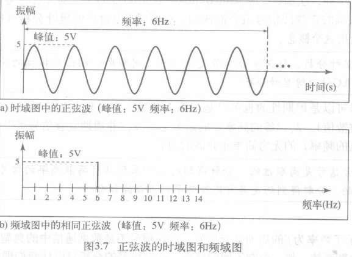
### 复合信号(composite signal)
单一频率的正弦波在数据通信中没有用处(无法携带信息),需要发送由许多简单正弦波组成的复合信号
按照傅里叶分析,任何复合信号是由具有不同频率、相位和振幅的简单正弦波组合而成
* 周期复合信号分解得到一系列离散频率的信号
    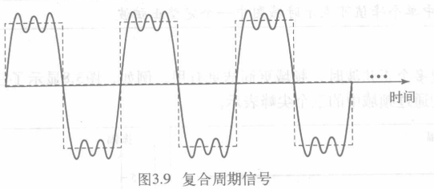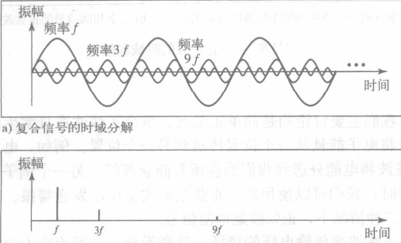
    >振幅为f的正弦波振幅与复合信号峰值一样,称为**基础频率/第一谐波**
    3f的振幅是f的1/3,第三谐波
    9f的振幅是f的1/9,第九谐波

* 非周期复合信号分解得到连续频率的正弦波组合
    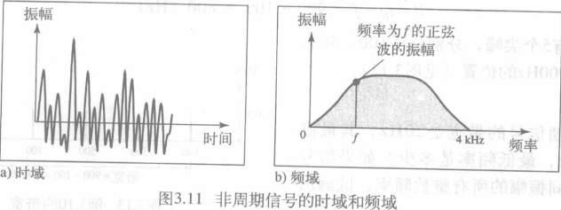

### 带宽(bandwidth)
* 带宽: 复合信号包含的频率范围
    > 复合信号的带宽是信号最高频率与最低频率的差值

## 数字信号
* 一个数字信号可以多于两个电平表示.在这种情况下,每个电平就可以发送多个位
    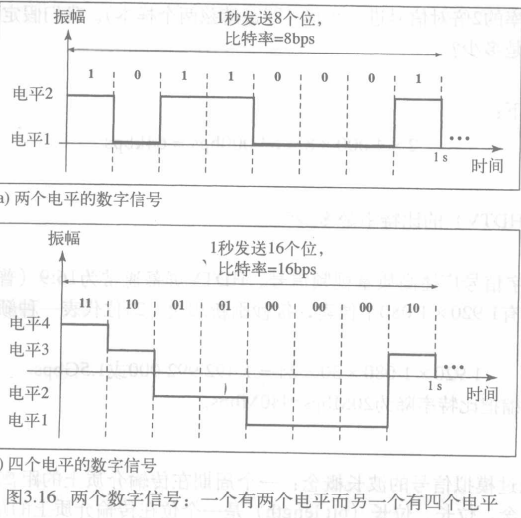
    > 一个信号有L个电平则每个电平需要/可表示$log_2L$位
### 比特率(bit rate)
1秒钟发送的位数,单位是bps或者b/s
### 位长(bit length)
一个位在传播介质上的距离,=传播速度 \* 位持续时间
> 数字信号的"波长"概念
### 特性: 复合模拟信号
基于傅里叶分析,数字信号是复合模拟信号,带宽∞
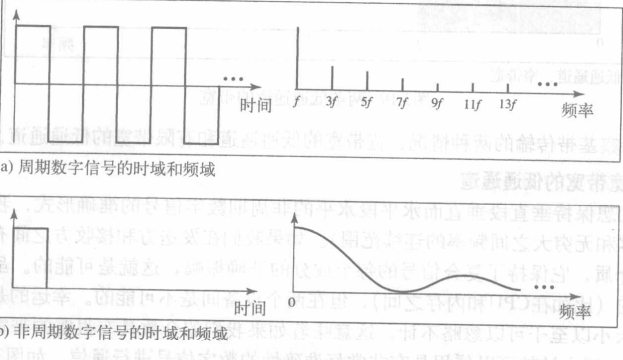
> 带宽都为无穷大
周期数字信号(少见)分解为离散频率的频域
非周期数字信号分解为连续频率

### 数字信号的传输
无穷带宽的数字信号如何传输?
#### 基带传输
通过通道传输数字信号,不转换为模拟信号
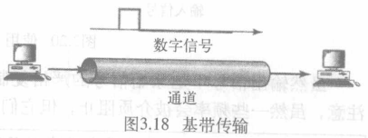
>需要一个带宽下限频率是0的低通通道(带宽从0开始的通道)
比特率与所需带宽成正比

低通通道有宽带宽和窄带宽的(不存在无穷大带宽)
* 宽带宽的低通通道
    发送非周期数字信号的准确形式(整个频谱),需要无穷大带宽的专用介质(计算机内可能,设备间不可能)
    带宽边界的频率振幅太小可忽略不计,因此宽带宽的抵用通道可传递数字信号(不完全相同但没影响)
    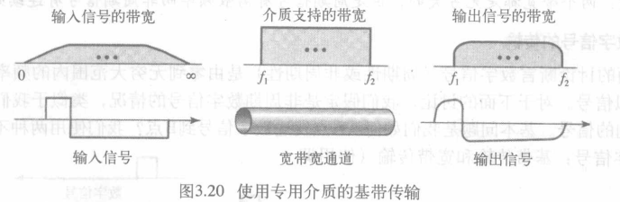
* 有限带宽的低通通道
    只能将数字信号近似成模拟信号
    * 大致近似
        假定数字信号比特率为N,考虑最坏情况即数字信号变化的最大数(0101),需要f=N/2的模拟信号,每周期发送2位
        但这只是最大频率(N/2),还需模拟其他情况,这一周期变化了几次决定了频率大小
        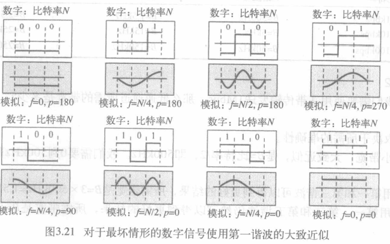
    * 更好近似
        增加更多频率的更多谐波使得模拟信号形状更像数字信号
        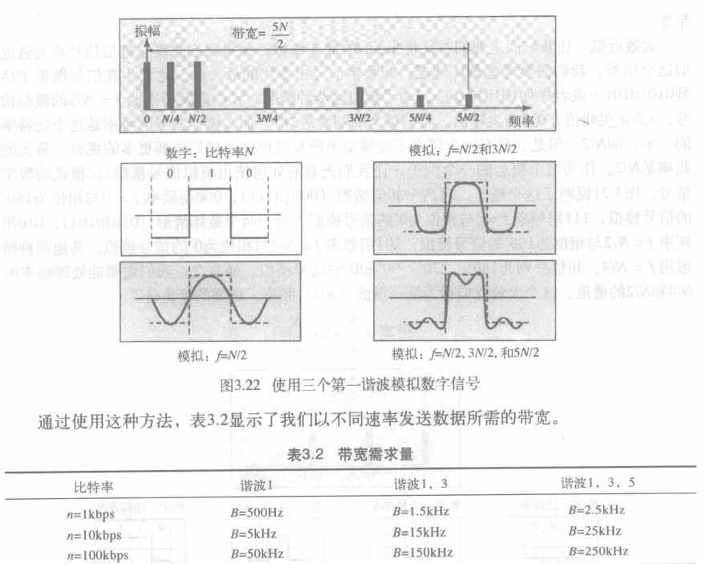
    * 所需带宽
        所需带宽与比特率成正比
        最小带宽的比特率最小,采用大致近似,B=N/2
        13谐波B=3N/2
        135谐波B=5N/2
        最大比特率使用所有带宽,如用第一谐波则Nmax=2B
        > B:所需带宽 N:比特率

        > 例
        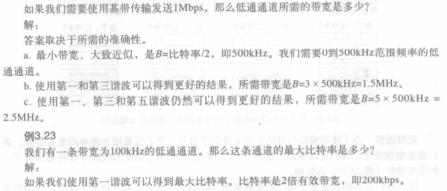
    * 宽带传输(使用调制)
        把数字信号转换成模拟信号
        > 调制允许使用带宽通道(带宽不从0开始)
        带宽通道不能直接接收数字信号,需先将数字信号转化为模拟信号

        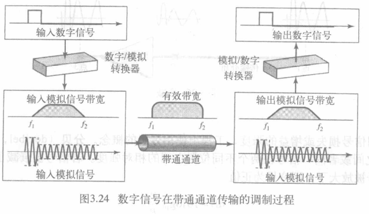

## 传输减损(Impairment)
通常会发生三种类型的减损: 衰减、失真和噪声
### 衰减(attenuation)
能量损失
通常使用分贝来计算相对强度 $dB = 10log_{10}P_2/P_1$
>P1,P2: 位置1,2的功率(一般电压和功率成正比)
### 失真(distortion)
信号改变了形状或形态
产生在不同频率组成的复合信号中,每种信号在介质中有自己的传播速度,导致延迟
通常也用分贝表示
### 噪声(noise)
有热噪声、感应噪声、串扰和脉冲噪声
用信噪比(SNR)来衡量:$SNR = 平均信号功率/平均噪声功率$
通常用分贝描述 $SNR_{dB}=10log_{10}SNR $

## 数据速率限制
在一个通道中能够以多快的速率发送数据(每秒钟的比特数)是数据通信中一个非常重要的问题
* 数据速率取决于三种因素: 
    1. 有效带宽
    2. 使用的信号电平数
    3. 通道的质量(噪声电平)
### 无噪声信道: 奈奎斯特比特率
无噪声通道理论上最大比特率: 
$最大比特率 = 2 × 带宽 × log_2 L$ (L是电平数)
> 理论上增加信号电平可获得任意比特率,但增加信号电平时增加了接收方负担(分辨电平),削弱了系统可靠性

### 有噪声信道: 香农容量定理
噪声通道理论上最高数据速率:
$通道容量C=带宽B×log_2(1+SNR) $
> 信噪比SNR = 平均信号功率/平均噪声功率
通道容量为通道的传输容量(每秒比特数)
无论使用多少电平都无法获得更高数据速率(公式定义通道的特性而不是传输方式)
### 应用
实际应用中需要确定带宽,信号电平数
> 例

## 性能
### 带宽
两种情况下使用术语带宽:
* 以赫兹衡量的带宽指复合信号包含的频率范围或者通道能通过的频率范围
* 以每秒比特数衡量的带宽指通道或链路中位传输的速率

关系: 赫兹衡量的带宽⬆ -> 比特率衡量带宽⬆
取决于是否有基带传输或调制传输
### 吞吐量(Throughput)
单位时间内成功地传送数据的数量.用于衡量通过网络发送数据的快慢
吞吐量是实际值,带宽是潜在衡量值,吞吐量T<带宽B
### 延迟
第一个位从源开始出发到整个报文完全到达目标所经历的时间
* 由四部分组成:
    * 传播时间(propagation time)
        >传输一个比特从源到目标的时间
        取决于电磁信号的传播速度（真空中3×108m/s）
    * 传输时间(transmission time)
        >传输时间 = 报文长度 / 传输速度(带宽)，是发送报文所需的时间
    * 排队时间(queuing time)
    * 处理延迟(processing time)

延迟 = 传播延迟 + 传输时间 + 排队时间 + 处理延迟

### 带宽×延迟
带宽延迟乘积定义了能充满链路的位数
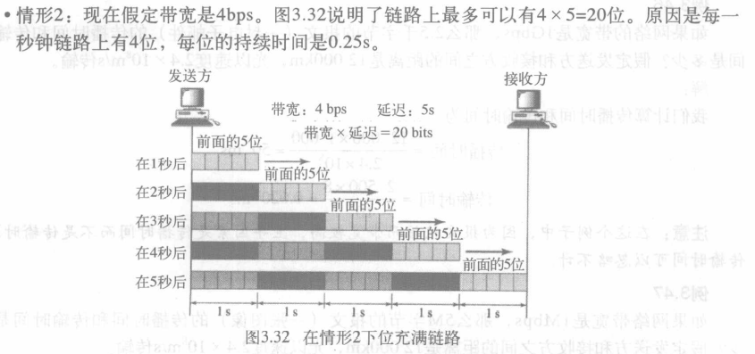

