
数字传输(Digital Transmission)

[TOC]

## 数字到数字转换
### 线性编码(line coding)
#### 元素,速率
将数字数据转换成数字信号(位序列->数字信号)
* 数据元素(data element): 表示一块信息的最小实体即位(bit),是被承载的
* 信号元素(signal element): 是数字信号的最小单元,是传输载体
 

* **比率r**: 每个信号元素承载的数据元素的个数
    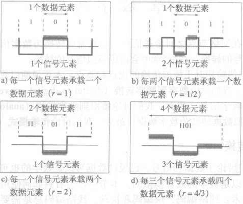
* 数据速率(比特率)N: 1秒钟发送的数据元素(位)的数量,即bps(bits per second)或 b/s
* 信号速率(波特率)S: 1秒钟发送的信号元素的数量,单位是波特率(baud),或者叫做脉冲速率(pulse rate)、调制速率(modulation rate)或波特率(baud rate)
    > 目标: 增加数据速率而降低信号速率  
* 关系: $S=c×N×\frac{1}{r}(band)$
    > N:数据速率 S:信号速率 c:情形因子,一般取1/2 r:比率
#### 带宽
虽然数字信号的真实带宽是无限的,但有效带宽是有限的(许多成分振幅很小可忽略不计)
* 是波特率而不是比特率决定了数字信号的带宽
* 若给定通道带宽,则可以得到最大数据速率
* 最小带宽: $B_{min} =c×N×\frac{1}{r}$
最大数据速率: $N_{max}=\frac{1}{c}×B×r $
#### 待解决问题
* 基线(baseline): 接收方计算收到信号功率的运行平均值
    > 信号代表的高低电平根据信号的功率与基线比较得到
* 基线偏移(Baseline Wandering): 0或1的长字串会引起基线偏移,使接收方不能正确地进行解码.
    >好的线路编码方案需要防止基线偏移
* 直流分量(DC Components):接近于零的频率成为直流分量,会给不允许通过低频率的系统,或者使用电子耦合的系统带来问题
    >直流信号不能通过电容,不能远距离传输,会造成器件老化
* 自同步(self-synchronization): 接收方的位间隔与发送方的位间隔严格对应与匹配.数字信号在传输的数据中包含有定时信息,通常是使用信号中包含有提示接收方起始、中间和结束位置的脉冲的跳变(transition)
    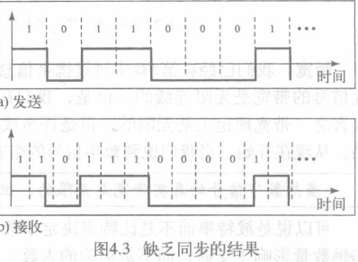
    > 例
    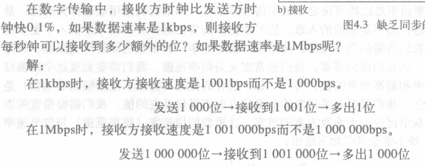
* 差错检测
* 抗噪声和抗干扰
* 复杂性

### 线路编码方案(Line coding schemes)
大致分为: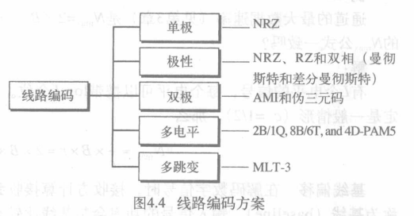
#### 单极性编码(Uniploar)——不归零(NRZ)
单极编码方案的所有信号电平都在时间轴的同一边
* **极性NRZ:**
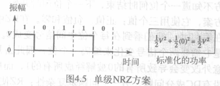
    > 1正0零,位中间信号不归零
成本高(功率是极性方案的2倍)

#### 极性编码(polar) —— 不归零编码(NRZ)
极性编码方案的电平在时间轴两边
* **NRZ-L**(NRZ电平编码) & **NRZ-I**(NRZ反相编码):
    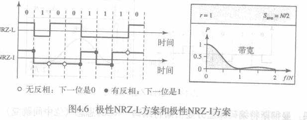
    >NRZ-L: 1负0正
     NRZ-I: 初始正,遇1反相遇0不变

    >都有 N/2 Baud的平均信号速率.
    能量集中在0 ~ N/2之间的频率.
    都有基线偏移、同步和DC问题

    > 例
    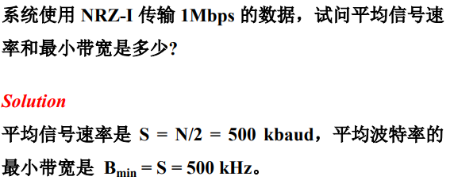
#### 极性编码 —— 归零码(Polar RZ)
时钟不同步时NRZ会出问题
归零编码RZ,信号在位中变化解决基线偏移问题
* **RZ**:
    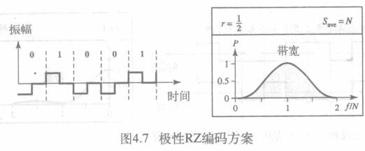
    > 位中到位尾零,前半0负1正

    >信号有三个值: 正值,负值和零;
    优点: 自同步、无DC成分;
    缺点: 占用的带宽大,三个电平的生成和辨别更加困难
#### 极性编码 ——双相码(biphase)
**曼彻斯特**(Manchester)编码: RZ的位中间跳变 + NRZ-L
**差分曼彻斯特**(Differential Manchester)编码: RZ + NRZ-I
* :
    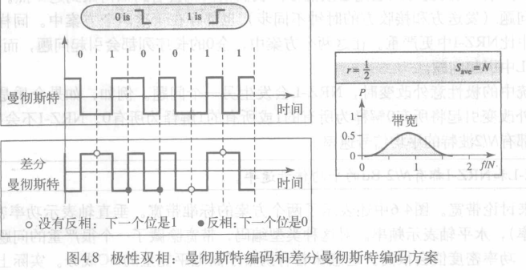
    > 曼彻斯特: 前半0正1负,位中跳变
    差分曼彻斯特: 初始正,每位开始遇0跳变遇1不变,位中跳变

    > 位中跳变用于同步
    优点: 没有基线偏移,没有DC成分,自同步.
    缺点: 曼彻斯特编码和差分曼彻斯特编码的最小带宽是NRZ的两倍
#### 双极性编码(bipolar)
也称为多电平二进制(multilevel binary)编码.
有3个电平
**AMI**: 交替传号反码(Alternate Mark Inversion)
**伪三元**编码(Pseudoternary)
* :
    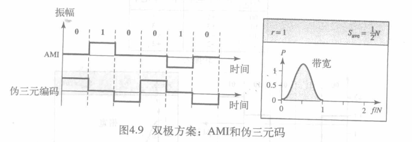
    > AMI: 0为零,1交替正负
    伪三元: 1为零,0交替正负

    > NRZ替代方案信号速率与NRZ一样,但没有DC成分;
    能量集中于频率N/2处;
    AMI存在长序列0时有同步问题
#### 多电平编码(multilevel schemes)
通过把m个数据元素的模式编码成n个信号元素的模式,增加每波特的位数
不同信号元素可以用不同的电平表示,L个不同的电平,可以产生Ln个信号模式组合
* $2^m=L^n$,每个数据模式编成一个信号模式
* $2^m<L^n$,每个数据模式只能占据一个信号模式的子集
* $2^m>L^n$,无法数据编码

以**mBnL**区分编码类型
> m:二进制模式的长度 B:二进制的数据 n:信号模式的长度 L:信号中的电平数(L=2用B替换(binary),3T,4Q)
$2^m<=L^n$
* 2B1Q: 用长度为2的2位数据模式编码成一个4电平信号元素
    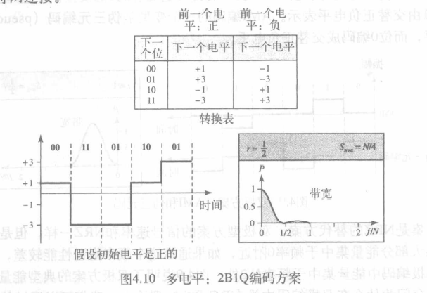
    > 2B1Q的一个例子
    平均信号速率S=N/4,但使用4个电平
* 8B6T
    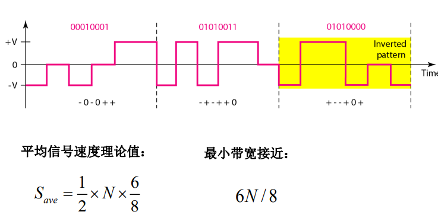
* 4D-PAM5(了解)
    * 4维5级脉冲振幅调制(four dimensional five-level pulse amplitude )
    * 4D: 数据同时通过4条线路发送
    * 5个电平: -2,-1, 0, 1, 2
    * 0只用于发送差错检测
    * 若编码是一维的,4个电平产生类似于8B4Q
    * 信号速率可以降低到N/8
    * G比特 LAN 使用此技术来通过4条铜线(能处理125MBd)发送1Gbps的数据.
    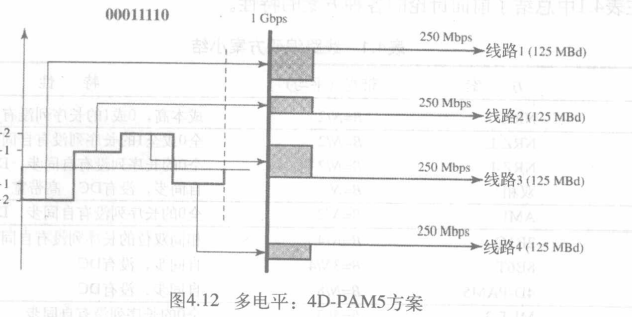

* 多线路传输MLT-3
    三电平多线路传输(multiline transmission, three level)
    多于两个跳变规则的差分编码
    * :
    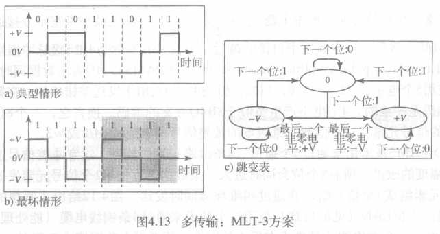
    > 如果下一位是0,没有跳变
    如果下一位是1且当前电平是0,下一个电平是最后一个非零电平的相反值
    如果下一位是1且当前电平不是0,下一个电平是0
#### 小结
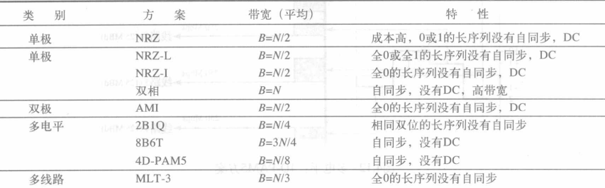

### 块编码(block coding)
块编码通常称为**mB/nB**编码技术,把m-bit位组变成n-bit(n>m)
利用冗余确保同步和差错检测
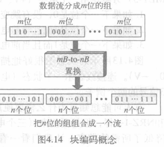
一般步骤:分组 置换 组合

#### 4B/5B
与NRZ-I组合使用: BRZ-I有很好的信号速率,但有同步问题(连续0长序列会失去同步)
4B/5B改变位流,不会有多于3个连续0(将4位输入置换为5位输出仅包不超过一个前导0(左边的位)和两个后缀0(右边的位))
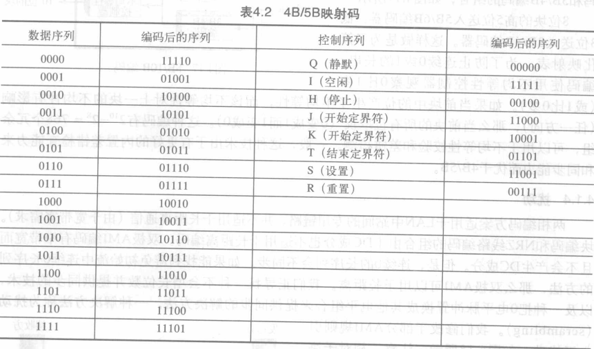
> 解决了同步问题,但增加了信号速率(冗余位增加20％波特)
未解决DC(可使用双相或双极编码)

####  8B/10B
类似于4B/5B编码,8位数据组被置换成10位编码
提供了更高的差错控制能力
实际上5B/6B编码和3B/4B编码的组合
为了防止连续0或者1的长串,使用不均等性控制性,可见0比1多
编码有: $2^{10}-2^8=768$个冗余组

### 扰动(Scrambling)
* 双相码适用于LAN中间站的专用链路,不适用于长距离通信(由于宽带宽需求)
* 块编码和NRZ编码的组合有DC分量,也不适合于长距离通信
* 双极性AMI带宽窄且没有DC分量,但连续0的长序列会失去同步

如果避免连续0长序列,就可用双极AMI进行长距离通信
用扰动修改AMI
#### B8ZS
8零置换的双极性码B8ZS(bipolar with 8-zero substitution)
* 8个连续0电平会被替换成000VB0VB;
* V表示违反(Violation),是个非零电平,与前一个非零脉冲极性相同的极性,违反了AMI编码规则;
* 表示双极,表示与AMI相一致的非零电平,即与一个非零脉冲极性相反的极性

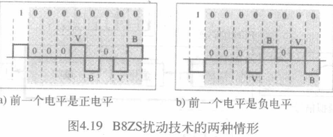

> 扰动不改变比特率,平衡了正负电平维持了DC平衡

#### HDB3
高密度双极3零方案(high density bipolar 3-zero)
* 4个连续0电平被置换成000V或B00V;
* 两个不同的置换是由于为了维持每次置换后非零脉冲为偶数;
* 如果最后一次置换后的非零脉冲数是奇数,置换为000V,使得非
零脉冲总数为偶数;
* 如果最后一次置换后的非零脉冲数是偶数,置换为B00V,使得非
零脉冲总数为偶数

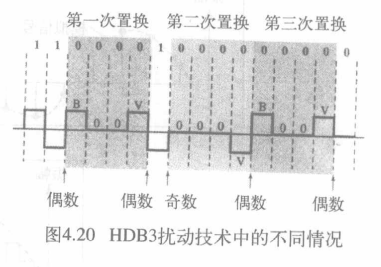

## 模拟到数字转换
数字信号优于模拟信号,今天的趋势是把模拟信号转换成数字信号
### 脉冲码调制PCM
最通用的技术
* 三个过程:
    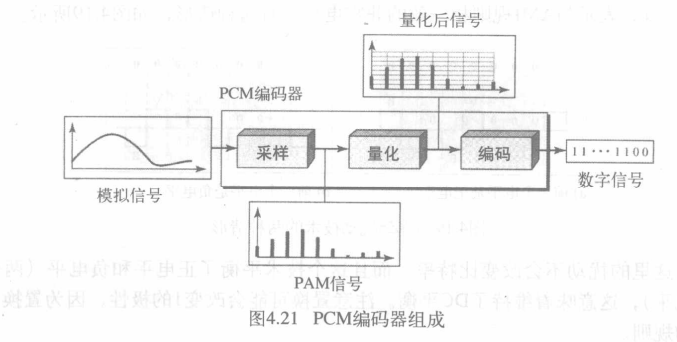
    采样,量化,编码

#### 采样(Sample)
* **采样率**`fs`: 定义了单位时间内从连续信号中提取并组成离散信号的采样个数,单位是赫兹(Hz),也称采样速度或者采样频率
    采样频率的倒数是采样周期`Ts`或者叫作采样时间.
    > 根据Nyquist定理,采样率必须至少是信号所含最高频率的2倍
    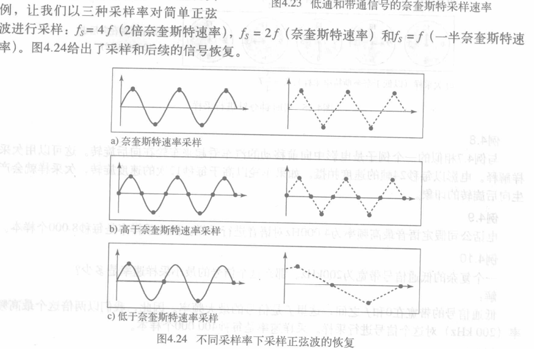
* 有三种采样方法:理想采样,自然采样,方顶采样
    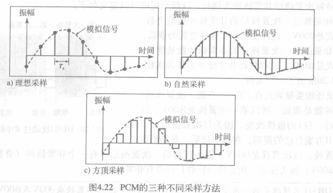
    > 理想采样对来自模拟型号的脉冲进行采样(理想,不易实现)
    自然采样当采样发生时高速开关开启很短的时间,样本序列保持了模拟信号的形状
#### 量化(Quantization)
采样后的结果是一系列振幅值介于信号最大振幅和最小振幅间的脉冲,必须要量化
* 步骤:
    * 假设原始模拟信号振幅介于Vmin和Vmax之间;
    * 分成L个区间,每个区间高度为Δ =(Vmax - Vmin)/L,L即为量化等级,与信号振幅范围及恢复信号的准确程度有关;
    * 分配0到L-1的量化值给每个区间的中点;
    * 样本振幅值近似为量化值

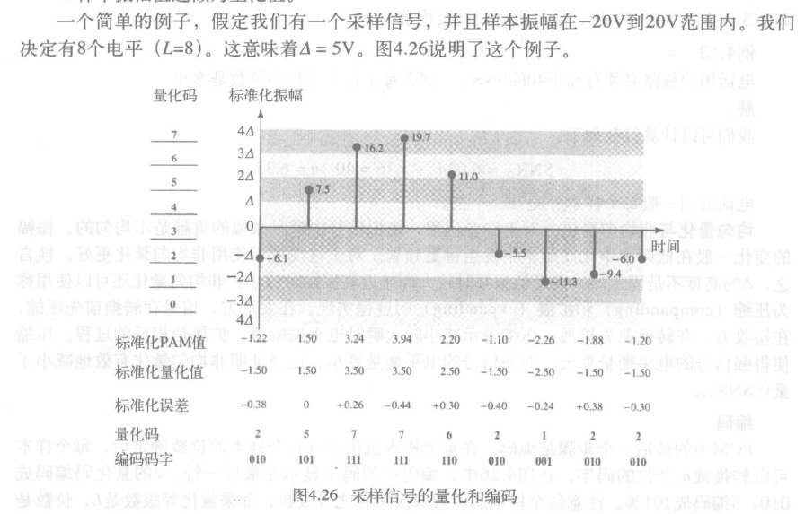

> 每个样本顶端的值给出了实际振幅
第一行为每个样本标准化后值(实际振幅/Δ)
标准化量化值为每个区间中间选择(不同于标准化振幅(PAM))
标准化误差: 标准化量化值-标准化PAM值
* 量化误差(Quantization errors)
    * 量化是一个近似过程
    * 输入实际值,输出近似值(区间的中间值)
    如输入值也在区间中间就不会有量化误差
    * 可以证明量化误差对信号SNRdB的影响取决于量化级别L或每个样本位数nb: $SNR_{dB}=6.02n_b + 1.76dB $
* 量化方式
    * 均匀量化:  △的高度是固定的.
    * 非均匀量化: △的高度不固定,低振幅时△较大,接近高振幅时△较小
#### 编码(code)
采样后的数据用多少位比特表示
如果每个样本可以转换成nb个位的码字,量化等级是L,则:
$n_b = log_2L $
$比特率=采样速率×每个样本位数=f_s×n_b $
> 例:
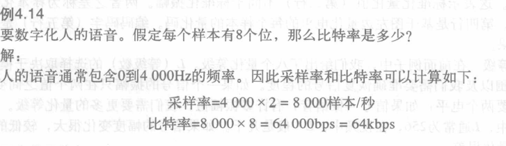

#### PCM带宽
给定低通模拟信号的带宽,如要数字化这个信号,数字信号的通道的最小带宽是多少?
线路编码的信号的最小带宽$B_{min}=c×N×\frac{1}{r} $
因$N=n_b×f_s$, $f_s=2×B_{analog}$
当1/r=1(NRZ,双极信号)且c=1/2(平均情况)时
$B_{min}=n_b×B_{analog}$
> 数字信号的最小带宽是模拟信号带宽的𝑛𝑏倍.这是数字化的代价
#### 原始信号恢复
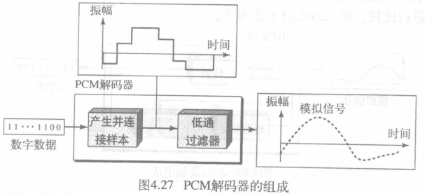

#### 通道的最大数据率
通道的最大数据速率:$N_{max} = 2 × B × log_2 L$ (L是电平数)
可算得数据速率也为$N_{max} = 2 × B × log_2 L$
最小所需带宽$B_{min}=\frac{N}{2×log_2L} (HZ)$
### Delta调制(DM)
减少PCM的复杂性

## 传输模式(TRANSMISSION MODES)
通过链路传输二进制数据可以采用并行模式或者串行模式 (并行模式每个时钟脉冲发送多位,串行模式每个时钟脉冲发送1位)
* 并行传输只有一种方式
* 串行传输分为三类:异步(asynchronous),同步(synchronous),等时(isynchronous)
### 并行传输
每次使用n条线路传送n位
并行传输的优点是速度高
缺点是成本高,需要n条线路
### 串行传输
位是一个一个依次传输的
两个通信设备之间只需要一条通道
串行传输的优点是只要一条通信信道,成本只有并行的1/n
#### 异步传输
* 在传输中信号的时序并不重要,信息的接收和转换通过约定的模式进行
* 约定模式基于将位流组成字节的方式建立,每组作为一个单位沿着链路传输
* 没有同步时钟,增加起始位和停止位.在每个字节开始时发送1个起始位,结束时发送1个或者多个停止位,在每个字节之间会有一个时间间隔
>异步在这里是指在字节级上的异步,但是每位仍然要同步,它们的持续时间是相同的

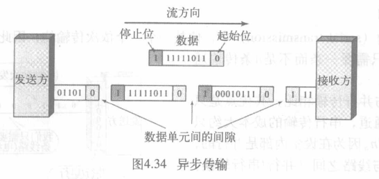

#### 同步传输
位流组合成更长的帧,一帧包含多个字节,接收方将位流解码成字节
不含起始位、停止位和间隙, 接收方负责将位流进行分组
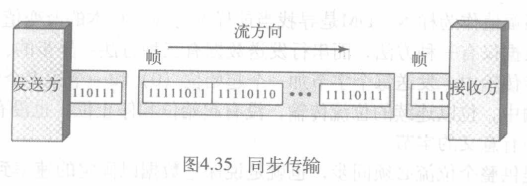
速度快

#### 等时
帧间没有延迟,保证数据以固定速率到达
