
模拟传输(Analog Transmission)

[TOC]

数字传输有很多好处,但需要低通通道
如果只有带通通道,就只能选择模拟传输

## 数字到模拟转换
* 数字到模拟转换: 将数字数据转换为带通模拟信号
* 模拟到模拟转换: 将低通模拟信号转换为带通信号

正弦波由振幅,频率,相位定义,改变简单正弦波的某一特性就可用来表示数字数据
从而至少有3种将数字数据调制到模拟信号的机制:
* 幅移键控(ASK),频移键控(FSK),相移键控(PSK)
* 将振幅和相位变化结合起来:正交振幅调制(QAM)
### 数模转换问题
* 比特率和波特率
    * 比特率: 每秒发送的位数
    * 波特率: 每秒发送的信号元素数
        >在数字数据模拟传输中,波特率小于等于比特率
    $波特率S=比特率N×\frac{1}{r} 波特 $
    r: 一个信号元素携带的数据元素个数, L: 是信号元素类型
* 载波信号
    模拟传输中,发送设备产生一个高频率信号作为基波来承载信息,这个基波就称为**载波信号**或载波频率
    数字信息通过改变载波信号的一个或多个特性来调制载波信号,称为**调制**或移动键控
    > 接收设备的收听频率与载波信号的频率一致
### 幅移键控 —— 二进制ASK(BASK)
幅移键控通过改变载波信号的振幅生成信号元素(频率和相位不变)
二进制幅移键控(开关键控OOK): ASK常用的信号元素只是用两个电平
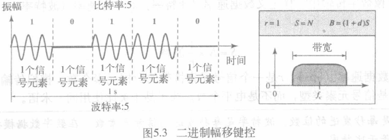
载波频率fc位于带宽中间,如有可用的带通通道,可选择fc使得调制后的信号能占用该带宽(可把发送的带宽平移到可用带宽)

* ASK带宽
    $B=(1+d)×S $
    > B:带宽 S:信号速率 d:因子(0-1)
    所需带宽最小值为S,最大2S
> 例:
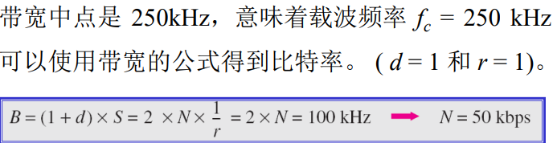
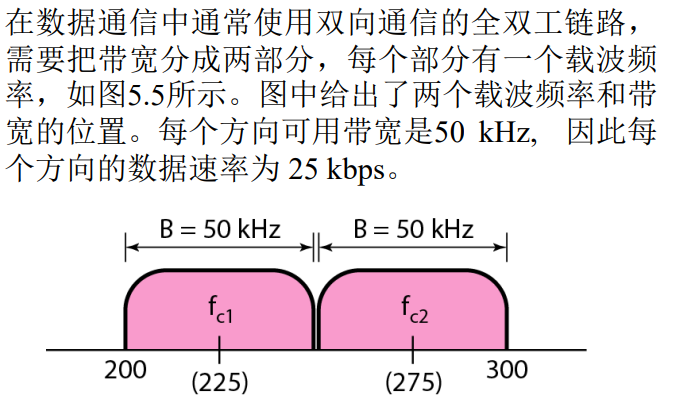

### 频移键控 —— 二进制FSK(BFSK)
通过改变载波信号的频率生成信号元素
选择两个载波频率f1,f2
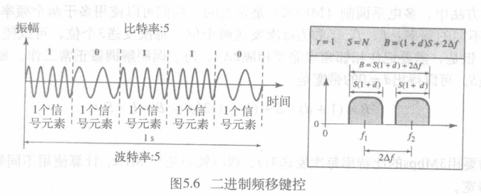
每个带宽中点的频率为f1,f2,离中点的距离都是Δf,频率之差为2Δf

* 带宽
    $B=(1+d)×S+2Δf $
    > B:带宽 S:信号速率 d:因子(0-1)
> 例:
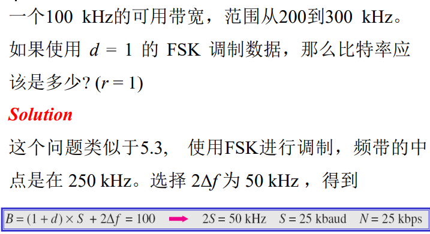

BFSK有两种实现方法: 非相干(noncoherent)和相干(coherent).
* 在非相干BFSK中,一个信号元素结束和下一个信号元素开始时相位不连续.可以看作使用两个载波频率的两个ASK.
* 在相干BFSK中,两个信号元素边界处的相位是连续的.可以使用一个压控振荡器(VCO)实现,根据输入电平改变频率.
> 例:
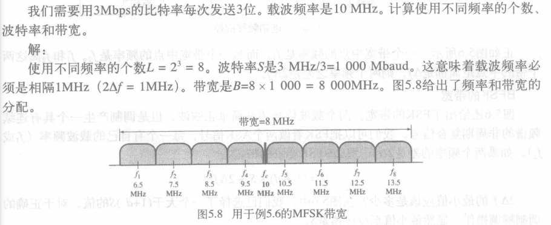

### 相移键控 —— 二进制PSK(BPSK)
改变载波的相位
BPSK只用2个信号元素,一个相位是0°,另外一个相位是180°
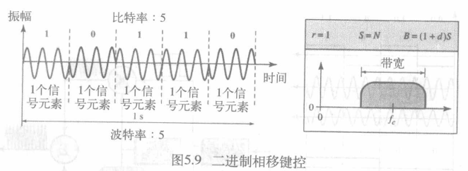

> BPSK和BASK一样简单,但比BASK不易受噪声影响
* 带宽: =BASK
### 相移键控 —— 正交PSK(QPSK)
使用2个独立的BPSK,一个是同相的,另外一个是正交的
在每个信号元素种一次使用2位
> 例:
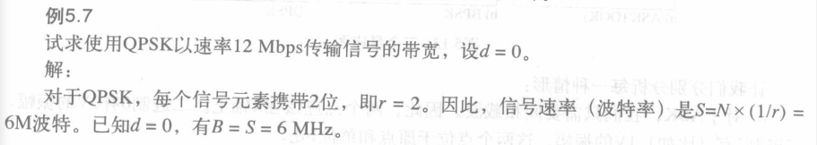

### 星座图
有助于定义信号元素的振幅和相位
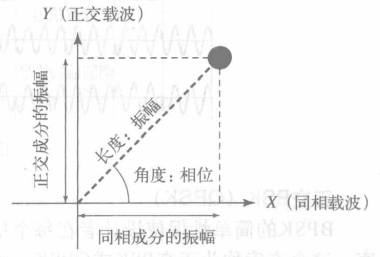

1. 水平X轴与同相载波相关,垂直Y轴与正交载波相关
2. 点在X轴的投影定义了同相成分的峰值振幅,点在Y轴的投影定义了正交成分的峰值振幅.
3. 连线与X轴之间的角度是信号元素的相位

> 例
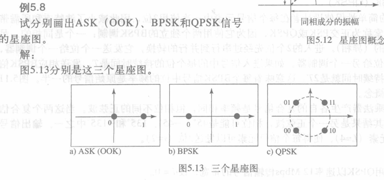

### 正交振幅调制QAM
改变两种特性
FSK不可结合使用(带宽限制),ASK和PSK可结合
* 正交振幅调制(QAM): 使用两个振幅不同的载波,一个同相一个正交,且使用不同的振幅.

## 模拟信号调制(Analog and Digital)
* 模拟信号调制: 通过模拟信号来表示模拟信息的
    > 为何要调制模拟信号: 如果介质具有带通特性或者只有带通带宽可用,则模拟信号就需要进行调制
    即模拟到模拟转换
* 模拟到模拟转换三种实现方法:
    * 调幅(Amplitude Modulation)
    * 调频(Frequency Modulation)
    * 调相(Phase Modulation)
### 调幅AM
调制载波信号使其振幅随调制信号的振幅变化而改变
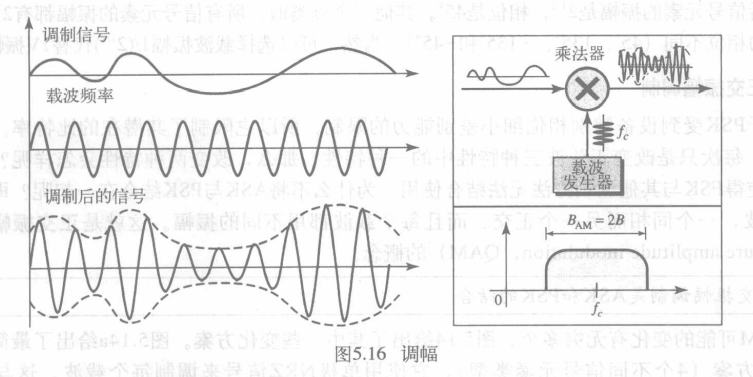

* AM带宽
    AM信号的带宽是调制信号带宽的2倍
    >音频信号的带宽通常为 5kHz,所以调幅无线电台需要的最小带宽是 10kHz
### 调频FM
载波信号的频率随调制信号电平(振幅)的改变而调整
>载波信号振幅和相位保持不变,当调制信号的振幅改变时载波信号的频率改变

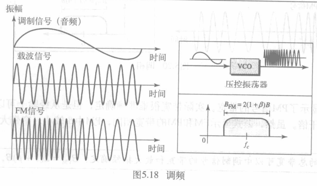

* FM带宽
    经验数值为2(1+β)B (β为基于调制技术的因子,一般4)
    >立体声广播的音频信号带宽接近15kHz,FCC允许每个调频电台使用200kHz的带宽,电台之间有至少200kHz的频率差,确保电台之间带宽不重叠
### 调相PM
载波信号的相位根据调制信号的电平(振幅)改变而调整
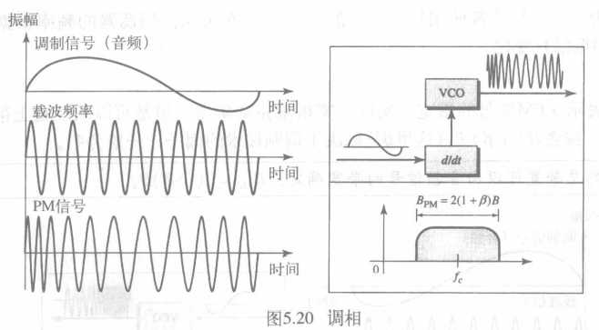

* PM带宽
    PM 所需的总带宽由调制信号的带宽和最大振幅确定:
    $B_{PM} = 2(1 + β)B$
