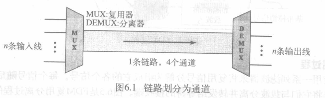

带宽利用(Bandwidth Utilization: Multiplexing and Spreading)

[TOC]

为达到特殊的目的,带宽利用是可用带宽的合理使用;
* 复用(multiplexing)可获得效率: 将一些通道合并为一个通道
* 扩频(spreading)可以保密与抗干扰

## 复用(multiplexing)
* 链路共享: 只要连接两台设备的介质带宽比设备间传输所要求的带宽高时,该链路就可以被共享
* **复用**: 允许同时通过一条数据链路传输多个信号的一组技术
* 链路划分为通道
    
    > n条线路共享一条链路的带宽
    * **链路**(link): 物理通路
    * **通道**(channel: 在一对设备之间传送传输信号的链路的部分
        > 一条链路可能有多个通道
* 多路复用的技术:
    * 频分复用(FDM, frequency-division multiplexing)
    * 波分复用(WDM, wave-division multiplexing)
    * 时分复用(TDM, time-division multiplexing)
### 频分多路复用(FDM)

一种模拟技术,在链路带宽 > 传输的信号的带宽之和时用

* 每个发送设备生成的信号用于调制不同的载波频率,调制后的信号合并为可通过链路传输的复合信号
    > 载波频率间的频率差必须能够容纳调制信号的带宽
* 通道之间由狭长的防护频带(guard band)进行分隔,防止信号重叠
* 载波频率不能影响原始的数据频率
* 数字信号转换为模拟信号之后仍然可以使用FDM

复用过程:

分离过程:
* 将不同设备的信号按带宽分配到不同的频率上,合并,通道接收到信号后用滤波器将自己的信号分离出来

模拟载波系统
*  在模拟层次结构上,通过群,超群,主群,巨群合并通道

> 例

### 波分复用(WDM)
合并多个光信号的模拟多路复用技术(用于具有高数据速率传输能力的光缆)
WDM在概念上与FDM相同,其原理也一样,差别是WDM复用的频率非常高
* 复用过程: 在复用器上将多个光源组成单一光信号,在分离器上做相反的处理
    光源组合与分离由棱镜完成
    
* 一种应用: 同步光纤网络(SONET)
### 时分复用(TDM)
是组合多个低速通道为一个高速通道数据的复用技术
* 是一个数字化的过程,它允许多个连接共享一条高带宽链路
* 在时间上共享,每个连接占用链路的一个时间片段;
* 将不同源端的数字数据合并到一个时间共享的链路上

复用过程:

* 每个输入的数据流划分为多个单元,每个单元占用一个输入时隙
* 每个每个输入单元成为一个输出单元,占用一个时隙
* 每个输出单元占用 1/n 个时隙(n是连接数)
    > 所有线路共享输出线路
* 帧: 每个输入连接的全部数据单元

> 例

#### 交替(Interleaving)

#### 空时隙(Empty slots)
某个输入端源无数据时就会有空时隙,下为解决办法

#### 数据速率管理
当数据速率不同的时候,采用策略:
* 多级复用(Multilevel Multiplexing)
    一条输入线的数据速率是其他的整数倍时可用
    组合成相同数据速率
    
* 多时隙分配(Multiple-slot Allocation)
    在一个帧中允许对一条输入线分配多个时隙
    
* 脉冲填充(Pulse Stuffing)(位填充)
    比特率不是整数倍时,选取最高速率为主要速率,在其他低速率输入线上添加虚位

#### 帧同步
TDM不易实现: 复用器和分离器之间也要维护同步状态
因此在每帧的开始增加一个或多个同步位称为帧指示位,按某种模式逐帧变化,使分离器与输入流同步.

#### 数字信号服务

## 扩频(spread spectrum)
* 在扩频系统SS中,也把来自某些源端的信号组合在一起形成一个更宽的带宽,可是目的略有不同: 扩频为无线应用设计,在空气,真空中传播,需要保证安全性(没有窃听者,恶意入侵)
* 为达到此目的,扩频技术增加冗余部分,扩展原始信号的频带.
* 扩展的频带允许进行更安全的封装

两个原则以达到此目的:
* 对每个站点分配的带宽显然要比它所需要的带宽更大.
* 原来的带宽B扩大到BSS必须有一个与原来信号无关的过程来做.也就是说,信号由源端生成后,扩频过程才发生
### 跳频扩频 (FHSS)
用源信号调制M个不同的载波频率(某一时刻调制1个,下一时刻调制另一个).扩展以后占用的带宽远大于原带宽
* 伪随机噪声: 对每个跳周期随机生成一个模式,通过该模式查找相应的频率,传送到频率合成器
* 带宽共享(Bandwidth sharing): 通过适当的调制技术,M个不同站点可用同一扩展带宽
    
### 直接序列扩频(DSSS)
也是扩大源信号的带宽,但方法不同
每个数据位用扩展编码的n位代替

