数据链路层: 检错与纠错(Error Detection and Correction)

<!-- @import "[TOC]" {cmd="toc" depthFrom=1 depthTo=6 orderedList=false} -->

<!-- code_chunk_output -->

- [数据链路层](#数据链路层)
- [检错与纠错](#检错与纠错)
  - [概念](#概念)
    - [差错的类型](#差错的类型)
    - [冗余(redundancy)](#冗余redundancy)
    - [检错和纠错](#检错和纠错)
    - [前向纠错(forward error correction)和重传(retransmission)](#前向纠错forward-error-correction和重传retransmission)
    - [编码](#编码)
    - [模运算(modular arithmetic)](#模运算modular-arithmetic)
  - [块编码(block coding)](#块编码block-coding)
    - [检错](#检错)
    - [纠错](#纠错)
    - [汉明距离](#汉明距离)
  - [线性块编码(linear block codes)](#线性块编码linear-block-codes)
    - [线性块编码的最小距离](#线性块编码的最小距离)
    - [线性块编码例](#线性块编码例)
      - [简单奇偶校验编码](#简单奇偶校验编码)
      - [两维奇偶校验编码](#两维奇偶校验编码)
      - [汉明编码](#汉明编码)
  - [循环码(cyclic codes)](#循环码cyclic-codes)
    - [循环冗余校验(CRC, Cyclic Redundancy Check)](#循环冗余校验crc-cyclic-redundancy-check)
    - [多项式(polynomial)](#多项式polynomial)
    - [循环编码分析](#循环编码分析)
      - [特殊差错](#特殊差错)
  - [校验和(checksum)与反码](#校验和checksum与反码)
    - [反码](#反码)
    - [因特网校验和](#因特网校验和)

<!-- /code_chunk_output -->

# 数据链路层
* 把物理层的原始传输设施转换成一条负责点到点(逐跳)通信的链路
* 具体任务: 成帧、寻址、流量控制、差错控制和介质访问控制
    * 成帧: 把从网络层接收到的位流划分为帧,以便易于处理
    * 寻址(头部): 增加头部用来规定发送方和接收方地址
    * 流量控制: 如果数据在接收方的速率低于发送方的发送速率,则数据链路层会实行流量控制机制来防止数据大量涌入接收方
    * 差错控制: 增加了一些机制用来检测和重传被损坏帧、防止重复或丢失帧
    * 介质访问处理: 增加了一些机制用来检测和重传被损坏帧、防止重复或丢失帧

# 检错与纠错
## 概念
### 差错的类型
* 单个位差错(Single-bit error)
    数据单元(如一字节,字符,分组)中仅有一比特发生变化
* 突发性差错(Burst error)
    数据单元中有两位或多位发生变化
    > 更易发送,噪声持续时间长
### 冗余(redundancy)
冗余是检错或纠错的核心概念
发送数据之外还需发送一些额外的位,这些冗余位允许接收方检测或纠正被破坏的位
### 检错和纠错
* 纠错比检测更难: 检错只看是否发生错误,对类型,个数都不感兴趣
纠错要知道坏位的个数,位置等
### 前向纠错(forward error correction)和重传(retransmission)
两种主要的纠错方法
* 向前纠错: 接收方通过冗余位尝试推测报文
* 重传: 接收方检测到错误要求发送发重新发送报文
### 编码
建立冗余位和真实数据位之间的关系
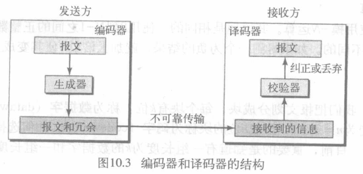

可将编码方案分为:
* 块编码(block coding)
* 卷积编码(convolution coding)
> 本节关注块编码
### 模运算(modular arithmetic)
只使用有限范围中的正整数,上限称为**模数N**
模N运算中,只使用0到N-1的整数

## 块编码(block coding)
在块编码中,把报文划分成块,每块有k位,称为**数据字**,并增加r个冗余位使其长度变为n = k + r,形成n位的块称为**码字**
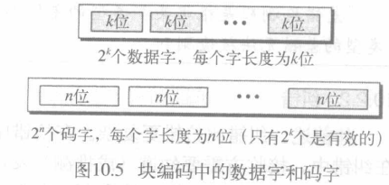

### 检错
满足以下两个条件,接收方就能检测出原码字的一个差错,就能使用块编码检测差错
1. 接收方有有效码字的列表
2. 原来码字已改变成无效的码字
> 如果码字在传输中被破坏,但接收到的码字仍然是一个有效的码字,差错则无法被检测到
检错码是为某些类型的差错而设计的,因此只能检测这些类型的差错,其它类型的差错则无法检测到

> 例
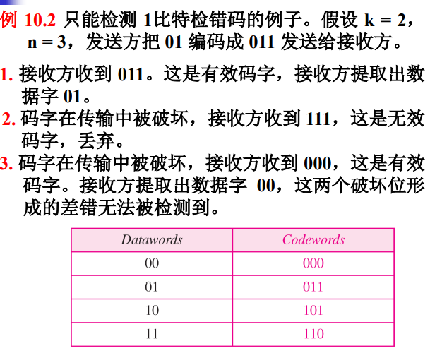

### 纠错
比检错更复杂,需要更多冗余位
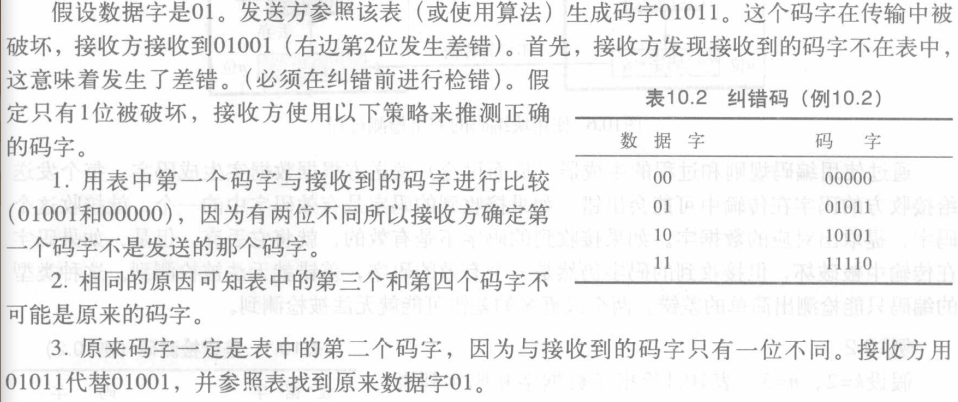

### 汉明距离
* **汉明距离**: 两个相同长度字的汉明距离是对应位不同的数量.它是差错编码的核心概念
    以`d(x, y)`表示
    两字异或,1的个数即为汉明距离
* **最小汉明距离**: 是一组字中所有可能对的最小汉明距离

>例
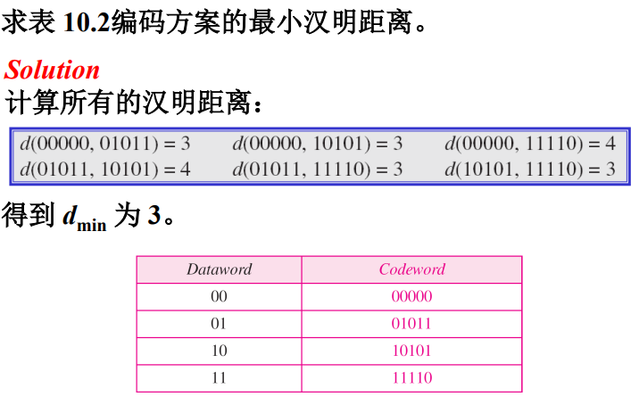

* 编码方案的三个参数:
    * 码字长度`n`
    * 数据字长度`k`
    * 最小汉明距离`dmin`
    > 编码方案写成`C(n, k)`和一个单独的`dmin`表达式
* 汉明距离和差错: 接收到的码字和发送的码字之间的汉明距离是传输中被破坏的位数
* **检错**的最小距离: 为了保证检测出最多s个错误,块编码中最小汉明距离一定是dmin = s+1
    > 如最小汉明距离为2,则只能检测单比特错误.
    这样接收到的码字才不会与有效码字匹配
* 纠错的最小距离: 决策基于区域概念
    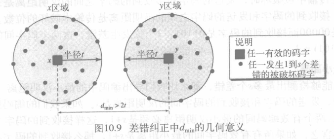
    > t是被破坏的位数 x,y是码字
    圆心是该有效码字,园内的码字可确定就是位于圆心的码字

    >为了保证最多能**纠正**t个差错,块编码中的最小汉明距离是 dmin = 2t+1

    >例
    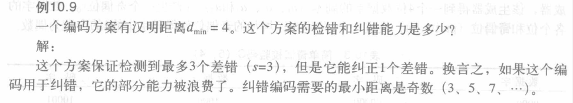

## 线性块编码(linear block codes)
几乎所有使用的块编码都属于一个称为线性块编码的子集
* 线性块编码: 由任何两个有效码字的异或产生的另一个有效码字

> 例
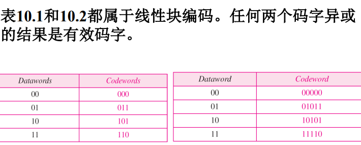

### 线性块编码的最小距离
线性块编码的最小汉明距离: 具有最小1的个数的非0有效码字中1的个数

> 例
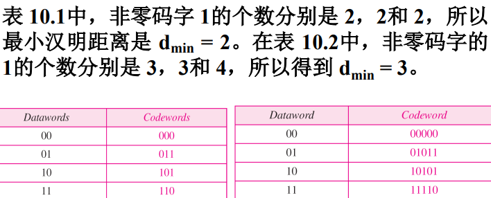

### 线性块编码例
#### 简单奇偶校验编码
n = k+1,且 dmin = 2 的单比特检错编码
增加一个奇偶位r0,使得码字中1的个数为偶数
>简单奇偶校验码能检出奇数个差错
#### 两维奇偶校验编码
分别维护行列的偶数1
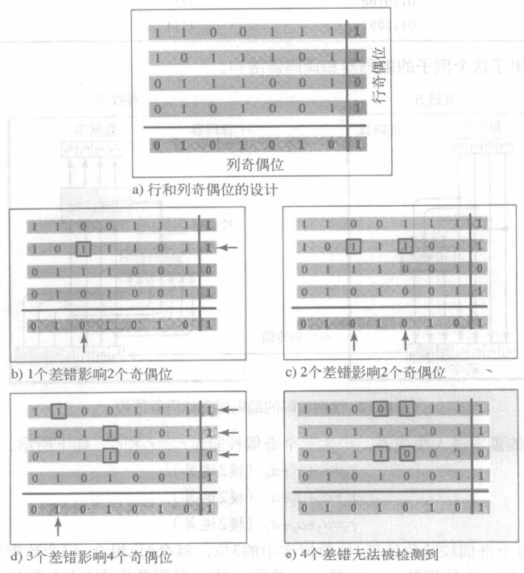
>能检测出所有3位或3位以下的错误(因为此时至少在某一行或某一列上有一位错)、奇数位错以及很大一部分偶数位错

#### 汉明编码
>本书只讨论最小汉明距离为 dmin = 3 的汉明码,它最多能检测出2位差错和最多纠正1位差错

选择 m ≥ 3 的整数,则码字长n、数据字长k和校验位r的关系为
n = 2m−1, k = n-m, r = m
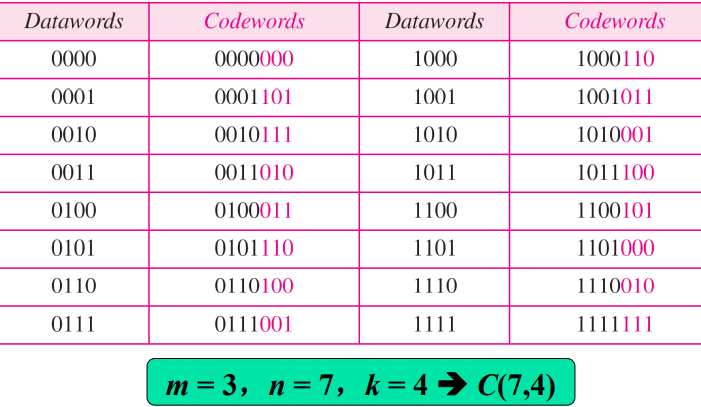
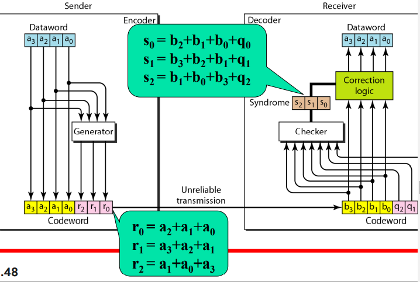
> 四位数据字副本进入生成器产生三个奇偶效验位r0-r2
每个奇偶效验位处理4位中的3位,每个奇偶效验位1+数据位3的4位组合中1的个数一定为偶数
校验器使用与生成器一样的等式,生成3位校正子,不同的位模式对应8种情况
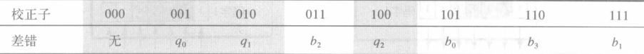
生成器不考虑阴影中4种情况(无差错或奇偶位差错,其余情况位反转)

> 例
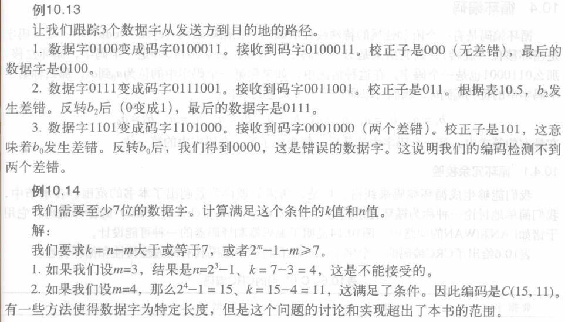

## 循环码(cyclic codes)
* **循环码**: 有一个附加性质的特殊线性块编码
    > 如果码字循环移位(旋转),其结果是另一个循环码字
### 循环冗余校验(CRC, Cyclic Redundancy Check)
C(7,4)的CRC
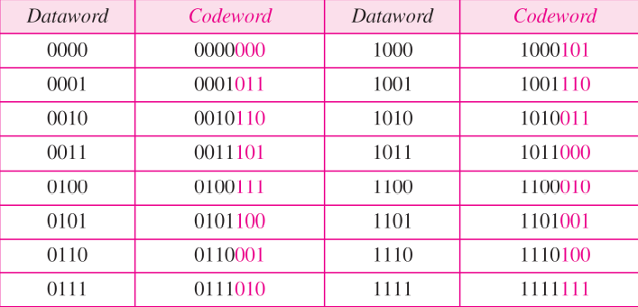

* k位数据字,n位码字,数据字右边加上 n-k 位0,变成n位后传给生成器;
* 生成器用长度为 n–k+1 的除数(自定义)去除增加长度后的数据字(模 2 除法);
* 除法的商被丢弃,余数r2r1r0加到数据字上生成码字.
* 校验器用相同的除数去除码字,得到的余数是 n-k 位校正子;
* 如果校正子全0,码字最左边k位被接收为数据字,否则丢弃
>例: 计组课本中CRC计算
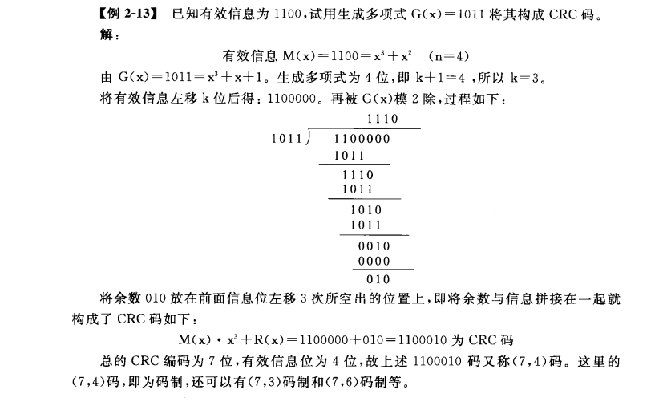

### 多项式(polynomial)
若干个0和1组成的模式可以表示为以0和1为系数的**多项式**
幂次表示位所在的位置,系数表示位的值
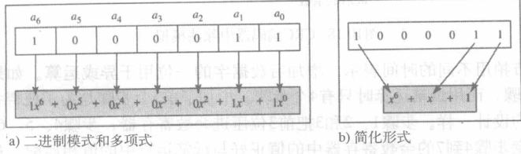

* 次数: 最高幂次
* 加减: 加减同幂次项系数(加减相同:都为删除相同项,保留不同项)
    > x5+x4+x2 +- x6+x4+x2 = x6+x5
* 项乘除: 幂次相加减
* 多项式乘: 每项分别相乘,最后删除相同项
* 多项式除: 同二进制除法
* 左移m位: 每项乘以xm
* 右移m位: 每项除以xm(没有负幂次)

> 循环码的除数通常称为生成多项式,简称生成子(生成器)

### 循环编码分析
数据字: d(x) 码字: c(x) 生成多项式: g(x)
校正子: s(x) 差错: e(x)
* 接收到的码字 = c(x) + e(x)
* $\frac{接收到的码字}{g(x)}=\frac{c(x)}{g(x)}+\frac{e(x)}{g(x)} $

>循环码中,有些可以被生成多项式 g(x) 整除的差错无法被捕捉到.(发生的概率极小)

下面说明一些特殊差错
#### 特殊差错
* 单个位差错: $e(x)=x^i $(i是差错位的位置)
    e(x)不能被g(x)整除,则差错会被捕捉
    > 若生成多项式至少有两项,且x0的系数是1,则所有单比特错误都可以检出

    > 例
    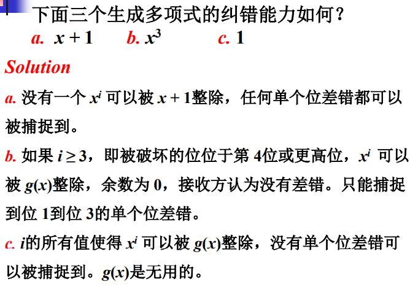
    大于最高次幂的差错不会被捕捉
* 两个独立的单个位差错: 
    $e(x) = x^i+ x^j = x^i (x^{j-i} +1) = x^i (x^t +1)$(t在多项式含有的幂次范围内)
    (i,j只表示差错的位置,j-i表示差错的距离)
    >若生成多项式不能整除 $x^t + 1$(t在0和n-1之间),那么所有独立的双比特错误都能被检测到
    
    > 例
    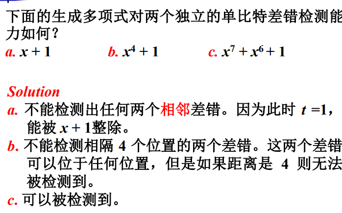
* 奇数个差错: 包含x+1因子的生成多项式能检测到所有奇数个差错
    > 如 $g(x) = x^4 + x^2 +1 = (x + 1)(x^3 + x^2 +1)$
* 突发性差错:$e(x)=x^j+...+x^i=x^i(x^{j-i}+...+1) $
    如果g(x)能检测到单个差错就不能整除$x^i$
    如果想要能整除$x^i(x^{j-i}+...+1)$,有三种情况(记$g(x)=x^r+...+1 $):
    记作 j–i = L-1
    1. L <= r,都会被检测
        所有长度小于或等于r的突发性差错都能被检测到.
    2. L = r+1, 有概率检测不到:$(1/2)^{r-1}$
    3. L > r+1, 有概率检测不到:$(1/2)^{r}$
    > 例
    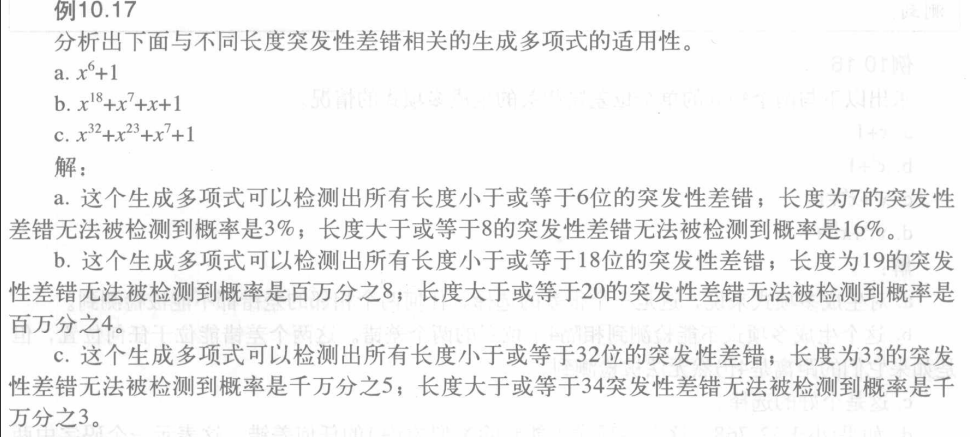
* 总结: 高性能生成多项式的特性:
    1. 至少有两项
    2. $x^0$的系数一定不为0
    3. 不能整除 $x^t + 1$（2 ≤ t ≤ n−1）
    4. 应当有因子 x+1
* 标准生成多项式
    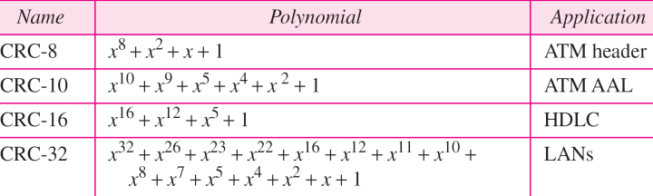

## 校验和(checksum)与反码
用校验和进行简单检错的方法常用于Internet的其它高层协议中
* **校验和**: 发送数据时,同时还发送它们的和的负数
    >(7, 11, 12, 0, 6, -36)
### 反码
数据为4位字,但和越界怎么办
* **反码**: 只使用n位表示0到$2^n-1$的无符号数字,如果数字多于n位,最左边的额外位加到最右边的n位
    > 反码的负数为该数所有位取反

    > 例: 如何用 4位表示数字21和-6？
    21的二进制数是 10101 ,将最高位1加到最低位,得到 (0101+1) = 0110 或 6.
    6的二进制数是 0110,-6对其取反,得到 1001.也可以用6的补数 (24–1) - 6 = 9,9的二进制数是1001

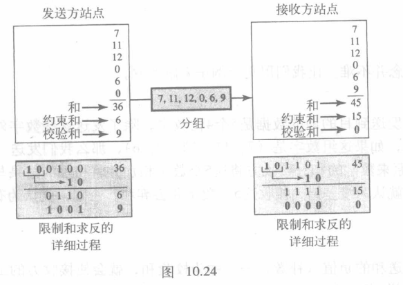

>发送方和为36不能4位表示,就用约束的效验和得到为6.
然后对和求反,结果的效验和为9(逐位取反)
发送方数据加上效验和9发送
接收方计算总和为45,约束的效验和为15,求反得到校验和为0,表示数据正常(效验和不为0即被破坏)

### 因特网校验和
* 发送方:
    1. 报文被划分为16位字.
    2. 校验和字的值设为0.
    3. 所有字包括校验和使用反码运算相加.
    4. 对这个和求反变成校验和.
    5. 校验和随数据一起发送.
* 接收方:
    1. 报文(包括校验和)被划分成16位字.
    2. 使用反码运算将所有字相加.
    3. 对该和求反码生成新校验和.
    4. 如果校验和是0,接收报文,否则丢弃

> 例
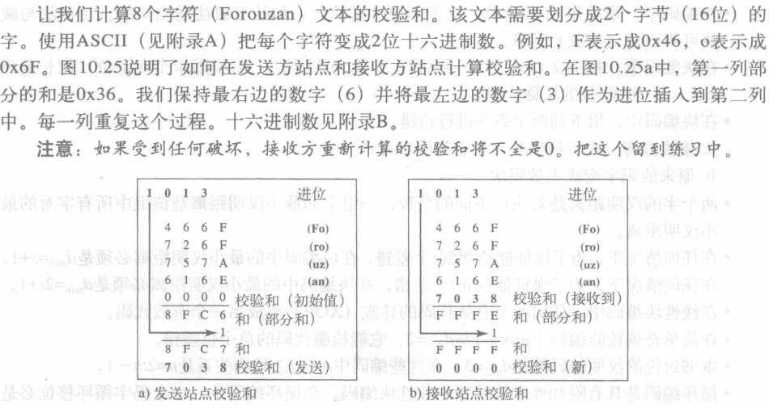
