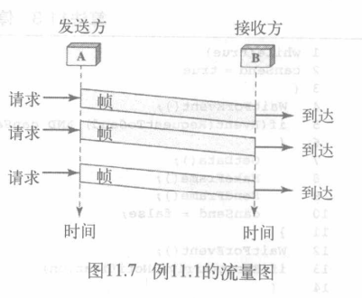
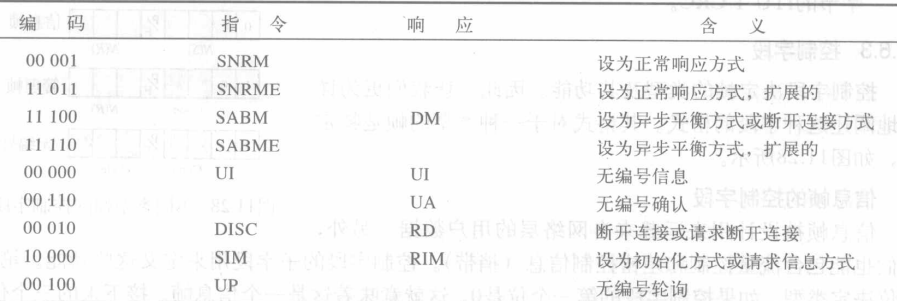

<font face = "Consolas">
数据链路层: 数据链路控制(Data Link Control)

[TOC]

****
* 数据链路层的两个主要功能:
    * 数据链路控制
        >用来处理两个邻近节点之间通信,即节点到节点通信的设计和程序,本章讲述
    * 介质访问控制
        > 如何共享链路,12章讲述
* 数据链路控制的功能: 
    * 成帧
    * 流量控制
    * 差错控制
    * 提供帧在节点之间流畅且可靠传输的软件实现协议
****

## 成帧(framing)
数据链路层需要将一组比特位组成帧,以便帧和帧之间是可以识别的
* **成帧**: 通过添加发送方地址和接收方地址,将一条从源端到目的端的报文分离开,或者将到不同目的端的报文分离开(如信封)
### 成帧的方式
#### 固定大小成帧(fixed-size framing): 
不需要定义帧的边界,通过长度本身作为分隔符(ATM广域网)
#### 可变长度成帧(variable-size framing)
需要一种方法规定帧的结束和下一帧开始
* 面向字符协议(character-oriented protocol): 
    * 用于交换文本: 
    在帧的开始和结束增加8位的标记(flag)
    * 用于其他连续信息(视频,图片等):
        >标记所用的任何模式都可能是信息的一部分

        采用**字符填充**(byte-stuffing)策略: 当数据中存在一个与标记字符或换义字符相同的字符时,添加一个额外字节的过程(称为换义字符(ESC, escape-character))
    
>面向字符协议会出问题
如Unicode有16位和32位字符,会与8位字符冲突
所以以下面向位协议是大势所趋
* 面向位协议(bit-oriented protocol)
    数据段是位序列,常用特殊8位标记0111 1110作为分隔符(标记)
    但标记的模式仍可能出现在数据中: 采用**位填充**(bit stuffing): 遇到1个0后面连续5个1时,插入一个比特0的过程,使得接收方不会误认为0111 110是帧的标记
    

## 流量控制和差错控制(flow and error control)
是数据链路层最重要的职能,通常一起称为数据链路控制
### 流量控制(flow control)
一系列程序用来限制发送方在等到确认前发送的数据数量.
接收设备需要缓冲区处理进入的数据
### 差错控制
包括差错检测和纠正,接收方提示发送方差错,并协调发送方重新传输这些帧
数据链路层中差错控制一般容易实现:通过自动重复请求(ARQ, Automatic Repeat Request): 检测到差错就重传这个错误帧

## 协议(protocols)
数据链路层如何将成帧、流量控制和差错控制结合起来,实现节点到节点间的数据传输
* 确认帧: ACK(Acknowledgement)
* 否定确认帧: NAK(Negative Acknowledgement)
> 通过捎带(piggybacking)技术被包含在数据帧中

协议分类:


## 无噪声通道(noiseless channels)
* 假定有一种不会丢失帧、复制帧或损坏帧的理想信道
包括两种协议: 不使用流量控制和使用流量控制的协议,但两种协议均不使用差错控制(假设为完美的无噪声通道)
### 最简单的协议
* 没有流量控制和差错控制
* 单向: 数据帧从发送方到接收方单方向传输
* 即时处理: 帧的处理时间忽略不计(不会超载)
    ****
设计:
    
* 无需流量控制,数据链路层直接从网络层,物理层获取数据
* 发送方,接收方处理程序不断运行
* 每一个数据分组传送称为**事件**(event)

算法:
* 发送方:
    ```c++
    while(true)                         //不断重复
    {
        Waitforevent();                 //当一个事件出现时,唤醒它
        if(Event(RequestTosend))        //有一个要发送的分组
        {
            GetData();
            MakeFrame();
            SendFrame();                //发送帧
        }
    }
    ```
* 接收方:
    ```c++
    while(true)
    {
        WaitForEvent();
        if(Event(ArrivalNotification))      //数据帧到达
        {
            receiveFrame();
            ExtractData();
            DeliverData();                  //数据发送给网络层
        }
    }
    ```

最简单的流量图: 发送方发送帧不考虑接收方
    
### 停止等待协议(stop-and-wait protocol)
* 存储帧: 到达接收方的数据帧速度大于处理速度,就需要存储帧
* 反馈: 为了避免接收方出现帧超负荷,需要让发送方减缓速度---接收方必须给发送方反馈信息
* 确认: 发送方发出一个帧后必须等待接收方的确认,才可发送下一帧
* 单向通信: 数据帧仍为单向,除了辅助的ACK帧从另一端传输
    ****
设计
    
* 有前向通道和反向通道的数据流
* 正反通道无需同时传输: 半双工链路

算法
* 发送方: 
    ```c++
    canSend = true;                     //允许发送第一个帧
    while(true)
    {
        WaitForEvent();                 //出现事件唤醒
        if(Event(RequestToSend) and canSend)
        {
            GetData();
            MakeFrame();
            SendFrame();                //发送数据帧
            canSend = false;            //不能发送直到ACk到达
        }
        WaitForEvent();                 //出现事件唤醒
        if(Event(ArrivalNotification))  //ACK到达
        {
            ReceiveFrame();             //接收ACK帧
            canSend = true;
        }
    }
    ```
    >发送一个帧后,发送方忽略其他网络层的请求指导该帧被确认
* 接收方:
    ```c++
    while(true)
    {
        WaitForEvent();
        if(Event(ArrivalNotification))      //数据帧到达
        {
            receiveFrame();
            ExtractData();
            Deliver(data);                  //数据发送给网络层
            SendFrame();                    //发送ACK帧
        }
    }
    ```
    > 多了一步发送ACK帧

停等协议流量图: 发送方等待ACK帧
    
> 图中发送两个帧设计发送方4个事件,接收方2个事件

## 有噪声通道(noisy channels)
无噪声通道不存在,差错不能忽略,需添加差错控制
### 停止等待自动重复请求(停等ARQ, Stop-and-Wait Automatic Repeat Request)
在停等协议中加入简单的差错控制
* 给数据帧加上冗余位
* 损坏帧被无声丢弃(不发送ACK)
* 丢失帧较难处理: 为帧编号,接收到无序的数据帧意味帧丢失或是被复制的帧
> 损坏帧和丢失帧都需重发: 发送方保留已发送帧的副本并维护一个定时器,定时器到时且未收到ACK则重发该帧,重复操作
* ACK帧也会损坏丢失: ACK帧也需冗余位和序列号
> 发送方简单的丢弃损坏的ACK帧或忽略无序帧

序列号逻辑: 以发送了序列号为x的帧:
* 安全到达发送确认: 发送方发送x+1帧
* 安全到达,ACK损坏丢失: 超时后重发x帧(重复帧),接收方确认这一事实
* 未到达: 超时后重发x帧
> 序列号基于模2运算

确认号逻辑: 确认号总是以模2运算告知接收方期待的下一帧的序列号
*   
    ****
设计
    
> 接收方有控制变量Rn保存下一个期待接收到的帧的编号,发送方Sn保存已发送未确认帧的序列号,
帧发送时Sn递增(模2)(1->0,0->1),接收时Rn递增(模2)

算法:
* 发送方:
    ```c++
    Sn = 0;                                     //帧0最先发出
    canSend = true;
    while(true)
    {
        WaitForEvent();                         //出现事件唤醒
        if(Event(RequestToSend) and canSend)
        {
            GetData();
            MakeFrame(Sn);                      //序列号为Sn
            StoreFrame(Sn);                     //保留副本
            SendFrame(Sn);                      //发送数据帧
            StartTimer();
            ++Sn;
            canSend = false;                    //不能发送直到ACk到达
        }
        WaitForEvent();                         //出现事件唤醒
        if(Event(ArrivalNotification))          //ACK到达
        {
            ReceiveFrame(ackNo);                //接收ACK帧
            if(not corrupted and ackNo == Sn)   //有效ACK
            {
                StopTimer();
                PurgeFrame(S_{n-1});            //不需要的副本
                canSend = true;
            }
        }
        if (Event(TimeOut))                     //超时
        {
            StartTimer();
            ResendFrame(S_{n-1});               //发送副本检查
        }
    }
    ```
    > Sn是待发送的帧的序列号,每发送一个帧后递增(模2运算,为0101)
    有缓冲区保存帧的副本
* 接收方:
    ```c++
    Rn = 0;
    while(true)
    {
        WaitForEvent();
        if(Event(ArrivalNotification))      //数据帧到达
        {
            receiveFrame();
            if(corrupted(frame))            //坏帧则忽略
                sleep();
            if(seqNo == Rn)                 //有效数据帧
            {
                ExtractData();
                DeliverData();              //数据发送给网络层
                ++Rn;
            }                
            SendFrame(Rn);                  //发送ACK帧
        }
    }
    ```
    > Rn为期待接收到的序列号,接收到的帧序列号为Rn是才接收
    即使与Rn不匹配也会发送ACK用于确认前一个ACK(可能是接收方认为先前ACK丢失发送方才重发的)

停等ARQ流量图:
    
>第0帧发送并确认;
第1帧丢失,超时后重传;
重传的第1帧确认,定时器停止计时;
第0帧发送,但确认帧丢失;
超时后,再次重传第0帧,并被确认;

> 例


* 流水线: 停等ARQ需要等待ACK,不可流水线

###  回退N帧ARQ接收窗口(Go-Back-N ARQ)
为提高传输效率,采用流水线操作
出问题时重发窗口内所有帧
* 序列号: 头部允许m位序列号,为模$2^m$
* 发送/接收**滑动窗口**(sliding window): 发送方,接收方关心的序列号范围
    * 窗口是一个抽象概念,通过三个变量来定义:
        * $S_f$: 发送窗口第一个待处理帧
        * $S_n$: 发送窗口下一个待发送帧
        * $S_{size}$: 发送窗口大小(一般取2m − 1)
    * 发送窗口将这些序列号分成4部分:
        1. 最左端--窗口左墙:  已被确认的帧的序列号
        2. 阴影部分: 已发送,但未确认
        3. 空白部分: 能被发送的帧,但还未接收到
        4. 右墙--最右端: 不能发送的帧,直到窗口滑动才可使用
    * 当ACK到达时,发送窗口滑动一个或者多个帧时隙(一个ACK可确认一个以上的帧)
        发送窗口:
        
    
    * 接收窗口的大小始终为1,用Rn定义了大小为1的接收窗口.正确的帧到达时,接收窗口滑动到下一个时隙
    接收窗口: 
    
* 确认: 
    * 当一个帧安全有序到达时,接收方发送肯定的确认
    * 如果一个帧被损坏或收到时次序颠倒了,接收方不响应,丢弃所有后来的帧直到收到一个期待帧
    * 接收方不响应使得不被确认帧的定时器过期,发送方从此帧开始重发所有帧
        > 如发送帧6时帧3定时器到期,则重发3456
    * 接收方发送一个累积确认
*   
    ****
设计
    
>多个帧在前向方向传输,在反向传输多个确认

发送窗口大小
    
>发送窗口必须小于$2^m$,如图m=2
=3,小于时假如3个ACK丢失,帧0计时器到时时重发012,但接收方期待帧3于是不响应,正确舍弃
=4,等于时假如4个ACK丢失,发送方重发0123,接收方已经接收了0123期待下一轮的帧0,但发送的是这轮的帧0,产生差错

算法
* 发送方:
    ```c++
    Sw = 2^m - 1;                       //发送窗口大小
    Sf = 0;                             //发送窗口待确认帧
    Sn = 0;                             //发送窗口待发送帧
    while(true)
    {
        WaitForEvent();
        if(Event(RequestToSend))        //发送包
        {
            if(Sn-Sf >= Sw)             //窗口满则等待
                sleep();
            GetData();
            MakeFrame(Sn);
            StoreFrame(Sn);
            SendFrame(Sn);
            ++Sn;
            if(timer not running)
                StartTimer();
        }
        if(Event(ArrivalNotification))   //ACK到达
        {
            Receive(ACK);
            if(corrupted(ACK))
                sleep();
            if((ackNo>Sf)&&(ackNo<=Sn>)) //有效ACK
                while(Sf <= ackNo)       //该ACK前的帧的副本可删除
                {
                    PurgeFrame(Sf);
                    ++Sf;
                }
                StopTimer();
        }
        if(Event(TimeOut))               //计时器超时
        {
            StartTimer();               //启动新的计时器
            Temp = Sf;
            while(Temp < Sn)             //重发Sf--Sn内的帧
            {
                SendFrame(Sf);
                ++Sf;
            }
        }
    }
    ```
    > 接收到的ACKNo属于待确认帧,就清除该帧左边的待确认帧副本并将窗口左墙移到右边
* 接收方
    ```c++
    Rn = 0;
    while(true)
    {
        WaitForEvent();
        if(Event(ArrivalNotification))  //数据帧到达
        {
            Receive(Frame);
            if(corrupted(Frame))
                sleep();
            if(seqNo == Rn)             //为期望帧
            {
                DeliverData();          //传送数据
                ++Rn;
                SendACK(Rn);            //滑动窗口
            }
        }
    }
    ```
    > 忽略损坏,失序帧

> 例: ACK延迟,丢失

虽然ACK2丢失,但ACK3也表示帧2收到了
7个发送方事件,4个接收方事件

> 例: 数据帧丢失

帧1丢失,接收方丢弃失序帧23,定时器到时后重发帧123(重发是一个事件,必须得整个事件完成后才会处理别的事件,包括ACK)

回退N帧ARQ与停等ARQ比较:
* 停等ARQ是窗口大小为 1 的回退N帧ARQ的特殊情况

回退N帧ARQ的问题: 
* 接收方只有一个变量,不能解决帧失序问题;
* 在有噪声信道效率低下,因为需要重发多个帧

### 选择性重复ARQ(Selective Repeat ARQ)
接收方通过NAK请求重发某帧,接收方窗口存储,批量ACK
发送帧损坏时不必重发N个帧,但接收方程序更复杂
* 窗口: 
    * 尺寸更小,<=$2^{m-1}$
    * 接收窗口和发送窗口大小一样
    > 并行性减少,但副本帧少了很多
    允许接收窗口帧乱序到达

    
*   
    ****
设计


窗口大小为何为<=$2^{m-1}$
假设m=2
    
> 窗口大小=2时,ACK01丢失,定时器到时时帧0重发,但接收方期待帧2,正确舍弃
窗口大小=3时,ACK012丢失,重发帧0,接收方期待下一轮的帧0,出错

算法
* 发送方:
    ```c++
    Sw = 2^m - 1;                       //发送窗口大小
    Sf = 0;                             //发送窗口待确认帧
    Sn = 0;                             //发送窗口待发送帧
    while(true)
    {
        WaitForEvent();
        if(Event(RequestToSend))        //发送包
        {
            if(Sn-Sf >= Sw)             //窗口满则等待
                sleep();
            GetData();
            MakeFrame(Sn);
            StoreFrame(Sn);
            SendFrame(Sn);
            ++Sn;
            StartTimer();                //每帧的发送都启动一个计时器
        }
        if(Event(ArrivalNotification))   //ACK或NAK到达
        {
            Receive(frame);
            if(corrupted(frame))
                sleep();
            if(FrameType == NAK)         //为NAK则重发
                if(nakNo between Sf and Sn)
                {
                    ReSend(nakNo);
                    StartTimer(nakNo);
                }
            if(FrameType == ACK)         //为ACK则删除副本,滑动窗口
                if(ackNo between Sf and Sn)
                {
                    while(Sf < ackNo)
                    {
                        Purge(Sf);
                        StopTimer(Sf);
                        ++Sf;
                    }
                }
        }
        if(Event(TimeOut(t)))             //计时器超时
        {
            StartTimer(t);                //启动新的计时器
            SendFrame(Sf);

        }
    }
    ```
    > 每帧的发送都启动计时器
    NAK表示重发请求
* 接收方
    ```c++
    Rn = 0;
    NakSent = false;
    AckNeeded = false;
    Repeat(for all slots)
        Marker(slot) = false;
    
    while(true)
    {
        WaitForEvent();
        if(Event(ArrivalNotification))
        {
            Receive(Frame);
            if(corrupt(Frame))&&(not NakSent)   //有错且未申请重发
            {
                SendNAK(Rn);                    //发送NAK
                NakSent = true;
                sleep();
            }
            if(seqNo != Rn)&&(not NakSent)      //seqNo不是当前Rn且未申请重发
            {
                StoreFrame(seqNo);
                Marked(seqNo) = true;
                while(Marked(Rn))
                {
                    DeliverData(Rn);
                    Purge(Rn);
                    ++Rn;
                    ACkNeeded = true;
                }
                if(AckNeeded)
                {
                    SendAck(Rn);
                    AckNeeded = false;
                    NakSent = false;
                }
            }
        }
    }
    ```
    > NakSent 为了不使另一端因NAK超负荷
    AckNeeded 明确何时需要发送一个ACK
    相应帧到达且保存了会标记,收到损坏帧且NAK未被发送就发送一个NAK表示未收到期待帧.
    好帧且在窗口中就保存并标记
    如果Rn开始相邻的帧都被标记就发送ACK,滑动窗口
    
    有颜色代表ACK已确认,白色代表无确认

>例: 帧丢失

每个帧有单独的定时器,ACK到达停止,NAK到达重启
接收到未期待但在窗口内的帧就保存发送Rn的NAK,请求重发Rn
继续用ACK请求当前Rn

### 捎带
以上三个协议都是单向的
现实中数据帧,控制信息通常可双向流动
* 使用捎带的回退N帧ARQ
    

## 高级数据链路控制协议(HDLC, High-level Data Link Control)
一种面向比特的数据链路协议,支持点到点链路和多点链路.具体实现了本章讨论的各种ARQ协议
* 具有两种通用传输模式:
    * 正常响应方式(NRM, Normal Response Mode)
        >有主站,从站,主站只发送指令,从站只响应
    * 异步平衡方式(ABM, Asynchronous Balanced Mode)
        > 点到点,每个站点平等,都可发送指令/响应
        常用
### HDLC帧
三种类型的帧:
* 信息帧(I-frames, information frames)
* 管理帧(S-frames, supervisory frames)
* 无编号帧(U-frames, unnumbered frames)
    
    >每个帧最多包含六个字段
    一帧的结束标记可作下一帧的开始标记

字段含义:
* 标记字段: 8位序列,模式是0111 1110,可作为开始也可作为结束,为接收方提供同步模式
* 地址字段: 去往/来自地址
* 控制字段: 1或2字节,用于流量控制和差错控制,解释取决于帧类型
* 信息字段: 来自网络层的用户数据,管理信息
* 帧校验序列字段: 差错校验字段,可包含2-4字节的 ITU-T CRC

#### 控制字段
决定帧的类型和功能
    
* 信息帧的控制字段
    0 -1位 | N(s) -3 | P/F -1 | N(R) -3
    -|-|-|-
    表示为信息帧|定义帧序号|=1时有意义(意味轮询(主->从)或终止(从->主)|使用捎带时与确认号对应
    运载来自网络层的用户数据,包含流量控制和差错控制信息(捎带)
* 管理帧
    10表示管理帧,N(R)与ACK或NAK对应
    code两位决定管理帧类型:
    * 准备接收RR,字段标识是00
    * 不准备接收RNR,字段标识是10
    * 拒绝接收REJ,字段标识是01
    * 选择性拒收SREJ,字段标识是11
* 无编号帧
负责在连接设备间交换会话管理和控制信息
code2+3产生32种类型:
    
    

* 异步平衡方式下,使用无编号帧建立链路连接和断开链接
    
* 无差错捎带情况
    
* 有差错捎带情况
    

## 点到点协议(PPP,P2P, Point-to-Point Protocol)
高级数据链路控制协议是点到点和点到多点都能使用的一个通用协议
但最通用的协议还是点到点协议,使用面向字节的方式
* 点到点信道: 一条链路上就一个发送端和接收端的信道,通常用在广域网链路
* PPP协议特点:
    * 简单: 不提供可靠传输,无重传机制,网络开销小,速度快
    * 封装成帧: 首部和尾部,帧开始符,帧结束符
    * 透明传输: 可传输任意比特组合的数据,加转义字符,收到后去掉转移字符
    * 差错检测: CRC计算帧校验序列FCS
    * 支持多种网络层协议: IPv4和IPv6网络层协议都可以封装到PPP帧中
    * 多种类型链路: 光纤、铜线,同步传输、异步传输,串行、并行链路均可
    * 最大传送单元: 1500字节
    * 网络层地址协商: 能够为拨号的一端分配IP地址、子网掩码、网关和DNS
    * 数据压缩协商
### 成帧
* 帧的格式
    
    * 标记: 0111 1110 标记开始和结束
    * 地址: 为常量1111 1111,可协商省略
    * 控制: 常量1100 0000,因PPP不许流量控制,差错控制也很少,可协商忽略
    * 协议: 数据字段的属性
    * 有效载荷: 用户数据或其他信息
    * 帧效验序列: 2-4字节标准CRC
* 字节填充
PPP作为面向字节的协议,标记是一个字节(数据部分相同模式转义,转义字节为0111 1101)
### 传输阶段
* PPP连接,转换阶段的状态迁移图
    
    * 闲置: 链路未使用
    * 建立: 有节点在通信
    * 鉴别: 可选,发送一些鉴别信息分组
    * 联网: 网络层协议协商
    * 打开: 进行数据传输
    * 终止: 终止连接,两端交换分组以消除关闭链路
### 多路复用
PPP也使用其他协议来建立链路
链路控制协议(LCP), 两个鉴别协议(AP), 多个网络控制协议(NCP)
    
* 链路控制协议(LCP): 负责建立、维护、确认并终止链路
    
    编码字段的信息分组:
    
    ****
* 鉴别协议(AP): 使一个需要访问一系列资源的用户的身份合法化
    * 常用选项: 

    PPP有两种鉴别协议:
    * 口令鉴别协议(PAP, Password Authentication Protocol) 
        1. 需要访问系统的用户发送一个鉴别身份(通常是用户名)和一个口令.
        2. 系统检测身份和口令的合法性,并选择接收连接或拒绝连接

        PAP使用的三种类型的分组:
        
    * 查询握手认证协议(CHAP, Challenge Handshake Authentication Protocol)
        1. 系统发送给用户一个包含查询值(通常是一些字节)的查询分组
        2. 用户应用一项预定义功能,根据查询值和用户自身的口令产生一个结果.用户将结果放入一个响应分组发送给系统
        3. 系统同样操作.它应用同样的功能,使用户的口令(系统已知的)和查询值产生一个结果.如果这个结果与响应分组中发送的结果相同,访问被允许:否则,访问被拒绝
        >CHAP比PAP安全得多,特别是当系统不断地更换查询值时.甚至当入侵者得知查询值和结果时,口令始终是保密的

        CHAP使用的分组:
        
        ****
* 网络控制协议NCP
    * ICPC(互联网络协议控制协议): 一种网络控制协议,配置用于承载IP分组的链路
    ICPC分组格式:(协议字段为0x8021)
    
* 来自网络层的数据

### 多链路PPP
单个点到点链路种多通道的实用性促使了多链路PPP的发展
一个PPP逻辑帧被分割成许多个实际的PPP帧


>例

