
数据链路层: 多路访问(Multiple Access)

[TOC]

通道可能不是专用的.
数据链路层有两个子层: 上子层负责数据链路控制,下子层负责解决对共享介质的访问(专用通道不许下子层)
* 多路访问控制协议:
    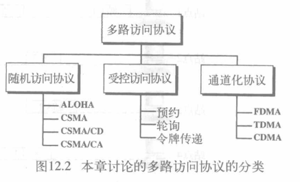
## 随机访问(random access)(竞争访问)
* 平等: 在随机访问或竞争访问方式中,没有一个站点是优于其它站点的,也不能控制其它站点
    站点请求发送数据用协议定义的程序来决定是否发送
### ALOHA
最早的随机访问方法
#### 纯ALOHA(pure ALOHA)
只要站点有帧要发送,就发送帧
>问题
只有一条共享通道,不同站点间的帧可能发生冲突
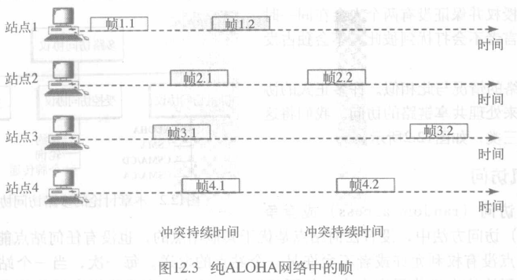
只有帧1.1 3.2成功发送: 只要一个帧的一个位与另一帧的一个位同时存在于通道种就会产生冲突,两个帧都会损坏

* 重发损坏帧
* 依赖于接收方的确认
* 每个站点在重发帧之前都会随机等待一个时间(补偿时间TB)(解决都同时重发从而又损坏)
* 一个站点经过最大次数(Kmax)的重发尝试后必须放弃,以后再试
 

* 流程图:
    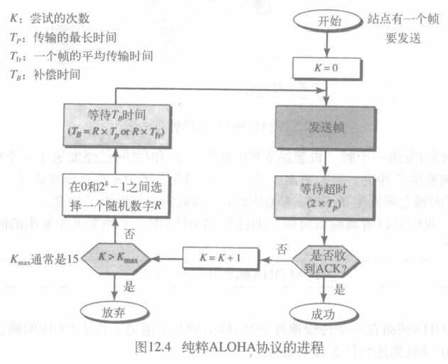

>例
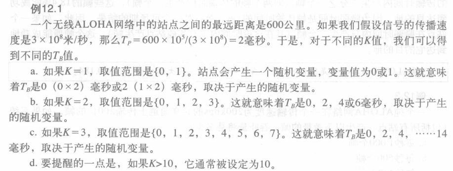

* 脆弱时间(vulnerable time): 可能发生冲突时间的长短
    假设站点发送固定长度的帧,每帧发送时间是Tfr秒
    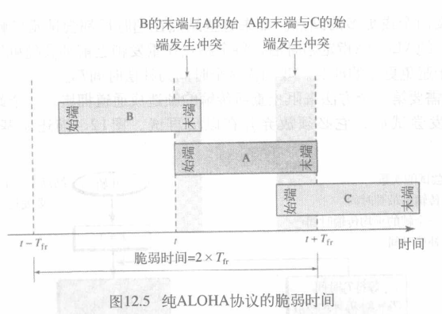
    > 可看到脆弱时间 = 2×Tfr
>例

* 吞吐量 $S=G×e^{-2G}$
    G: 一个帧传输时间内系统产生的帧的平均数量
    G= (1/2)时,最大吞吐量为Smax = 0.184

#### 时隙ALOHA(slotted ALOHA)
把时间分割成Tfr秒的时隙,并强制站点只有在时隙开始之时オ能发送
    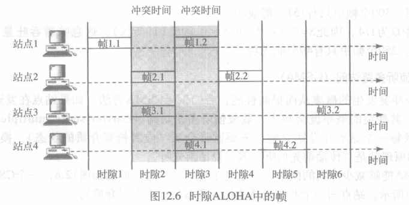
> 减少了ALOHA冲突

* 脆弱时间 = Tfr
* 吞吐量 $S=G×e^{-G}$
    G = 1时,最大吞吐量Smax = 0.368

### 载波侦听多路访问CSMA(Carrier Sense Multiple Access)
* 为了减少冲突概率: 每一个站点在发送前先要监听介质,以减少冲突发生的概率
* CSMA中冲突的时空模型
    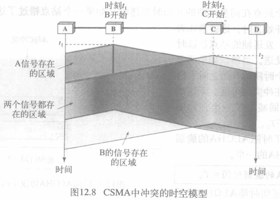
* 冲突仍存在: 因传播的延迟
* 脆弱时间 = $Tp$(传播时间,信号从介质的末端到另一端的传播时间)

通道繁忙或者空闲的站点行为:
    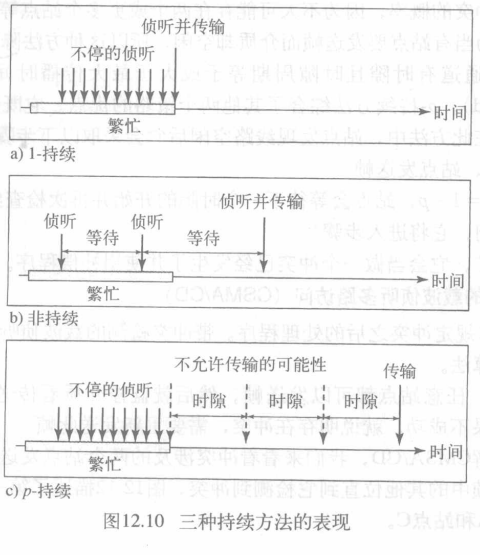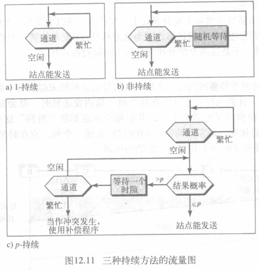
* 1-持续: 侦听线路,直到站点空闲则立刻传输
    >优点 : 信道利用率高,只要信道空闲,站点就可以发送数据;
    缺点 : 如果有多个站点要发送数据,就会发生冲突
* 非持续: 如空闲立即传输;忙则等待一个随机时间再次侦听
    > 优点 : 随机时间后,监听重发机制,减少发生冲突的可能性;
    缺点 : 可能存在所有站点都在等待的场景,此时信道处于空闲状态,信道利用率降低
* p-持续: 如通道有时隙且时隙周期 >= 最大传播时间:
    如空闲p概率传输,1−p概率等到下一个时隙再传输,忙则等待随机时长后继续监听
    >优点 : 既能像 “非坚持 CSMA” 那样减少冲突,又能像“1-坚持 CSMA”那样减少媒体空闲时间
    缺点 : 如果发生冲突后,会坚持将数据帧发送完毕,造成了浪费 

### 带冲突检测的载波监听多路访问CSMA/CD
* CSMA没有规定冲突处理程序,CSMA/CD给出了处理算法: 
    任意站点都可以发送帧,之后监控介质查看传送是否成功:
    * 如果成功,站点完成发送;
    * 如果不成功,说明存在冲突,需要重新发送此帧
* 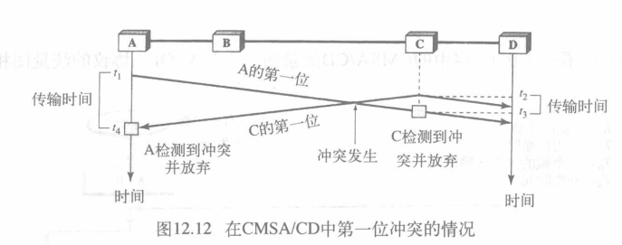

    * t1: 站点A发送帧
    * t2: 站点C未监听到A已经发送帧(第一位还没送到),C也开始发送帧
    * t3: C接收到A的第一位,检测到冲突.C马上放弃传输
        > C传输持续时间为t3-t2
    * t4: A收到C的第一个位,检测到冲突,A马上放弃传输
        > A传输持续时间为t4-t1
    > 因此想要避免冲突,帧的长度必须大于这些持续的时间段

* 帧的最小长度: 必须在发送帧的最后一位之前检测到冲突放弃传输(一旦整个帧发送了就不保留副本)
    因此帧传输时间$T_{fr}$至少为最大传播时间T$_p$的两倍
    > 最坏情况: 两冲突站点距离最远,互相到达需要Tp时间(1->2 Tp),冲突到达站点还需要Tp时间(2->1 Tp)
>例
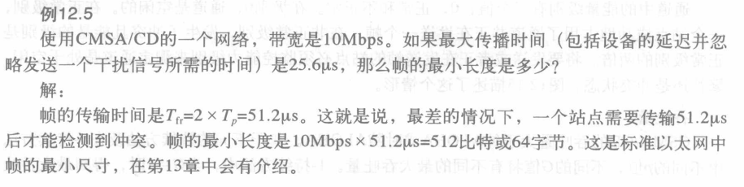

* 流程图:
    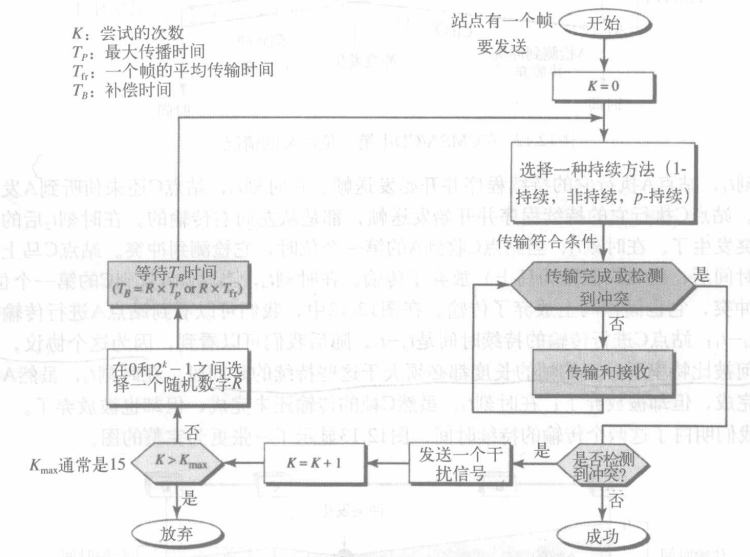
    >与ALOHA类似,区别:
    • 增加了持续程序: 选择性传输
    • 不是整个帧传输
    • 发送干扰信号加强冲突,使得冲突被其他站点检查
* 能量级别
    通道中的能量级别有三个值:
    * 0: 通道空闲
    * 正常: 一个站点成功占用通道并正在发送一个帧
    * 非正常: 发生冲突,且能量级别时正常的2倍
    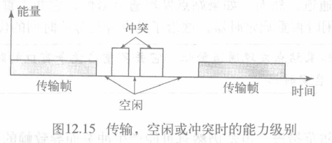
* 吞吐量 
    大于ALOHA,具体基于不同的持续方法

### 带冲突避免的载波侦听多路访问CSMA/CA(Carrier Sense Multiple Access with Collision Avoidance)
CMSA/CD在冲突发生时站点接收到两种信号: 自身信号,第二个站点传输的信号. 两种信号能量差不多
为了区分以上两种情况,应使这两者能量明显不同: 来自第二个站点的信号需要为第一个站点产生的信号增加大量的能量
但在无线网络中,能量丢失严重,无法检测到冲突的能量增加
所以需要CSMA/CA: 避免冲突

* 帧间间隔(IFS, Interframe Space)
    即使通道空闲,站点也不马上发送而是等待一段时间(帧间间隔)
    >因为可能有远处站点已经开始传输了

    如果在IFS事件后仍空闲,站点再等待一段竞争时间,后可发送
    > IFS长短也可区分站点的优先级
* 竞争窗口(Contention Window)
    将时间分割成时隙,预发送站点选择一随机时隙作为等待的时间
    >时隙数量根据情况动态变化
    
    等待后,如发现通道忙则停止计时器并侦听直到空闲再重启计时器
    >给了站点最长等待时间优先权
* 确认
    仍可能发生冲突导致帧破坏或传输中数据损坏.加入确认机制确保接收方收到帧
* 流程图
    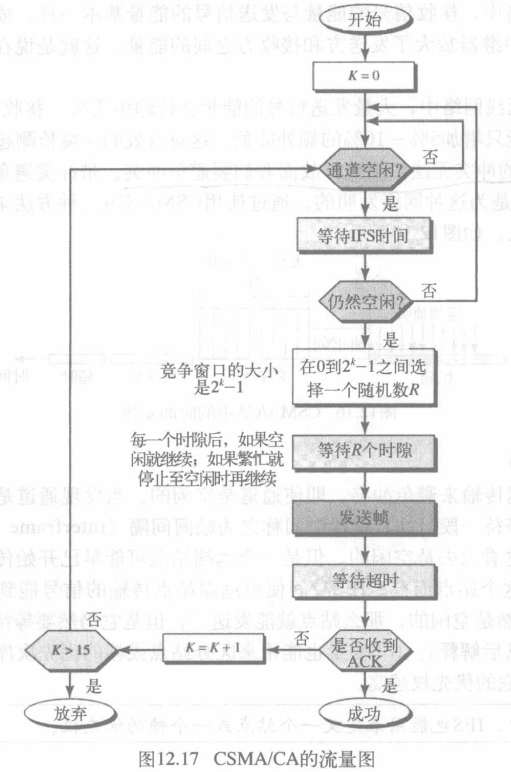

## 受控访问(controlled access)
站点之间相互协商以确定哪个站点有权发送
介绍三种受控访问方法
### 预约(reservation)
时间划分为时隙,在每个时隙内,在数据帧之前先发送一个预约帧
>如有N个站点,预约帧中就有N个预约子时隙,每个站点在自己的预约子时隙中做预约

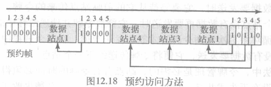

### 轮询(polling)
存在主站,所有数据交换通过主站点进行,主设备控制链路,从设备只跟随其指令工作
* 轮询: 主设备希望接收时,就询问从设备是否有数据要发送
    > Poll->NAK
    Poll->Data->ACK
* 选择: 主设备希望发送时,就通知从设备准备接收
    >SEL->ACK->Data->ACK

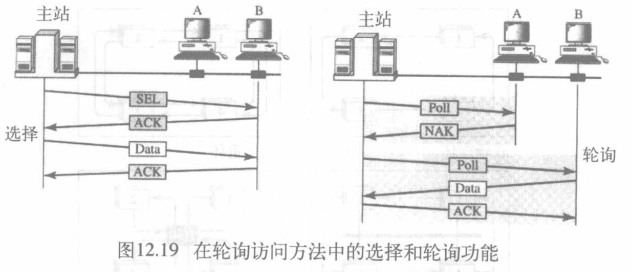

### 令牌传递(token-passing)
站点组织在一个逻辑环中(每个站点都有前驱,后驱)

* 令牌(token): 一个特殊的信息分组,在环中循环,表示访问权限
    目前站点的令牌由前驱站点传递,该站点没有待发送数据时就将令牌传递给后继站点
> 站点占有令牌时间必须限制
令牌必须得到监控确保没有丢失或损坏
令牌也可加入优先级
* 逻辑环: 环只需是逻辑的
    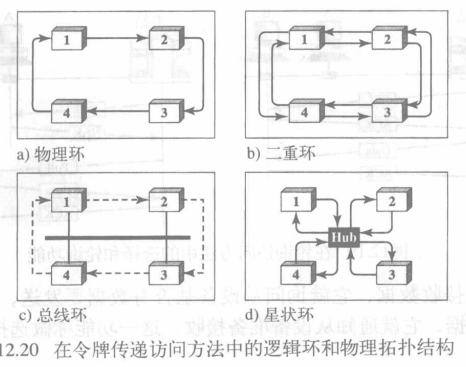

## 通道化(channelization)
通道化也是一种多路访问方法: 不同站点之间在时间域上、频率域上或码域上正交化来共享信道
主要包括下面三种方式
### 频分多路访问(FDMA, Frequency-division multiple access)
可用带宽划分成频带,每个站点都有专属,独有的频带传输数据
每个站点也是用带通滤波器限制传输器的频率
* 防护频带: 通过小的防护频带将指定波段分开以防止冲突

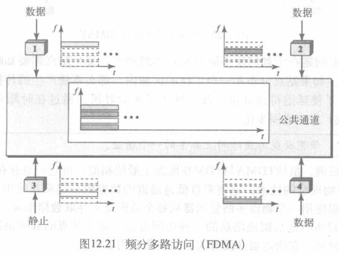

> FMDA与FDM: FDM是物理层技术,组合低带宽通道
FDMA是数据链路层的访问方法
### 时分多路访问(TDMA, Time-division multiple access)
所有站点在时间上共享通道的带宽: 每个站点分配一个时隙,只有在这一时隙内才能发送数据
* 主要问题: 如何使不同站点达到同步(如何使所有站点知晓自身时隙(存在传播延迟))
* 保护时间: 在时隙开始点插入同步位(前导位)完成同步化(延迟补偿)
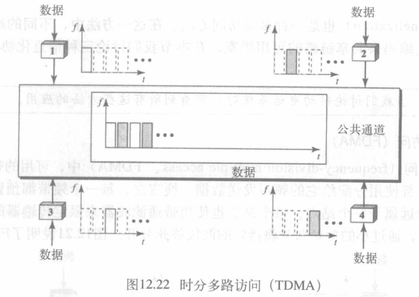
> TDMA与TDM: TDM物理层技术,将低速通道数据组合成高速通道,使用物理多路复用器从每个通道交叉存取数据单元
TDMA: 数据链路层的访问方法

### 码分多路访问(CDMA, code-division multiple access)
一个通道同时承载所有传输: 所有站点可同时发送数据(使用不同编码)
    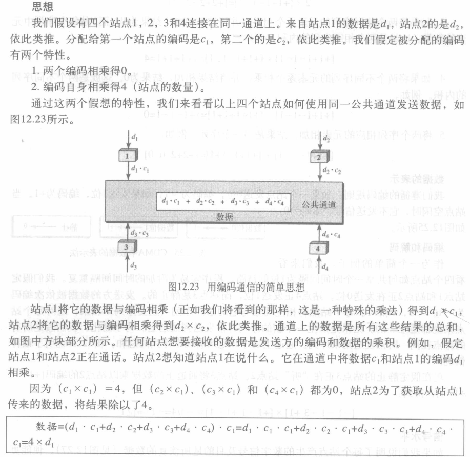

## 多址技术和复用技术
多址技术: 
* 用来区分不同用户的一种技术,属于数据链路层的一种访问方法;
* 为了使用户地址之间互不干扰,地址之间必须满足相互正交

复用技术: 
* 多个信息源共同使用同一个物理资源(如一条物理通道),并且互不干扰,属于物理层的一种技术;
* 复用是指“多个共同使用”的意思,存在多路复用器

关系
* 通信的目的是让多个信息源发出的信号在同一物理或逻辑信道上不要发生冲突,和平共处,共同分享信道资源,并安全到达目的地
* 多址的“址”在移动通信中是指用户临时占用的信道,多址就是要给用户动态分配一种地址资源——信道,当然这种分配只是临时的
* 多址技术是要根据不同的“址”来区分用户;复用是要给用户一个很好的利用资源的方式.“复用针对资源,多址针对用户”
* 多址需要用复用来实现

 