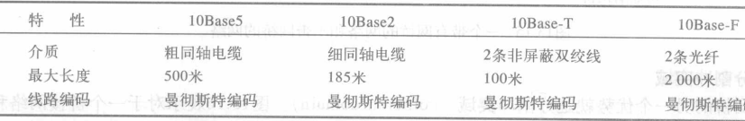

有线局域网:以太网(Ethernet)

<!-- @import "[TOC]" {cmd="toc" depthFrom=1 depthTo=6 orderedList=false} -->

<!-- code_chunk_output -->

- [IEEE标准](#ieee标准)
  - [数据链路层](#数据链路层)
    - [逻辑链路控制层LLC](#逻辑链路控制层llc)
    - [介质访问控制层MAC](#介质访问控制层mac)
- [标准以太网](#标准以太网)
  - [MAC子层](#mac子层)
    - [帧格式](#帧格式)
    - [以太网地址](#以太网地址)
    - [单播地址,多播地址,广播地址](#单播地址多播地址广播地址)
    - [时隙和冲突](#时隙和冲突)
  - [MAC帧格式](#mac帧格式)
  - [物理层](#物理层)
    - [10Base5: 粗缆以太网](#10base5-粗缆以太网)
    - [10Base2: 细缆以太网](#10base2-细缆以太网)
    - [10Base-T: 双绞线以太网](#10base-t-双绞线以太网)
    - [10Base-F: 光纤以太网](#10base-f-光纤以太网)
    - [总结](#总结)
- [标准的变化](#标准的变化)
  - [桥接以太网](#桥接以太网)
  - [交换式以太网](#交换式以太网)
  - [全双工以太网](#全双工以太网)
- [快速以太网](#快速以太网)
  - [MAC子层](#mac子层-1)
  - [物理层](#物理层-1)
  - [总结](#总结-1)
- [千兆以太网](#千兆以太网)
  - [物理层](#物理层-2)
  - [总结](#总结-2)
- [万兆以太网](#万兆以太网)
- [总结](#总结-3)

<!-- /code_chunk_output -->

以太网是一种传输速率为10Mbps的常用局域网（LAN）标准。所有计算机被连接一条同轴电缆上，采用具有冲突检测的载波监听多点访问技术（CSMA/CD）的方法，采用竞争机制和总线拓朴结构。
以太网具有的一般特征概述如下:
* 共享媒体：所有网络设备依次使用同一通信媒体。
* 广播域：需要传输的帧被发送到所有节点，但只有寻址到的节点才会接收到帧。
* CSMA/CD：以太网中利用载波监听多路访问/冲突检测方法来防止更多节点同时发送数据。
* MAC地址：媒体访问控制层的所有 Ethernet 网络接口卡（NIC）都采用48位网络地址

## IEEE标准
设定标准使得不同制造商生产的设备之间能相互通信, 命名为ISO 8802
* 局域网的IEEE802标准
    
    >将数据链路层分为两个子层:
    逻辑链路控制层(LC, logical link control)
    介质访问控制层(MAC, media access control)
### 数据链路层
#### 逻辑链路控制层LLC
负责流量控制,差错控制,部分成帧的职能
#### 介质访问控制层MAC
为每个局域网定义特定的访问方法
有部分成帧功能
    

## 标准以太网
最初的以太网是由施乐公司的Palo Alto研究中心(PARC)创建
历经四代发展:
* 标准以太网(Standard Ethernet)(10  Mbps)
* 快速以太网(FastEthernet)(100 Mbps)
* 千兆以太网(Gigabit Ethernet)(1 Gbps)
* 10千兆以太网(Ten-Gigabit Ethernet)(10 Gbps)

先介绍标准以太网
### MAC子层
MAC子层负责控制访问方法,将来自上层的数据成帧传输给物理层
#### 帧格式

* 前导符: 7个字节,其中的1和0交替出现,以此通知接收系统有帧的到来并使其与输入的时钟同步。
    >该模式仅提供一个通知和时钟脉冲。56位模式容许站点在帧的开始可以丢弃一些位
* 起始帧分界符(SFD): 1个字节:10101011, 说明帧的开始。SFD通知站点它们这是最后一个同步的机会。最后的两位是11,并且通知接收方下一个字段是目的地址
* 长度类型: 这一字段定义为长度或类型字段。最初的以太网使用这个字段作为类型字段来定义使用MAC帧的上层协议。IEE标准使用它作为长度字段来定义数据字段的字节数
* 数据: 上一层协议封装的数据,46Byte -- 1500Byte
* CRC: 此情况下为CRC-32
> 帧长度为 64bytes -- 1518bytes(不包括前导符和SFD字段)
(6+6+2+4) + (46->1500) 

#### 以太网地址
每个站点都有自己的网络接口卡(网卡)(NIC, network interface card)
网卡给站点提供6字节物理地址,如`06:01:02:01:2C:4B`
#### 单播地址,多播地址,广播地址
源地址永远是一个单播地址(帧只来自一个站点)
目的地址可以是这三者
> 第一个字节最低位0:单播地址, 1:多播地址
单播地址只有一个接收方; 多播的目的地址定义了一组地址; 广播地址接收方是局域网中所有站点,所有位都是1

>例

* EUI-48地址
    

#### 时隙和冲突
* 时隙: 一个帧从最大长度网络的一端到另一端往返所需时间 + 发送干扰序列所需时间
    即 往返时间 + 发送干扰序列时间
    > 以太网时隙以位定义,是一个站点发送512位所需时间
    意味着时隙取决于数据速率: 10Mps : 51.2us
* 512位时隙是为了发挥CSMA/CD减少冲突
* 最大网络长度 = 传播速度×(时隙/2) = 5120m 
    >考虑到中继器和接口的延迟，以及发送干扰序列所需的时间，减少到2500m

### MAC帧格式
常用的以太网MAC帧格式有两种标准
* DIX Ethernet V2 标准
* IEEE 的 802.3 标准
    >最常用的 MAC 帧是以太网 V2 的格式

* 无效的MAC帧:
    * 数据字段的长度与长度字段的值不一致；
    * 帧的长度不是整数个字节；
    * 用收到的帧检验序列 FCS 查出有差错；
    * 数据字段的长度不在 46 ~ 1500 字节之间；
    * MAC 帧长度不在64 ~ 1518 字节之间；
    * 对于检查出的无效 MAC 帧就简单地丢弃，以太网不负责重传丢弃的帧

### 物理层
* 标准以太网定义的物理层实现:
    * 10Base5 (总线,同轴,电缆粗缆)
    * 10Base2 (总线,同轴,电缆细缆)
    * 10Base-T (星型,UTP)
    * 10Base-F (星型,光纤)
* 标准以太网实现中的编码使用曼彻斯特编码/解码

#### 10Base5: 粗缆以太网
使用一个有外部收发器(transceiver)的总线拓扑,通过一个外接口与粗轴电缆相连接
    
#### 10Base2: 细缆以太网
收发器通常是网卡(NIC)的一部分,被安装在站点内部
    
#### 10Base-T: 双绞线以太网
使用物理星型拓扑结构,站点通过双绞线连接到一个网络集线器上
    
#### 10Base-F: 光纤以太网
使用星型拓扑结构,站点通过两条光纤连接到一个网络集线器上
    
#### 总结

## 标准的变化
10Mbps标准以太网在运行更高的传输速率之前已经经历了一些变化,使得以太网更有竞争力
### 桥接以太网
将局域网用网桥(bridge)分割,有两个作用: 提高带宽 分割冲突域
* 提高带宽
    非桥接的带宽被所有站点共享
    网桥可以将网络分成更多个网络,基于带宽每个网络独立
    
* 分割冲突域
    桥接网络各网络有独立带宽,冲突减少
### 交换式以太网
更多的桥接: 将每个站点都分割为一个域
    
    带宽仅由站点和交换机共享
### 全双工以太网
10Base5和10Base2的通信是半双工的
全双工模式是将每一个域的能力从10M提高到20M
不需要CSMA/CD，站点和交换机之间是专用链路，不再需要载波检测，不需要冲突检测
    

## 快速以太网
设计快速以太网是为了与诸如FDDI或光纤通道等的局域网协议相竞争
快速以太网是标准以太网的后向兼容，但是其传输速度是100Mbps，快了10倍
* 目标:
    * 数据速率升级为100Mbps；
    * 与标准以太网兼容；
    * 保留48位地址；
    * 保留相同的帧格式；
    * 保留最大和最小帧长度
### MAC子层
* 放弃总线型拓扑
* 保留星型拓扑
    * 半双工：集线器、CSMA/CD
    * 全双工：交换机
* 自动协商：允许设备协商运行模式和传输速率
    * 解决不兼容问题
    * 功能扩展
    * 检测集线器
### 物理层
两个站点可用点到点连接,三个以上用星型拓扑
* 实现: 
    * 两线
        * 100Base-TX (5类UTP)
        * 100Base-FX (光纤)
    * 四线
        * 100Base-T4(3类UTP)
* 编码:
    100Mbps传输速率曼彻斯特编码需要200M bound带宽
    选择上述3中编码方案
    
### 总结

## 千兆以太网
IEEE委员会称之为标准802.3z
* 目标
    * 数据速率升级为1000Mbps；
    * 与标准以太网和快速以太网兼容；
    * 保留48位地址；
    * 保留相同的帧格式；
    * 保留最大和最小帧长度；
    * 支持自动协商。
* 变化
    * 全双工：交换机
        * 无需CSMA/CD
        * 网络的最大长度取决于信号的衰减程度
    * 半双工：集线器
        * 网络的最大长度取决于最小帧长
        * 传统方法：最小帧长512bit
        * 载波扩展方法：最小帧长512byte
        * 帧突发方法：短帧
### 物理层
两个站点点到点,三个以上星型拓扑,或可用交换机连接多个星型分层
    
* 实现
    * 两线
        * 1000Base-SX (光纤)
        * 1000Base-CX (STP)
    * 四线
        * 1000Base-T (5类双绞线)
* 编码
    
### 总结

## 万兆以太网
802.3ae标准,主要用于主干网络

## 总结
* 802.1--高层及其交互工作。提供高层标准的框架，包括端到端协议、网络互连、网络管理、路由选择、桥接和性能测量。
* 802.2--连接链路控制LLC，提供OSI数据链路层的高子层功能，提供LAN 、MAC子层与高层协议间的一致接口。
* 802.3--以太网规范，定义CSMA/CD标准的媒体访问控制（MAC）子层和物理层规范。
* 802.4--令牌总线网。定义令牌传递总线的媒体访问控制（MAC）子层和物理层规范。
* 802.5--令牌环形网。它定义了令牌传递环形网的MAC子层和物理层的规范
* 802.6--城域网MAN，定义城域网（MAN）的媒体访问控制（MAC）子层和物理层规范(DQDB分布队列双总线)。
* 802.7--宽带技术。
* 802.8--光纤技术。
* 802.9--综合话音数据局域网。
* 802.10--可互操作的局域网安全。
* 802.11--无线局域网。
* 802.12--新型高速局域网（100 Mb／s）。
* IEEE802.3I
    * 原始IEEE 802.3规范的物理更改，它要求通过双绞线网络介质，使用以太网类型的信令。标准设定信令速度为10兆比特每秒，使用一个通过双绞线电缆传输，该双绞线电缆采用星形或延伸的星形拓扑。
* IEEE802.3u
    * (100Base-T)是100兆比特每秒以太网的标准。100Base-T 技术 中 可 采 用 3 类 传 输 介 质 ， 即 100Base-T4 、100Base-TX和100Base-FX，它采用4B/5B编码方式
* IEEE802.3z
    * IEEE 802.3z千兆以太网标准在1998年6月通过，它规定的三种收发信机包括三种介质：1000BASE-LX应用于已安装的单模光纤基础上，1000BASE-SX应用于已安装的多模光纤基础上，1000BASE-CX应用于已安装的在设备室内连接的平衡屏蔽铜缆基础上。
* IEEE 802.3ab，1999年6月
    * IEEE 继超高速以太网络标准（802.3z）公布之后，于1999年6月再通过的规范，为针对实体媒介部分制定的 1000 Base-T 规格，由于这项标准的通过使得超高速以太网络不再只限制于光纤的传输环境
* IEEE 802.3bz，2016年10月
* IEEE 802.3bz标准除了兼容主流的Cat 5e/6线缆外，其最高传输速率更可达到5Gbps
* IEEE 802.3bz标准，包含了2.5Gbps(2.5GBASE-T，即2500Mbps)与5Gbps(5GBASE-T，即5000Mbps)两种传输速率规格，都是基于10GBASE-T调降时脉/速率开发而来。
* IEEE 802.3bz如同1000BASE-T，使用了4对导线负责传输（Tx）与接收（Rx），但是每对的传输能力提升 至 625Mbps/1250Mbps ， 因 此 总 和 能 够 达 到2.5Gbps/5Gbps