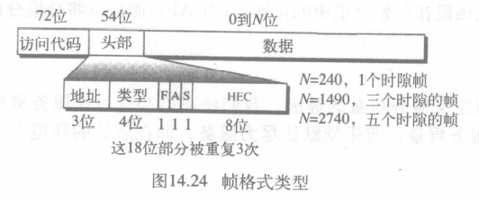

无线局域网(wireless LAN)

[TOC]

## IEEE 802.11
由IEEE定义的无线局域网规范称做IEEE 802.11，该规范涵盖了物理层和数据链路层
### 体系结构
定义了两种类型的服务: 
* 基本服务集(BSS, basic service set)
    由无线站点(固定,移动),一个可选的中央基站(访问点(AP, access point))组成
    
    * 不带AP的特别体系结构: 独立网络,不能向其他BSS发送数据
    * 带AP: 称为基础设施(infrastructure)网络
* 扩展服务集(ESS, extended service set)
    由两个或更多带有AP的BSS组成,通过一个分布式系统(通常有线局域网)将各BSS连接在一起(连接AP)
    >802.11对分布式系统并没有严格的限制，它可以是任何的 IEEE 局域网，如以太网

    

    站点类型(根据站点在无线局域网中的移动性):
    * 不迁移(no transition)：固定的或仅在BSS内部移动。
    * BSS迁移(BSS transition)：站点可以从一个BSS移动到另外一个BSS，但仅限于一个ESS之内。
    * ESS迁移(ESS transition)：站点可以从一个ESS移动到另外一个ESS，但802.11不保证通信在移动中是连续的。
### MAC层
定义了两个MAC子层:
    
* 分布式协调功能(DCF)
    使用CSMA/CA
    1. 在发送一个帧之前,源站点通过检测载波频率的能量级来侦听介质。
        1. 在通道空闲之前,通道使用带有补偿的持续策略。
        2. 站点发现通道空闲之后,它等待一个称做分布式帧间间隔(distributed interframe space,DIFS)的时间周期,然后就发送一个叫做请求发送(RTS)的控制帧。
    2. 接收到RTS并等待一个称做短帧间间隔(short interframe space,SFS)的短暂时间后,目的站点就向源站点发送一个叫做清除发送(CTS)的控制帧,这一控制帧表示目的站点准备接收数据。
    3. 在等待一个与SIFS相等的时间后,源站点就发送数据
    4. 在等待一个与SIFS相等的时间后,目的站点发送确认说明已经接收到帧。在这个协议中,由于没有任何方法检查它的数据是否已经成功地到达目的站点,所以确认还是需要的。另一方面,在 CSMA/CD中,没有冲突就是向源站点表示数据已经到达
     
    * 如何避免冲突: NAV
    发送RTS帧时包含需要占据通道的时间,受这一传送所影响的站点建立一个叫做网络分配矢量(network allocation vector,NAV)的定时器,该定时器指出在允许这些站点检测通道是否空闲之前还必须要经过多长时间
    每当一个站点访问系统并且发送RTS帧时,其他站点就启动它们的NAV(对任何一个站点,在检查物理介质是否空闲之前,首先要检查它的NAV是否过期)
    * 流程图
    

    为何不用CSMA/CD:
    * CSMA/CD 协议要求一个站点在发送本站数据的同时还必须不间断地检测信道，但在无线局域网的设备中要实现这种功能就花费过大。
    * 即使能够实现冲突检测的功能，并且在发送数据时检测到信道是空闲的，在接收端仍然有可能发生冲突，因为信号的衰减会使一端的站点无法侦听到另一端的冲突。
    * 隐藏站和站点距离较大时可能无法检测冲突
* 点协调功能(PCF)
    一种在BSS中实现的可选访问方式,在DCF的上层实现，主要用于时间敏感信息的传输
    集中的、无竞争的轮询访问方式，AP对可以被轮询的站点进行轮询
    >优先级高于DCF,所以定义另一套帧间间隔(PIFS和SIFS),时间比DIFS短
    * 避免DCF站点饿死: 设计了重复间隔(repetition interval)来覆盖无竞争(PCF)和基于竞争(DCF)的通信.
    重复间隔: 会持续地重复,开始于一个称为信号帧(beacon frame)的特殊控制帧.当站点听到信号帧时在重复间隔的无竞争周期内开始他们的NAV
        > 在重复间隔中,PC(点控制方)可以发送轮询帧、接收数据、发送ACK、接收ACK或者做任何这些动作(802.11使用捎带)的组合。
        在无竞争周期结束时,PC发送CF结束(无竟争)帧允许基于竞争的站点能使用介质

* 分段
    损坏帧必须重传,因此协议建议要分段(将大帧分割为多个小帧)
* 帧格式
    
    * D: 在除了一个类型以外的所有帧类型中,本字段定义了用于设置NAV值的传输间隔时间。在一个控制帧中,这个字段用来定义帧的ID。
    * 地址: 有4个地址字段,每个有6字节。每一个地址字段的含义取决于1D和 from DS子字段的值,后面要讨论。
    * 序列控制: 本字段定义帧的序列号,以用于流量控制。
    * 帧主体: 长度可以在0~2312字节之间。包含了根据FC字段中定义的类型和子类型的信息。
    * FCS: 长度为4字节,包含一个CRC-32的差错检测序列
* 帧类型
    * 管理帧：用于站点和接入点之间的初始化通信
    * 控制帧：用于访问通道和对帧的确认
        
        控制帧类型字段是01,子类型字段为:
        * 1011: 请求发送(RTS)
        * 1100: 清除发送(CTS)
        * 1101: 确认(ACK)
    * 数据帧：携带数据与控制信息
* 寻址机制

### 寻址机制
说明了4种情况,由FC字段的两个标记(from DS 和 to DS)定义,MAC帧的地址1-地址4解释取决于这些标记的值
    
>地址1总是下一个设备的地址,而地址2总是前一个设备的地址。
如果最后的目的站点没有被地址1定义的话,地址3就是最后目的站点的地址。
如果起始源站点的地址与地址2不同的话,那么地址4就是起始信源站点的地址

* 隐藏站点问题:如
    
    > 站点A可以听到B,C传送的任何信号
    B->C,A->C同时发生时,BC并不知道互相都要给A传输,都认为A时空闲的,造成冲突

    解决方法:握手帧(RTS或CTS)
    RTS到达A时A广播CTS帧
    
     
* 暴露站点问题
    A->B,C->D本因互不干扰,但C听到了A在发送,就不敢给D发送
    
    

### 物理层

## 蓝牙
### 微微网络(piconet)
蓝牙网称作微微网络(小网络),一个微微网络可包含8个站点,一个主站其余从站

可以附加处于休眠状态的8个从站点。一个处于休眠从站点从站点从站点从站点状态的从站点和主站点同步,但是在它脱离休眠状态之前不能参加通信(仅能了8个站点处于活动状态,从休眠状态激活一个站点就意味着必须有一个站点进入休眠状态)
### 散射网络(scatternet)
微微网络组合成散射网络
微微网络中的从站点可以变成另一个微微网络中的主站点
> 一个站点可能是两个微微网络中的成员

### 蓝牙层

### 通信

### 帧格式

###  L2CAP
逻辑链路控制和自适应协议(Logical Link Control and Adaptation Protocol)
基本上与LLC子层类似
* 数据分组格式
    