
连接局域网、主干网和虚拟局域网

[TOC]

连接设备连接局域网或局域网的各个分段,工作于英特网模型的不同层
本节讨论工作在物理层,数据链路层的设备

## 连接设备(connecting devices)
根据在网络中工作的层分为五类:
    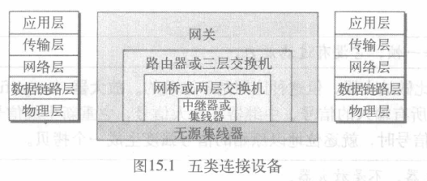
    1. 工作在物理层以下的设备,如无源集线器。
    2. 工作在物理层的设备(中继器或有源集线器)。
    3. 工作在物理层和数据链路层的设备(网桥或两层交换机)。
    4. 工作在物理层、数据链路层和网络层的设备(路由器或三层交换机)。
    5. 工作在所有五层的设备(网关)。
### 无源集线器(passive hub)
只是个连接器,连接来自不同分支的线路
> 如星型拓扑网络中的集线器
### 中继器(repeater)
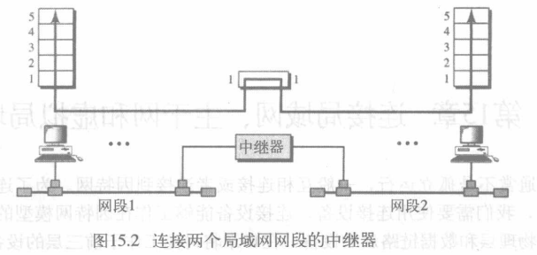

* 仅工作在物理层,重新发送变弱的信号,用于扩展局域网的物理长度
    > 不是放大器: 中继器重新生成信号,是再生器
* 不能连接两个局域网,连接同一局域网的两个网段(两个网段任是同一局域网)
    >不能连接采用不同协议的两个局域网，它连接的是同一局域网的两个分段
    * **网段**(segment): 局域网中被中继器分割的部分
* 中继器转发每一帧，没有过滤能力
* 常用于星型结构中，可多级连级(级联)
### 有源集线器(hub)
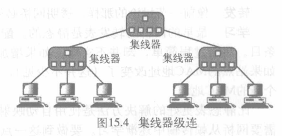

多端口的中继器,常用于星型拓扑
* 优点:
    * 克服了10Base-T标准的100m距离限制，因此扩展了以太网覆盖的范围并增加了以太网中计算机的数量；
* 缺点:
    * 集线器组建的以太网中，无论数据帧的MAC地址是否是自己的，都能够捕获，因此以太网具有与生俱来的安全隐患。
    * 级联后以太网的计算机处于一个冲突域中，增大了冲突的概率，每台计算机分到的带宽也降低了
    * 相连的集线器每个接口带宽要一样。如果速率不一致，则工作在较低的数据速率，因为集线器接口不能缓存帧

#### 单播与广播、广播域与冲突域
* 单播(Unicast):在一个发送者和一个接收者之间通过网络进行的通信。
* 广播(Broadcast):主机之间“一对所有”的通信模式,网络对其中每一台主机发出的信号都进行无条件复制并转发,所有主机都可以接收到所有信息(不管是否需要)。数据网络中的广播被限制在二层交换机的局域网范围内,禁止广播数据穿过路由器,防止广播数据影响大面积的主机
* 广播域:彼此能够接收广播帧的所有设备的集合被称为个广播域。
* 冲突域:在同一个网络上两个比特同时进行传输会产生冲突,这样的区域称为冲突域。所有的共享介质环境都是冲突域。
> 当独立的冲突域被集线器连接成更大的冲突域后,会有更多的信号广播,降低效率

### 网桥(bridge)
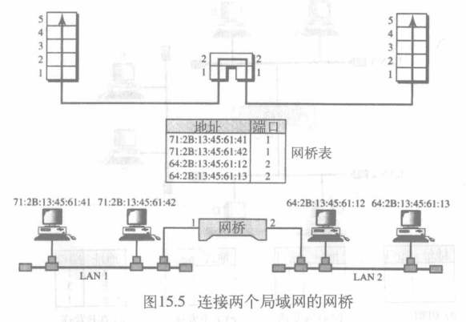

工作在物理层: 重新生成接收到的信号
数据链路层:  检查帧包含的物理(MAC)地址(源,目的地址)
* 过滤(filtering): 网桥检查帧的目的地址,决定帧转发(到指定端口)或丢弃,每个网桥都有端口地址映射表
    > 不改变帧的物理(MAC)地址
* 特点:
    * 网桥基于MAC地址转发帧，转发之前运行CSMA/CD算法，工作在数据链路层
    * 一个接口是一个冲突域，冲突域的数量增加，但冲突的概率降低
    * 实现帧的存储转发，增加了时延
    * 网桥的不同接口可以是不同的带宽
#### 透明网桥(Transparent Bridge)
站点意识不到其存在的网桥
* 802.1d规范了透明网桥的标准：
    * 帧必须能从一个站点转发到另外一个站点；
    * 学习帧中的地址，自动建立转发表；
    * 避免形成循环(Loop)问题。
* 学习型网桥: 使用自动映射地址到端口的动态表
    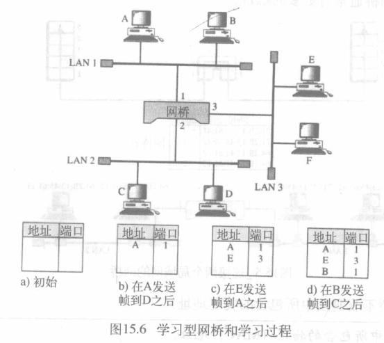
    1. A->D, 网桥没有表条目,网桥转发到所有端口,查看源地址知道A在端口1的LAN中
    2. E->A, 网桥有A条目,仅向端口1转发该帧,将帧的源地址E添加到表中
    3. B->C, 没有相关表条目,重复1
#### 循环问题
冗余网桥(LAN间使用多个网桥)使系统更可靠,但影响了透明网桥工作,还会产生循环
    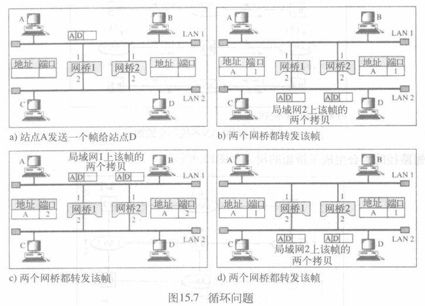
1. A->D, 两个网桥转发表都为空,都转发帧,更新A
2. LAN2获得该帧两份拷贝,网桥1发出的拷贝由网桥2接收,网桥2没有D的信息,直接广播导致帧泛滥,网桥2的也被网桥1接收,循环
>使用生成树算法建立无循环拓扑结构
#### 生成树(Spanning Tree)
生成树是一个没有循环路径的图，用于建立到达其它LAN的唯一路径
> 为了找出生成树,需要给连接线分配成本(度量)(如最小跳数、最小延迟、最短队列、最大带宽),选择最小代价
假设从网桥到LAN跳数为1，从LAN到网桥跳数为0

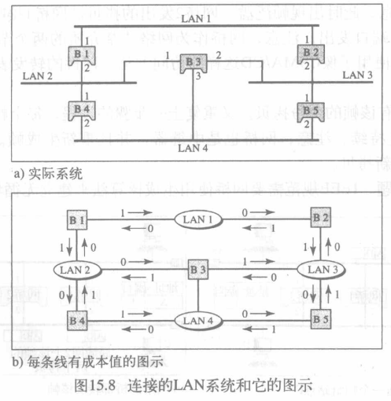

1. 每个网桥广播其ID，选择最小ID的网桥作为根网桥；
2. 找出从根网桥到其它网桥或LAN的最短路径(最小成本路径)；
3. 最短路径组合生成最短的树；
4. 标记转发端口(forwarding port)(属于生成树部分的端口)和阻塞端口(blocking port)(不适于生成树部分的端口)
    > 阻塞端口没有帧发出

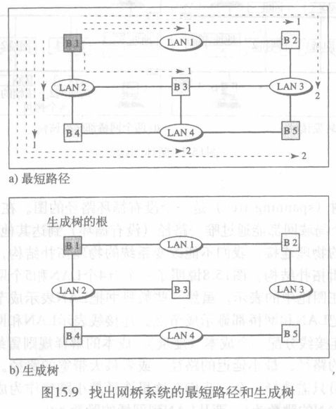

生成树中每对LAN间只有一条路径
> 网桥动态完成这个过程
网桥互相发送网桥协议数据单元(BPDU)用于更新生成树

#### 源路由网桥(source routing bridge)
防止环路的另外一种方法
* 透明网桥的职责(过滤帧、转发和阻塞)由源站点来执行
* 由源方指定帧必须经过的网桥。发送数据帧之前，源站点和目的站点通过交换特定帧来得到网桥地址
>用于令牌环网

#### 网桥连接不同的局域网
网桥理论上在数据链路层能连接不同协议的局域网,但有许多问题需要考虑:
* 帧格式
* 最大数据长度
* 数据速率
* 位顺序(先发送高位还是先发送低位)
* 安全
* 多媒体支持

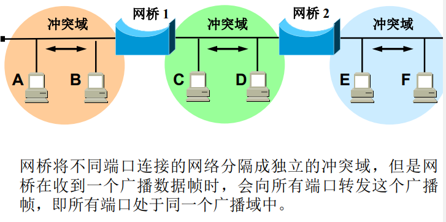

### 交换机
* 使用交换机组网与集线器组网相比具有以下特点：
    * 端口独享带宽：集线器是共享带宽；
    * 安全：交换机根据MAC地址只转发到目标端口；
    * 全双工通信；
    * 全双工不再使用CSMA/CD协议；
    * 接口可工作在不同速率：交换机使用存储转发技术；
    * 转发广播帧：转发到除了发送端口以外的所有端口
* 交换机的冲突域和广播域
    * 集线器是冲突域
    * 交换机是广播域
    * 路由器隔绝广播
    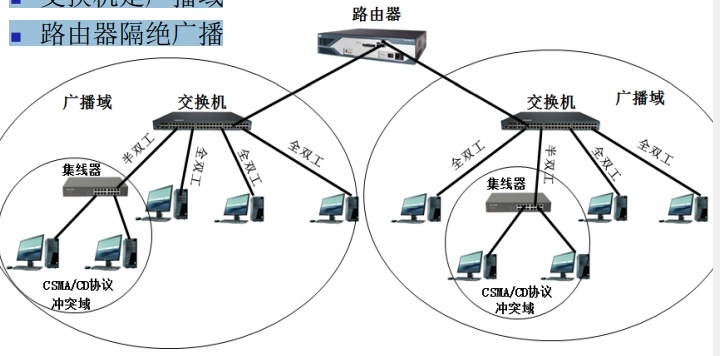
#### 两层交换机(two-layer switch)
工作在物理层,数据链路层
多端口,高性能网桥
可以像网桥一样，基于收到帧的MAC地址做出过滤决策
工作过程比网桥更加复杂，它有缓存区来保存帧并进行处理
* 优点
    * 从总线型局域网或集线器局域网转变为交换局域网，连接设备在软件或硬件上不需做任何修改。例如原来是以太局域网，连接设备继续使用以太网媒体接入控制协议来接入局域网。
    * 每个连接设备都具有相当于原来整个局域网容量的专用容量，只要二层交换机有足够容量为所有连接设备服务。
    * 二层交换机扩容简单
* 类型
    * 存储转发式(Store-and-forward)
        * 从输入线路上接收帧
        * 缓存
        * 通过路由选择将其发到适当的输出线路上
        * 发送方和接收方之间存在延迟
        * 增进了网络的整体一致性
    * 直通式(Cut-through)
        * 利用了目的地址总是出现在MAC帧的最前面的特点
        * 交换机识别出目的地址后就将帧转发到适当的输出线路
        * 能够达到很高的吞吐量
        * 可能传播损坏帧(交换机在重传之前无法做CRC检查)
        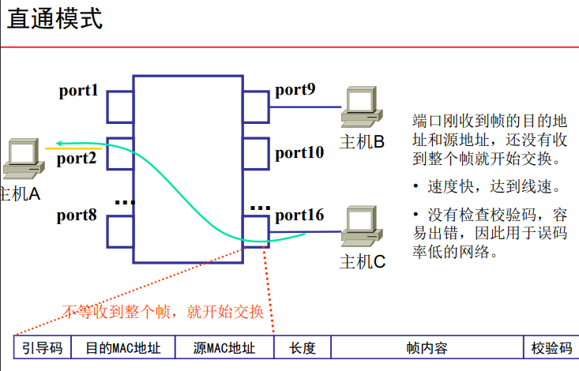
#### 三层交换机(three-layer switch)
三层交换机具有路由功能，与传统路由器的路由功能总体上一致，但是它们还是存在着相当大的本质区别的
* 主要功能不同。三层交换机同时具备了数据交换和路由转发两种功能，但其主要功能还是数据交换；而路由器仅具有路由转发这一种主要功能。
* 主要适用的环境不一样。三层交换机的路由功能通常比较简单，在局域网中的主要用途还是提供快速数据交换功能。路由器则更多体现在不同类型网络之间的互联上，如局域网与广域网之间的连接、不同协议的网络之间的连接等，可进行最佳路由选择、负荷分担、链路备份及和其他网络进行路由信息的交换等。
* 性能体现不一样。路由器一般由基于CPU的软件路由引擎执行数据包交换，而三层交换机通过硬件执行数据包交换。从整体性能上三层交换机的性能远优于路由器，适用于数据交换频繁的局域网中；路由器虽然路由功能非常强大，但它的数据包转发效率远低于三层交换机，更适合于数据交换不是很频繁的不同类型网络的互联，如局域网与互联网的互联。

### 路由器(router)
路由器是三层设备,基于分组的逻辑地址路由分组
通常连接LAN和路由器中的WAN,由一张表来决策路由
路由表通常是动态的,使用路由协议更新
指导IP报文发送的路径信息
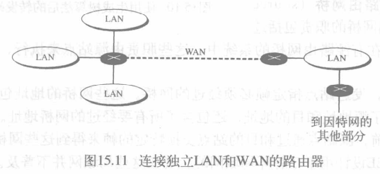

* 路由器数据处理
    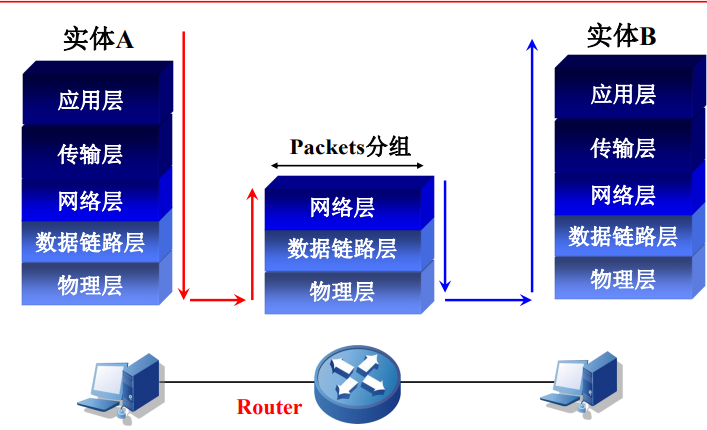
#### 路由表(routing table)
用于保存各种传输路径的相关数据(路由信息)供数据转发(路由选择)时使用
* 包含了以下关键项:
    * 目的地址(Destination)：标识IP数据报的目的地址或目的网络
    * 网络掩码(Mask)：与目的地址一起标识目的主机或路由器所在网段的地址
    * 输出接口(Interface)：说明IP数据报从路由器哪个接口转发
    * 下一跳IP地址(Next hop)：说明IP数据报所经由的下一个路由器的接口地址

* 路由的来源
    * 链路层协议发现的直连路由
        >开销小，配置简单，无需人工维护。只能发现本接口所属网段的路由
    * 手工配置静态路由
        >无开销，配置简单，需人工维护，适合简单拓扑结构的网络
    * 动态路由协议发现的动态路由
        >开销大，配置复杂，无需人工维护，适合复杂拓扑结构的网络

### 网关(gateway)
* 在网络层以上实现网络互连，是复杂的网络互连设备，仅用于两个高层协议不同的网络互连，可用于广域网和局域网
* 由于历史的原因，许多有关TCP/IP的文献曾把网络层使用的路由器称为网关，如今很多局域网采用都是路由来接入网络，因此通常指的网关就是路由器的IP

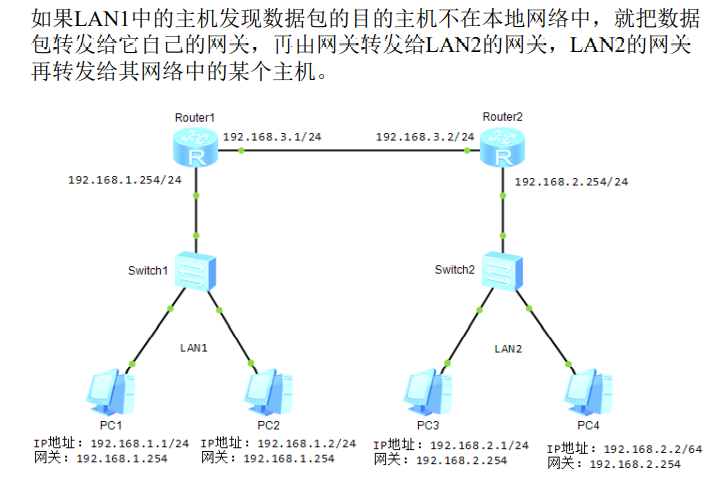

## 主干网(backbone networks)
主干网允许连接多个局域网
站点不直接连接到主干上
站点是局域网的一部分,由主干连接这些局域网
主干网本身也是使用局域网协议的局域网
### 总线型主干网(bus backbone)
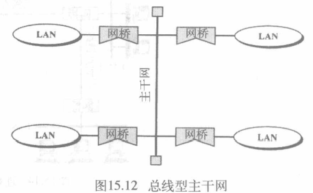

* 如果一个站要向同一LAN中的另一个站点发送帧，相应的网桥将阻塞该帧，到达不了主干；
* 如果一个站点要向另外一个LAN中的站点发送帧，网桥将传输该帧到主干网，由适当的网桥接收并发送到目的LAN
### 星型主干网(star backbone)

> 主干网仅是一台交换机 
### 网桥连接远程LAN
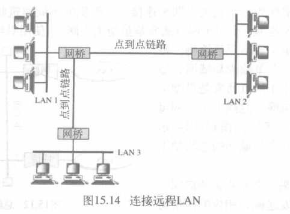

在远程网桥连接的远程主干网中，点对点链路被认为是一个局域网

## 虚拟局域网VLAN(virtual LAN)
* **虚拟局域网(VLAN)**: 通过软件而不是物理线路来配置一个局域网

交换式局域网中组的改变意味着网络配置的物理改变
VLAN将LAN划分为逻辑的而不是物理的网段,改变组无需改变物理配置
* 特点
    * 将LAN划分成逻辑的而不是物理的网段；
    * 一个LAN可以划分成多个VLAN，每个VLAN是一个工作组；
    * 允许连接在不同交换机上的站点组成一个VLAN；
    * VLAN将属于一个或多个物理LAN的站点分组到一个广播域中；
    * 同一VLAN中的站点通信时就像它们属于一个物理网段一样
* VLAN的划分方式
    * 基于端口：使用交换机的端口号
        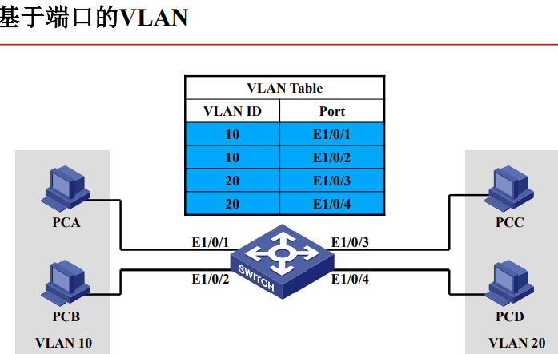
    * 基于MAC地址：使用48位MAC地址
    * 基于第三层协议：如使用IP地址
        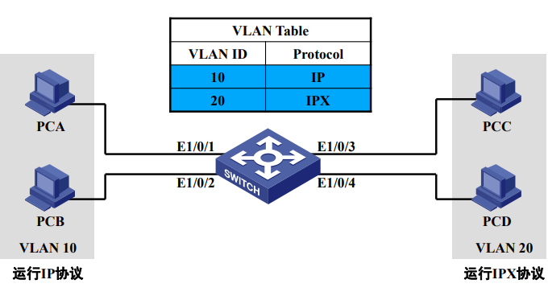
    * 基于组播组：使用多播IP地址
    * 基于子网
        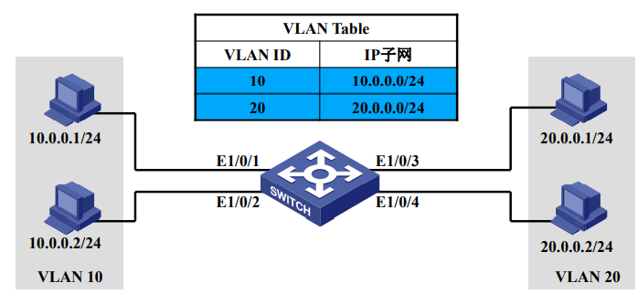

    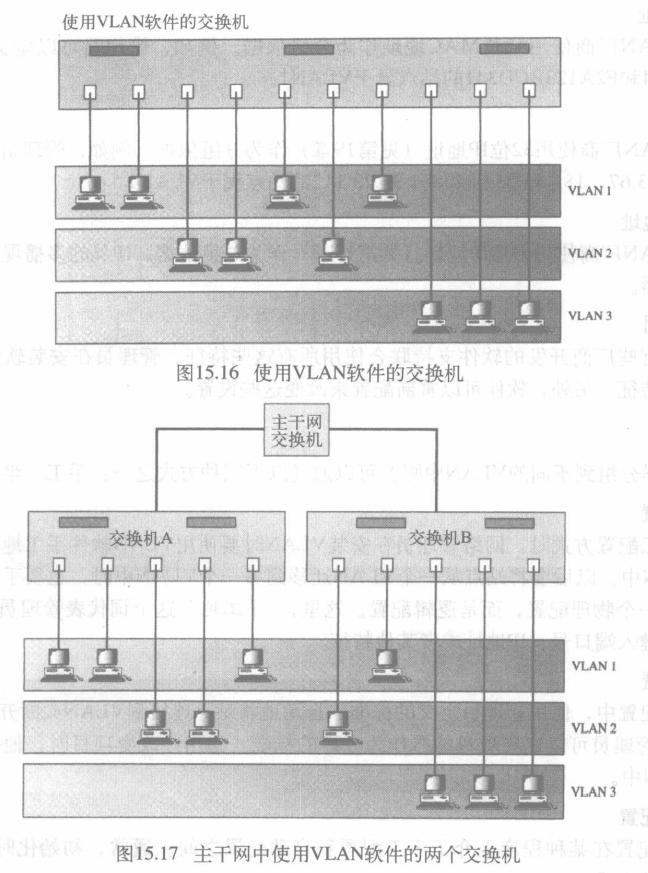
* VLAN创建广播域: VLAN将属于一个或多个物理LAN的站点分组到广播域中。VLAN中的站点和其他站点通信时就像它们属于一个物理网段一样。
* 默认VLAN: 交换机初始就有的VLAN，通常ID为1，所有接口都处于这个VLAN下，这就是设备连接到交换机以后就能互相通信的原因
    > VLAN ID最多总共有2^12 = 4096个(0 - 4095)，其中VLAN 0和VLAN 4095为保留，只在特定的情况下使用
* 交换机的三种链路类型
    * access: 只属于一个VLAN，一般用于连接计算机端口。
    * trunk: 可以允许多个VLAN通过，可以接收和发送多个VLAN的报文，一般用于交换机之间的端口。
    * hybrid: 可以允许多个VLAN通过，可以接受和发送多个VLAN的报文，可以用于交换机之间连接，也可以用于连接用户计算机。
        >hybrid端口和trunk端口在接收数据时，处理方法是一样的，唯一不同在于发送数据时：hybrid端口可以允许多个VLAN的报文发送而不打tag(标签)，而trunk端口只允许缺省VLAN(就是它所在的VLAN)不打tag(标签)