
网络层: 逻辑寻址

[TOC]

* 网络层负责在计算机间传输分组,可能经过多个网络(链路)
* 网络层增加一个头部,它包含来自上一层分组的发送方与接收方的逻辑地址。如果分组经过因特网传输,还需要寻址系统来识别源与目的地址。
* 当若干个独立的网络(链路)连接在一起组成一个互联网时,路由器或交换机对分组进行路由选择到达它的最终目的地。网络层一个功能是提供一种路由机制。

## IPv4
* **IPv4地址**: 是一个32位的地址，它唯一并通用地定义了一个连接在因特网上的设备
### 地址空间(address space)
* 地址空间: 该协议能用的地址总数
即$2^{32}$
### 标记法
* 二进制: `01110101 10010101 00011101 00000010`
* 点分十进制: `117.149.29.2`
### 分类寻址(classful addressing)
分类寻址中,地址空间被划为5类: ABCDE
开头几位可表示所属类
    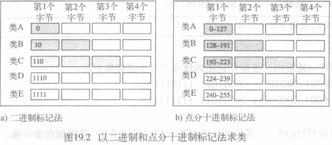
`IP 地址 ::= { <网络号>, <主机号>}`
#### A类地址
* 网络号: $2^7-2=126$
    * 网络号字段为全 0 的IP地址为保留地址，意思为“本网络”。
    * 网络号为 127(01111111)保留作为本地软件环回测试(loopback test)本主机进程之间的通信之用
* 主机号 $2^{24}-2$
    * 全 0 的主机号字段表示该IP地址是“本主机”所连接到的单个网络地址。
    * 全 1 的主机号字段表示该网络上的所有主机
>A类地址占有整个IP地址空间的50%
#### B类地址
* 网络号: $2^{14}-1$
    * 128.0.0.0不指派，因此可以指派的B类最小网络地址是128.1.0.0
* 主机号 $2^{16}-2$
    * 去除全0和全1的主机号
>B类地址空间占整个IP空间的25%
#### C类地址
* 网络号: $2^{21}-1$
    * 192.0.0.0不指派，可以指派的C类最小网络地址是192.0.1.0
* 主机号 $2^{8}-2=254$
    * 扣除全0和全1的主机号
>C类地址空间占整个IP空间的12.5%
#### D类地址
* D类地址被保留用于多播
    >多播可发送一个消息给同一多播组中的一组成员设备

可以用28位来指定多播组，即有2.68亿(大约268 435 456)个可能的多播组。
D类地址支持两种多播组，一种是永久多播地址，另外一种是临时多播地址
#### 总结
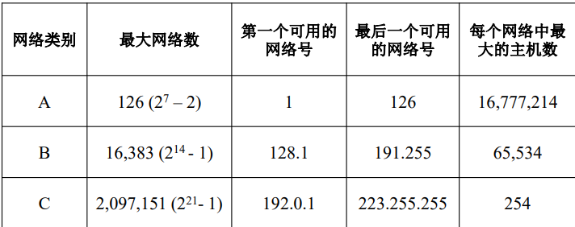
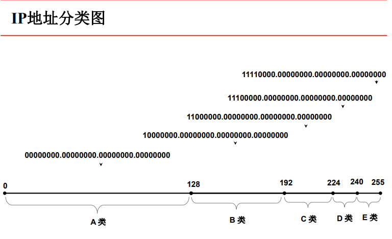
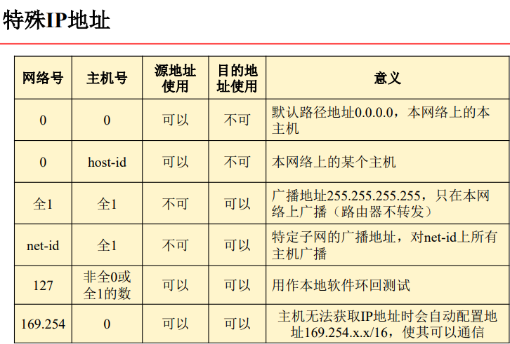

>例
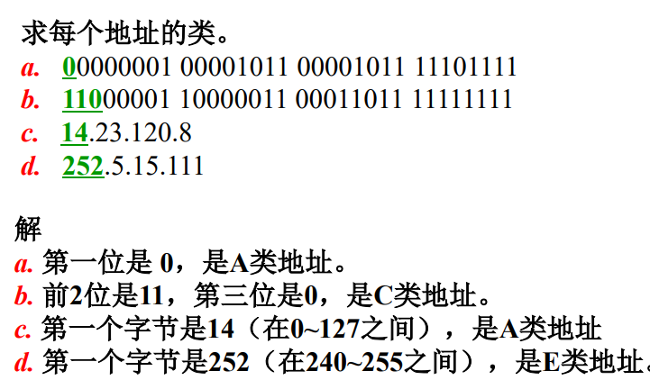

### 私有网络
在IP地址空间中，保留了几个用于私有网络的地址。私有网络地址通常应用于公司、组织和个人网络，它们没有置于因特网中
因特网上的路由器没有到私有网络的路由，在因特网上也不能访问私有地址，因而使用私网地址的计算机更安全，也节约了公网IP地址
* A类：10.0.0.0 ～ 10.255.255.255
* B类：172.16.0.0 ～ 172.31.255.255
* C类：192.168.0.0 ～ 192.168.255.255

### 两级IP地址
* 在 ARPANET 的早期，IP 地址的设计确实不够合理。IP 地址空间的利用率有时很低。
* 给每一个物理网络分配一个网络号会使路由表变得太大因而使网络性能变坏。
* 两级的 IP 地址不够灵活
### 三级IP地址
* 从 1985 年起在 IP 地址中又增加了一个“子网号字段”，使两级的 IP 地址变成为三级的 IP 地址。
* 这种做法叫作划分子网(subnetting) 。划分子网已成为因特网的正式标准协议
### 划分子网
* 划分子网纯属一个单位内部的事情。单位对外仍然表现为没有划分子网的网络
    `IP地址 ::= {<网络号>, <子网号>, <主机号>}`
    >从主机号借用若干个位作为子网号 subnet-id
* 基本思路:
    1. 凡是从其他网络发送给本单位某个主机的IP数据报，仍然是根据 IP 数据报的目的网络号net-id，先找到连接在本单位网络上的路由器
    2. 然后此路由器在收到 IP 数据报后，再按目的网络号 net-id 和子网号 subnet-id 找到目的子网
    3. 最后就将 IP 数据报直接交付目的主机

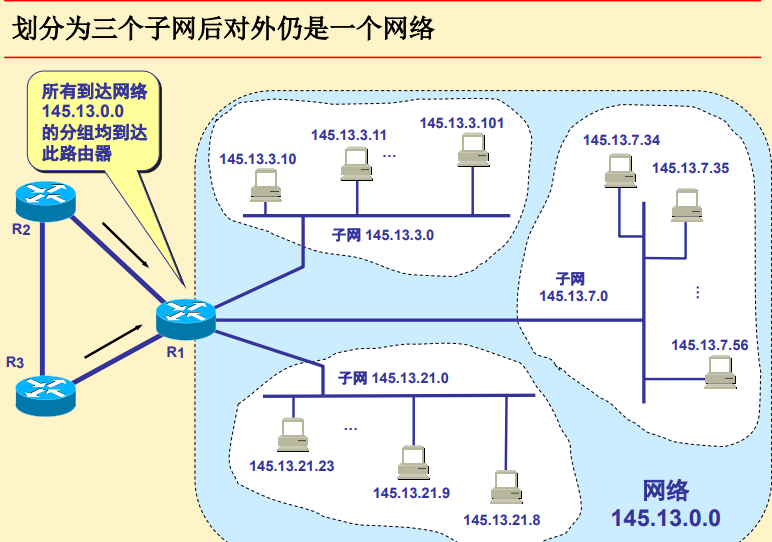

### 子网掩码(subnet mask)
使用子网掩码可以找出IP地址中的子网部分
`IP & mask = 网络地址`
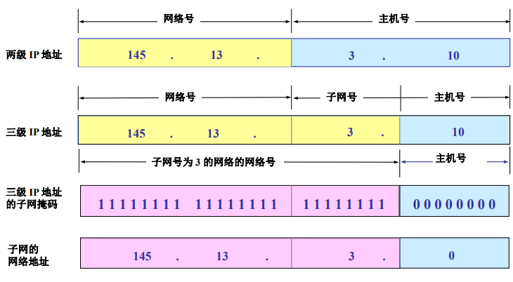

> 子网掩码主机号部分1的位数即为子网号的位数
* 默认子网掩码:
    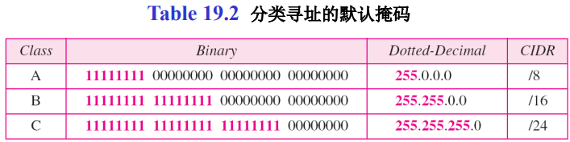
### 子网掩码和网关的作用
通信步骤:
1. 先`自己mask & 自己IP`得到自己所在网段,再`自己mask & 目标IP`得到目的地址网段
2. 网段不同就封装帧时以网关的MAC地址作为目标MAC地址，交换机就会将帧转发给路由器接口
3. 网段相同则封装帧时直接使用目标IP地址的MAC地址作为目标MAC地址，直接将帧发送给目标IP地址

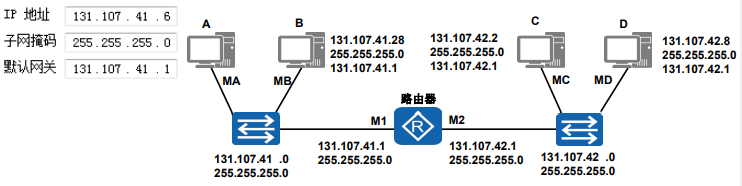
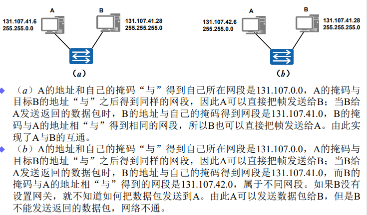

### 无分类编址CIDR(Classless Inter-Domain Routing)
IPv4不够了
1. 使用变长子网掩码 VLSM (Variable Length Subnet Mask)可进一步提高 IP 地址资源的利用率
2. 在 VLSM 的基础上又进一步研究出无分类编址方法，它的正式名字是无分类域间路由选择CIDR (Classless Inter-Domain Routing)

* CIDR特点:
    * CIDR 消除了传统的 A 类、B 类和 C 类地址以及划分子网的概念，因而可以更加有效地分配IPv4 的地址空间。
    * CIDR使用各种长度的“网络前缀” (network-prefix)来代替分类地址中的网络号和子网号。
    * IP 地址从三级编址(使用子网掩码)又回到了两级编址
    >CIDR把网络前缀都相同的连续的IP地址组成“CIDR 地址块”
* 记法
    * 两级编址: `IP地址 ::= {<网络前缀>, <主机号>} `
    * 斜线记法(slash notation)(CIDR记法): `/网络前缀所占的位数`
        >这个数值对应于三级编址中子网掩码中1的个数

* 无类地址块条件:
    1. 块中的地址必须是连续的；
    2. 块中的地址个数必须是2的整数次幂；
    3. 块的起始地址必须能被块的个数整除
* 常用CIDR地址块
    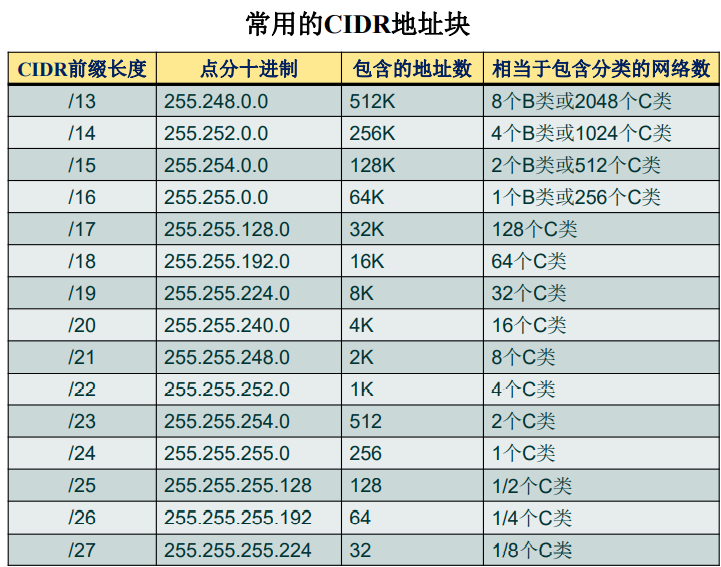
* CIDR地址块划分举例
    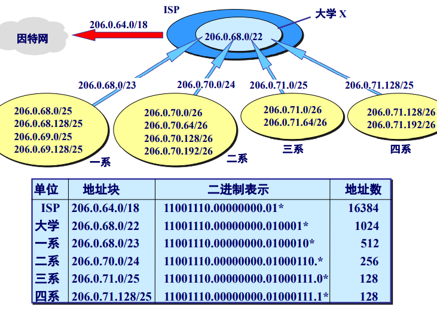
    >这个 ISP 共有 64 个 C 类网络。如果不采用 CIDR 技术，则在与该 ISP 的路由器交换路由信息的每一个路由器的路由表中，就需要有 64 个项目。但采用地址聚合后，只需用路由聚合后的 1 个项目 206.0.64.0/18 就能找到该 ISP
>块中地址的个数可简单用公式$2^{32−n}$求得。
• 块中的起始地址通常不分配给任何设备，用做表示该组织的网络地址；
• 块中的最后地址通常不分配给任何设备，用来做广播地址

> 例
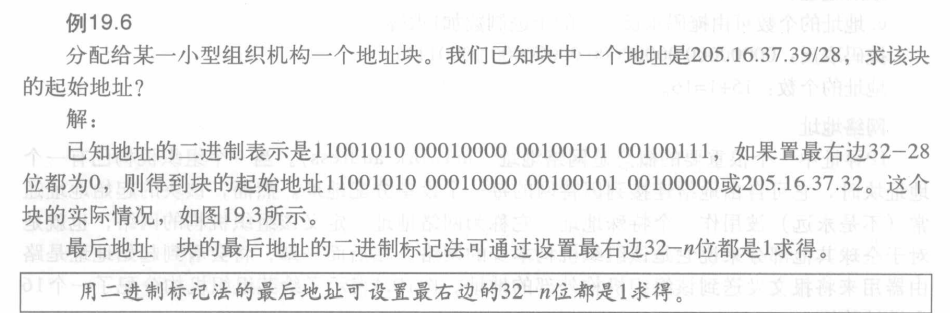
如下

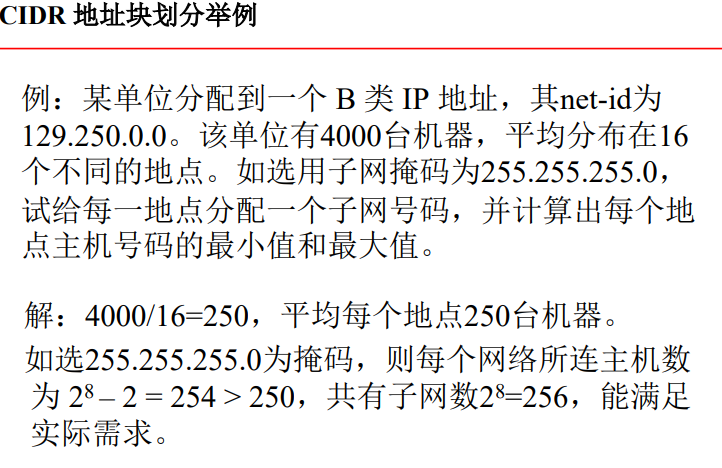
例：假定从196.16.0.0开始有大量连续的IP地址可以使用。现在四个组织A、B、C和D按照顺序依次申请4000、2000、4000和8000个地址。对于每一个申请，请写出所分配的第一个IP地址、最后一个IP地址以及掩码
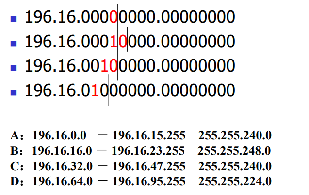
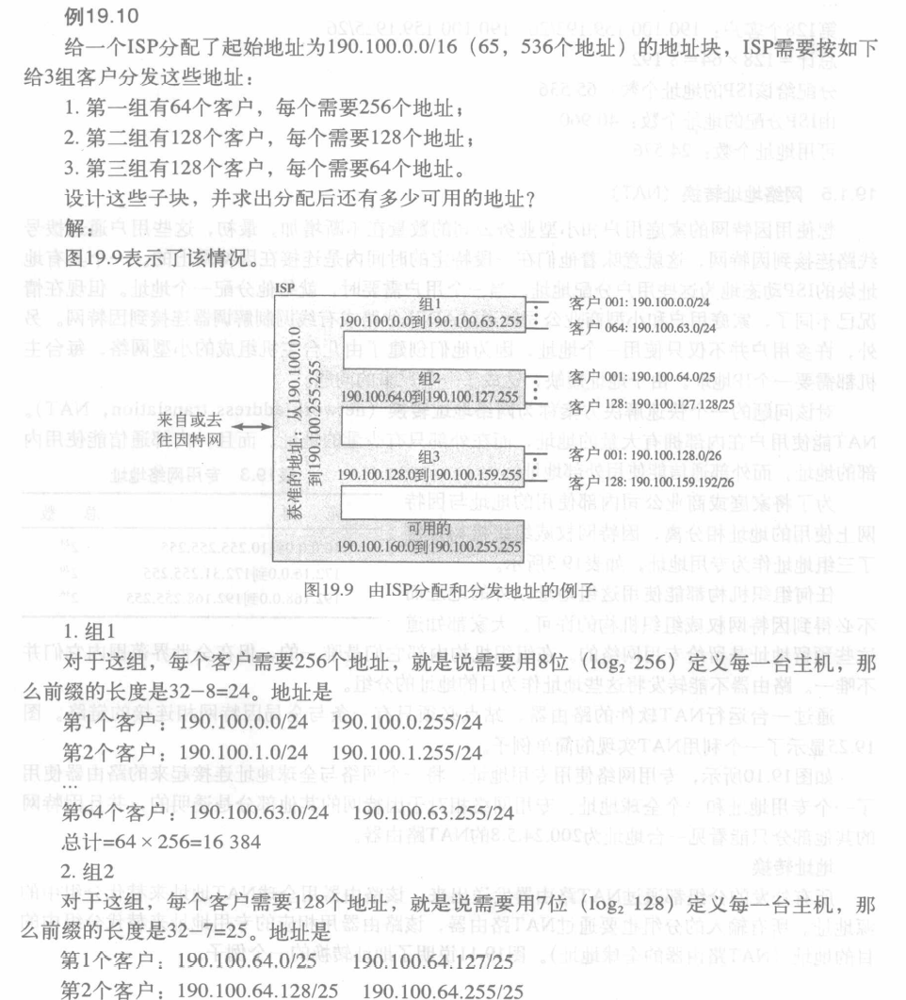

### 超网合并网段
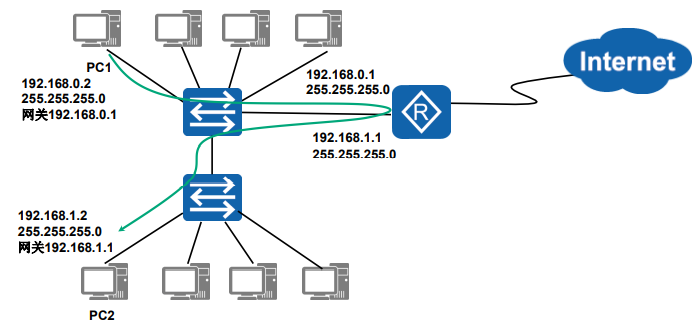

>两个网段192.168.0.0/24 和 192.168.1.0/24, 通过交换机连接
此时这两个网段的计算机再物理上处于同一个网段,IP却不在一个网段
想要这些计算机可以通信,需要在路由器接口添加这两个C类网络的地址作为这两个网段的网关,但这让本在同一网段的计算机通过路由器转发通信,效率低
* 使用超网合并网段:将192.168.0.0/24和192.168.1.0/24这两个C类网络合并。合并后的
网段为192.168.0.0/23
子网掩码为255.255.254.0
可用地址为192.168.0.1 ~ 192.168.1.254
    >合并后更改网络中计算机的IP地址配置与路由器接口配置。这种方法的本质是通过把1位网络地址位用作主机地址位而实现了网络的扩容
### 网络地址转换NAT(Network Address Translation)(网络掩蔽,IP掩蔽)
解决IPv4地址短缺的解决方案
* 网络地址转换(网络掩蔽,IP掩蔽): 在IP数据包通过路由器或防火墙时重写源IP地址或目的IP地址的技术
    >这种技术被普遍使用在拥有多台主机但只通过一个或少量公有IP地址访问Internet的私有网络中
* 专用地址 —— 仅在机构内部使用的IP地址，可以由本机构自行分配，而不需要向因特网的管理机构申请。
    > 专用地址只能用作本地地址而不能用作全球地址。在因特网中的所有路由器，对目的地址是专用地址的数据报一律不进行转发
    • 预留的三组专用地址:
    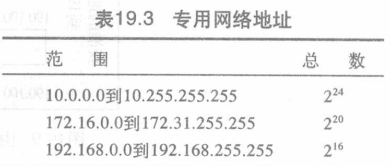
* 全球地址 —— 全球唯一的IP地址，必须向因特网的管理机构申请

地址转换实现:
* 所有外发的分组都通过NAT路由器发送出来,该路由器用全球NAT地址来替代分组中的源地址。
* 所有输入的分组也要通过NAT路由器,该路由器用相应的专用地址来替代分组中的目的地址(NAT路由器的全球地址)。
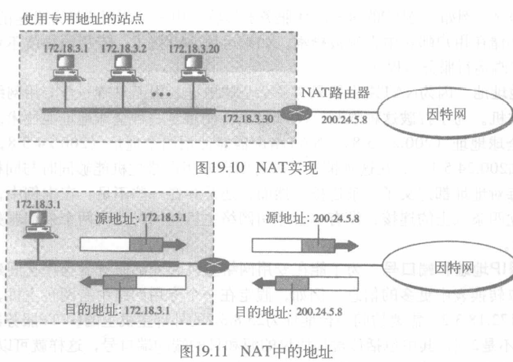

源地址转换成外发地址很简单,但输入分组如何转化为专用IP?
* 转换表
    最简单情况下只有两列: 专用地址,外部地址
    通过源地址/目的地址查表得出专用地址
    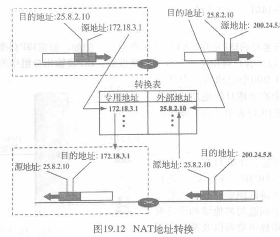

    > 此策略中通信必须由专用网络发起
* NAT类型
    * 静态NAT(Static NAT): 实现了私有地址和全球公有地址的一对一映射，一个公有IP地址只会分配给唯一且固定的内网主机。
    * 动态NAT(Dynamic NAT): 是指将内部网络的私有IP地址转换为公有IP地址时，IP地址对是不确定的、随机的，所有被授权访问Internet的私有IP地址可随机转换为任何指定的公有IP地址。当ISP提供的公有IP地址略少于网络内部的计算机数量时，可以采用动态转换的方式。
    * 网络地址端口转换PAT(Port Address Translation): 是把内部地址映射到外部网络的一个IP地址的不同端口上。PAT与动态地址NAT不同，它将内部连接全部映射到外部网络中的一个单独的IP地址上，同时在该地址上加上一个由NAT设备选定的端口号
    >• 普通路由器在转发IP数据报时，源IP地址或目的IP地址都是不改变的，但NAT路由器在转发IP数据报时，一定要更换其IP地址（转换源地址或目的地址）
    • 普通路由器在转发分组时工作在网络层，但PAT路由器要查看和转换运输层的端口号，属于运输层的范畴

     
* 有效利用NAT路由器的IP地址
    * 当NAT路由器具有n个全球IP地址时，专用网内最多可以同时有n个主机接入到因特网。NAT路由器IP地址数量有限时，专用网内较多数量的主机可轮流使用NAT路由器的全球IP地址。
    * 为了更有效地利用NAT路由器上的全球IP地址，常用的NAT转换表把运输层端口号也利用上。这样，就可以使多个拥有本地地址的主机，共用一个NAT路由器上的全球IP地址，因而可以同时和因特网上的不同主机进行通信

## IPv6
* **IPv6**: 128位
### 标记法
* 十六进制冒号标记法: `FDEC:0074:0000:0000:0000:B0FF:0000:FFFF`
* 缩写: 
    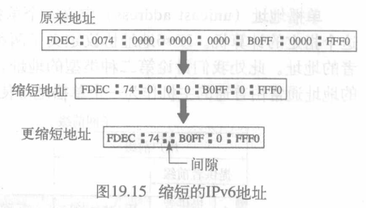
    > 000F -> F, 0000 -> 0 -> 空(一串0都可省略,但一个地址只能用一次), 3210 -> 3210
* CIDR的斜线表示法仍然可用:
    >60 bit的前缀 12AB00000000CD3 可记为：
    12AB:0000:0000:CD30:0000:0000:0000:0000/60
    或12AB::CD30:0:0:0:0/60
    或12AB:0:0:CD30::/60

>例
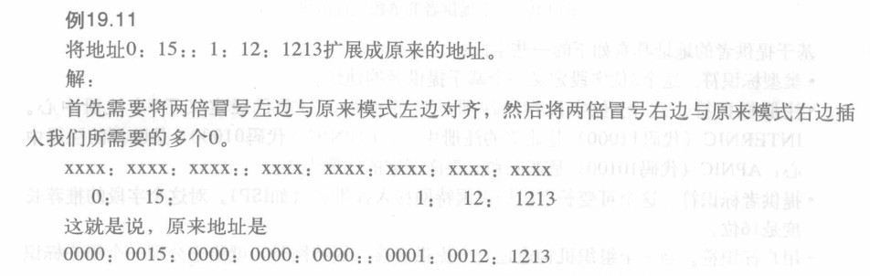

### 类型前缀
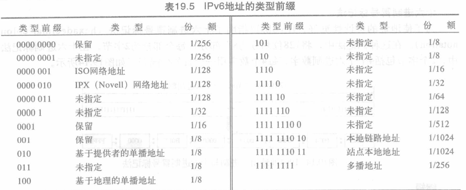

### 单播地址(unicast address)
定义了一个单独的计算机
* 基于提供者的地址:
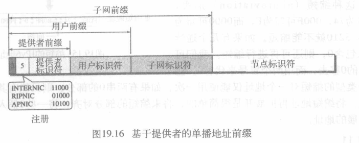

### 多播地址(multicast address)
定义一组主机,发送到多播地址的分组必须传递到该组中每个成员
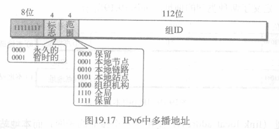

### 保留地址(reserved address)
以`0000 0000`开始
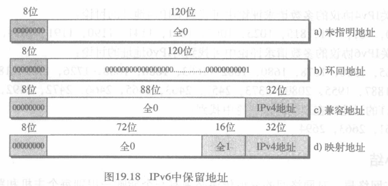

### 本地地址
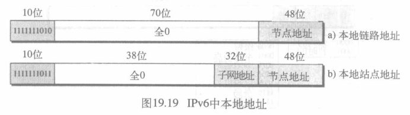