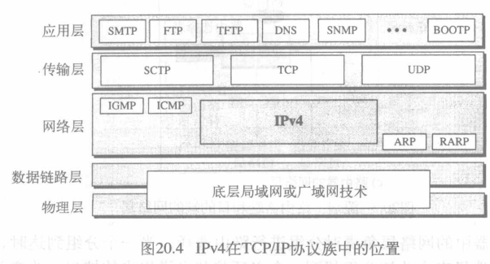
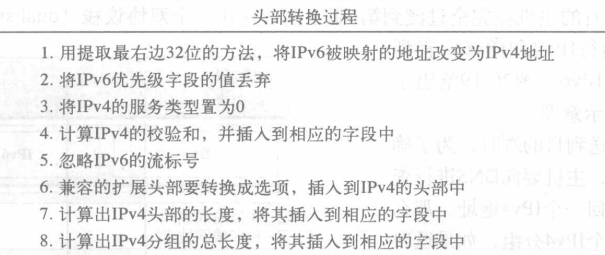

IP协议(网际协议)

[TOC]

## 网际互联

网络相邻节点间数据传递:
    
>物理层和数据链路层在本地运行
* A->D,需要A->S/R1, S/R1->S/R3, S/R3->D
* 分组经过三个链路进行传递,每个链路包括两个物理层和数据链路层
* 问题: S/R如何知道将数据从哪个接口发出去?
    >数据链路层,物理层没有规则帮助
    帧未携带路由选择信息(只包括A的MAC和R1的MAC)

对于一个局域网或广域网,传递意味着通过一条而不是多条链路传送帧。
如何解决通过多条链路传递的问题
### 网络层需求
设计了网络层(互联网络层),负责**主机间**的传递 和 通过路由器或交换机对分组进行**路由选择**

* 源端网络层: 
    * 输入数据生成分组,添加头部(源,目的逻辑地址和其他信息)
    * 检验路由表选择信息
    * 分段分组
* S/R网络层: 对分组进行路由选择(路由选择表)
* 目的端网络层: 地址验证,所有分段到达后重组
>*  因特网中的网络层交换是利用数据报分组交换的方法实现的
*  分组传递可利用面向连接或无连的服务来实现
*  因特网的网络层通信是无连接的
>>*  无连接: 交换机或路由器不保存有关连接状态的信息，不需要建立连接，也不需要拆除连接
*  数据报模式:
    

## IPv4
网际协议第四版(Internet Protocol version4, IPV4)
* 是TCP/IP协议使用的传输机制
    
* 不可靠的无连接的数据报协议
    >*  它尽力传递(Best-effort delivery)数据报，但是不提供差错控制或流量控制(除首部的检验和之外)，因此不保证可靠性
    *  需要保证可靠性时需要与可靠协议(如TCP)搭配使用
    
### 数据报(datagram)

是一个可变长分组,由头部和数据组成
* 头部: 20-60字节,包含路由选择,传输相关信息
    > TCP/IP中习惯以4字节表示头部
    * **版本**(VER): 4bit,定义IPv4版本(目前4),将被版本6(IPng)取代
    * **头部长度**(HLEN): 4bit,数据报头部的总长度,一单位表示4字节(最大15单位)
    * **服务**: 前称服务类型,现称差分服务(differentiated service)
        
        * 优先: 优先级0-7
        * TOS位: 请求服务的类型
        * 码点(codepoint): 右3位全0时左三位为优先级,不全为0时为服务类型
    * **总长度**: 16bit,字节计的数据报总长度
        > 16位,所以数据报总长度最大为$2^{16}-1=65535$

        > 大多数情况下不需要这个字段(接收到帧直接去头尾部转发),但有时封装在一个帧中的不只是数据报(以太网最小帧为46-1500字节,数据报长度过小就需要填充)
    * **标识**: 16bit,一个**计数器**产生数据报的标识
    * **标志**(flag): 3bit，只有后两位有意义。
        * More Fragment：MF=1(还有分片)，MF=0(最后一片)
        * Don’t Fragment：DF=1(不能分片)，DF=0(允许分片)
    * **分段(片)偏移**: 13bit，指出较长的分组在**分片**后某片在原分组中的相对位置(首字节，以8个字节为偏移单位
    * **生存时间**: 8bit,记为TTL(Time To Live)，数据报在网络中可通过的**路由器数**的最大值
        > 约为任何两个主机间路由器数的两倍,每经过一个路由器-1,为0时丢弃该数据报
        设置为1就限制在局域范围内
    * **协议**: 8bit,使用此IPv4服务的高层协议(TCP,UDP等),以便目的主机的IP层将数据部分上交给那个处理过程
        Value|Protocol
        :-:|:-:
        1|ICMP
        2|IGMP
        6|TCP
        17|UDP
        89|OSPF
    * 首部效验和：16bit,只检验数据报的头部
        >不采用CRC检验码而采用简单的计算方法: 发送方头部求和取反码为校验和,接收方带校验和全求和取反码为0即效验通过
    * 源地址/目的地址: 4字节
    ****
    以上为固定部分,为20字节,其余都为选项部分
    ****

> 例:
20.1:
一个到达的 IPv4 分组的前8位如下：
01000010
接收方是否应丢弃该分组？为什么？
解：
这个分组有错误，其中最左的4位是版本，它是正确的。下一个4位是0010，则表明它是一个无效长度 (2 × 4 = 8)。而头部的最小字节数是20。因此，这个分组在传输过程中被损坏了
\
20.2:
在一个 IPv4 分组中，头部长度字段的值用二进制表示为1000，试问这个分组携带的选项是几个字节？
解：
头部的长度值是 8, 说明头部的总字节数是 8 × 4= 32 字节。 前面的 20 个字节是基本头部，后面的 12 个字节是选项。
\
20.3:
在一个 IPv4 分组中，头部长度字段的值是5，而总长度字段的值是 0x0028，试问这个分组携带的数据是多少字节？
解：
头部长度字段值是 5，就是说头部的总字节数为5 × 4 = 20 字节 (无选项)。总长度是40字节，即这个分组携带 (40 − 20) = 20个字节的数据
\
20.4:
一个IPv4 分组已到达，最前面几个十六进制数字如下
0x45000028000100000102 . . .
在丢弃这分组之前，它还能跳多少跳？数据是属于上层的哪一个协议？
解：
生存时间字段是第9个字节，跳过了前8个字节（16个十六进制数字），得到值是01，这就是说分组仅能跳一次。协议字段是下一个字节02，也就是说上层协议是IGMP

### 分段
一个数据报可通过不同的网络进行传输,每个路由器将接收到的帧拆封成Ipv4数据报,处理后封装为另一个帧,前后格式和长度取决于此路由器两端物理网络所用的协议
#### 最大传输单元(MTU)
每个数据链路层协议都有自己的帧格式,也有自己的最大长度

MTU的值取决于物理网络协议

为了使IPv4协议与物理网络无关,IPv4数据报最大长度等于最大传输单元(65535字节),可使传输更有效,但对于一些物理网络需要分段(fragmentation)通过
* 传输层分段(fragmentation):
    
    >每个分段都有自己的头部
    可多次分段
    可在路径上任何路由器分段,只能在目的主机重组
    * 分段重组相关字段:
        * 标识: 与源IPv4唯一定义一个数据报
        * 标志: 
            * More Fragment：MF=1(还有分片)，MF=0(最后一片)
            * Don’t Fragment：DF=1(不能分片)，DF=0(允许分片)
        * 分段偏移: 此分段在整个数据报中相对位置,为首字节/8(首字节必须可整除)

    * 目的主机重组:
        1. 第一个分段的偏移字段的值为0;
        2. 将第一个分段长度除以8,其结果就是第二个分段的偏移值;
        3. 将第一个和第二个分段的总长度除以8,其结果为第三个分段的偏移值;
        4. 继续以上过程,最后一个分段的多个分段位的值为0。

    

> 例:
20.5:
到达到一个分组的M位的值是0，试问这是第一个分段还是中间的分段，还是最后的分段？我们是否知道这个分组已被分段？
解：
如果M位是0，这就是说不存在更多的分段，该分段是最后的一个分段。但是我们不能说原来的分组是否已经被分段。没有分段的分组被认为是最后一个分段
\
20.6
到达的一个分组的M位的值是1，试问这是第一个分段还是中间的分段，还是最后的分段？我们是否知道这个分组已被分段？
解：
如果M位是1，这就是说至少还有一个分段，这个分段是第一个或中间的分段，而不是最后的分段。但我们不知道它是第一个分段还是中间分段，还需要有更多的信息（分段偏移值）
\
20.7
到达的一个分组的M位的值是1，而偏移值是0，试问这是第一个分段还是最后的分段，或是最后的分段？
解：
因为M位是1，它或是第一个分段或是中间分段。由于偏移值为0，因此它是第一个分段
\
20.8
到达的一个分组的偏移值是100，试问第一个字节的编号是什么？能知道最后一个分段的编号吗？
解：
为了求第一个字节的编号，将偏移值乘8，即第一个字节的编号是800。但不能确定最后字节的编号，除非知道数据的长度
\
20.9
到达的一个分组的偏移值是100，而HLEN字段值为5，总长度字段的值是100。试问第一个字节和最后字节的编号是多少？
解：
第一个字节的编号是100 × 8 = 800，总长度是100字节，头部长度是 20 个字段(5 × 4), 这就是说这个数据报有80个字节。如果第一个字节的编号是800，则最后字节的编号是879

#### 选项
数据报头部的可变部分,最长40字节

<mark>选项信息

## IPv6
Ipv4缺点:
* 地址可能耗尽
* 未提供最小延迟策略和预留资源
* 不提供对数据加密和鉴别

Ipv6优点:
* 更大的地址空间。IPv6 将地址从 IPv4 的 32 位 增大到了 128 位。
* 扩展的地址层次结构。
* 灵活的首部格式。
* 改进的选项。
* 允许协议继续扩充。
* 支持即插即用（即自动配置）
* 支持资源的预分配。
* 支持更多的安全性。
* IPv6首部改为8字节对齐。
### 分组格式
每个分组由基本头部(40字节)和有效荷载(最大65535字节)(可选扩展头部和来自上层的数据)组成

* 基本头部(base header):
    * **版本**(version)—— 4 bit。它指明了协议的版本，对 IPv6 该字段总是 6。
    * **优先级**—— 4 bit，指发生通信量拥塞时的分组的优先级。
        定义同源分组间的优先级
        IPv6通信量被分为2类：
        * 可进行拥塞控制的通信量(congestion-controlled traffic)
            
        * 不可进行拥塞控制的通信量(noncongestion-controlled traffic)
            >优先级8-15为此类,优先级小到大为冗余度从大到小
    * **流标号**(flow label)—— 24 bit。“流”是互联网络上从特定源点到特定终点的一系列数据报，“流”所经过的路径上的路由器都保证指明的服务质量。所有属于同一个流的数据报都具有同样的流标号。
        * 支持流标号处理的路由器中包含有一个流标号表；
        * 可用来加速路由器对分组的处理；
        * 可用来支持实时音频和视频的传输；
        * 流标号使用的三个原则：
            * 流标号由源主机指定给分组，是1到$2^{24} - 1$之间的随机数。
            * 如果主机不支持流标号，则置为0
            * 所有属于同一个流的分组必须具有相同的源地址、目的地址、优先级和选项
    * **有效载荷长度**(payload length)—— 16 bit。它指明 IPv6 数据报除基本首部以外的字节数（所有扩展首部都算在有效载荷之内），其最大值是 65535。
    * **下一个首部**(next header)—— 8 bit。它相当于 IPv4 的协议字段或可选字段。
        
    * **跳数限制**(hop limit)—— 8 bit。源站在数据报发出时即设定跳数限制。路由器在转发数据报时将跳数限制字段中的值减1。当跳数限制的值为零时，就要将此数据报丢弃。

数据报格式

#### 头部比较
1. IPv6取消了头部长度字段,因为在此版本中头部长度是固定的
2. IPv6取消了服务类型字段,优先级和流标号字段合在一起取代服务类型字段的功能
3. IPv6取消了总长度字段,替代的是有效载荷长度字段
4. 在IPv6中的基本头部中取消了标识、标记和偏移字段,这些都包含在分段扩展头部中
5. 在IPv6中,将TTL字段称为跳数限制字段
6. 协议字段被替换为下一个头部字段
7. 头部校验和取消了,因为校验和由上层协议提供,因此这一层不需要了
8. IPv4的选项字段在IPv6中被实现为扩展头部

### 扩展头部

<mark>扩展头部

#### 扩展头部比较
1. 在Pv4中的无操作和选项结束选项被替换成IPv6中的Pad和PadN选项
2. 在IPv6中,没有记录路由选项,因为它未被使用
3. 在IPv6中,时间戳选项没有实现,因为它未被使用
4. 在IPV6中,源路由器选项称为源路由扩展头部
5. 在IPv4中的基本头部的分段字段已经移到IPv6中的分段扩展头部
6. 在IPv6中的鉴别扩展头部是新的
7. 在1Pv6中,加密的安全有效载荷扩展头部是新自

## IPv4到IPv6过渡
要使每一个在因特网中的系统从IPv4 过渡到 IPv6，需要花费相当长的时间。这种过渡必须是平滑的，以防止IPv4 和 IPv6 系统间出现任何问题
* IETF设计了三种过渡策略: 
    * 双协议栈(dual stack)
    * 隧道技术(tunneling)
    * 头部转换(header translation)
### 双协议栈(dual stack)
站点同时运行IPv4和IPv6
主机查询DNS确定使用的版本
### 隧道技术(tunneling)
两台IPv6计算机通信,分组通过Ipv4区域,使用该策略
该分组必须具有Ipv4地址,进入时IPv6分组封装成Ipv4分组,离开时去掉封装
### 头部转换(header translation)
IPv6发送给IPv4时无法识别,使用头部转换将IPv6头部转换为Ipv4
