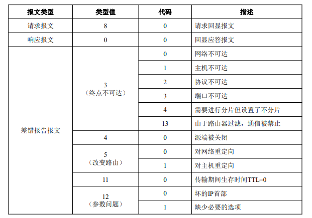

IP协议(网际协议)

[TOC]

* IP: 使用逻辑寻址的主机到主机的协议
    还需要协议来创建物理地址和逻辑地址之间的映射
    IP分组需要封装成帧,需要物理地址.为此设计了一个地址解析协议(ARP, Address Resolution Protocol),有时还需要逆映射
* IP协议缺少流量控制和差错控制,产生另一个协议ICMP
* IP是为单播(一源一目的)设计的,IGMP提供了多播能力

## 地址映射
分组传递时需要逻辑地址和物理地址,需要将一个逻辑地址映射成为它对应的物理地址，反过来也一样
可以通过静态或动态映射完成
* 静态映射：创建一个将逻辑地址和物理地址对应的表，存储在网络的每个机器上。
* 动态映射：当机器知道逻辑地址和物理地址之一时，可以利用协议求出另一个地址。

### 逻辑地址映射到物理地址 ARP(Address Resolution Protocol)
发送方总是有接收方的逻辑地址,但IP数据报必须封装成帧,需要有接收方的物理地址

查询物理地址时,请求广播,响应单播

>ARP 请求报文是广播发送
ARP 回答报文是单播发送
#### 高速缓存
将ARP回答的映射存储在高速缓存中
#### 分组格式

* 硬件类型: 16bit, 网络接口硬件的类型,以太网为1
* 协议类型: 16bit, 发送方使用的协议,IPv4为0800H
* 硬件长度: 8bit, 以字节为单位的物理地址长度,以太网为6
* 协议长度: 8bit, 以字节为单位的逻辑地址长度,以太网为4
* 操作: 16bit, 定义分组的类型,有: ARP请求(1), ARP回答(2)
#### 封装
ARP分组直接封装在数据链路帧中
#### 工作过程
* IP请求ARP协议产生一个ARP请求报文，填入发送方物理地址、IP地址以及目标的IP地址，目标的物理地址字段填0；
* 将这个报文发送给数据链路层封装成帧，使用发送方物理地址作为源地址进行广播；
* 每个主机和路由器均接收到此帧，除了目标机器，其它机器丢弃该帧；
* 目标机器使用单播方式以ARP回答报文进行应答，回答报文包括其物理地址；
* 发送方收到回答报文，知道目标机器的物理地址；
* 将发送给目标机器的IP数据报封装成帧，以单播方式发送
 

* 四种情况
    
    1. 物理地址映射为逻辑地址,逻辑地址为目的IP
    2. 查找路由表查找下一跳(路由器)的IP,没有路由表就查找默认路由表的IP(必须映射为物理地址的那个逻辑地址)
    3. 检查路由表找出下一个路由器IP(必须映射为物理地址的那个逻辑地址)
    4. 数据报的目的IP就是必须映射为物理地址的那个逻辑地址

>例

#### 代理ARP(proxy ARP)
用来产生子网化的效果,代理ARP时可以代表一组主机的ARP,由路由器代替接收方主机发出ARP回答,然后路由器将受到的IP分组发送给相应主机或路由器

### 物理地址映射到逻辑地址 RARP(Reversed Address Resolution Protocol),BOOTP和DHCP
有两种可能的场合,当一个主机知道它的物理地址但不知道其逻辑地址:
1. 无盘站点正在被引导,站点可以通过检查其接口得到它的物理地址,但不知道它的逻辑地址;
2. 一个组织机构没有足够的P地址分配给每一个站点,只能按需分配。站点可发送它的物理地址并请求延续一个短暂的时间。
#### 反向地址解析协议 RARP
为仅知道物理地址的机器寻求他的逻辑地址而设计
创建RARP请求在本地网络上广播,另一个机器用RARP回答响应
问题: 数据链路层中广播时广播地址在以太网中是全1,且不能通过网络边界.多个子网时需为每个子网指定一个RARP
#### 引导程序协议 BOOTP
一种C/S协议，提供物理地址到逻辑地址的转换
BOOTP报文被封装到UDP分组中，UDP再被封装到IP分组中

为静态配置协议

#### 动态主机配置协议 DHCP
提供人工,自动的静态,动态地址配置
* 静态地址配置: 这种DHCP的性能与 BOOTP相同,它是与 BOOTP向后兼容的,这就表示个运行 BOOTP客户机的主机可以向一个DHCP服务器请求一个静态地址。DHCP服务器有一个数据库静态地绑定物理地址和IP地址。
* 动态地址配置: DHCP有第二个数据库,它拥有一个可用的IP地址池。这个第二个数据库使DHCP成为动态的。当DHCP客户机请求一个临时的IP地址时,DHCP服务器就查找给出可用IP

## 因特网控制报文协议(ICMP, Internet Control Message Protocol)
提供差错报告或差错纠正机制 和 为主机和管理查询的机制
* 特点:
    * 为了提高 IP 数据报交付成功的机会，在网际层使用了因特网控制报文协议 ICMP。
    * ICMP 允许主机或路由器报告差错情况和提供有关异常情况的报告。
    * ICMP 不是高层协议，而是 IP 层的协议。
    * ICMP 报文作为 IP 层数据报的数据，加上数据报的首部，组成 IP 数据报发送出去。
    * ICMP不能纠错，只能报告错误。
    * ICMP分为差错报告报文和查询报文。
### 报文类型
* 差错报告报文(error-reporting message): 向路由器或主机(目的端)报告在处理一个IP数据报时可能碰到的一些问题
* 查询报文(querymessage): 成对出现的,它帮助主机或网络管理员从一个路由器或另一个主机得到特定的信息。例如,节点能够发现它们的邻站。此外,主机能够发现和知道在它们的网络上的些路由器的情况,而一些路由器能帮助一个节点改变报文的路由。
### 报文格式

8字节头部和可变长数据部分,每种报文头部前4节类型都相同

### 差错报告
ICMP总是向原始的源方报告差错报文(并不能纠正,纠正交给高层协议)
* 共有5种差错可处理:目的端不可达(3)、源端抑制(4)、时间超时(11)、参数问题(12)及重定向(5)
    * 目的端不可达: 丢弃这个数据报，然后发回目的端不可达报文
    * 源端抑制: 补充流量控制:当路由器或者目的主机中产生拥塞时，路由器或者目的主机丢弃数据报，发送源端抑制报文给发送方
    * 时间超时: TTL减为0时，路由器丢弃数据报:报文的所有分片没有在有限的时间内到达（超时），由目的主机发送
    * 参数问题: IP分组的首部中产生错误或者二义性:路由器或者主机丢弃这个分组，然后向源方发送参数问题报文
    * 重定向: 是路由更新过程中出现的问题: A想向B发送数据报，R2是有效的路由，但A却选择了R1，R1收到后发现应该发往R2，于是把分组发给R2，同时向A发送重定向报文

* 对于携带ICMP差错报文的数据报,不再产生ICMP差错报文;
* 对于分段的数据报文,如果不是第一个分段则不产生ICMP差错报文
* 对于多播地址的数据报文,不产生ICMP差错报文;
* 具有特殊地址,如127.0.0.0或0.0.0.0,不产生ICMP差错报文。

差错报文的数据部分包括原始数据报头部加上数据报中前8字节

### 查询报文
* 回送请求和回答(8 & 0):诊断网络
* 时间戳请求和回答(13 & 14):确定数据报的往返时间,同步
* 地址掩码请求和回答(17 & 18):获取地址对应的掩码
* 路由器询问和通告(10 & 9):询问路由器是否可正常工作

>例21.3
用ping 程序测试服务器/fhda.edu。
结果如下：
ping程序发送报文的序列号从0开始，每次探测给出这次的往返时间。封装了 ICMP报文的IP数据报的TTL（生存时间）字段已被为置为62，这就是说该分组的传输不能超过62跳。
一开始ping程序定义数据部分为56个字节，IP数据报总长度为84字节（增加ICMP首部8字节和IP头部20字节）。注意：每次探测ping程序定义的字节个数为64，这是ICMP分组的总长度(56+8)

### traceroute
用于追踪经过的路由

> 例

## 因特网组管理协议(IGMP, Internet Group ManagementProtocol)
是其中一个必要的，但不是充分的协议(多播也包含其他的协议)
### 组管理
lGMP是一个鉏管理协议,它帮助多播路由器创建和更新与每个路由器接口有关的忠实成员的列表。
### IGMP报文
IGMPv2三种类型的报文:
* 查询
    * 普通的
    * 特殊的
* 成员报告
* 离开报告

### 操作
IGMP是本地运行的。连接到网络的多播路由器有一个组多播地址表,该表内至少有一个忠实的成员

>在IGMP中，成员关系报告一个接着一个地发送两次。
普通查询报文没有定义一个特殊的组

### 封装
IGMP封装在IP数据报中,IP数据报本身又封装在帧中

* 网络层中封装
    对于IGMP协议,IP分组的协议字段的值是2。
    在协议字段中携带这个值的每一个IP分组都有需要给IGMP协议传送数据。
    当这个报文被封装在IP数据报中时,TTL的值必须为1。(报文不离开局域网)
* 数据链路层封装

## ICMPv6
