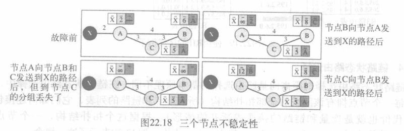

传递、转发和路由选择

<!-- @import "[TOC]" {cmd="toc" depthFrom=1 depthTo=6 orderedList=true} -->

<!-- code_chunk_output -->

- [传递(delivery)](#传递delivery)
- [转发(forwarding)](#转发forwarding)
  - [转发技术](#转发技术)
    - [下一跳方法(next-hop method)与路由方法](#下一跳方法next-hop-method与路由方法)
    - [特定主机方法与特定网络方法(network-specific method)](#特定主机方法与特定网络方法network-specific-method)
    - [默认方法(default method)](#默认方法default-method)
  - [转发过程](#转发过程)
  - [地址聚合](#地址聚合)
  - [最长掩码匹配](#最长掩码匹配)
  - [路由](#路由)
- [单播路由选择协议](#单播路由选择协议)
  - [优化原则](#优化原则)
  - [域内部和域间路由选择](#域内部和域间路由选择)
  - [距离向量路由选择](#距离向量路由选择)
    - [RIP](#rip)
  - [链路状态路由选择](#链路状态路由选择)
    - [最短路径优先协议 OSPF(Open Shortest Path First)](#最短路径优先协议-ospfopen-shortest-path-first)
  - [路径向量路由选择协议](#路径向量路由选择协议)
    - [边界网关协议 BGP(Border Gateway Protocol)](#边界网关协议-bgpborder-gateway-protocol)
- [路由算法](#路由算法)
  - [最短路径树(Dijkstra算法)](#最短路径树dijkstra算法)
  - [Bellman-Ford 算法](#bellman-ford-算法)
- [多播路由选择协议](#多播路由选择协议)
  - [单播,多播,广播](#单播多播广播)
  - [优化路由选择: 最短路径树](#优化路由选择-最短路径树)
  - [多播路由器选择协议](#多播路由器选择协议)

<!-- /code_chunk_output -->

这一章讨论IP分组到它们最终目的端的传递、转发和路由选择。
* 传递(Delivery): 在网络层控制下用底层的网络对一个分组进行处理的方法。
* 转发(Forwarding): 将一个分组传递到下一个站点的方法。
* 路由选择(Routing): 在转发过程中创建路由表的方法。
* 路由选择协议(routing protocol): 用于不断地更新在转发和路由选择中要查找的路由表
* 在本章中,我们也讨论常用的单播和多播路由(multicast routing)协议。

## 传递(delivery)
* 分组的传递: 网络层负责用底层物理网络处理分组

分组传递到最终目的端的两种不同方法:
* 直接传递(direct delivery): 源目的在同一物理网络上
    > 判断: 发送方通过目的端网络地址与其所在网络比较即可判断
    最后的传递总是直接传递
* 间接传递(indirect delivery): 源目的不在同一网络上

## 转发(forwarding)
* 转发: 将分组由路由到他的目的端
    >转发要求主机或路由器有一个路由表。当主机有分组要发送时，或是路由器已收到一个分组要转发时，就要查找路由表以便求得到达最终目的端的路由
    >>如今路由表项目数太多,不适合

### 转发技术
简化路由表的技术
#### 下一跳方法(next-hop method)与路由方法

* 下一跳方法: 路由表中只保留下一跳地址从而减少路由表内容
* 路由方法: 在路由表中保留完整的路由信息
#### 特定主机方法与特定网络方法(network-specific method)

* 特定网络方法: 对同一物理网络上所有主机用同一项目来定义
#### 默认方法(default method)

* 默认方法: 可用其余部分指代其他的网络,可以仅使用默认项目(0.0.0.0)

### 转发过程
1. 假定主机和路由器使用无类寻址(分类寻址可做为特殊情况)
2. 路由器根据网络地址进行查询
    > 分组中只有目的地址没有网络地址,所以路由表包含掩码\n,对应地址块也要包含该掩码

> 例
22.1:

### 地址聚合

### 最长掩码匹配
路由表中掩码存放是按长到短,查找顺序也如此(掩码越长，其地址块就越小，因而路由就越具体)

### 路由
* 路由：从某一网络设备出发去往某个目的地所经过的路径
    >路由器通过查询路由表为数据报选择转发路径。
    路由表只存在于终端计算机、路由器及三层交换机中，二层交换机中不存在路由表
    * 直连路由：设备自动发现的路由信息，路由器可自动发现与自己接口直接相连的网络的路由。
    * 静态路由：人工输入，无法自动更新。用于小型互联网或试验网络。
    * 动态路由：可周期性更新，适合大型网络

## 单播路由选择协议
需要动态路由表,因此产生了多种路由选择协议

动态路由协议的功能:
* 知道有哪些邻居路由器；
* 能够学习到网络中有哪些网段；
* 能够学习到至某个网段的所有路径；
* 能够从众多的路径中选择最佳的路径；
* 能够维护和更新路由信息
### 优化原则
路由器转发分组时,如何选择最优路径?

* 度量(metric)：给网络指定代价
    * 路由信息选择协议RIP
    * 开放最短路径优先协议OSPF
* 可达性
    * 边界网关协议
### 域内部和域间路由选择
单一路由选择协议无法更新所有路由器的路由表的任务,需将互联网划分为多个自治系统
* 自治系统(autonomous system): 一个单一的管理机构管辖下的一组网络和路由器
    * 域内/域间路由选择: 在自治系统内部/之间的路由选择

几种域内和域间路由协议:
* 域内:
    * RIP 距离向量 路由选择信息协议
    * OSPF 链路状态 开放最短路径优先
* 域间:
    * BGP 路径向量 边界网关协议

### 距离向量路由选择
* 距离向量路由选择: 最低代价时最小距离的路径
    > 每个节点保留到其他每个节点的最小向量距离表

* 初始化: 每个节点只知道邻站的距离
* 共享: 每个节点与它的邻站周期性地或有变化时共享其完整路由表
    >但是，表中的第三列对接收节点来说是没有用的，当它收到一个表的时候，把第三列都用发送方的节点名替代
* 更新算法: 节点收到邻站的路由表时:
    
    * 如果下一节点项目相同，选取新行；
    * 如果下一节点项目不同，选取具有最小代价的行，最小代价相同时保持旧项目

* 何时共享
    * 周期性更新：通常每隔30秒。
    * 触发更新：路由表有变化时:
        * 节点接收到邻站的表，引起自己表的更新；
        * 节点检测到邻站链路有故障

* 问题: 两个节点不稳定性
    
    > X与A断开后,A改变路由表,改变后发送给B,如果B接收之前发送自己的路由表给A,就造成不稳定(A假定B已找到X的路径),然后这个过程循环,直至无穷
* 解决方法
    * 定义无穷大：将一个较小的数值定义为无穷大，RIP协议为16；
    * 分割范围（split horizon）:发送表的一部分。发送路由表之前先删除自己路由表的最后一行，第一次更新后，系统稳定；
    * 毒性逆转（poison reverse）与分隔范围结合：分割范围的缺点是有定时器。二者结合：用无穷大做警告“不要使用这个值，我知道到的这个路径来自你”
* 问题: 三节点不稳定性依旧存在
    
    > X与A断开后,A改变路由表,改变后发送给BC,但到达C的分组丢失,AB就会以为C找到了X的路径
#### RIP
路由选择信息协议(Routing Information Protocol): 在自治系统内部使用的域内路由选择协议
RIP基于下列考虑实现距离向量路由选择
1. 在一个自治系统中,包括了路由器和网络(链路)。路由器有路由表,而网络没有路由表;
2. 路由表中的目的端这一列是网络,这表示它的第一列定义了目的网络地址
3. RIP所用的度量很简单,距离定义为到达目的端的链路(网络)个数。因此,RIP的度量称为跳数(hop count)
4. 16就定义为无穷大,就是说在使用RIP的任何自治系统中,任何路径不能大于15跳
5. 下一个节点这一列定义为被发送分组所要到达的目的路由器的地址

优缺点
* RIP 协议最大的优点就是实现简单，开销较小。
* RIP 存在的一个问题是当网络出现故障时，要经过比较长的时间才能将此信息传送到所有的路由器。
* RIP 限制了网络的规模，它能使用的最大距离为 15（16表示不可达）。
* 路由器之间交换的路由信息是路由器中的完整路由表，因而随着网络规模的扩大，开销也就增加

算法

>例

送来路由表距离+1下一跳为该路由,与原表比较,同目的网络且下一跳为该路由直接替换,不然同目的网络的用距离小的

### 链路状态路由选择
区域中的每个节点拥有该区域的全部拓扑结构，包括所有节点和链路的列表，它们如何连接包含类型、代价即度量和链路的接通或断开的情况

>每个节点知道自己这一部分的链路状态（如类型、状态和代价），整个拓扑可由每一个节点的部分知识复合而成

* 建立路由表
    1. 按每个节点建立链路状态分组LSP的链路状态；
    2. 用洪泛法(flooding)向其它路由器扩散LSP；
    3. 为每个节点构成一个最短路径树；
    4. 基于最短路径树计算路由表
* 生成链路状态分组LSP
    * 链路状态分组携带大量信息，如节点标识、链路清单、序列号和寿命。
    * 生成LSP的情况
        * 区域的拓扑发生变化时
        * 周期性产生：60分钟~2小时
* 洪泛flooding
    1. 创建节点的LSP，并从每个接口发送LSP副本。
    2. 收到LSP的每个节点与已有的副本比较：
        * 丢弃旧的，保留新的；
        * 节点通过每个接口（接收副本的接口除外），再次转发副本。

#### 最短路径优先协议 OSPF(Open Shortest Path First)
为了有效地和及时地处理路由选择,OSPF将自治系统划分为一些区域。
* 区域(area): 包含在自治系统中的一些网络、主机和路由器的集合。自治系统又可划分为多个不同的区域,在一个区域里所有网络必须是互相连接的。
    * 一个区域中，路由器都使用洪泛法传送路由信息；
    * 每个区域都有标识，用32 bit 的区域标识符表示（点分十进制）；
    * 区域不能太大，一个区域内的路由器最好不超过 200 个

优点:
* 将利用洪泛法交换链路状态信息的范围局限于每一个区域而不是整个的自治系统，减少了整个网络上的通信量。
* 在一个区域内部的路由器只知道本区域的完整网络拓扑，而不知道其它区域的网络拓扑的情况。
* OSPF 使用层次结构的区域划分。上层的区域为主干区域 0.0.0.0，用来连通其它在下层的区域

特点:
* OSPF 对不同的链路可根据 IP 分组的不同服务类型而设置成不同的代价。因此，OSPF 对于不同类型的业务可计算出不同的路由。
* 多路径间的负载平衡：如果到同一个目的网络有多条相同代价的路径，那么可以将通信量分配给这几条路径。
* 保证仅在可信赖的路由器之间交换链路状态信息：所有在 OSPF 路由器之间交换的分组都具有鉴别的功能。
* 由于一个路由器的链路状态只涉及到与相邻路由器的连通状态，因而与整个互联网的规模并无直接关系。因此当互联网规模很大时，OSPF 协议要比距离向量协议 RIP 好得多。
* 支持可变长度的子网划分和无分类编址 CIDR。

### 路径向量路由选择协议
* 因特网的规模太大，使得自治系统之间路由选择非常困难。对于自治系统之间的路由选择，要寻找最佳路由是很不现实的
    * 比较合理的做法是在自治系统之间交换“可达性”信息
* 自治系统之间的路由选择必须考虑有关策略
* 因此，路径向量路由选择协议只能是力求寻找一条能够到达目的网络且比较好的路由（不能兜圈子），而并非要寻找一条最佳路由
 

* 代言节点: 每个自治系统一个的代表节点

1. 初始化
    
2. 共享
    代言节点与相邻的代言节点共享路由表
3. 更新
    

* 优点
    * 预防回路：避免距离向量路由选择协议的不稳定性和回路问题。
    * 策略路由选择：路由器检查报文路径，如果路径中列出的某自治系统不符合策略，则忽略。
    * 优化路径：符合组织机构标准的路径及保密、安全、可靠性等其它原则。

#### 边界网关协议 BGP(Border Gateway Protocol)
BGP是不同自治系统的路由器之间交换路由信息的协议
* 特点
    * 结点数量级是自治系统数的量级，比自治系统中的网络数少很多。
    * 每一个自治系统中 BGP 代言节点的数目很少，使得自治系统之间的路由选择不致过分复杂。
    * 支持 CIDR，因此 BGP 的路由表也就应当包括目的网络前缀、下一跳路由器，以及到达该目的网络所要经过的各个自治系统序列。
    * 在BGP 刚刚运行时，BGP 的邻站是交换整个的 BGP 路由表。以后只在发生变化时更新有变化的部分，这样可节省网络带宽和减少路由器的处理开销。
* BGP会话
    * 使用 BGP 的两个路由器之间交换路由信息即为会话。
    * 一个 BGP 代言节点与其它自治系统中的 BGP 代言节点交换路由信息，需要先建立 TCP 连接，然后在此连接上交换 BGP 报文以建立 BGP 会话。
    * 使用 TCP 连接能提供可靠的服务，也简化了路由选择协议
    

## 路由算法
例:

### 最短路径树(Dijkstra算法)

### Bellman-Ford 算法
h = 在算法目前阶段中的路径具有的最大链路数
Lh+1(n) = min{Lh(n), minj [Lh(j) + w(j,n)]}

## 多播路由选择协议
### 单播,多播,广播
* 单播: 路由器将接收到的分组仅从其端口中的一个转发出去
* 多播: 路由器可能通过它的多个端口将其所接收到的分组转发出去
* 广播: 并未明确支持
* 多播与多个单播
    
    > 多播发出单一分组,被路由器复制
    多个单播发出不同的分组(不同的目的地址)

    >用单播仿真多播效率不高并可能产生长的延迟，特别是对于大的分组

### 优化路由选择: 最短路径树
* 在单播路由选择中，区域中的每一个路由器都有一张表，该表定义了到可能目的地址的一棵最短路径树
    
* 在多播路由选择中，每个相关的路由器都要为每个组构建一棵最短路径树
    * 基于源树方法: 对每个组每个路由器都需要有一个最短路径树
    
    * 组共享树方法: 只有一个核心路由器，它对多播所涉及的每一个组有一个最短路径树
    
### 多播路由器选择协议
