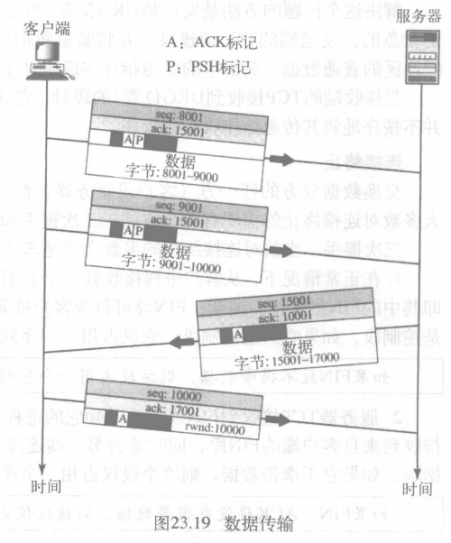

传输层: UDP、TCP 和 SCTP

[TOC]

传输层: 负责报文的进程到进程传递
所以,在OSI模型中,传输层头部必须包含一个称为服务点地址的地址类型,或在因特网和 TCP/IP协议族中的端口号或端口地址。

进程到进程传递的必要性

## 进程到进程的传递
传输层负责进程到进程的传递，即进程之间的分组传递以及部分消息传递

*  传输层特性
    * 网络层监管独立分组从源端到目的端的传递，但不辨认分组之间的关系；传输层负责进程到进程的传递，监管**差错控制和流量控制**，确保全部报文完整地按序到达。
    * 传输层的流量控制和差错控制是**端到端**的。
    * 传输层协议可以是**无连接**的，也可以是**面向连接**的。
    * 在传输层，一个报文通常被划分为可传输的**段**。无连接的协议对每段独立处理，面向连接的协议需要序号生成这些段之间的关系
### 寻址
* 数据链路层：节点到节点 —— MAC地址
* 网络层：主机到主机 —— IP地址
* 传输层：进程到进程 —— 端口号
 

* 端口号(port number): 16位，0 ~ 65535之间的整数
    * 客户端：临时端口号
    * 服务器端：熟知端口号
    > IP定义主机,端口号定义进程

* 因特网号码分配管理局IANA划分的端口编号:
    * 熟知端口号：0 ~ 1023，由IANA分配和控制
    * 注册端口号：1024 ~ 49151，在IANA注册
    * 动态端口号：49152 ~ 65535，临时使用

* 套接字地址(socket address): `IP + 端口号`
    > 传输层协议需要一对套接字地址: 客户的和服务器的

### 复用和分离
寻址机制允许通过传输层进行复用和分离

* 复用: 可能多个进程发送分组对应一个传输层协议
* 分离: 接收方一个传输层协议对应多个进程接收分组

### 无连接服务和面向连接服务
* 无连接服务(connectionless service)
    * 无需连接,无编号,无确认
    * 延迟、丢失、重复、失序
    * UDP
* 面向连接的服务(connection-oriented service)
    * 可靠服务，建立连接
    * TCP、SCTP

### 可靠服务和不可靠服务
传输层服务可以是可靠的或不可靠的,对应性能的高低
> 可靠的数据链路层也需要在传输层进行流量控制和差错控制: 数据链路层的可靠性在节点间,我们需要端到端的可靠性(因为网络层是不可靠的

### 三种协议位置

## 用户数据报协议(UDP, User Datagram Protocol)
称为无连接的不可靠的传输层协议
它除了提供进程到进程而不是主机到主机的通信外，没有给IP服务增加任何东西,还完成非常有限的差错检验
但他协议简单，开销小
* UDP的应用场景：
    * 客户端程序和服务器端程序通信，应用程序发送的数据包不需要分段。如域名解析时的请求报文和返回的解析结果；
    * 实时通信如QQ或微信语音聊天。发送方和接收方需要实时交互，不允许较长时延；
    * 多播或广播通信
* 特点:
    * **无连接**的服务。独立数据报，无编号，无连接，沿不同路径传递，减小了建立连接的开销和时延。
    * 尽**最大努力交付**。不保证可靠传输，无需维持复杂的连接状态，节省系统资源。
    * 面向报文。对应用层交付的报文，既不合并也不拆分，一次交付一个**完整的报文**。应用程序需选择合适大小的报文，报文太长时由网络层分片。
    * **无流量控制和差错控制**。没有流量控制，也没有窗口机制；除校验和之外没有差错控制，使用UDP的**进程自己必须要**有流控和差错控制。接收方可能溢出，报文可能丢失或重复，出错时悄悄丢弃。
    * **无拥塞控制**。网络出现拥塞时不会使源主机的发送速率降低，适用于允许网络拥塞时丢失一些数据但不允许太大时延的实时应用。
    * 支持**一对一、一对多、多对一和多对多**的通信。
    * **首部开销小**
* 使用
    * 适用于需要有简单请求 - 响应通信的进程，较少考虑流量控制和差错控制：P2P
    * 适用于具有内部流量控制和差错控制的进程：TFTP
    * 适用于多播
    * 适用于网络管理：SNMP
    * 适用于某些路由协议：RIP
### UDP熟知端口号

### 用户数据报(user datagram)
UDP分组称为用户数据报

>UDP长度 = IP长度 – IP首部长度

* 校验和
    UDP校验包括伪头部(pseudoheader),头部,数据
    * 伪头部: 是IP分组的头部的一部分
    
    * 计算方法:
    分组相加取反
    
    > 不计算效验和则填全1(校验和不可能为全1)
### 队列
每个客户端和服务器都只有一对出队列和入队列
出时,UDP逐个将报文取出,加上UDP头部交给IP
队列不存在时,ICMP协议发送端口不可达报文
入队列溢出丢弃发送不可达,出队列溢出要求发送等待

## 传输控制协议(TCP, Transmission Control Protocol)
面向连接的,可靠的传输协议，它在两个TCP之间建立一个虚拟连接来发送数据,使用流量控制和差错控制机制

### TCP提供的服务
#### TCP熟知端口

#### 流传递服务
TCP允许发送进程以字节流形式传递数据,接收进程也以字节流形式接收数据,类似一种"管道"连接

* 发送和接收缓冲区
    发送和接收进程速度不同,所以每个方向都需要缓冲区
    
* 段(segment): 在传输层TCP将多个字节分组合成一个分组
    IP层作为TCP服务的提供者,需要以分组而不是字节流的方式发送数据
    TCP给每个段添加头部,将该段发送给IP层
    段被封装到IP数据报中,进行传输

### 序号系统
1. TCP在段的首部使用**序号(seq)**和**确认号(ack)**，它们都是字节序号，而不是段序号。
2. 在每个连接中传送的字节都由TCP编号，第一个字节的序号开始于0到2^32-1之间的一个**随机数**。
3. 字节被编号后，TCP对发送的每一个段分配一个序号，用这个段的**第一个字节的序号**表示。
4. 确认号定义了通信一方**预期接收的下一个字节的编号**。确认号是累加的，表示接收方已正确地接收到最后一个字节的序号，加1并通告这个结果作为确认号

>例

### 段(segment)
TCP中的分组称为段

* 头部20(无选项)-60字节
    * 序号字段: 4字节,本报文段所发送的数据的第一个字节的序号,初始序号随机生成
    * 确认号字段: 4字节, 是期望收到对方下一个报文段数据的第一个字节的序号
    * 控制字段: 6bit,可同时设置多位
    
    * 窗口大小: 16bit,对方必须维持的窗口大小(字节),由接收方确定
    * 校验和: 16bit, 与UDP所用相同,但是强制的(伪头部协议字段是6)
    * 紧急指示符: 16bit, 只有设紧急标志位时有效,包含紧急数据,定义了在本报文段中紧急数据共有多少个字节(紧急数据放在最前)
    * 选项字段: 长度可变。TCP 只规定了一种选项，即最大报文段长度 MSS (Maximum Segment Size)。MSS 是 TCP 报文段中的数据字段的最大长度。数据字段加上 TCP 首部才等于整个的 TCP 报文段

### TCP连接
* TCP是一种面向连接的协议，在源端和目的端之间建立一条**虚路径**。一个报文的所有段都沿着这条虚路径发送，整个报文使用单一的虚路径有利于确认处理及对损坏或丢失帧的重发
* TCP使用IP服务向接收方传递独立的段，它对连接进行控制，如果段丢失或损失，则重新发送。如果一个段失序到达，TCP保存它直到缺少的段到达
* IP不知道这个重发过程，也不知道重新排序的过程
 

#### 连接建立
* 三个问题:
    * 要使每一方能够确知对方的存在；
    * 要允许双方协商一些参数(如最大报文段长度，最大窗口大小，服务质量等)；
    * 能够对传输实体资源(如缓存大小，连接表中的项目等)进行分配

* 被动打开：服务器程序告诉TCP，已准备好接受一个连接。它自己不能完成这个连接。
* 主动打开：客户程序发出请求，告诉TCP它需要连接到特定服务器
 

* 三次握手
    1. 服务器请求被动打开
    2. 客户程序发出请求主动打开,客户端通过TCP要求连接到特定服务器
    

* 握手过程
    1. 客户发送SYN段(仅有SYN标志被置位),用于序列号同步
        >无数据,占用一个序列号
    2. 服务器发送第二个段: SYN和ACK置位的段,是另一方向通信的SYN,也是第一个SYN的ACK
        >无数据,占用一个序列号
    3. 客户发送ACK确认第二个段收到
        > 如不携带数据则不占用序列号

#### 数据传输
连接建立后可进行双向数据传输

* 紧迫数据
    在字节流中有某些数据需要被立即读出
    URG置1,紧急指针给出紧急数据范围(在段首)
#### 连接终止
双方都可关闭连接,有两种方法
* 三次握手
    
    1. 客户TCP发送FIN段,可包含要发送的最后数据块
        > 不包含数据则占用一个序列号
    2. 服务器发送FIN+ACK段,ACK段1并通知另一端连接关闭,可包含要发送的最后数据块
        > 不包含数据则占用一个序列号
    3. 客户端TCP发送ACK
        > 不携带数据,不占用序列号
* 半关闭四次握手
    一端停止发送数据后还可继续接收数据
    
    * 客户端发送FIN段半关闭,服务器发送ACK确认半关闭,客户端到服务器的数据传输结束,但服务器还可发送数据
    * 半关闭时服务器可发送数据给客户端,客户端也可发送确认,但半关闭中传输的数据不占用序列号
    * 服务器发送完数据后发送FIN段,客户端ACK确认
    
### 流量控制
利用TCP的滑动窗口机制可以很方便地在TCP连接上实现流量控制
* TCP滑动窗口
    

    * TCP的滑动窗口是面向**字节**的，数据链路层的滑动窗口是面向帧的；
    * TCP的滑动窗口是**可变大小**的，而数据链路层的滑动窗口是固定大小；
    * 窗口的滑动是由**接收方**而不是发送方控制的，发送方必须服从接收方的命令；
    > 与11章数据链路层的滑动窗口不同:
    • 数据链路层: 与实际的传输时间相比，传输实体之间的传输时延都比较长，即流量控制信息的通信存在着相当可观的时延
    • 传输层是在网络或互联网之上操作的，传输时延是高度可变的，这使得为重传丢失数据而使用的超时机制难以高效

    * TCP窗口受**接收方窗口**(rwnd)和**拥塞窗口**(cwnd)大小的影响，取两者中的最小值；
    * 发送方**不必**发送一个**全窗口**大小的数据；
    * **接收方可暂时关闭窗口**，之后发送方可发送一个1字节的探测报文

>例

* TCP通知窗口
    * 通知窗口是接收方根据接收能力确定的窗口值。接收方将通知窗口值放在报文首部中发送给发送方。根据接收方工作状态来改变窗口大小是TCP流量控制的主要方法
    * 如果接收方读取数据的速度与数据到达的速度一样，接收方在每个确认中发送一个非零的窗口通告。如果发送方比接收方速度快，造成缓冲区被全部占用，接收方发送一个“零窗口”通告，发送方停止发送
    
* 坚持计时器
    * 如果接收方通告窗口为零，发送方需要停止发送，直至接收方确认并通告一个非零窗口。但是这个报文可能会丢失，造成双方都在等待对方，出现死锁
    * TCP为每个连接设置一个坚持计时器，当发送方收到零窗口的确认时，就启动坚持计时器。计时器到期后，发送方会发送一个1字节的探测报文，提醒接收方确认报文已丢失
 

* 糊涂窗口综合征(Silly Windows Syndrome)
    * 如果TCP缓存已满，而应用进程每次只从缓存读取1字节，则接收缓存空出1字节，接收方向发送方发送窗口为1的确认报文
    * 此时发送方会以41字节的代价发送1字节的数据（假设TCP和IP首部各20字节），这样继续下去，传输效率极低
    * 解决办法是禁止接收方发送只有1字节的更新报文，接收方会等待一段时间，使得接收缓存具有足够空间接收一个较长的报文段后再发送窗口更新报文
### 差错控制
TCP是可靠的传输层协议，使用差错控制来提供可靠性
差错控制包括检测出报文的差错、丢失、失序和重复并纠正
差错检测和纠正有三种方式：校验和、确认和超时
* 校验和：16bit，用来检查受到损坏的段。如果损坏则会被丢弃
* 确认：数据段需确认，不携带数据但占用序号的控制段也要确认，ACK段不需要确认
* 重传：差错控制的核心。当一个段损坏、丢失或延迟时需要重传。不占用序号的段不重传，尤其是ACK不重传
    > 有两种情况重传段: 重传计时器到时, 发送方收到3个重复ACK
    * RTO后重传
        对所有重要的未确认段维护重传超时(RTO)计时器,计时器到时时重发最早的重要段
        > RIO值更具段的往返时间(RTT,到达目的并接受ACK的时间)动态调整
    * 三个重复ACK
        收到大量失序段时为了缓解存储压力进行快速重传,立即重发缺少的段
* 失序段
    * 当一个段被延迟、丢失或废弃时，后面一些段的到达就失序了
    * 数据可以失序到达，TCP暂时存储失序的段，并标记它们为失序的段直到缺少的段到达
    * 失序的段不传递给进程，TCP确保传递给进程的段是无失序的

### TCP情况
* 正常情况
    
    >ACK延时500ms观察是否有更多段
* 丢失段
    
    > 接收方接收到失序段,立即ACK发送期望下一字节,发送方得知丢失,重发
    失序段先存入缓冲区,等待,
* 快速重传
    
    >RTO值较大

## 拥塞控制
如果网络中的载荷即发送到网络中的分组数量，超过了网络的容量即网络中能处理的分组数量，在网络中就可能发生拥塞
拥塞控制指的是控制拥塞和使载荷低于网络容量的机制和技术。
### 拥塞控制与流量控制的关系
* 拥塞控制所要做的都有一个前提，就是网络能够承受现有的网络负荷.是一个全局性的过程
* 流量控制往往指在给定的发送端和接收端之间的点对点通信量的控制
### 拥塞窗口
发送方控制拥塞窗口的原则：发送方维持一个拥塞窗口cwnd，其大小取决于网络的拥塞程度，且动态变化，发送方让自己的发送窗口小于等于cwnd。如果发送方没有按时收到确认报文，就猜想网络可能发生了拥塞。
* 接收方窗口rwnd，拥塞窗口cwnd，实际窗口= min(rwnd, cwnd)
### 拥塞策略
* 慢启动：很慢的传输速率启动，迅速增大到阈值(指数增长)
    TCP发送端先以一个较低的数据率发送数据，例如先发送一个TCP报文，其长度为1个MSS（MaximumSegment Size），如果在重传定时器超时之前收到对该数据段的正确确认，则成倍增加这个拥塞窗口使其变为2个MSS。。。以此类推直至达到阈值
    >简化前提：使用报文的个数而不是字节的个数；rwnd比cwnd大得多；每段单独确认
* 加性增加(拥塞避免)：达到阈值后为避免拥塞降低数据速率
    >当拥塞窗口的大小达到慢启动的阈值时，慢启动阶段停止，加性增加阶段开始

    每次整个窗口所有段都被确认（一次传输）时，采用每次增加 1个MSS的递增方式，直到检测到数据丢失
* 乘性减少(拥塞检测)：检测到拥塞返回到慢启动或拥塞避免
    >如果发生拥塞，必须减小拥塞窗口。发送方通过重传的要求判断拥塞程度

    

## 流控传输协议(SCTP, Stream Control Transmission Protocol)
流控传输协议是一种新的可靠的、**面向报文**的传输层协议。然而，SCTP主要是为最近引入的因特网应用而设计的。这些新应用所需要的服务都比TCP能提供的更复杂
### SCTP熟知端口

### 多流(multistream)
TCP的单一流一点丢失就会阻塞数据传递,传输实时数据时不可接受.
SCTP提供多流服务(关联),某个被阻塞其余流仍可传递数据
### 多接口(multihoming)
一个TCP连接只包括一对源目的IP,SCTP关联支持多接口,每一次关联可在每一端定义多个IP地址,但不能共用(容错)
### 特性
* 传输序列号
    TCP以字节为数据单元,SCTP数据单元为数据大块(Data Chunk),按传输序列号(TSN)编号.
*  流标识符
    每次关联可有多个流,每个流用流标识符(SI)(0开始16位数字)标识.
    每个数据大块头部必须有SI
* 流序列号
    为了区别属于同一个流中的不同数据大块，SCTP使用流序列号(SSN)
* 分组
    数据作为数据大块被携带,控制信息作为控制大块被携带,多个控制大块和数据大块合并成一个分组