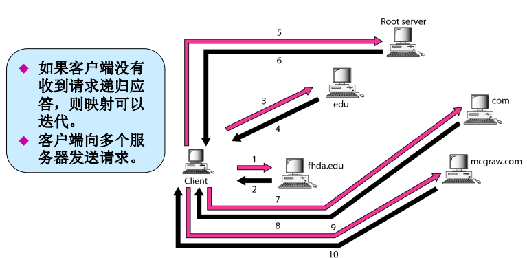

应用层: 域名系统(DNS, domain name system)

<!-- @import "[TOC]" {cmd="toc" depthFrom=1 depthTo=6 orderedList=false} -->

<!-- code_chunk_output -->

- [名字空间(namespace)](#名字空间namespace)
  - [平面名字空间(flat namespace)](#平面名字空间flat-namespace)
  - [层次名字空间(hierarchical namespace)](#层次名字空间hierarchical-namespace)
- [域名空间(domain namespace)](#域名空间domain-namespace)
  - [标号(label)](#标号label)
  - [域名](#域名)
  - [域(domain)](#域domain)
- [名字空间的分布](#名字空间的分布)
  - [名字服务器的层次结构](#名字服务器的层次结构)
  - [区域(zone)](#区域zone)
  - [服务器](#服务器)
- [因特网中的DNS](#因特网中的dns)
  - [通用域(generic domain)](#通用域generic-domain)
  - [国家域(country domain)](#国家域country-domain)
  - [反向域(inverse domain)](#反向域inverse-domain)
- [解析](#解析)
  - [解析过程](#解析过程)
  - [递归解析(recursive resolution)](#递归解析recursive-resolution)
  - [迭代解析(iterative resolution)](#迭代解析iterative-resolution)
  - [高速缓存](#高速缓存)
- [DNS报文](#dns报文)
- [记录类型](#记录类型)
- [注册机构](#注册机构)
- [动态域名系统(DDNS)](#动态域名系统ddns)
- [封装](#封装)

<!-- /code_chunk_output -->

需要能完成IP到地址相互映射的系统

* 主机文件实现映射
    主机文件存储在主机磁盘中，以一个标准主机文件定期更新；
    >主机文件太大，也无法更新所有主机
* 域名系统DNS
    将信息数据分割为许多小的部分，存储于不同计算机中
## 名字空间(namespace)
名字空间将每一个地址映射到唯一的名字
### 平面名字空间(flat namespace)
一个名字分配给一个地址，名字是一个无结构的字符序列
* 缺点: 必须集中控制才能避免二义性和重复，不能用于大规模系统
### 层次名字空间(hierarchical namespace)
每个名字由几部分组成，分配和控制名字空间的机构可以分散化

## 域名空间(domain namespace)
为了获得层次结构的名字空间，设计了域名空间
所有的名字由根在顶部的倒置树结构定义。该树最多有128级：0级(根节点) -127级。

### 标号(label)
树上每一节点有一个标号,为字符串(最多63字符)
根节点的标号为空串
每一节点的子节点有不同的标号,保证域名唯一性
### 域名
用.分割的标号序列
域名从节点向上读到根节点,最后一个标号是根节点的标号(空)

* 全称域名(FQDN, fully qualified domain name): 
    一个标号以一个空字符串结束
    > 是包含一台主机所有名字的域名,包含所有的标号,能唯一定义一台主机
    如`www.funny.int.`
    必须以空标号结束
* 部分域名(PQDN, partially qualified domain name):
    不以空字符串结束
    没到达根节点
### 域(domain)
域名空间的一棵子树,域的名字是子树顶部节点的域名

## 名字空间的分布
只用一台计算机存储如此大容量的信息，效率非常是低下和不安全的。讨论名字空间的分布
### 名字服务器的层次结构
将信息分布在多台DNS服务器中
同样建立服务器的层次结构

### 区域(zone)
* 区域: 一个服务器负责或授权的范围
### 服务器
* 根服务器: 区域由整棵树组成的服务器
    通常不保存关于域的任何信息,只是将其授权托给其他服务区,保存与这些服务器的参照关系
* 主服务器(primary server): 存储了授权区域有关文件的服务器
    负责创建,维护,更新区域文件
* 辅助服务器(secondary server): 负责从另一个服务器(主服务器或辅助服务器)传输一个区域的全部信息,并将文件存储在他的本地磁盘中.(备份)
>主服务器能够从磁盘文件中装载所有信息，辅助服务器从主服务器中装载信息
当辅助服务器从主服务器中下载信息时，这称为区域的传递

## 因特网中的DNS
DNS是一种可以在不同平台上使用的协议。在因特网中，域名空间(树)被划分成三个部分：通用域、国家域和反向域
### 通用域(generic domain)
按已经注册主机的一般行为对主机进行定义

树中每一节点定义一个域,是到域名空间数据库的一个索引

通用域第一层标号描述了组织结构类型

### 国家域(country domain)
是使用两个字母的国家缩写，第二级标号可以是组织结构

### 反向域(inverse domain)
将地址映射为名字
如用于确定客户端是否在授权的列表中
* 这种查询称为反向或指针(PTR)查询
* 为了处理这种查询,需要在域名空间中增加一个反向域,称第一级节点为arpa,第二级单节点为in-addr
* 子网号处于更低的层次
    > 如IP `132.34.45.121 `
    读取为`121.45.34.132.in-addr.arpa`

## 解析
* 名字-地址解析: 将名字映射为地址或将地址映射为名字的过程
### 解析过程
DNS是客户机/服务器应用程序
需要解析时,主机调用DNS客户程序:解析程序,解析程序用一个映射请求访问最近的一个DNS服务器,找不到则交付给其他服务器.解析程序收到映射后解释这一响应确定是否出错,然后结果传递给请求进程
### 递归解析(recursive resolution)
如该服务器不是这一域名的授权服务器,服务器就将请求发送给另一服务器(通常为父服务器),循环直到得到解析,然后向后传送到发出请求的客户机

### 迭代解析(iterative resolution)
如该服务器不是这一域名的授权服务器,就返回其认为可能解析此域名的服务器的IP给客户端,客户端再向其发送请求,循环
>客户端向多个服务器发送请求

### 高速缓存
使用高速缓存技术来缩短服务器查询的时间
仍然可能出现问题，就是映射过期(缓存中的映射为过期的映射)，解决方法: 
* 授权服务器总是将生存时间TTL信息添加到映射上；
* DNS要求每一台服务器对每一个映射保留一个TTL计数器

## DNS报文
DNS有两种类型的报文: 查询和响应, 这两种类型的报文具有相同的格式
* 查询报文: 由头部和查询记录构成
* 响应报文: 由头部、查询记录、响应记录、授权记录和附加记录组成
 

* 头部
两者头部格式相同,12字节

## 记录类型
DNS有两种类型的记录，
在查询和响应报文的询问部分使用了询问记录；
在响应报文中的应答、授权、附加信息部分使用了资源记录
* 询问记录(question record): 客户机通过询问记录从服务器获取信息(包含域名)
* 资源记录(resource record): 每一域名都与一个资源记录相关联,服务器数据库包含所有的资源记录,服务器还返回资源记录给客户机

## 注册机构
新域名通过注册机构加入DNS
一个熟知的商业实体是ICANN（因特网名字和编号分配组织）
## 动态域名系统(DDNS)
DNS主文件必须能动态更新。动态域名系统Dynamic Domain Name System (DDNS) 就是为了满足这种需求而设计的
在DDNS中，当名字和地址之间的绑定确定时，通常由DHCP给主DNS服务器发送这种信息，主服务器更新这一区域。通知辅助服务器的方法可以以主动方式或者以被动方式
## 封装
DNS可以使用UDP或者TCP协议。在这两种情况下，服务器使用熟知端口53
当响应报文的长度小于512字节时，就使用UDP。因为大多数UDP分组有512字节分组大小的限制。
如果响应报文大于512字节，则必须使用TCP连接