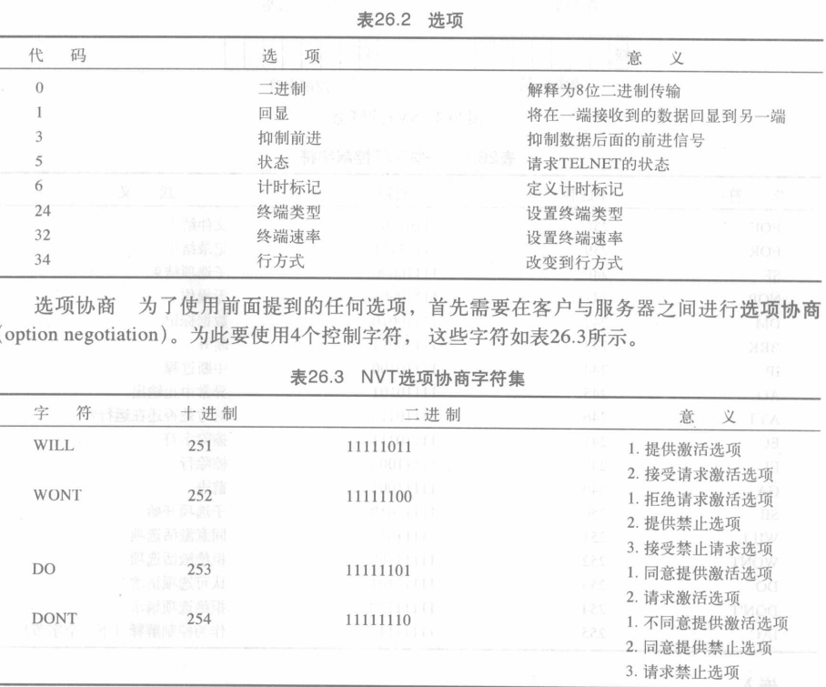

远程登录、电子邮件与文件传输

<!-- @import "[TOC]" {cmd="toc" depthFrom=1 depthTo=6 orderedList=false} -->

<!-- code_chunk_output -->

- [远程登录](#远程登录)
  - [登录过程](#登录过程)
  - [网络虚拟终端NVT](#网络虚拟终端nvt)
  - [嵌入](#嵌入)
  - [选项](#选项)
- [电子邮件(e-mail)](#电子邮件e-mail)
  - [构架](#构架)
  - [用户代理(UA, User Agent)](#用户代理ua-user-agent)
    - [用户代理类型](#用户代理类型)
    - [邮件格式](#邮件格式)
    - [邮件地址](#邮件地址)
    - [多用途因特网邮件扩充(MIME)](#多用途因特网邮件扩充mime)
  - [报文传输代理(MTA): SMTP](#报文传输代理mta-smtp)
  - [报文访问代理(MAA): POP和IMAP](#报文访问代理maa-pop和imap)
- [文件传输](#文件传输)
  - [文件传输协议(FTP, File Transfer Protocol)](#文件传输协议ftp-file-transfer-protocol)

<!-- /code_chunk_output -->

## 远程登录
使用通用的客户/服务器程序，它让用户能够访问远程计算机上的任何应用程序
* 终端网络TELNET(Terminal NETwork)
### 登录过程

1. 远程登录时,将字符发送给TELNET客户机,其将字符转换成网络虚拟终端(NVT)字符的通用字符集,将其传送给本地TCP/IP堆栈
2. 这些命令或文本通过因特网传送给远程机器的TCP/IP堆栈,字符传递给操作系统,再传给TELNET服务器,将字符转换成远程计算机可理解的字符,但操作系用只能接收来自终端驱动程序的字符,所以增加伪终端驱动程序

### 网络虚拟终端NVT
为一个字符集,将本地系统的字符,命令等转换成通用的NVT形式,再传递给网络.服务器TELNET再将NVT转换成远程计算机的形式

### 嵌入
TELNET使用TCP连接,服务器用熟知端口23,客户端用临时端口
* 要同一个连接发送数据和控制字符,TELNET通过将控制字符嵌入到数据流中实现
* 为了区分开两者,在每个控制字符序列前要加上一个特殊的控制字符:控制解释(IAC)
    > 如退格转换成远程字符IAC EC
### 选项

>例

## 电子邮件(e-mail)
主要包括三个组件: 用户代理,报文传输代理,报文访问代理

### 构架
*  第一种情况: 发送方与接收方是同一系统内的用户
    仅需要两个用户代理(UA)
* 第二种情况: 发送方和接收方是在不同系统上
    需要2个用户代理和一对报文传输代理(MTA)
    
* 第三种情况: 不同系统,但一方没有与他的系统直接连接:通过点到点广域网或局域网连接到系统
需要两对MTA
    
* 第四种情况: 都是通过广域网或局域网连接到系统
    2个UA,两对MTA,一对MAA
    
    >MTA将报文推入服务器,MAA从服务器拉出报文
### 用户代理(UA, User Agent)
UA是一个程序,由组成 读取 回答 转发报文,处理邮箱组成
#### 用户代理类型
* 命令驱动型
    早期,从键盘接收单个字符命令以执行某项任务
* 基于GUI型
    通过图形用户接口组件
#### 邮件格式
有一个信封和一个报文
* 信封: 发件人,收件人地址
* 报文: 头部(发信人,收件人,报文主题和其他信息),主题
#### 邮件地址
地址由`本地部分@域名`组成
* 本地部分: 用户邮箱,定义一个特殊文件的名字
* 域名: 邮件服务器
#### 多用途因特网邮件扩充(MIME)
>电子邮件只能发送NVT 7-bit ASCII的报文

MIME是一个辅助协议,允许非ASCII数据通过电子邮件传送.
在发送方转换成NVT ASCII,传递给MTA发送,接收方转换回来.
* MIME头部,定义转换参数
    
* 数据类型和子类型
    
### 报文传输代理(MTA): SMTP
MTA负责实际的邮件传输,定义MTA客户机和服务器的形式化协议称为简单邮件传输协议(SMTP)

SMTP只定义如何来回发送命令和响应,都以一个二字符(回车,换行)的行结束标记来终止
* 命令: 客户发送给服务器
    `关键词: (变量)(0个或多个)`
    
    >前5个强制支持 
* 响应: 服务器发送给客户
    3位数字码,可跟附加的文本信息
    

>例
26.3:观察如何直接使用SMTP发送电子邮件和如何模拟本节所描述命令和响应。使用TELNET登录到端口25(SMTP的熟知端口号)，然后用命令直接发送电子邮件。在这个例子中，forouzanb@adelphia.net发送一封电子邮件给他自己。前面的三行表示TELNET试图与Adelphia邮箱服务器建立连接:
`$ telnet mail.adelphia.net 25`
`Trying 68.168.78.100 . . .`
`Connected to mail.adelphia.net (68.168.78.100)`
连接建立后输入SMTP命令，然后接收响应，如下图所示。用黑色表示命令，而用彩色表示响应。注意：为了清晰起见，增加了一些用“=”符号指定的注释行。这些行不是电子邮件过程的部分

### 报文访问代理(MAA): POP和IMAP
SMTP是推协议,第三阶段需要拉协议
两种报文访问代理协议:
* 邮局协议版本3(POP3)
* 因特网邮件访问协议版本4(IMAP4)
    

* POP3命令与响应交换
    

## 文件传输
### 文件传输协议(FTP, File Transfer Protocol)
* FTP使用TCP服务。它需要两个TCP连接
* 熟知端口21用于控制连接，而熟知端口20用于数据连接

>客户三个组件,服务器两个组件,控制连接在控制进程之间进行,数据连接在数据传输进程间进行
整个交互期间,控制连接始终连接,数据连接在每次传输文件时开启然后关闭
* 控制连接
    如SMTP,使用7-bit ASCII,通过命令和响应完成
    
* 数据连接
    在控制连接上发送的命令控制下,在数据连接上进行文件传输
    读取RETR,存储STOP,列表LIST
    客户必须定义要传送的文件类型、数据结构和传输方式。
    

>例
26.4:
下面给出了使用FTP会话读出目录中的项目清单。彩色的行表示来自服务器控制连接的响应，黑色行表示用户发送的命令。黑色背景中带白色的行表示数据传输
1.在创建了控制连接后，FTP服务器在控制连接上发送220(服务器就绪)响应。
2.客户发送它的名字。
3.服务器用331(用户名正确，需要口令)响应。
4.客户发送口令(不显示出来)。
5.服务器用230(用户登录正确)响应。
6.客户发送列表命令(1s报告)去寻找报告名目录中的列表。
7.现在服务器用150响应，并打开数据连接。
8.服务器在数据连接上发送文件列表或目录。
9.客户发送一个QUIT命令。
10.服务器用221(服务关闭)响应

26.5:
某些网站可用匿名FTP,如anonymous
