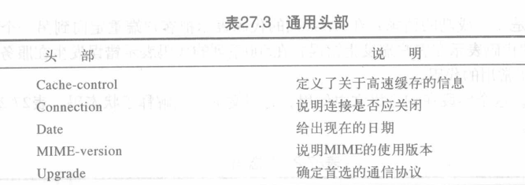

万维网与超文本传输协议

<!-- @import "[TOC]" {cmd="toc" depthFrom=1 depthTo=6 orderedList=false} -->

<!-- code_chunk_output -->

- [体系结构](#体系结构)
  - [客户(浏览器)](#客户浏览器)
  - [服务器](#服务器)
  - [同一资源定位符(URL)](#同一资源定位符url)
  - [Cookies](#cookies)
- [Web文档](#web文档)
  - [静态文档(static document)](#静态文档static-document)
  - [动态文档(dynamic document)](#动态文档dynamic-document)
  - [活动文档(active document)](#活动文档active-document)
- [超文本传输协议(HTTP, Hypertext Transfer Protocol)](#超文本传输协议http-hypertext-transfer-protocol)
  - [HTTP事务](#http事务)
    - [报文](#报文)

<!-- /code_chunk_output -->

## 体系结构
WWW是一个分布式的客户/服务器服务，在这种方式下，客户机用浏览器能够使用服务器提供的服务。然而，提供的服务是分布在许多称为站点的位置上

### 客户(浏览器)
* 浏览器通常由三部分构成: 控制程序 用户程序 解释程序
### 服务器
客户机请求到达时服务器发送Web文档
* 提高效率: 服务器高速缓存,多线程,多处理器

### 同一资源定位符(URL)
URL是说明因特网上信息类型的一种标准
* URL格式包括4部分: 协议://主机:端口/路径

### Cookies
Cookie机制采用的是在客户端保持状态的方案，是在用户端的会话状态的存贮机制，需要用户打开客户端的Cookie支持。Cookie的作用就是为了解决HTTP协议无状态的缺陷所作的努力
* 只允许注册用户才能访问网站
* 电子支付时使用
* 登录门户网站
* 作为广告代理

## Web文档
WWW中的文档可以分为三大类：静态文档 动态文档 活动文档。
>基于文档内容的时间确定分配
### 静态文档(static document)
固定内容的文档
超文本标记语言HTML
### 动态文档(dynamic document)
浏览器请求时Web服务器才创建动态文档
* 公共网关接口(CGI)
* 服务器端脚本
### 活动文档(active document)
需要程序或脚本在客户端运行

## 超文本传输协议(HTTP, Hypertext Transfer Protocol)
主要用于万维网上存取数据的协议，HTTP在功能上像是FTP和SMTP的组合
>HTTP在熟知端口80上使用TCP服务
### HTTP事务
虽然HTTP使用TCP服务,但HTTP本身是无状态协议
客户端发送请求报文初始化事务,服务器发送响应进行回复
#### 报文
请求和响应报文格式相似
* 请求报文: 请求行(第一行) 头部 (主体)
* 响应报文: 状态行(第一行) 头部 (主体)
    

* 请求类型分成几种方法:
    
* 状态码为3位数字,状态短语解释了状态码
    
 

* 头部
    用于客户端和服务器之间交换附加的信息
    `头部名字: 头值` 由一行或多行组成
    * 通用头部
        
    * 请求头部(只在请求报文中)
        
    * 响应头部(只在响应报文中)
        
    * 实体头部
        

>例
