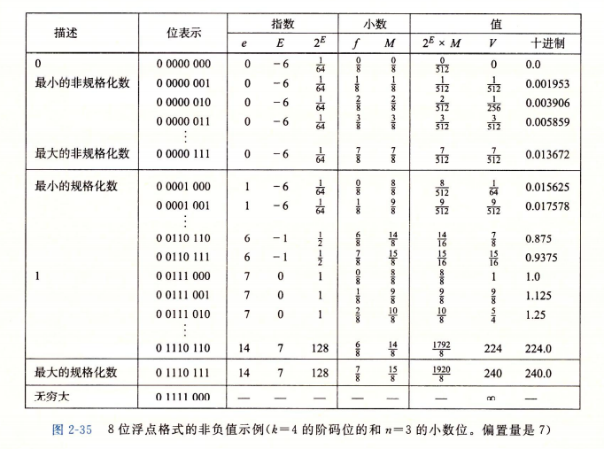
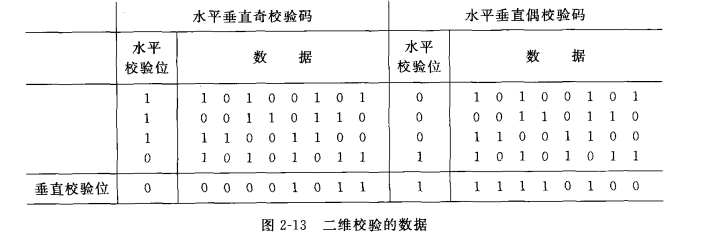
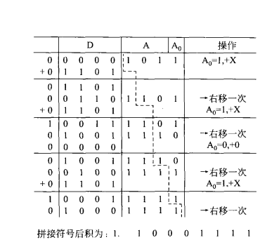
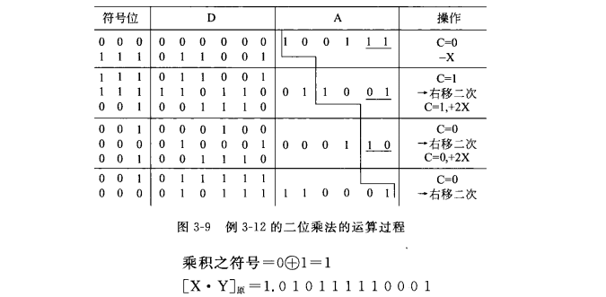
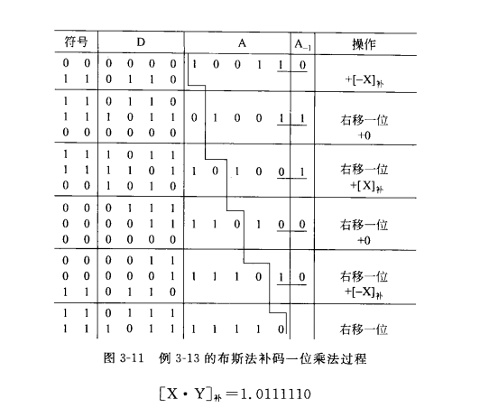
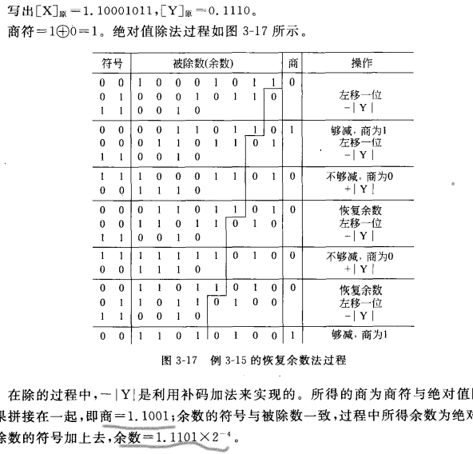
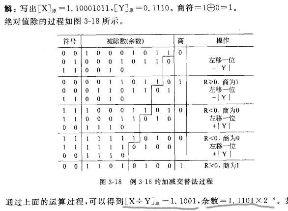
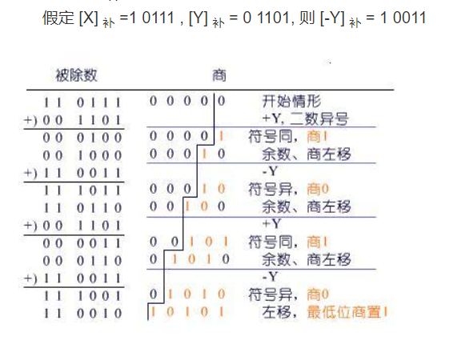
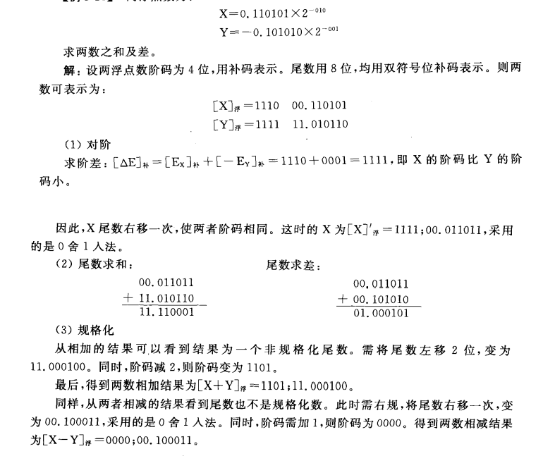

[TOC]

>CPI(Clock cycle Per Instruction)每条计算机指令执行所需的时钟周期=总的时钟周期数/总的指令数
MIPS(每秒钟处理了多少百万条指令)=主频/(CPI * $10^6$) 

# Unit2
## 转化关系
>正数的反码与原码相同
**补码**求补为所有位取反再末位加1(原转补可通过大于0原与补相同再求补得到)
**移码**为补码符号位取反(无论正负)
负数:
**反码**是原码的数值位取反

## 浮点
### 非规格化表示
$F = {M(尾数,补码或原码)} * {R(基数)}^{E(阶码,移码)}$
### 规格化表示
规格化为正时,尾数最高位为1(0.1XXXXX).   为负时,最高位为0(1.0XXXXX) 
  >即最高有效位非零
  通过移位达成(移位同时改变阶码E)
  存储时可省去必需位,如0.1xx存为0.xxx 1.0xx存为1.xxx
  可通过异或尾数符号位和第一数值位判断是否为规格化
  数值范围都可推
#### 规格化操作(左规,右规)
用变形补码(2位符号位)表示尾数
* 左规: 不合规时将尾数<<1阶码-1,直到尾数规格化
* 右规: 尾数>>1阶码+1,判断**阶码**是否溢出
### IEEE
尾数用原码,隐含的以1开头
E=e-Bias(偏置量,为$2^{k-1}$ -1,如127,1023),产生指数的正负取值范围
  　    M=frac解释为小数位,隐含的以1开头

#### CSAPP-note day1  整数,浮点
* 小数点右为负幂 不能准确表示部分值
>  P78
  结构: (-1)s * M * $2^E$ s符号,E阶码(exp),M尾数(frac)(二进制小数),k阶码位
  内存中是 s exp frac
.
  规格化:
  exp不全为0或1时,为规格化值
  　E=e-Bias(偏置量,为$2^{k-1}$ -1,如127,1023),产生指数的正负取值范围
  　M=frac解释为小数位,隐含的以1开头
  　存在最大的规格化数,超过溢出为+∞
.
  非规格化:
  exp全0时
  　E=1-Bias, M=f(不隐含1)
  　1-Bias补偿非规格化数没有隐含1,使得最大非规格化数和最小规格化数平滑转变P81
  　提供一种表示0的办法,通过s可以定义0.0和-0.0
  　表示非常接近0的数,提供[逐渐溢出]的属性
  exp全1
  　frac全0得到无穷,非全0得到NaN
* 

## 水平垂直奇偶效验
* 奇偶效验码
异或各数值位得到偶效验位(奇效验位异或完取反即可),与数据一起存储

## 海明码
* 编码距离(海明距离): 两个编码字之间对应位置数值不同的位置的数目
* 编码最小距离(最小海明距离): 一个码组集合中,任意两个编码字间的编码距离的最小值

## CRC码
>模2除为不考虑借位,即各位异或
* 
>验证: CRC码除G(x),得余数为0则无错,不同的余数对应不同的出错位

# Unit3

## 溢出
>双符号位判断溢出: 结果两符号位异号,则溢出
进位判断溢出: 最高数值位向符号位的进位和符号位进位异号,则溢出
> 检测:加数同号(异号不会溢出)但合与其异号

## 标志位
> 由标志寄存器存储,保存ALU操作结果的某些状态

ZF(zero flag)零标志
CF(carry)进位/借位标志
OF(overflow)溢出标志
SF(sign)符号位标志
PF(parity)奇偶标志

## 整数移码运算:
>移码相加减后结果符号位取反.

## 乘法:
### 原码一位乘法:
符号位为异或
0.1101 * 1.1011

### 原码两位乘法:
两位乘数位: 00->+0    01->+|x|    10->+2|X|     11->+3|X|
+3|X|处理: (-x后加4x)c初始为0,遇到11时-|X|c置1,下一步发现c为1时就再原先操作基础上多+|X|
3位符号位,乘数只带数值位入A
0.100111 * 1.100111

### 补码一位乘法:
乘数尾添附加位0,带符号位入A,x也带符号
先看乘数尾两位的后位-前位, 0->+0    1->+[x]     -1->+[-x],后右移一位
00.1010 * 11.0011

> 结果不看符号位
### 补码两位乘法:
乘数尾也要添附加位0
先看$-2Y_{i}+Y_{i-1}+Y_{i-2}$,为多少就加减多少的x补(-2~2),后右移两位
乘数为偶数时最后一次只右移一位,乘数为奇数时在乘数位添0变为偶数

## 除法:
### 原码除法: 
符号位先异或,然后计算绝对值结果
纯小数时 被除数小于除数, 纯整数时 被除数大于除数

### 原码恢复余数除法:
两位符号位
先左移一位,减去除数,根据差的正负判断上商01,不够减上商0加回除数(恢复余数)
-|Y|是补码加法

> 商的首0为开头加的省略,尾数的负次方为左移一位的次数
### 原码加减交替除法:
恢复余数法的改良,恢复余数后左移为2(R+B),再减除数最终结果为2R+B
所以余数为负是只需左移后加除数就可实现恢复
第一步左移减除数, $(余数为正则商1,左移一位,减除数/为负则商0,左移一位,加除数)_{循环}$
-|Y|还是补码加法

### 补码除法:
第一步,被除数与除数同号则减除数,异号加除数.
循环: 余数与除数同号商1左移一位减除数,异号商0左移一位加除数.
结束时左移后商置1退出

## 浮点运算:
>$X=M*2^E$

### 浮点加减:
先对阶,将小阶码变成大阶码,阶码加一尾数右移一位
然后尾数加减
再规格化: 至00.1XXXXXX或11.0XXXXX(左规减右规加)
尾数溢出时可将尾数右规,(加减运算时最多一次右规)
右规舍入:丢1保留末尾加1丢0不变,或直接丢弃低位

    
### 浮点乘:
$X*Y = (Mx*My)2^{Ex+Ey}$
都为规格化数
检查阶码溢出,尾数乘用补码乘法
然后结果尾数规格化,左规右规都至多需要一次

### 浮点除:
$X/Y = (Mx/My)2^{Ex-Ey}$
都为规格化数,阶码判断溢出
尾数除用补码除法
然后结果尾数规格化,左规右规也至多需要一次